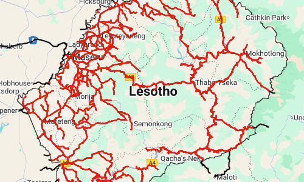
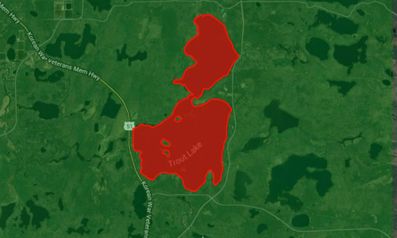
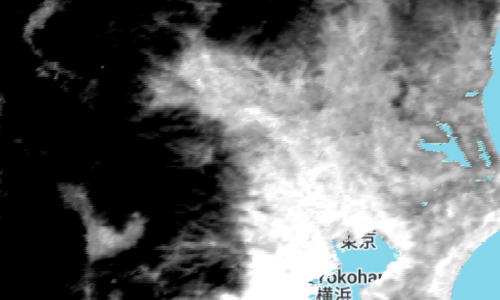
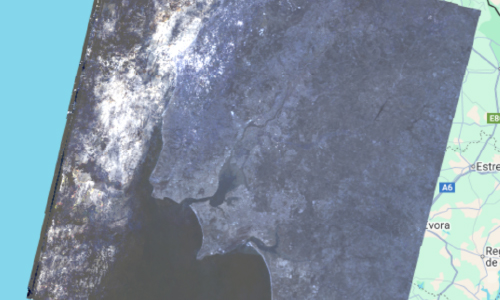
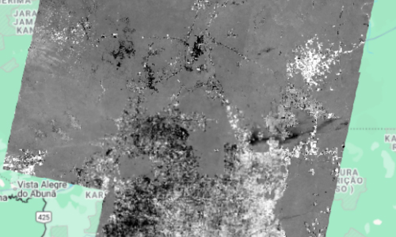

<!-- Copyright 2024 The Google Earth Engine Community Authors

Licensed under the Apache License, Version 2.0 (the "License"); you may not use
this file except in compliance with the License. You may obtain a copy of the
License at

 http://www.apache.org/licenses/LICENSE-2.0

Unless required by applicable law or agreed to in writing, software distributed
under the License is distributed on an "AS IS" BASIS, WITHOUT WARRANTIES OR
CONDITIONS OF ANY KIND, either express or implied. See the License for the
specific language governing permissions and limitations under the License.
-->

# The Cloud-Based Geospatial Benchmark (CBGB)

## Overview

We introduce a new benchmark for evaluating the ability of Large Language Models
(LLMs) to generate code for solving geospatial problems, with a focus on Google
Earth Engine. The Cloud-Based Geospatial Benchmark (CBGB) was presented at the
[TerraBytes Workshop](https://terrabytes-workshop.github.io/) at ICML on July
18, 2025, in Vancouver. A link to the corresponding paper is forthcoming.

## Example Problems with (human generated) solutions

<table align="center">
  <tbody>
    <tr>
      <td align="center">
        
         
        <b>Land Cover Classification Using Random Forest</b>
         
        <a href="https://code.earthengine.google.com/?accept_repo=projects%2Fgee-edu%2Fbook&scriptPath=users%2Falemlakes%2Fr-8000-PADMA%3A8.ReadyForEval%2FApplications%2FA1%2FA1.2%2FEBA_A1.2_A1a%2FEBA_A1.2_A1a_NC">Script 1</a> | <a href="https://code.earthengine.google.com/?accept_repo=projects%2Fgee-edu%2Fbook&scriptPath=users%2Falemlakes%2Fr-8000-PADMA%3A8.ReadyForEval%2FApplications%2FA1%2FA1.2%2FEBA_A1.2_A1a%2FEBA_A1.2_A1a_S1">Script 2</a>
      </td>
      <td align="center">
        
         
        <b>Calculating Road Length in Lesotho</b>
         
        <a href="https://code.earthengine.google.com/?accept_repo=projects%2Fgee-edu%2Fbook&scriptPath=users%2Falemlakes%2Fr-8000-PADMA%3A8.ReadyForEval%2FApplications%2FA1%2FA1.3%2FEBA_A1.3_A1_NC">Script 1</a> | <a href="https://code.earthengine.google.com/?accept_repo=projects%2Fgee-edu%2Fbook&scriptPath=users%2Falemlakes%2Fr-8000-PADMA%3A8.ReadyForEval%2FApplications%2FA1%2FA1.3%2FEBA_A1.3_A1_S1">Script 2</a>
      </td>
      <td align="center">
        
         
        <b>Calculating Iron Oxide Ratio (IOR) for Hydrothermal Rock Detection</b>
         
        <a href="https://code.earthengine.google.com/?accept_repo=projects%2Fgee-edu%2Fbook&scriptPath=users%2Falemlakes%2Fr-8000-PADMA%3A8.ReadyForEval%2FFundamentals%2FF2%2FF2.0%2FEBA_F2.0_A2%2FEBA_F2.0_A2_NC">Script 1</a> | <a href="https://code.earthengine.google.com/?accept_repo=projects%2Fgee-edu%2Fbook&scriptPath=users%2Falemlakes%2Fr-8000-PADMA%3A8.ReadyForEval%2FFundamentals%2FF2%2FF2.0%2FEBA_F2.0_A2%2FEBA_F2.0_A2_S1">Script 2</a>
      </td>
    </tr>
    <tr>
      <td align="center">
        
         
        <b>Normalized Burn Ratio Thermal (NBRT) Calculation for Rim Fire</b>
         
        <a href="https://code.earthengine.google.com/?accept_repo=projects%2Fgee-edu%2Fbook&scriptPath=users%2Falemlakes%2Fr-8000-PADMA%3A8.ReadyForEval%2FFundamentals%2FF3%2FF3.1%2FEBA_F3.1_A1%2FEBA_F3.1_A1_NC">Script 1</a> | <a href="https://code.earthengine.google.com/?accept_repo=projects%2Fgee-edu%2Fbook&scriptPath=users%2Falemlakes%2Fr-8000-PADMA%3A8.ReadyForEval%2FFundamentals%2FF3%2FF3.1%2FEBA_F3.1_A1%2FEBA_F3.1_A1_S1">Script 2</a>
      </td>
      <td align="center">
        
         
        <b>Measuring Area of Largest Lake within a Specified Area</b>
         
        <a href="https://code.earthengine.google.com/?accept_repo=projects%2Fgee-edu%2Fbook&scriptPath=users%2Falemlakes%2Fr-8000-PADMA%3A8.ReadyForEval%2FFRC%2FFRC_9%2FFRC_9_S1">Script 1</a>
      </td>
      <td align="center">
        
         
        <b>Analyzing Long-Term Land Surface Temperature Trends in an Urban Area</b>
         
        <a href="https://code.earthengine.google.com/?accept_repo=projects%2Fgee-edu%2Fbook&scriptPath=users%2Falemlakes%2Fr-8000-PADMA%3A7.AwaitingRelease%2FFree-Range%2FFRC_67%2FFRC_67_S1">Script 1</a> | <a href="https://code.earthengine.google.com/?accept_repo=projects%2Fgee-edu%2Fbook&scriptPath=users%2Falemlakes%2Fr-8000-PADMA%3A7.AwaitingRelease%2FFree-Range%2FFRC_67%2FFRC_67_S2">Script 2</a>
      </td>
    </tr>
    <tr>
      <td align="center">
        
         
        <b>Deforestation Analysis Around a National Park</b>
         
        <a href="https://code.earthengine.google.com/?accept_repo=projects%2Fgee-edu%2Fbook&scriptPath=users%2Falemlakes%2Fr-8000-PADMA%3A8.ReadyForEval%2FFundamentals%2FF5%2FF5.1%2FF5.1_A3%2FEBA_F5.1_A3_NC">Script 1</a> | <a href="https://code.earthengine.google.com/?accept_repo=projects%2Fgee-edu%2Fbook&scriptPath=users%2Falemlakes%2Fr-8000-PADMA%3A8.ReadyForEval%2FFundamentals%2FF5%2FF5.1%2FF5.1_A3%2FEBA_F5.1_A3_S1">Script 2</a>
      </td>
      <td align="center">
        
         
        <b>Landsat 8 TOA Reflectance Percentile Analysis for Lisbon, Portugal</b>
         
        <a href="https://code.earthengine.google.com/?accept_repo=projects%2Fgee-edu%2Fbook&scriptPath=users%2Falemlakes%2Fr-8000-PADMA%3A8.ReadyForEval%2FFundamentals%2FF4%2FF4.1%2FEBD_F4.1_C2%2FEBD_F4.1_C2_S1">Script 1</a>
      </td>
      <td align="center">
        
         
        <b>Burn Severity Change Detection in the Amazon Rainforest</b>
         
        <a href="https://code.earthengine.google.com/?accept_repo=projects%2Fgee-edu%2Fbook&scriptPath=users%2Falemlakes%2Fr-8000-PADMA%3A8.ReadyForEval%2FFundamentals%2FF4%2FF4.4%2FEBD_F4.4_C2%2FEBD_F4.4_C2_S1">Script 1</a> | <a href="https://code.earthengine.google.com/?accept_repo=projects%2Fgee-edu%2Fbook&scriptPath=users%2Falemlakes%2Fr-8000-PADMA%3A8.ReadyForEval%2FFundamentals%2FF4%2FF4.4%2FEBD_F4.4_C2%2FEBD_F4.4_C2_S2">Script 2</a>
      </td>
    </tr>
    <tr>
      <td align="center">
        
         
        <b>Agricultural Land Use Analysis in California's Central Valley</b>
         
        <a href="https://code.earthengine.google.com/?accept_repo=projects%2Fgee-edu%2Fbook&scriptPath=users%2Falemlakes%2Fr-8000-PADMA%3A8.ReadyForEval%2FFundamentals%2FF5%2FF5.0%2FEBD_F5.0_C1%2FEBD_F5.0_C1_S1">Script 1</a> | <a href="https://code.earthengine.google.com/?accept_repo=projects%2Fgee-edu%2Fbook&scriptPath=users%2Falemlakes%2Fr-8000-PADMA%3A8.ReadyForEval%2FFundamentals%2FF5%2FF5.0%2FEBD_F5.0_C1%2FEBD_F5.0_C1_S2">Script 2</a>
      </td>
      <td align="center">
        
         
        <b>Deforestation Rate Comparison in Colombian Amazon Protected Areas</b>
         
        <a href="https://code.earthengine.google.com/?accept_repo=projects%2Fgee-edu%2Fbook&scriptPath=users%2Falemlakes%2Fr-8000-PADMA%3A8.ReadyForEval%2FFundamentals%2FF5%2FF5.1%2FEBD_F5.1_C1%2FEBD_F5.1_C1_S1">Script 1</a> | <a href="https://code.earthengine.google.com/?accept_repo=projects%2Fgee-edu%2Fbook&scriptPath=users%2Falemlakes%2Fr-8000-PADMA%3A8.ReadyForEval%2FFundamentals%2FF5%2FF5.1%2FEBD_F5.1_C1%2FEBD_F5.1_C1_S2">Script 2</a>
      </td>
      <td align="center">
        
         
        <b>Count of States Intersecting HUC4 Watershed 0707</b>
         
        <a href="https://code.earthengine.google.com/?accept_repo=projects%2Fgee-edu%2Fbook&scriptPath=users%2Falemlakes%2Fr-8000-PADMA%3A8.ReadyForEval%2FFRC%2FFRC_5%2FFRC_5_S1">Script 1</a>
      </td>
    </tr>
  </tbody>
</table>

## Paper Abstract

With the increasing skill and adoption of Large Language Models (LLMs) in the
sciences, evaluating their capability in a wide variety of application domains is
crucial. This work focuses on evaluating LLM-based agents on Earth Observation
tasks, particularly those involving the analysis of satellite imagery and
geospatial data. We introduce the Cloud-Based Geospatial Benchmark (CBGB), a set
of challenges designed to measure how well LLMs can generate code to provide
short numerical answers to 45 practical scenarios in geography and environmental
science. While the benchmark questions are framed to assess broadly applicable
geospatial data analysis skills, their implementation is most readily achieved
using the extensive data catalogs and powerful APIs of platforms like Earth
Engine. The questions and reference solutions in CBGB were curated from experts
with both domain familiarity in Earth Observation and programming expertise. We
also estimate and include the difficulty of each problem. We evaluate the
performance of frontier LLMs on these tasks with and without access to an
execution environment for error correction based feedback. Using the benchmark
we assess how LLMs operate on practical Earth Observation questions across a
range of difficulty levels. We find that models with the error correction
feedback, which mirrors the iterative development process common in geospatial
analyses, tend to perform consistently better with the highest performance at
71%; the reasoning variants of models outperformed the non-thinking versions. We
also share detailed guidelines on curating such practical scenarios and
assessing their ability to evaluate agents in the geospatial domain.

## Authors

Jeffrey A. Cardille1,2, Renee Johnston1, Simon Ilyushchenko1, Zahra Shamsi1, Johan Kartiwa1, Matthew Abraham1, Khashayar Azad3, Nuala Caughie2, Kainath Ahmed2, Emma Bergeron Quick2, Noah Jencz2, Karen Dyson4, Andrea Puzzi Nicolau4, Fernanda Lopez Ornelas5, David Saah5, Michael Brenner1,6, Subhashini Venugopalan1, Sameera Ponda1

1Google Research 2McGill University 3Concordia University 4Spatial Informatics Group 5University of San Francisco 6Harvard University

## Details
All Benchmark questions are available under CC-BY-4.0 license in a public
Google Cloud Storage bucket:

- `gs://cbgb-1/eval_set_2025_05_08.csv`
- Direct download at:
 https://storage.googleapis.com/cbgb-1/eval_set_2025_05_08.csv

This repository contains a [lightweight evaluation pipeline](https://github.com/google/earthengine-community/blob/master/experimental/cbgb_benchmark/cbgb_eval_pipeline.ipynb) assessing
the capabilities of various LLMs to generate Earth Engine Python code. The
pipeline imports the full set of benchmark challenges and expected answers. It
then utilizes code generation agents powered by different LLMs (models from
Gemini, OpenAI, Anthropic, and Deepseek), to generate Python code to
answer these questions. The framework includes functionality for code execution,
error correction with multiple retries, and detailed result logging.

The 45 benchmark questions in the dataset were curated and validated by a group
of Remote Sensing/GIS practitioners. Primary sources for these questions included
the free publicly available textbook [Cloud-based Remote Sensing with Google
Earth Engine: Fundamentals and Applications](https://www.eefabook.org/), and
original problems conceptualized by subject-matter experts in the contributor
group — all intended to reflect practical, real-world geospatial analysis tasks.

We are excited to release this evaluation pipeline to the community and welcome
feedback and contributions.

## Attribution

The Cloud-Based Geospatial Benchmark (CBGB) is a collaborative effort. The
primary developers of the evaluation pipeline and the associated research paper
are Jeffrey A. Cardille of McGill University and Renee Johnston of Google
Research.

The development of the benchmark questions and the underlying methodology was a
significant undertaking involving contributions from a number of individuals,
including all of the authors listed above.

The evaluation pipeline leverages the
[functionsmith](https://github.com/google/earthengine-community/tree/master/experimental/functionsmith)
library, developed by Simon Ilyushchenko, for parsing and executing the
LLM-generated code.