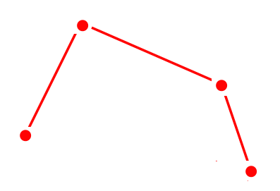
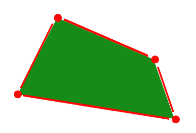
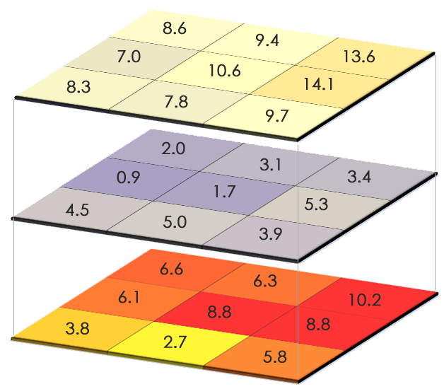
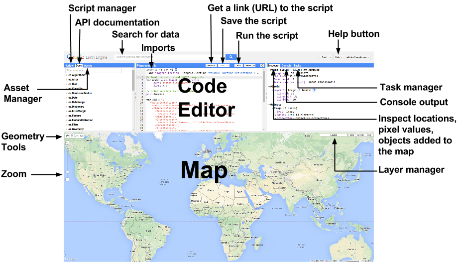
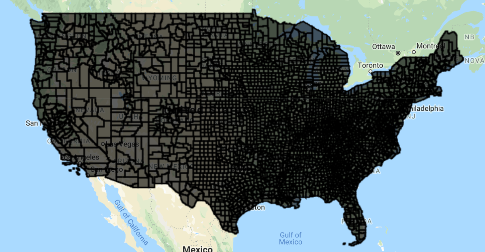
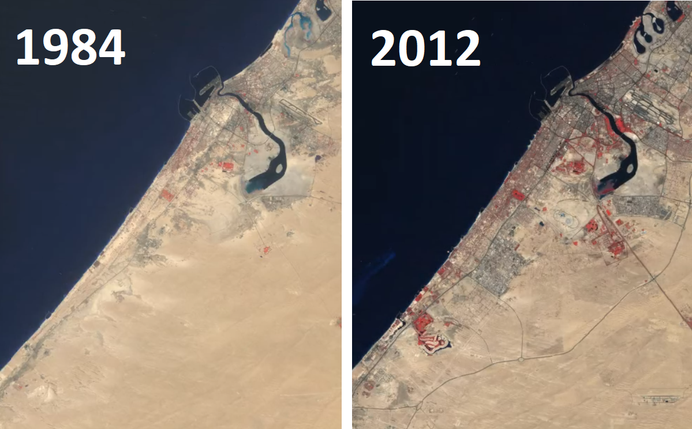

<!--
Copyright 2019 The Google Earth Engine Community Authors

Licensed under the Apache License, Version 2.0 (the "License");
you may not use this file except in compliance with the License.
You may obtain a copy of the License at

    http://www.apache.org/licenses/LICENSE-2.0

Unless required by applicable law or agreed to in writing, software
distributed under the License is distributed on an "AS IS" BASIS,
WITHOUT WARRANTIES OR CONDITIONS OF ANY KIND, either express or implied.
See the License for the specific language governing permissions and
limitations under the License.
-->

In this tutorial, we will introduce several types of geospatial data, and enumerate key Earth Engine functions for analyzing and visualizing them. This cookbook was originally created as a workshop during Yale-NUS Data 2.0 hackathon, and later updated for Yale GIS Day 2018 and 2019.

## Introduction

GIS or Geographic Information System is the collection, visualization, and analysis of geographical or spatial data. In this section, we will cover the data types commonly used in GIS applications.

## Vector data

Vector data represent objects on the Earth's surface using their longitude and latitude, as well as combinations of the pairs of coordinates (lines, polylines, polygons, etc.).

### Point data

A pair of coordinates (longitude, latitude), that represents the location of points on the Earth's surface.

Example: Location of drop boxes, landmarks, etc.

 

### Lines

A series of points that represents a line (straight or otherwise) on the Earth's surface.

Example: Center of roads, rivers, etc.

 

### Polygons

A series of points (vertices) that define the outer edge of a region.
Example: Outlines of cities, countries, continents, etc.

 

## Raster data

Raster data represent objects/variables on the Earth's surface as a matrix of values, in the form of pixels, cells, or grids.

### Layers and bands

A raster is an image with a matrix of values representing the values of some observed attribute. Bands of a raster correspond to different variables, usually using the same matrix structure.

Example: Spatial variability of temperature, elevation, rainfall, etc. over a region.

 

Image sources: https://gisgeography.com/spatial-data-types-vector-raster/

## The Google Earth Engine platform

[Introductory video](https://www.youtube.com/watch?v=gKGOeTFHnKY&feature=youtu.be)

[Code editor](https://code.earthengine.google.com/)

What is Earth Engine?

- A cloud-based platform for planetary scale geospatial analysis
- Uses Google's computational resources to reduce processing time
- A massive [archive](https://developers.google.com/earth-engine/datasets/catalog/) of remote sensing data



## Basic functions

### Declaring variables
```javascript
var variableName = ee.ContainerType(value);
```

A container object (usually in the form `ee.SomeVariableType`) is used to wrap a native JavaScript object so that Google's servers can perform operations on it.

###  Centering the map

```javascript
Map.setCenter(long, lat, zoomLevel);
```

> Zoom level varies from 0 (no zoom) to 20 (highest zoom level)

### Displaying metadata

```javascript
print(variableName);
```

The `print` operation is also useful for printing data and getting debugging info. Note: You cannot print more than 5,000 elements at once.

### Adding a layer to the map

```javascript
Map.addLayer(variableName);
```

## Common Earth Engine data types

### Strings

```javascript
var str = ee.String('This is a string. Or is it? It is.');
```

### Numbers

```javascript
var num = ee.Number(5);
```

### Arrays

```javascript
var arr = ee.Array([[5, 2, 3], [-2, 7, 10], [6, 6, 9]]);
```

### Lists

```javascript
var lis = ee.List([5, 'five', 6, 'six']);
```

### Dictionaries

```javascript
var dict = ee.Dictionary({five: 5, six: 6});
```
### And the fun stuff...

- `ee.Geometry`
- `ee.Feature`
- `ee.FeatureCollection`
- `ee.Image`
- `ee.ImageCollection`

## Declaring geometries

### Points

```javascript
var poi = ee.Geometry.Point(0, 45);
```

### Multi points

```javascript
var multi = ee.Geometry.MultiPoint(0, 45, 5, 6, 70, -56);
```

### Line string
```javascript
var lineStr = ee.Geometry.LineString([[0, 45], [5, 6], [70, -56]]);
```

### Multi-line string

```javascript
var mLineStr =
ee.Geometry.MultiLineString([[[0, 45], [5, 6], [70, -56]], [[0, -45], [-5, -6], [-70, 56]]]);
```

### Linear ring
```javascript
var linRin = ee.Geometry.LinearRing(0, 45, 5, 6, 70, -56, 0, 45);
```

### Rectangle

```javascript
var rect = ee.Geometry.Rectangle(0, 0, 60, 30);
```

### Polygon

```javascript
var poly = ee.Geometry.Polygon([[[0, 0], [6, 3], [5, 5], [-30, 2], [0, 0]]]);
```

### Multi-polygon

```javascript
var multiPoly =
ee.Geometry.MultiPolygon([ee.Geometry.Polygon([[0, 0], [6, 3], [5, 5], [-30, 2], [0, 0]]),
ee.Geometry.Polygon([[0, 0], [-6, -3], [-5, -5], [30, -2], [0, 0]])]);
```

## Features and FeatureCollections

- Features are geometries associated with specific properties.
- Feature collections are groups of features.



## Functions and mapping

A function is a set of instructions to perform a specific task:

```javascript
function functionName(Arguments) {
statements;
};
```

### Calling a function

```javascript
var result = functionName(input);
```

### Mapping a function over a collection
```javascript
var result = input.map(functionName);
```

Mapping a function over a collection applies the function to every element in the collection.

## Common operations on geometries

### Finding the area of a geometry

```javascript
var geoArea = geometry.area();
```

By default, all units in Earth Engine are in meters.

### Finding the length of a line

```javascript
var linLen = lineString.length();
```
### Finding the perimeter of a geometry
```javascript
var geoPeri = geometry.perimeter();
```

### Reducing number of vertices in geometry
```javascript
var simpGeo = geometry.simplify(100);
```
### Finding the centroid of a geometry

```javascript
var centrGeo = geometry.centroid();
```

### Creating buffer around a geometry

```javascript
var buffGeo = geometry.buffer(100);
```

### Finding the bounding rectangle of a geometry

```javascript
var bounGeo = geometry.bounds();
```

### Finding the smallest polygon that can envelope a geometry

```javascript
var convexGeo = geometry.convexHull();
```

### Finding common areas between two or more geometries

```javascript
var interGeo = geometry1.intersection(geometry2);
```

### Finding the area that includes two or more geometries

```javascript
var unGeo = geometry1.union(geometry2);
```

#### Example: Geometry operations

Let's run of some these operations over the the state of Connecticut, US using geometries of the public US counties feature collection available on Earth Engine:

```javascript
// Set map center over the state of CT.
Map.setCenter(-72.6978, 41.6798, 8);
// Load US county dataset.
var countyData=ee.FeatureCollection('TIGER/2018/Counties');
// Filter the counties that are in Connecticut (more on filters later).
var countyConnect=countyData.filter(ee.Filter.eq('STATEFP', '09'));
// Get the union of all the county geometries in Connecticut.
var countyConnectDiss=countyConnect.union();
// Add the layer to the map with a specified color and layer name.
Map.addLayer(countyConnectDiss, {color: 'red'}, 'Chicago dissolved');
// Find the rectangle that emcompasses the southernmost, westernmost,
// easternmost, and northernmost points of the feature.
var bound = countyConnectDiss.geometry().bounds();
// Add the layer to the map with a specified color and layer name.
Map.addLayer(bound, {color: 'yellow'}, 'Bounds');
// Find the polygon covering the extremities of the feature.
var convex = countyConnectDiss.geometry().convexHull();
// Add the layer to the map with a specified color and layer name.
Map.addLayer(convex, {color: 'blue'}, 'Convex Hull');
// Find the area common to two or more features.
var intersect = bound.intersection(convex, 100);
// Add the layer to the map with a specified color and layer name.
Map.addLayer(intersect, {color: 'green'}, 'Bound and convex intersection');
// Find the area encompassing two or more features; number is the maximum
// error in meters.
var union = bound.union(convex, 100);
// Add the layer to the map with a specified color and layer name.
Map.addLayer(union, {color: 'purple'}, 'Bound and convex union');
// Find the difference between two geometries
var diff=bound.difference(convex, 100);
// Add the layer to the map with a specified color and layer name.
Map.addLayer(diff, {color: 'purple'}, 'Bound and convex difference');
// Find area of feature.
var ar = countyConnectDiss.geometry().area();
print(ar);
// Find length of line geometry (You get zero since this is a polygon).
var length = countyConnectDiss.geometry().length();
print(length);
// Find permeter of feature.
var peri = countyConnectDiss.geometry().perimeter();
print(peri);
```

#### Example: Mapping over a feature collection

By mapping over a collection, one can apply the same operation on every element
in a collection. For instance, let's run the same geometry operations on every
county in Connecticut:

```javascript
// Set map center over the state of CT.
Map.setCenter(-72.6978, 41.6798, 8);
// Load US county dataset.
var countyData=ee.FeatureCollection('TIGER/2018/Counties');
// Filter the counties that are in Connecticut.
var countyConnect=countyData.filter(
  ee.Filter.eq('STATEFP', '09'));
// Add the layer to the map with a specified color and layer name.
Map.addLayer(countyConnect, {color: 'red'}, 'Original Collection');
// Define function.
function performMap(feature) {
 // Reduce number of vertices in geometry; the number is to specify maximum
 // error in meters. This is only for illustrative purposes, since Earth Engine
 // can handle up to 1 million vertices.
 var simple = feature.simplify(10000);
 // Find centroid of geometry.
 var center = simple.centroid();
 // Return buffer around geometry; the number represents the width of buffer,
 // in meters.
 return center.buffer(5000);
}
// Map function over feature collection.
var mappedCentroid = countyConnect.map(performMap);
// Add the layer to the map with a specified color and layer name.
Map.addLayer(mappedCentroid, {color: 'blue'}, 'Mapped buffed centroids');
```

## Operations on features

### Creating a feature with a specific property value

```javascript
var feat = ee.Feature(geometry, {Name: 'featureName', Size: 500});
```
### Creating a feature from an existing feature, renaming a property
```javascript
var featNew = feature.select(['name'], ['descriptor']);
```
### Extracting values of a property from a Feature

```javascript
var featVal = feature.get('size');
```

#### Example: Feature operations

Let's create a feature from scratch and play around with its properties:

```javascript
// Create geometry.
var varGeometry = ee.Geometry.Polygon(0, 0, 40, 30, 20, 20, 0, 0);
// Create feature from geometry.
var varFeature = ee.Feature(varGeometry, {
 name: ['Feature name', 'Supreme'],
 size: [500, 1000]
});
// Get values of a property.
var arr=varFeature.get('size');
// Print variable.
print(arr);
// Select a subset of properties and rename them.
var varFeaturenew = varFeature.select(['name'], ['descriptor']);
// Print variable.
print(varFeaturenew);
```

## Filtering

### Filtering by property values

```javascript
var bFilter = ee.Filter.eq(propertyName, value);
```
> or .neq , .gt , .gte , .lt , and .lte

### Filtering based on maximum difference from a threshold

```javascript
var diffFilter = ee.Filter.maxDifference(threshold, propertyName, value);
```

### Filtering by text property

```javascript
var txtFilter = ee.Filter.stringContains(propertyName, stringValue);
```

> or .stringStartsWith, and .stringEndsWith

### Filtering by a value range

```javascript
var rangeFilter = ee.Filter.rangeContains(
  propertyName, stringValue, minValue, maxValue);
```

### Filtering by specific property values

```javascript
var listFilter = ee.Filter.listContains(
  propertyName, value1, propertyName2, value2);
```
> .inList to test against a list of values

### Filtering by date range

```javascript
var dateFilter = ee.Filter.calendarRange(startDate, stopDate);
```

### Filtering by particular days of the year

```javascript
var dayFilter = ee.Filter.dayOfYear(startDay, stopDay);
```

### Filtering by a bounding area

```javascript
var boundsFilter = ee.Filter.bounds(geometryOrFeature);
```
### Combining and inversing filters

```javascript
var newFilterAnd = ee.Filter.and(listOfFilters);
var newFilterOr = ee.Filter.or(listOfFilters);
var inverseFilter = ee.Filter.not(filter);
```

## Operations on images

### Selecting the bands of an image

```javascript
var band = image.select(bandName);
```

### Creating masks

```javascript
var mask = image.eq(value);
```

> or .neq or .gt or .gte or .lt or .lte

### Applying image masks

```javascript
var masked = image.updateMask(mask);
```

### Performing pixelwise calculations

```javascript
var results = image.add(value);
```
> or .subtract ,    .multiply ,    .divide ,    .max , .min ,  .abs ,  .round ,  .floor ,  .ceil ,  .sqrt ,  .exp,  .log, .log10, .sin ,  .cos ,  .tan ,  .sinh ,  .cosh ,  .tanh ,  .acos, .asin

### Shift pixels of an image

```javascript
newImage = oldImage.leftShift(valueOfShift);
```

> or .rightShift

### Reducing an image to a statistic for an area of interest

```javascript
var outputDictionary = varImage.reduceRegion(reducer, geometry, scale);
```
---

## Operations on image collections

### Selecting the first n images in a collection (based on property)

```javascript
var selectedImages = imCollection.limit(n, propertyName, order);
```

### Selecting images based on particular properties

```javascript
var selectedIm = imCollection.filterMetadata(propertyName, operator, value);
```

> Operators include: "equals", "less_than", "greater_than", "not_equals",
"not_less_than", "not_greater_than", "starts_with", "ends_with", "not_starts_with",
"not_ends_with", "contains", "not_contains".

### Selecting images within a date range

```javascript
var selectedIm = imCollection.filterDate(startDate, stopDate);
```

### Selecting images within a bounding geometry

```javascript
var selectedIm = imCollection.filterBounds(geometry);
```

### Performing pixelwise calculations for all images in a collection

```javascript
var sumOfImages = imCollection.sum();
```

> or `product()`, `max()`, `min()`, `mean()`, `mode()`, `median()`, `count()`.

Alternatively, using reducers:

```javascript
var sumOfImages = imCollection.reduce(ee.Reducer.sum());
```

### Compositing images in collection with the last image on top

```javascript
var mosaicOfImages = imCollection.mosaic();
```

Alternatively, using reducers:

```javascript
var sumOfImages = imCollection.reduce(ee.Reducer.first());
```

#### Example: Image and image collection operations

Let's analyze images over a region of interest (the counties of Connecticut).

```javascript
// Set map center over the state of CT.
Map.setCenter(-72.6978, 41.6798, 8);
// Load the MODIS MYD11A2 (8-day LST) image collection.
var raw = ee.ImageCollection('MODIS/006/MYD11A2');
// Load US county dataset.
var countyData=ee.FeatureCollection('TIGER/2018/Counties');
// Filter the counties that are in Connecticut.
// This will be the region of interest for the image operations.
var roi=countyData.filter(ee.Filter.eq('STATEFP', '09'));
// Examine image collection.
print(raw);
// Select a band of the image collection using either indexing or band name.
var bandSel1 = raw.select(0);
var bandSel2 = raw.select('LST_Day_1km');
// Filter the image collection by a date range.
var filtered = raw.filterDate('2002-12-30', '2004-4-27');
// Print filtered collection.
print(filtered);
// Limit the image collection to the first 50 elements.
var limited = raw.limit(50);
// Print collections.
print(limited);
print(bandSel1);
// Calculate mean of all images (pixel-by-pixel) in the collection.
var mean = bandSel1.mean();
// Isolate image to region of interest.
var clipped = mean.clip(roi);
// mathematical operation on image pixels to convert from digital number
// of satellite observations to degree Celsius.
var calculate = clipped.multiply(0.02).subtract(273.15);
// Add the layer to the map with a specified color palette and layer name.
Map.addLayer(calculate, {min: 15, max: 20, palette: ['blue', 'green', 'red']}, 'LST');
// Select pixels in the image that are greater than 30.8.
var mask = calculate.gt(18);
// Add the mask to the map with a layer name.
Map.addLayer(mask, {}, 'mask');
// Use selected pixels to update the mask of the whole image.
var masked = clipped.updateMask(mask);
// Add the final layer to the map with a specified color palette and layer name.
Map.addLayer(masked,
  {min: 10, max: 30, palette: ['blue', 'green', 'red']}, 'LST_masked');
```
## Exporting data

### Exporting a collection to Google Drive, Earth Engine Asset, or Google Cloud
```javascript
Export.image.toDrive({
  collection: varImage, description: 'fileName', region: geometry, scale: 1000
});
```
> or `Export.image.toCloudStorage()`, `Export.image.toAsset()`,
> `Export.table.toDrive()`, `Export.table.toCloudStorage()`,
> `Export.video.toCloudStorage()`, `Export.video.toDrive()`.

#### Example: Importing and exporting data

```javascript
// Function to find mean of pixels in region of interest.
var getRegions = function(image) {
  // Load US county dataset.
  var countyData = ee.FeatureCollection('TIGER/2018/Counties');
  // Filter the counties that are in Connecticut.
  // This will be the region of interest for the operations.
  var roi=countyData.filter(ee.Filter.eq('STATEFP', '09'));
  return image.reduceRegions({
    // Collection to run operation over.
    collection: roi,
    // Calculate mean of all pixels in region.
    reducer: ee.Reducer.mean(),
    // Pixel resolution used for the calculations.
    scale: 1000
  });
};
// Load image collection, filter collection to date range, select band of
// interest, calculate mean of all images in collection, and multiply by
// scaling factor.
var image =
  ee.ImageCollection('MODIS/MYD13A1')
    .filterDate('2002-07-08', '2017-07-08')
    .select('NDVI')
    .mean()
    .multiply(.0001);
// Print final image.
print(image);
// Call function.
var coll = getRegions(image);
// Export image to Google Drive.
Export.table.toDrive({
 collection: coll,
 description: 'NDVI_all',
 fileFormat: 'CSV'
});
// Print final collection.
print(coll);
```

## Bonus: Timelapse example

```javascript
// Timelapse example (based on google API example);
// Create rectangle over Dubai.
var geometry = ee.Geometry.Rectangle([55.1, 25, 55.4, 25.4]);
// Add layer to map.
Map.addLayer(geometry);
// Load Landsat image collection.
var allImages = ee.ImageCollection('LANDSAT/LT05/C01/T1_TOA')
 // Filter row and path such that they cover Dubai.
 .filter(ee.Filter.eq('WRS_PATH', 160))
 .filter(ee.Filter.eq('WRS_ROW', 43))
 // Filter cloudy scenes.
 .filter(ee.Filter.lt('CLOUD_COVER', 30))
 // Get required years of imagery.
 .filterDate('1984-01-01', '2012-12-30')
 // Select 3-band imagery for the video.
 .select(['B4', 'B3', 'B2'])
 // Make the data 8-bit.
 .map(function(image) {
  return image.multiply(512).uint8();
 });
Export.video.toDrive({
 collection: allImages,
 // Name of file.
 description: 'dubaiTimelapse',
 // Quality of video.
 dimensions: 720,
 // FPS of video.
 framesPerSecond: 8,
 // Region of export.
 region: geometry
});
```

[Dubai timelapse](https://www.youtube.com/watch?v=6gK4Fd-WSM4&feature=youtu.be)



## Example applications

 What can you do with Google Earth Engine?

- [EE Population Explorer](https://google.earthengine.app/view/population-explorer)
- [EE Ocean Time Series Investigator](https://google.earthengine.app/view/ocean)
- [Global Surface UHI Explorer](https://yceo.users.earthengine.app/view/uhimap)
- [Stratifi - cloud-based stratification](https://sabrinaszeto.users.earthengine.app/view/stratifi)

## Additional resources

- [Geospatial Software Design](https://environment.yale.edu/courses/detail/754)
- [Google Earth Engine API documentation](https://developers.google.com/earth-engine/)
- [Google Earth Engine Developers forum](https://groups.google.com/forum/#!forum/google-earth-engine-developers)
- [Example scripts from Prof. Dana Tomlin's handouts for his course on Geospatial Software Design](https://github.com/EEYale/example-scripts)
