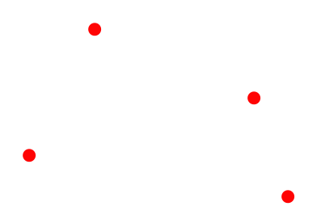

In this tutorial, we will introduce several types of geospatial data, and enumerate key Earth Engine functions for analyzing and visualizing them. This cookbook was originally created as a workshop during Yale-NUS Data 2.0 hackathon and then updated for Yale GIS Day 2018 and 2019. 

## Introduction
GIS or Geographic Information System is the collection, visualization, and analysis of geographical or spatial data. In this section, we will cover the data types commonly used in GIS applications.

## Data types

- Vector data represent objects on the Earth's surface using their longitude and latitude, as well as combinations of the pairs of coordinates (lines, polylines, polygons, etc.).
- Raster data represent objects/variables on the Earth's surface as a matrix of values, in the form of pixels, cells, or grids.

---


- Points

A pair of coordinates (longitude, latitude), that represents the location of points on the Earth's surface. 
Example: Location of drop boxes, landmarks, etc. 

 

- Lines

A series of points that represents a line (straight or otherwise) on the Earth's surface.
Example: Center of roads, rivers, etc. 

 

- Polygons

A series of points (vertices) that define the outer edge of a region.
Example: Outlines of cities, countries, continents, etc. 

 

- Raster layers/bands
 
A raster is an image with a matrix of values, representing some variable on/of the Earth's surface. Bands of a raster correspond to different variables, usually using the same matrix structure. 
Example: Spatial variability of temperature, elevation, rainfall, etc. over a region. 

 

Image sources: https://gisgeography.com/spatial-data-types-vector-raster/

---

## Google Earth Engine platform

[Introductory video](https://www.youtube.com/watch?v=gKGOeTFHnKY&feature=youtu.be)

[Code editor](https://code.earthengine.google.com/)

- Cloud-based platform for planetary scale geospatial analysis
- Uses Google's computational resources to reduce processing time
- Massive archive of remote sensing data 
  - 200+ public datasets 
  - over 4,000 new images every day 
  - over 5 million images 
  - over 30 petabytes of data

Source: Google Earth Engine user summit

---


---

## Basic functions

### Declaring variables
```javascript
var variableName = ee.ContainerType(value);
```
A container (in the form `ee.variabletype`) is used to wrap up a native JavaScript object so that Google's server can perform operations on it.

###  Centering map
```javascript
Map.setCenter(long, lat, zoomLevel);
```
>Zoom level varies from 0 (no zoom) to 20 (highest zoom level)

### Displaying metadata
```javascript
print(variableName);
```
The `print` operation is also useful for printing data and getting debugging info. You cannot print more than 5,000 elements at once.

### Adding a layer to the map
```javascript
Map.addLayer(variableName);
```

---

## Variable types in Earth Engine

### Strings

```javascript
var str = ee.String('This is a string. Or is it? It is.');
```
### Numbers
```javascript
var num = ee.Number(5);
```

### Arrays
```javascript
var arr = ee.Array([[5, 2, 3], [-2, 7, 10], [6, 6, 9]]);
```

### Lists
```javascript
var lis = ee.List([5, 'five', 6, 'six']);
```
### Dictionaries
```javascript
var dict = ee.Dictionary({five: 5, six: 6});
```

### And the fun stuff
- Geometries
- Features
- Feature collections
- Images
- Image collections

---

## Geometries – declaration and types

### Points
```javascript
var poi = ee.Geometry.Point(0, 45);
```
### Multi points
```javascript
var multi = ee.Geometry.MultiPoint(0, 45, 5, 6, 70, -56);
```
### Line string
```javascript
var lineStr = ee.Geometry.LineString([[0, 45], [5, 6], [70, -56]]);
```
### Multi line string
```javascript
var mLineStr =
ee.Geometry.MultiLineString([[[0, 45], [5, 6], [70, -56]], [[0, -45], [-5, -6], [-70, 56]]]);
```
### Linear Ring
```javascript
var linRin = ee.Geometry.LinearRing(0, 45, 5, 6, 70, -56, 0, 45);
```
### Rectangle
```javascript
var rect = ee.Geometry.Rectangle(0, 0, 60, 30);
```
### Polygon
```javascript
var poly = ee.Geometry.Polygon([[[0, 0], [6, 3], [5, 5], [-30, 2], [0, 0]]]);
```
### Multi polygon
```javascript
var multiPoly =
ee.Geometry.MultiPolygon([ee.Geometry.Polygon([[0, 0], [6, 3], [5, 5], [-30, 2], [0, 0]]),
ee.Geometry.Polygon([[0, 0], [-6, -3], [-5, -5], [30, -2], [0, 0]])]);
```

---

## Features and feature collections

- Features are geometries associated with specific properties.
- Feature collections are groups of features.


---

## Functions and mapping

- A function is a set of instructions to perform a specific task.
```javascript
function functionName(Arguments) {
statements;
};
```
### Call a function
```javascript
var result = functionName(input);
```

### Map function over feature or image collection
```javascript
var result = input.map(functionName);
```
Mapping a function over a collection applies the function to every element in the collection.

---


## Operations on geometries

### Find area of geometry
```javascript
var geoArea = geometry.area();
```

By default, all units in Earth Engine are in meters.

### Find length of line
```javascript
var linLen = lineString.length();
```
### Find perimeter of geometry
```javascript
var geoPeri = geometry.perimeter();
```

### Reduce number of vertices in geometry
```javascript
var simpGeo = geometry.simplify(100);
```
### Find centroid of geometry
```javascript
var centrGeo = geometry.centroid();
```
### Create buffer around geometry
```javascript
var buffGeo = geometry.buffer(100);
```
### Find bounded rectangle of the geometry
```javascript
var bounGeo = geometry.bounds();
```
### Find the smallest envelope that can envelop the geometry
```javascript
var convexGeo = geometry.convexHull();
```
### Find common area between two or more geometries
```javascript
var interGeo = geometry1.intersection(geometry2);
```
### Find area that includes two or more geometries
```javascript
var unGeo = geometry1.union(geometry2);
```

#### Geometry operations example

Let's run of some these operations over the the state of Connecticut, US using geometries of the public US counties feature collection available on Earth Engine:

```javascript
// Set map center over the state of CT
Map.setCenter(-72.6978, 41.6798, 8);
// Load US county dataset
var countyData=ee.FeatureCollection('TIGER/2018/Counties');
// Filter the counties that are in Connecticut (more on filters later)
var countyConnect=countyData.filter(ee.Filter.metadata('STATEFP', 'equals', '09'));
// Get the union of all the county geometries in Connecticut
var countyConnectDiss=countyConnect.union();
// Add the layer to the map with a specified color and layer name
Map.addLayer(countyConnectDiss, {color: 'red'}, 'Chicago dissolved');
// Find the rectangle that emcompasses the southernmost, westernmost, easternmost, and northernmost
// points of the feature
var bound = countyConnectDiss.geometry().bounds();
// Add the layer to the map with a specified color and layer name
Map.addLayer(bound, {color: 'yellow'}, 'Bounds');
// Find the polygon covering the extremities of the feature
var convex = countyConnectDiss.geometry().convexHull();
// Add the layer to the map with a specified color and layer name
Map.addLayer(convex, {color: 'blue'}, 'Convex Hull');
// Find the area common to two or more features
var intersect = bound.intersection(convex, 100);
// Add the layer to the map with a specified color and layer name
Map.addLayer(intersect, {color: 'green'}, 'Bound and convex intersection');
// Find the area encompassing two or more features; number is the maximum error in meters
var union = bound.union(convex, 100);
// Add the layer to the map with a specified color and layer name
Map.addLayer(union, {color: 'purple'}, 'Bound and convex union');
// Find the difference between two geometries
var diff=bound.difference(convex, 100);
// Add the layer to the map with a specified color and layer name
Map.addLayer(diff, {color: 'purple'}, 'Bound and convex difference');
// Find area of feature
var ar = countyConnectDiss.geometry().area();
print(ar);
// Find length of line geometry (You get zero since this is a polygon)
var length = countyConnectDiss.geometry().length();
print(length);
// Find permeter of feature
var peri = countyConnectDiss.geometry().perimeter();
print(peri);
```

#### Mapping over a feature collection example

By mapping over a collection, one can apply the same operation on every element in a collection. For instance, let's run the same geometry operations on every county in Connecticut:

```javascript
// Set map center over the state of CT
Map.setCenter(-72.6978, 41.6798, 8);
// Load US county dataset
var countyData=ee.FeatureCollection('TIGER/2018/Counties');
// Filter the counties that are in Connecticut
var countyConnect=countyData.filter(ee.Filter.metadata('STATEFP', 'equals', '09'));
// Add the layer to the map with a specified color and layer name
Map.addLayer(countyConnect, {color: 'red'}, 'Original Collection');
// Define function
function performMap(feature) {
 // Reduce number of vertices in geometry; the number is to specify maximum error in meters
 // This is only for illustrative purposes since Earth Engine can handle up to 1 million vertices
 var simple = feature.simplify(10000);
 // Find centroid of geometry
 var center = simple.centroid();
 // Create buffer around geometry; the number represents the width of buffer in meters
 var buff = center.buffer(5000);
 // return variable from function
 // Change the returned variable to visualize what each sequential geometry operation does
 return buff;
}
// Map function over feature collection
var mappedCentroid = countyConnect.map(performMap);
// Add the layer to the map with a specified color and layer name
Map.addLayer(mappedCentroid, {color: 'blue'}, 'Mapped buffed centroids');
```

---
## Operations on features

### Set property name and value of geometry to create a feature
```javascript
var feat = ee.Feature(geometry, {Name: 'featureName', Size: 500});
```
### Create a new feature from existing feature while renaming a property
```javascript
var featNew = feature.select(['name'], ['descriptor']);
```
### Extract values of a property from a Feature
```javascript
var featVal = feature.get('size');
```

#### Feature operations example

Let's create a feature from scratch and play around with its properties:

```javascript
// Create geometry
var varGeometry = ee.Geometry.Polygon(0, 0, 40, 30, 20, 20, 0, 0);
// Create feature from geometry
var varFeature = ee.Feature(varGeometry, {
 Name: ['Feature name', 'Supreme'],
 Size: [500, 1000]
});
// Get values of a property
var arr=varFeature.get('Size');
// Print variable
print(arr);
// Select a subset of properties and rename them
var varFeaturenew = varFeature.select(['Name'], ['Descriptor']);
// Print variable
print(varFeaturenew);
```

---

## Filters

### Creator a filter for values of a property

```javascript
var bFilter = ee.Filter.eq(propertyName, value);
```
>or .neq , .gt , .gte , .lt , and .lte

### Create a filter based on maximum difference from a threshold

```javascript
var diffFilter = ee.Filter.maxDifference(threshold, propertyName, value);
```

### Create a text filter

```javascript
var txtFilter = ee.Filter.stringContains(propertyName, stringValue);
```

>or .stringStartsWith, and .stringEndsWith

### Create a range filter

```javascript
var rangeFilter = ee.Filter.rangeContains(propertyName, stringValue, minValue, maxValue);
```
  
### Create a list filter to check for certain values

```javascript
var listFilter = ee.Filter.listContains(propertyName, value1, propertyName2, value2);
```
>.inList to test against list of values

### Create a filter of dates

```javascript
var dateFilter = ee.Filter.calendarRange(startDate, stopDate);
```

### Create a filter for particular days of the year

```javascript
var dayFilter = ee.Filter.dayOfYear(startDay, stopDay);
```

### Create a filter to subset geospatial data

```javascript
var boundsFilter = ee.Filter.bounds(geometryOrFeature);
```
### Combining and inversing filters

```javascript
var newFilterAnd = ee.Filter.and(listOfFilters);
var newFilterOr = ee.Filter.or(listOfFilters);
var inverseFilter = ee.Filter.not(filter);
```
---
## Operations on Images

### Selecting the bands of an image
```javascript
var band = var_Image.select(bandName);
```
### Creating masks
```javascript
var mask = image.eq(value);
```
>or .neq or .gt or .gte or .lt or .lte

### Applying masks
```javascript
var masked = image.mask(mask);
```

### Pixelwise calculation
```javascript
var results = image.add(value);
```
>or .subtract ,    .multiply ,    .divide ,    .max , .min ,  .abs ,  .round ,  .floor ,  .ceil ,  .sqrt ,  .exp,  .log, .log10, .sin ,  .cos ,  .tan ,  .sinh ,  .cosh ,  .tanh ,  .acos, .asin

### Shift pixels of an image
```javascript
newImage = oldImage.leftShift(valueOfShift);
```
>or .rightShift

### Create a single value from an image by applying a reducer based on regions of interest

```javascript
var outputDictionary = varImage.reduceRegion(reducer, geometry, scale);
```

---

## Operations on Image Collections

### Select the first n numbers of images in a collection (based on property)

```javascript
var selectedImages = imCollection.limit(n, propertyName, order);
```

### Select images in collection based on particular properties

```javascript
var selectedIm = imCollection.filterMetadata(propertyName, relation, value);
```

or preferably

```javascript
var selectedIm = imCollection.filter(ee.Filter.metadata(propertyName, relation, value));
```

>Relations could be "equals", "less_than", "greater_than", "starts_with", "ends_with", and "contains"

### Select images within date range
```javascript
var selectedIm = imCollection.filterDate(startDate, stopDate);
```

### Select images within geometry
```javascript
var selectedIm = imCollection.filterBounds(geometry);
```

### Perform pixelwise calculations for all images in collection
```javascript
var sumOfImages = imCollection.sum();
```

>or .product, .max, .min, .mean, .mode, .median, and .count 

Alternatively, using reducers:
```javascript
var sumOfImages = imCollection.reduce(ee.Reducer.sum());
```

### Create composite of images in collection with the last image on top

```javascript
var mosaicOfImages = imCollection.mosaic();
```
Alternatively, using reducers:
```javascript
var sumOfImages = imCollection.reduce(ee.Reducer.first());
```
#### Image and image collections operations example
Let's analyze images over a region of interest (the counties of Connecticut). Images and image collections cover the bulk of Earth Engine's data archives.

```javascript
// Set map center over the state of CT
Map.setCenter(-72.6978, 41.6798, 8);
// Load the MODIS MYD11A2 (8-day LST) image collection
var raw = ee.ImageCollection('MODIS/006/MYD11A2');
// Load US county dataset
var countyData=ee.FeatureCollection('TIGER/2018/Counties');
// Filter the counties that are in Connecticut
// This will be the region of interest for the image operations
var roi=countyData.filter(ee.Filter.metadata('STATEFP', 'equals', '09'));
// Examine image collection
print(raw);
// Select a band of the image collection using either indexing or band name
var bandSel1 = raw.select(0);
var bandSel2 = raw.select('LST_Day_1km');
// Filter the image collection by a date range
var filtered = raw.filterDate('2002-12-30', '2004-4-27');
// Print filtered collection
print(filtered);
// Limit the image collection to the first 50 elements
var limited = raw.limit(50);
// Print collections
print(limited);
print(bandSel1);
// Calculate mean of all images (pixel-by-pixel) in the collection
var mean = bandSel1.mean();
// Isolate image to region of interest
var clipped = mean.clip(roi);
// mathematical operation on image pixels to convert from digital number
// of satellite observations to degree Celsius
var calculate = clipped.multiply(.02).subtract(273.15);
// Add the layer to the map with a specified color palette and layer name
Map.addLayer(calculate, {min: 15, max: 20, palette: ['blue', 'green', 'red']}, 'LST');
// Select pixels in the image that are greater than 30.8
var mask = calculate.gt(18);
// Add the mask to the map with a layer name
Map.addLayer(mask, {}, 'mask');
// Use selected pixels to update the mask of the whole image
var masked = clipped.updateMask(mask);
// Add the final layer to the map with a specified color palette and layer name
Map.addLayer(masked, {min: 10, max: 30, palette: ['blue', 'green', 'red']}, 'LST_masked');
```

---

## Export image, video or table to Google Drive, Asset, or Google Cloud

```javascript
Export.image.toDrive({
  collection: varImage, description: 'fileName', region: geometry, scale: 1000
});
```
>or image.toCloudStorage, image.toAsset, table.toDrive, table.toCloudStorage, video.toCloudStorage, and video.toDrive

#### Importing and exporting data example

```javascript

// Function to find mean of pixels in region of interest
var getRegions = function(image) {
// Load US county dataset
var countyData = ee.FeatureCollection('TIGER/2018/Counties');
// Filter the counties that are in Connecticut
// This will be the region of interest for the operations
var roi=countyData.filter(ee.Filter.metadata('STATEFP', 'equals', '09'));
return image.reduceRegions({
 // Collection to run operation over
 collection: roi,
 // Reducer to use
 reducer: ee.Reducer.mean(),
 // Pixel resolution used for the calculations
 scale: 1000,
 });
};
// Load image collection, filter collection to date range, select band of interest,
// calculate mean of all images in collection, and multiply by scaling factor
var image = ee.ImageCollection('MODIS/MYD13A1').filterDate('2002-07-08', '2017-07-08')
.select('NDVI').mean().multiply(.0001);
// print final image
print(image);
// Call function
var Final = getRegions(image);
// Export image to Google Drive
Export.table.toDrive({
 collection: Final,
 description: 'NDVI_all',
 fileFormat: 'CSV'
});
// Print final collection
print(Final);
```
---

## Bonus: Timelapse example

```javascript
// Timelapse example (based on google API example);
// Create rectangle over Dubai
var geometry = ee.Geometry.Rectangle([55.1, 25, 55.4, 25.4]);
// Add layer to map
Map.addLayer(geometry);
// Load Landsat image collection
var allImages = ee.ImageCollection('LANDSAT/LT05/C01/T1_TOA')
 // Filter row and path such that they cover Dubai
 .filter(ee.Filter.eq('WRS_PATH', 160))
 .filter(ee.Filter.eq('WRS_ROW', 43))
 // Filter cloudy scenes
 .filter(ee.Filter.lt('CLOUD_COVER', 30))
 // Get required years of imagery
 .filterDate('1984-01-01', '2012-12-30')
 // Select 3-band imagery for the video
 .select(['B4', 'B3', 'B2'])
 // Make the data 8 bit
 .map(function(image) {
  return image.multiply(512).uint8();
 });
Export.video.toDrive({
 collection: allImages,
 // Name of file
 description: 'dubaiTimelapse',
 // Quality of video
 dimensions: 720,
 // FPS of video
 framesPerSecond: 8,
 // Region of export
 region: geometry
});
```

[Dubai timelapse](https://www.youtube.com/watch?v=6gK4Fd-WSM4&feature=youtu.be)


---

## Example Applications

 What can you do with Google Earth Engine?

- [EE Population Explorer](https://google.earthengine.app/view/population-explorer)

- [EE Ocean Time Series Investigator](https://google.earthengine.app/view/ocean)

- [Global Surface UHI Explorer](https://yceo.users.earthengine.app/view/uhimap)

- [Stratifi - cloud-based stratification](https://sabrinaszeto.users.earthengine.app/view/stratifi)
---

## Resources


- [Geospatial Software Design](https://environment.yale.edu/courses/2018-2019/detail/754/)

- [Google Earth Engine API documentation](https://developers.google.com/earth-engine/)

- [Google Earth Engine Developers forum](https://groups.google.com/forum/#!forum/google-earth-engine-developers)

- [Example scripts from Prof. Dana Tomlin's handouts for his course on Geospatial Software Design](https://github.com/EEYale/example-scripts)
