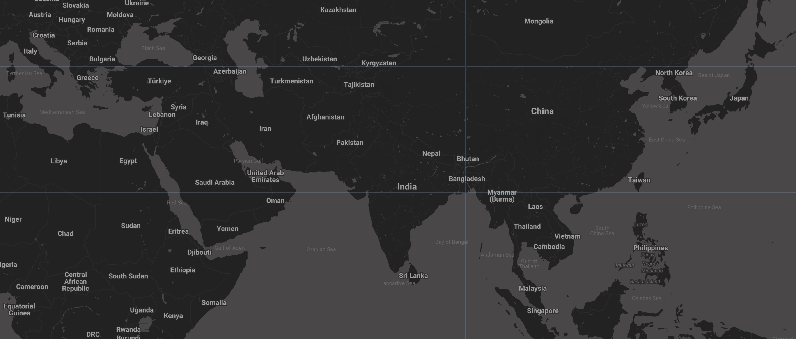
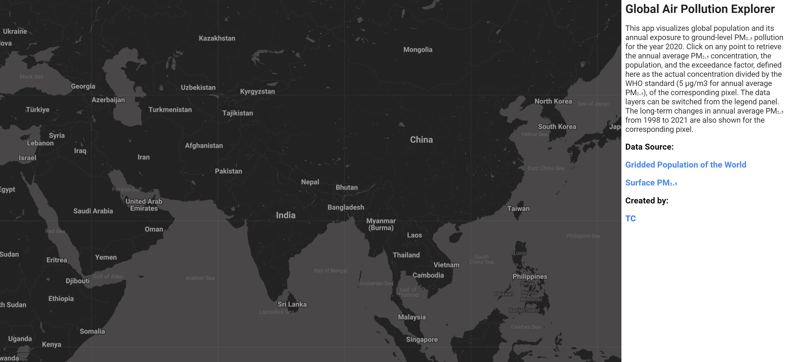
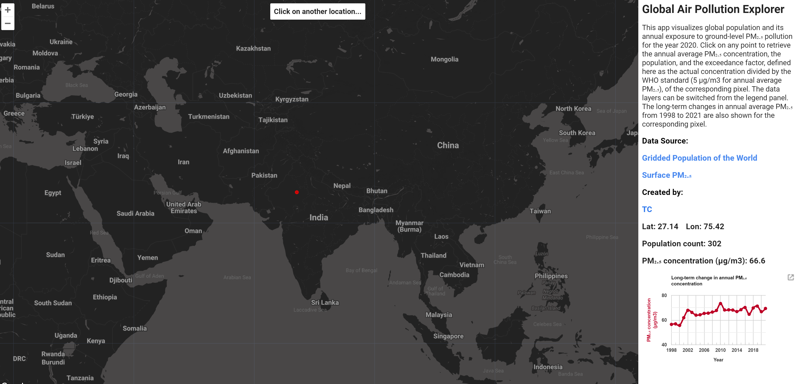
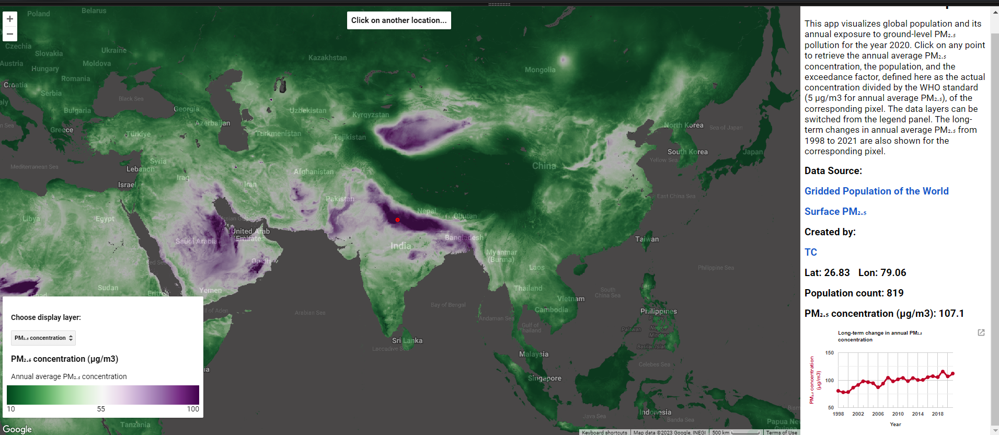
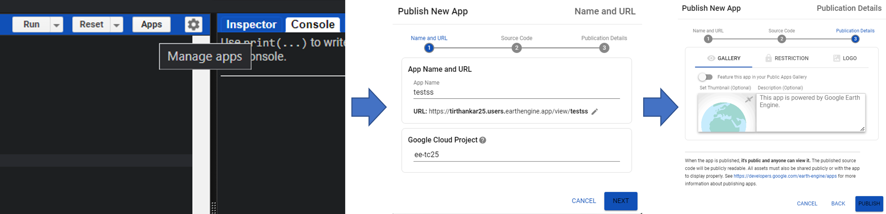

<!--
Copyright 2023 The Google Earth Engine Community Authors

Licensed under the Apache License, Version 2.0 (the 'License');
you may not use this file except in compliance with the License.
You may obtain a copy of the License at

    http://www.apache.org/licenses/LICENSE-2.0

Unless required by applicable law or agreed to in writing, software
distributed under the License is distributed on an 'AS IS' BASIS,
WITHOUT WARRANTIES OR CONDITIONS OF ANY KIND, either express or implied.
See the License for the specific language governing permissions and
limitations under the License.
-->

The Earth Engine Javascript API allows users to develop and deploy web apps to make datasets and results easy to explore and query. In addition to being able to control how others interact with your data, this lets individuals without Earth Engine access explore your data without having to use the code editor. In this tutorial, we will give an introduction to developing a simple Earth Engine web app for a sample dataset (in this case, some global gridded ground-level concentration estimates for particulate matter under 2.5 microns (PM2.5)). The tutorial breaks down the web app development process into some major stages, with relevant comments accompanying the code blocks. All web app development starts by writing a regular script on the code editor using the Earth Engine JavaScript API.

## Generating a new base map for your web app

To better control how to visualize our data, we can generate a new base map for our web app and add it to the map. Earth Engine uses Google's Map API to set the base map style. An example is given below, but you can learn more about these options in [this](https://developers.google.com/earth-engine/tutorials/community/customizing-base-map-styles) community tutorial.

```javascript
// Define base map style.
var basemapStyle = [{
        featureType: 'all',
        elementType: 'labels.text.fill',
        stylers: [{
                saturation: 36
            },
            {
                color: '#000000'
            },
            {
                lightness: 40
            },
        ],
    },
    {
        featureType: 'all',
        elementType: 'labels.text.stroke',
        stylers: [{
                visibility: 'on'
            },
            {
                color: '#000000'
            },
            {
                lightness: 16
            },
        ],
    },
    {
        featureType: 'all',
        elementType: 'labels.icon',
        stylers: [{
            visibility: 'off'
        },
        ],
    },
    {
        featureType: 'administrative',
        elementType: 'geometry.fill',
        stylers: [{
                color: '#000000'
            },
            {
                lightness: 20
            },
        ],
    },
    {
        featureType: 'administrative',
        elementType: 'geometry.stroke',
        stylers: [{
                color: '#000000'
            },
            {
                lightness: 17
            },
            {
                weight: 1.2
            },
        ],
    },
    {
        featureType: 'administrative',
        elementType: 'labels.text.fill',
        stylers: [{
            lightness: '38'
        },
        ],
    },
    {
        featureType: 'landscape',
        elementType: 'geometry',
        stylers: [{
                color: '#000000'
            },
            {
                lightness: 20
            },
        ],
    },
    {
        featureType: 'landscape',
        elementType: 'geometry.fill',
        stylers: [{
            lightness: '-32'
        },
        ],
    },
    {
        featureType: 'poi',
        elementType: 'geometry',
        stylers: [{
                color: '#000000'
            },
            {
                lightness: 21
            },
        ],
    },
    {
        featureType: 'poi',
        elementType: 'labels.text.fill',
        stylers: [{
            lightness: '36'
        },
        ],
    },
    {
        featureType: 'road.highway',
        elementType: 'geometry.fill',
        stylers: [{
                color: '#000000'
            },
            {
                lightness: 17
            },
        ],
    },
    {
        featureType: 'road.highway',
        elementType: 'geometry.stroke',
        stylers: [{
                color: '#000000'
            },
            {
                lightness: 29
            },
            {
                weight: 0.2
            },
        ],
    },
    {
        featureType: 'road.highway',
        elementType: 'labels.text.fill',
        stylers: [{
            color: '#bdbdbd'
        },
        ],
    },
    {
        featureType: 'road.arterial',
        elementType: 'geometry',
        stylers: [{
            lightness: 18
        },
        ],
    },
    {
        featureType: 'road.arterial',
        elementType: 'geometry.fill',
        stylers: [{
            lightness: '-62'
        },
        ],
    },
    {
        featureType: 'road.arterial',
        elementType: 'labels.text.fill',
        stylers: [{
                color: '#e5e5e5'
            },
            {
                visibility: 'off'
            },
        ],
    },
    {
        featureType: 'road.local',
        elementType: 'geometry',
        stylers: [{
                color: '#000000'
            },
            {
                lightness: 16
            },
        ],
    },
    {
        featureType: 'road.local',
        elementType: 'geometry.fill',
        stylers: [{
            lightness: '21'
        },
        ],
    },
    {
        featureType: 'road.local',
        elementType: 'labels.text.fill',
        stylers: [{
            color: '#a0a0a0'
        },
        ],
    },
    {
        featureType: 'transit',
        elementType: 'geometry',
        stylers: [{
                color: '#000000'
            },
            {
                lightness: 19
            },
        ],
    },
    {
        featureType: 'water',
        elementType: 'geometry',
        stylers: [{
                color: '#232222'
            },
            {
                lightness: 17
            },
        ],
    },
];

// Clear existing map.
ui.root.clear();

// Initiate new map object.
var map = ui.Map();

// Add custom map.
ui.root.add(map);

// Set basemap options.
map.setOptions('Base', {
    Base: basemapStyle
});

// Set visibility options to remove geometry creator, map type controller, and layer list.
map.setControlVisibility({
    all: false,
    layerList: false,
    zoomControl: true,
    scaleControl: true,
    mapTypeControl: false,
    fullscreenControl: false
});

// Set the default map's cursor to a 'crosshair'.
map.style().set('cursor', 'crosshair');

// Set the center and zoom level of the new map.
map.setCenter(79.32, 26.56, 4);
```

Now our web app will use this custom base map, which can be further modified, if required, to optimize the visualization or highlight certain features.


## Setting up a panel to hold your text, widgets, and charts

To hold all of the introductory text, widgets, and charts that will be used by or displayed on our web app, we create a function to generate a panel object and call it to add this panel to the map.

```javascript
// Function to create the intro panel with labels.
function panelcreate() {
    // Create an intro panel with labels.
    var intro = ui.Panel([
        ui.Label({
            value: 'Global Air Pollution Explorer',
            style: {
                fontSize: '1.4vw',
                fontWeight: 'bold'
            },
        }),
        ui.Label({
            value: 'This app visualizes global population and its annual exposure to ground-level PM₂.₅' + 
            'pollution for the year 2020. Click on any point to retrieve the annual average PM₂.₅ concentration,' +
            'the population, and the exceedance factor, defined here as the actual concentration divided by the' +
            'WHO standard (5 µg/m3 for annual average PM₂.₅), of the corresponding pixel.' +
            'The data layers can be switched from the legend panel.' + 
            'The long-term changes in annual average PM₂.₅ from 1998 to 2021 are also shown for the corresponding pixel.',
            style: {
                fontSize: '.9vw',
                fontWeight: 'normal'
            },
        }),
    ]);

    // Add intro panel to the main panel.
    panel.add(intro);
}

// Create main panel.
var panel = ui.Panel();

// Set the width and font style for the main panel.
panel.style().set({
    width: '20%',
    fontSize: '1vw',
    fontWeight: 'bold'
});

// Add the main panel to the UI root.
ui.root.insert(1, panel);

// Call the panelcreate function to create the intro panel.
panelcreate();
```

## Adding links and references to main panel

We can add links to the main panel, which is helpful when we want to refer back to a published paper, a doi, or a personal website. Some examples are provided below.

```javascript
// Function to create reference panel.
function referencecreate() {
    var referenceZero = ui.Label({
        value: 'Data Source:',
        style: {
            color: 'black',
            fontWeight: 'bold',
            textAlign: 'center'
        },
    });
    var referenceOne = ui.Label({
        value: 'Gridded Population of the World',
        style: {
            color: 'black',
            fontWeight: 'bold',
            textAlign: 'center'
        },
        targetUrl: 'https://doi.org/10.7927/H4JW8BX5'
    });
    var referenceTwo = ui.Label({
        value: 'Surface PM₂.₅',
        style: {
            color: 'black',
            fontWeight: 'bold',
            textAlign: 'center'
        },
        targetUrl: 'https://sites.wustl.edu/acag/datasets/surface-pm2-5/'
    });
    var referenceThree = ui.Label({
        value: 'Created by:',
        style: {
            color: 'black',
            fontWeight: 'bold',
            textAlign: 'center'
        },
    });
    var referenceFour = ui.Label({
        value: 'TC',
        style: {
            color: 'black',
            fontWeight: 'bold',
            textAlign: 'center'
        },
        targetUrl: 'https://tc25.github.io/'
    });

    // Add reference to the panel.
    panel.add(referenceZero);
    panel.add(referenceOne);
    panel.add(referenceTwo);
    panel.add(referenceThree);
    panel.add(referenceFour);
}

// Call the reference panel creation function.
referencecreate();
```

Here is what the initial panel looks like. 


## Defining a panel to interact with the layers and update values on the main panel

Now we can start adding more functionality to the app. We start by adding a panel that can help users interact with the app by providing some simple instructions. This is added to the top of the map for visibility.

```javascript

// Create an inspector panel with a horizontal layout.
var inspector = ui.Panel({
    layout: ui.Panel.Layout.flow('vertical'),
});

// Add a label to the panel.
inspector.add(
    ui.Label({
        value: 'Click on a location to extract variables',
        style: {
            fontSize: '1.7vmin',
            fontWeight: 'bold',
            textAlign: 'center',
            margin: '0px 0px 0px 0px'
        },
    })
);

// Add the inspector panel to the default map.
map.add(inspector);
```

## Function to interact with layers

We will write a simple callback function that is invoked whenever the map is clicked. The location of the clicked point and other relevant information for the layers being displayed can then be extracted. These values, including a chart that shows the entire time series for the selected point, will be added to our main panel on each map click. 

```javascript

// Register a callback on the default map to be invoked when the map is clicked.
map.onClick(function(coords) {
    // Clear the main panel.
    panel.clear();

    // Call the panel creation function again.
    panelcreate();

    // Call the reference panel creation function again.
    referencecreate();

    // Create panels to hold lon/lat and UHI values.
    var lat = ui.Label();
    var lon = ui.Label();
    var Value = ui.Label();
    var pmPixel = ui.Label();
    var popPixel = ui.Label();
    var efPixel = ui.Label();

    // Add panels to show longitude, latitude, and pixel values to the main panel.
    panel.add(ui.Panel([lat, lon], ui.Panel.Layout.flow('horizontal')));
    panel.add(ui.Panel([popPixel], ui.Panel.Layout.flow('horizontal')));
    panel.add(ui.Panel([pmPixel], ui.Panel.Layout.flow('horizontal')));
    panel.add(ui.Panel([efPixel], ui.Panel.Layout.flow('horizontal')));

    // Add a red dot showing the point clicked on.
    var point = ee.Geometry.Point(coords.lon, coords.lat);
    var dot = ui.Map.Layer(point, {
        color: 'red'
    });
    map.layers().set(1, dot);

    // Clear the inspector panel
    inspector.clear();

    // Show the inspector panel and add a loading label
    inspector.style().set('shown', true);
    inspector.add(
        ui.Label({
            value: 'Loading...',
            style: {
                color: 'gray',
                fontSize: '1.7vmin',
                fontWeight: 'normal',
                textAlign: 'center',
                margin: '0px 0px 0px 0px'
            },
        })
    );

    // Sample data at the clicked point from the images
    var samplePop = ee.Image(Pop).sample(point, 300).first().toDictionary();
    var samplePM = ee.Image(PM).sample(point, 300).first().toDictionary();
    var sampleEF = ee.Image(exceedanceFactor).sample(point, 300).first().toDictionary();

    // Update the lon/lat panel with values from the click event.
    lat.setValue('Lat: ' + coords.lat.toFixed(2));
    lon.setValue('Lon: ' + coords.lon.toFixed(2));

    // Update the pmPixel, popPixel, and efPixel panels with their respective values
    pmPixel.setValue('PM₂.₅ concentration (µg/m3): ' + samplePM.get('b1').getInfo().toFixed(1));
    popPixel.setValue('Population count: ' + samplePop.get('population_count').getInfo().toFixed(0));
    efPixel.setValue('Exceedance factor: ' + sampleEF.get('b1').getInfo().toFixed(2));
    // Create a pmChart line chart.
    // Create a line chart from the pmTime image and point data.
    var pmChart = ui.Chart.image
        .series(pmTime, point)
        .setChartType('LineChart');
    // Set the chart type to be a line chart.
    pmChart.setOptions({
        // Set the title of the chart.
        title: 'Long-term change in annual PM₂.₅ concentration',
        vAxes: {
            0: {
                // Set the title of the vertical axis.
                title: 'PM₂.₅ concentration (µg/m3)',
                // Set the format of the numbers on the axis.
                format: '#.##',
                // Set the style of the text.
                titleTextStyle: {
                    bold: true,
                    color: '#bd0026',
                    italic: false
                },
            },
        },
        hAxis: {
            // Set the title of the horizontal axis.
            title: 'Year',
            // Set the format of the numbers on the axis.
            format: 'yyyy',
            // Set the number of gridlines on the axis.
            gridlines: {
                count: 22
            },
            // Set the style of the text.
            titleTextStyle: {
                bold: true,
                italic: false
            },
        },
        // Set the type of curve for the line chart.
        curveType: 'function',
        // Set the color of the line.
        colors: ['#bd0026'],
        // Set the width of the line.
        lineWidth: 3,
        // Set the size of the points on the line chart.
        pointSize: 5,
        // set the height of the chart area
        chartArea: {
            height: '53%'
        },
        tooltip: {
            trigger: 'none'
        },
        series: {
            0: {
                targetAxisIndex: 0,
                visibleInLegend: false
            },
        },
    });

    // Add the chart to the panel.
    panel.widgets().set(9, pmChart);

    // Clear inspector again and display a new label.
    inspector.clear();

    inspector.style().set('shown', true);
    inspector.add(
        // Set the label text.
        ui.Label({
            value: 'Click on another location...',
            style: {
                fontSize: '1.7vmin',
                fontWeight: 'bold',
                textAlign: 'center',
                margin: '0px 0px 0px 0px'
            },
        })
    );
});
```

## Creating the legend panel

Next, we create another panel that will hold our legend. The legend panel will be initialized at the end of the script. 

```javascript

var vis = {
    min: 2000,
    max: 18000,
    palette: thePalette
};

var legend = ui.Panel({
    style: {
        position: 'bottom-left',
        width: '25%'
    }
});

// Define the legend creation function.
function legendcreate() {
    legend.add(ui.Label());
}

// Call legend creation function.
legendcreate();
```

## Loading in images to display and defining visualization options

We now add the datasets that we want to interact with in this web app. Many of these have been preprocessed for this tutorial, but you can use any of the datasets in the Earth Engine data catalog to generate similar web apps. 

```javascript

// Load in all relevant datasets.
// PM2.5 data for the year 2020 regridded to the same grids as the population estimates.
var PM = ee.Image('users/tirthankar25/PM_2020_regrid');

// Image collection of the original annual mean PM2.5 data.
var pmTime = ee.ImageCollection('projects/gee-datastore/assets/PM25_v5GL03');

// Population data.
var Pop = ee.Image(
    'CIESIN/GPWv411/GPW_Population_Count/gpw_v4_population_count_rev11_2020_30_sec'
);

// Exceedence factor of PM2.5 concentration.
var exceedanceFactor = ee.Image('users/tirthankar25/PMtimes_2020');

// Define color palette:
var thePalette = [
    '#40004b',
    '#762a83',
    '#9970ab',
    '#c2a5cf',
    '#e7d4e8',
    '#f7f7f7',
    '#d9f0d3',
    '#a6dba0',
    '#5aae61',
    '#1b7837',
    '#00441b'
].reverse();

// Define visualization options for the images displayed.
var pmTimeVis = exceedanceFactor.visualize({
    min: 1,
    max: 20,
    palette: thePalette,
    opacity: 0.65
});
var pmVis = PM.visualize({
    min: 10,
    max: 100,
    palette: thePalette,
    opacity: 0.65
});
var popVis = Pop.visualize({
    min: 2000,
    max: 18000,
    palette: thePalette,
    opacity: 0.65
});
```

With all data loaded in, we can now click on different parts of the map and the relevant values will be added to the main panel. 


Note, however, that the layers themselves are not visible. This is because we will link the layers to a legend bar with a layer selector, which is described in the steps below.

## Function to update visualization based on layer selected
First, we define a callback function that will reset the map and update the dataset displayed based on lhe layer selected.

```javascript

// Redraw function is called when the user changes the selected layer.
function redraw() {
    // Reset the layers and the legend.
    map.layers().reset();
    legend.clear();
    legendcreate();
    var layer = select.getValue();
    var image;
    legend
        .add(
            ui.Label({
                value: 'Choose display layer:',
                style: {
                    fontSize: '14px',
                    fontWeight: 'bold',
                    textAlign: 'left'
                },
            })
        )
        .add(select);

    // Check which layer is selected and create the corresponding legend.
    if (layer == pm_Times) {
        // Color labels and palette
        vis = {
            min: 1,
            max: 20,
            palette: thePalette
        };

        // Creates a color bar thumbnail image for use in legend from the given color palette.
        function makeColorBarParams(palette) {
            return {
               // Bounding box for color bar.
                bbox: [0, 0, 1, 0.1],
                // Dimensions of color bar.
                dimensions: '100x10',
                // Format of color bar.
                format: 'png',
                // Min value for color bar.
                min: 0,
                // Max value for color bar.
                max: 1,
                // Color palette for color bar.
                palette: palette
            };
        }

        // Create the color bar for the legend.
        var colorBar = ui.Thumbnail({
           // Image to use for color bar.
            image: ee.Image.pixelLonLat().select(0),
            // Parameters for color bar.
            params: makeColorBarParams(vis.palette),
            style: {
                // Stretch color bar horizontally.
                stretch: 'horizontal',
                // No margin for color bar.
                margin: '0px 0px',
                // Max height of color bar.
                maxHeight: '10%',
                // Width of color bar.
                width: '100%'
            },
        });

        // Create a panel with three numbers for the legend.
        var legendLabels = ui.Panel({
            widgets: [
                ui.Label(vis.min, {
                    margin: '0px 0px'
                }),
                ui.Label('10.5', {
                    margin: '0px 0px',
                    textAlign: 'center',
                    stretch: 'horizontal'
                }),
                ui.Label(vis.max, {
                    margin: '0px 0px'
                }),
            ],
            layout: ui.Panel.Layout.flow('horizontal')
        });

        // Add label to legend.
        legend.add(
            ui.Label({
                value: 'Actual concentration of PM₂.₅ divided by the WHO standard',
                style: {
                    fontSize: '14px',
                    textAlign: 'left'
                },
            })
        );

        // Add colorbar to legend.
        legend.add(colorBar);

        // Add labels to legend.
        legend.add(legendLabels);

        // Set the image variable to pmTimeVis.
        image = pmTimeVis;
    } else if (layer == pm_Dat) {
        // Set visualization parameters.
        vis = {
            min: 10,
            max: 100,
            palette: thePalette
        };
        // Function to create parameters for color bar.
        function makeColorBarParams(palette) {
            return {
                bbox: [0, 0, 1, 0.1],
                dimensions: '100x10',
                format: 'png',
                min: 0,
                max: 1,
                palette: palette
            };
        }

        // Create color bar for legend.
        var colorBar = ui.Thumbnail({
            image: ee.Image.pixelLonLat().select(0),
            params: makeColorBarParams(vis.palette),
            style: {
                stretch: 'horizontal',
                margin: '0px 0px',
                maxHeight: '10%',
                width: '100%'
            },
        });

        // Create panel with labels for legend.
        var legendLabels = ui.Panel({
            widgets: [
                ui.Label(vis.min, {
                    margin: '0px 0px'
                }),
                ui.Label('55', {
                    margin: '0px 0px',
                    textAlign: 'center',
                    stretch: 'horizontal'
                }),
                ui.Label(vis.max, {
                    margin: '0px 0px'
                }),
            ],
            layout: ui.Panel.Layout.flow('horizontal')
        });

        // Add label to legend.
        legend.add(
            ui.Label({
                value: 'PM₂.₅ concentration (µg/m3)',
                style: {
                    fontSize: '16px',
                    fontWeight: 'bold',
                    textAlign: 'left'
                },
            })
        );

        // Add label to legend.
        legend.add(
            ui.Label({
                value: 'Annual average PM₂.₅ concentration',
                style: {
                    fontSize: '14px',
                    textAlign: 'left'
                },
            })
        );

        // Add colorbar to legend.
        legend.add(colorBar);

        // Add labels to legend.
        legend.add(legendLabels);

        // Set image variable to pmVis.
        image = pmVis;
    } else if (layer == pop_Dat) {
        // Set visualization parameters.
        vis = {
            min: 2000,
            max: 18000,
            palette: thePalette
        };
        // Function to create parameters for color bar.
        function makeColorBarParams(palette) {
            return {
                bbox: [0, 0, 1, 0.1],
                dimensions: '100x10',
                format: 'png',
                min: 0,
                max: 1,
                palette: palette
            };
        }

        // Create the color bar for the legend.
        var colorBar = ui.Thumbnail({
            image: ee.Image.pixelLonLat().select(0),
            params: makeColorBarParams(vis.palette),
            style: {
                stretch: 'horizontal',
                margin: '0px 0px',
                maxHeight: '10%',
                width: '100%'
            },
        });

        // Create a panel with three numbers for the legend.
        var legendLabels = ui.Panel({
            widgets: [
                // Add minimum, center, and maximum values for legend.
                ui.Label(vis.min, {
                    margin: '0px 0px'
                }),
                ui.Label('10000', {
                    margin: '0px 0px',
                    textAlign: 'center',
                    stretch: 'horizontal'
                }),
                ui.Label(vis.max, {
                    margin: '0px 0px'
                })
            ],

            // Layout for legend.
            layout: ui.Panel.Layout.flow('horizontal')
        });

        // Add label to legend.
        legend.add(
            // Label for legend.
            ui.Label({
                value: 'Population count',
                // Font style of label.
                style: {
                    fontSize: '16px',
                    fontWeight: 'bold',
                    textAlign: 'left'
                },
            })
        );

        // Add label to legend.
        legend.add(
           // Label for legend.
            ui.Label({
                value: 'Number of people',
                // Font style of label.
                style: {
                    fontSize: '14px',
                    textAlign: 'left'
                },
            })
        );

        // Add colorbar to legend.
        legend.add(colorBar);

        // Add labels to legend.
        legend.add(legendLabels);

        // Set image variable to popVis.
        image = popVis;
    }

    // Add layer to map.
    map.addLayer(image, {}, layer);

    // If layer is none, reset layers on map.
    if (layer == none) {
        map.layers().reset();
    }
}
```

## Adding a layer selector to the legend
Second, we define a selector object that is added to the legend panel and can be used to update the layer being displayed. The callback function we defined above will be called whenever a new selection is made.

```javascript

// Define the text corresponding to options for the following layer selector.
var pm_Times = 'Exceedance factor';
var pm_Dat = 'PM₂.₅ concentration';
var pop_Dat = 'Population count';
var none = 'Remove all';

// Create a layer selector that dictates which layer is visible on the map.
var select = ui.Select({
    items: [pm_Times, pm_Dat, pop_Dat, none],
    value: pm_Times,
    onChange: redraw
});
legend
    .add(
        ui.Label({
            value: 'Choose display layer:',
            style: {
                fontSize: '14px',
                fontWeight: 'bold',
                textAlign: 'left'
            },
        })
    )
    .add(select);
var vis = {
    min: 1,
    max: 20,
    palette: thePalette
};
```

## Initialiating the script
Finally, to initialize the script, we will invoke the function to display the layer and add the legend to the map.

```javascript
// Invoke the redraw function once at start up to initialize the map.
redraw();

// Add legend to map.
map.add(legend);
```
The sript now has all the functionality through the code editor.


## Publishing your web app

To publish the web app, we just need to go to the manage app option on the Javascript code editor and follow the steps. See below:



## Additional resources

- You can find more information about publishing apps using Earth Engine [here](https://developers.google.com/earth-engine/guides/apps).
- The Google Earth Engine API documentation can be found [here](https://developers.google.com/earth-engine/).
- Curated Earth Engine apps are listed [here](https://www.earthengine.app/).
