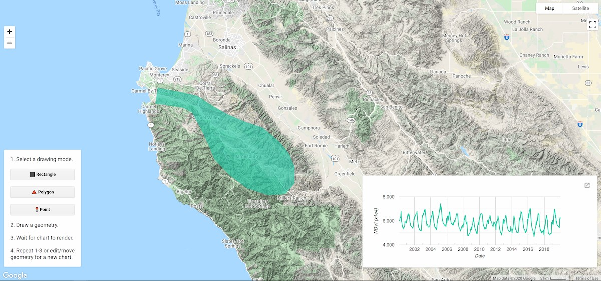
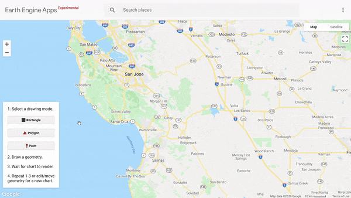

<!--
Copyright 2020 The Google Earth Engine Community Authors

Licensed under the Apache License, Version 2.0 (the "License");
you may not use this file except in compliance with the License.
You may obtain a copy of the License at

https://www.apache.org/licenses/LICENSE-2.0

Unless required by applicable law or agreed to in writing, software
distributed under the License is distributed on an "AS IS" BASIS,
WITHOUT WARRANTIES OR CONDITIONS OF ANY KIND, either express or implied.
See the License for the specific language governing permissions and
limitations under the License.
-->

This tutorial demonstrates how to use the [drawing tools
API](https://developers.google.com/earth-engine/ui_widgets#ui.map.drawingtools)
with a custom interface to make a simple [Earth Engine
App](https://developers.google.com/earth-engine/apps) that charts an NDVI
time series for a user-drawn geometry. The app provides options for drawing a
rectangle, polygon, or point. It listens for when a user draws a geometry and
displays a chart of mean NDVI for pixels intersecting the drawn geometry.


_The Earth Engine App resulting from this
tutorial. Shown is an NDVI time series chart for the drawn polygon around
Carmel Valley, California._

## Functionality

The app has two main functions: 1) allow a user to draw a geometry
and; 2) render a region reduction time series chart for the drawn geometry.
Clicking a "draw" button will allow a user to draw a geometry, and once the
drawing is complete, the chart will render. These two events (button click to
draw and drawing finished) need associated functions to complete the
event-callback cycle.

### Custom drawing tools

Before defining callback functions, setup `drawingTools` for custom use.

1\. Get the drawing tools widget object; define it as a variable for
convenience in recalling it later.

```js
var drawingTools = Map.drawingTools();
```

2\. Hide the default drawing tools so you can add your own. You can use the
default drawing tools for interactive region reduction, but they provide more
functionality than is needed when simplicity is the goal.

```js
drawingTools.setShown(false);
```

3\. Setup a while loop to clear all existing geometries that have been added
as imports from drawing tools (from previously running the script). The
design of the app is to handle charting a time series for a single geometry,
so remove any that exist.

```js
while (drawingTools.layers().length() > 0) {
  var layer = drawingTools.layers().get(0);
  drawingTools.layers().remove(layer);
}
```

4\. Initialize a dummy `GeometryLayer` with `null` geometry to act as a
placeholder for drawn geometries.

```js
var dummyGeometry =
    ui.Map.GeometryLayer({geometries: null, name: 'geometry', color: '23cba7'});

drawingTools.layers().add(dummyGeometry);
```

### Event callback functions
Define callback functions to enable drawing and chart rendering, they will be
attached to event listeners in the following sections.

#### Drawing buttons

Define a series of functions that are called when geometry
drawing buttons are clicked: one for clearing the previous geometry from
the `GeometryLayer` and one for each drawing mode button
(rectangle, polygon, and point).

1\. Define the geometry clearing function.

```js
function clearGeometry() {
  var layers = drawingTools.layers();
  layers.get(0).geometries().remove(layers.get(0).geometries().get(0));
}
```

2\. Define functions that will be called when each respective drawing
button is clicked. Each function will clear previous drawings using the
`clearGeometry` function and then initialize drawing for the particular drawing
mode.

```js
function drawRectangle() {
  clearGeometry();
  drawingTools.setShape('rectangle');
  drawingTools.draw();
}

function drawPolygon() {
  clearGeometry();
  drawingTools.setShape('polygon');
  drawingTools.draw();
}

function drawPoint() {
  clearGeometry();
  drawingTools.setShape('point');
  drawingTools.draw();
}
```

#### Regional time series chart

1\. Define a panel to hold the time series chart. Set the `shown` style
parameter to `false` to initially hide the panel until the first chart is
rendered.

```js
var chartPanel = ui.Panel({
  style:
      {height: '235px', width: '600px', position: 'bottom-right', shown: false}
});

```

2\. Add the panel to the `Map`.
```js
Map.add(chartPanel);
```

3\. Define a function that gets called on geometry drawing completion and
editing events to generate an
[NDVI time series](https://developers.google.com/earth-engine/datasets/catalog/MODIS_006_MOD13A2)
chart for the drawn region. See code comments for an explanation of each step.
In summary, the function shows the chart panel on the first drawing event,
clears previously rendered charts, gets the drawn geometry, calculates the
region reduction scale based on the `Map` scale, and renders a chart in the
chart panel.

```js
function chartNdviTimeSeries() {
  // Make the chart panel visible the first time a geometry is drawn.
  if (!chartPanel.style().get('shown')) {
    chartPanel.style().set('shown', true);
  }

  // Get the drawn geometry; it will define the reduction region.
  var aoi = drawingTools.layers().get(0).getEeObject();

  // Set the drawing mode back to null; turns drawing off.
  drawingTools.setShape(null);

  // Reduction scale is based on map scale to avoid memory/timeout errors.
  var mapScale = Map.getScale();
  var scale = mapScale > 5000 ? mapScale * 2 : 5000;

  // Chart NDVI time series for the selected area of interest.
  var chart = ui.Chart.image
                  .seriesByRegion({
                    imageCollection: ee.ImageCollection('MODIS/006/MOD13A2'),
                    regions: aoi,
                    reducer: ee.Reducer.mean(),
                    band: 'NDVI',
                    scale: scale,
                    xProperty: 'system:time_start'
                  })
                  .setOptions({
                    titlePostion: 'none',
                    legend: {position: 'none'},
                    hAxis: {title: 'Date'},
                    vAxis: {title: 'NDVI (x1e4)'},
                    series: {0: {color: '23cba7'}}
                  });

  // Replace the existing chart in the chart panel with the new chart.
  chartPanel.widgets().reset([chart]);
}
```

4\. Set the drawing tools widget to listen for geometry drawing and editing
events and respond with the `chartNdviTimeSeries` function.

Note that `ui.util.debounce` wraps the `chartNdviTimeSeries` function to
reduce the frequency of it being invoked while drawing and editing a
geometry. Here, the delay is set to 500 milliseconds or 0.5 seconds.

```js
drawingTools.onDraw(ui.util.debounce(chartNdviTimeSeries, 500));
drawingTools.onEdit(ui.util.debounce(chartNdviTimeSeries, 500));
```


## User interface

This section defines the drawing control, which contains instructions and
drawing tool buttons.

1\. Define a dictionary of symbols to augment the text label for each of the
geometry buttons defined in the following step. The symbols are kept separate
from the text to avoid unexpected cursor behavior when mixing symbols and
text. The symbols will be concatenated with text in the following step.

```js
var symbol = {
  rectangle: '⬛',
  polygon: '🔺',
  point: '📍',
};
```

2\. Define a `ui.Panel` to hold app instructions and the geometry drawing
buttons. Use a `ui.Label` for each instruction line and a `ui.Button` for
each of the three geometry drawing options. Button labels are the
concatenation of the symbols defined in the previous step and text. Set the
`onClick` parameter to each respective drawing mode callback function defined
above.

```js
var controlPanel = ui.Panel({
  widgets: [
    ui.Label('1. Select a drawing mode.'),
    ui.Button({
      label: symbol.rectangle + ' Rectangle',
      onClick: drawRectangle,
      style: {stretch: 'horizontal'}
    }),
    ui.Button({
      label: symbol.polygon + ' Polygon',
      onClick: drawPolygon,
      style: {stretch: 'horizontal'}
    }),
    ui.Button({
      label: symbol.point + ' Point',
      onClick: drawPoint,
      style: {stretch: 'horizontal'}
    }),
    ui.Label('2. Draw a geometry.'),
    ui.Label('3. Wait for chart to render.'),
    ui.Label(
        '4. Repeat 1-3 or edit/move\ngeometry for a new chart.',
        {whiteSpace: 'pre'})
  ],
  style: {position: 'bottom-left'},
  layout: null,
});
```

3\. Add the panel to the `Map`.

```js
Map.add(controlPanel);
```

## Result

The following animation is the result of putting the entire script together and
publishing it as an Earth Engine App. The simplicity of the custom drawing
tool interface and automatic clearing of the previous drawing and
plot will allow you and your app users to focus on exploring data instead of
geometry management.



Learn more about the drawing tools API in the
[Getting Started with Drawing Tools](https://developers.google.com/earth-engine/tutorials/community/drawing-tools)
tutorial.
