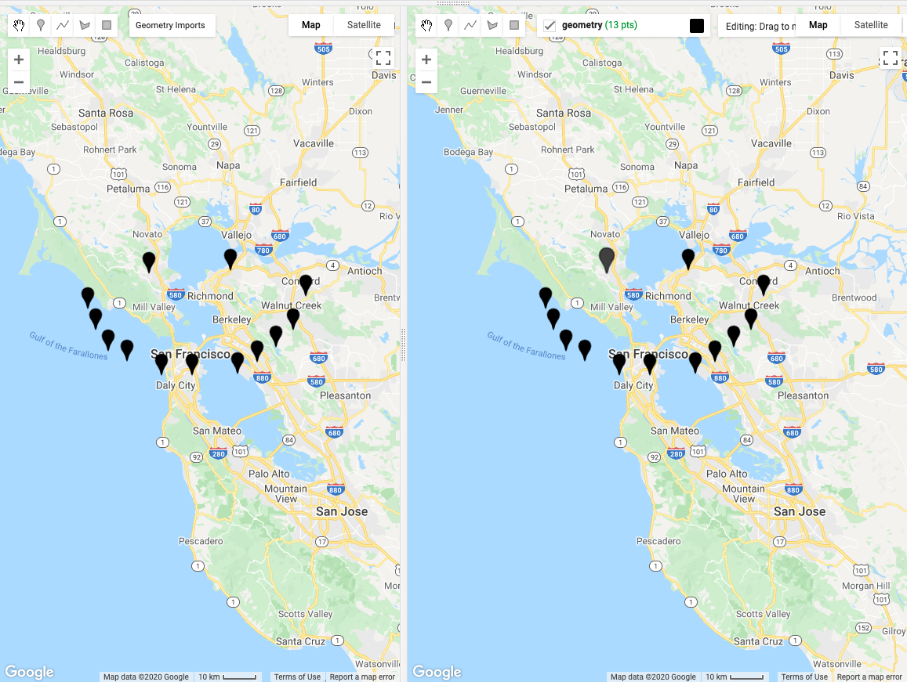
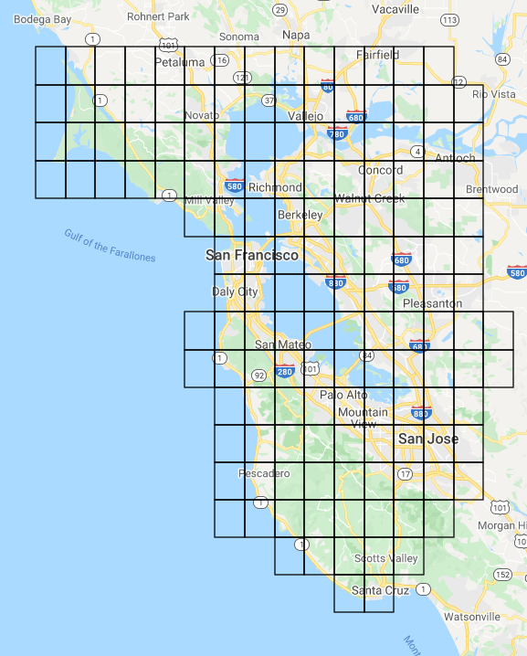
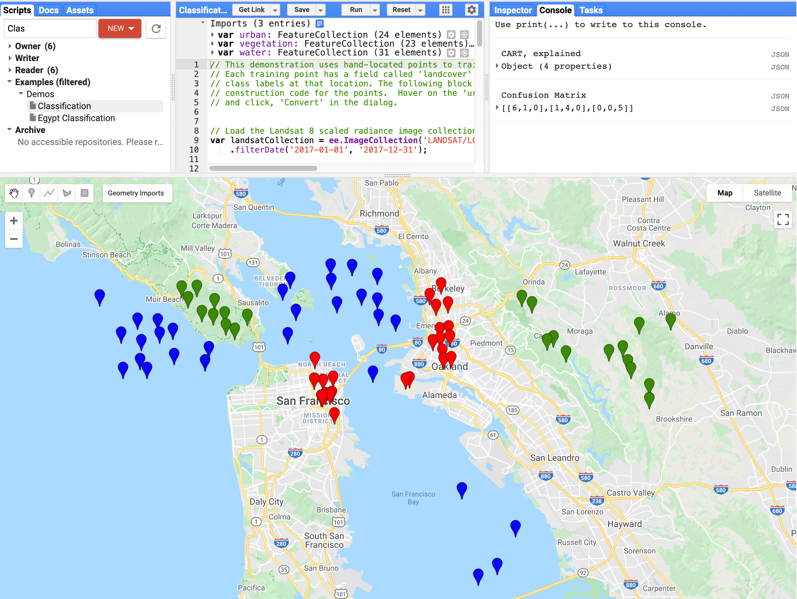

<!--
Copyright 2020 The Google Earth Engine Community Authors

Licensed under the Apache License, Version 2.0 (the "License");
you may not use this file except in compliance with the License.
You may obtain a copy of the License at

    http://www.apache.org/licenses/LICENSE-2.0

Unless required by applicable law or agreed to in writing, software
distributed under the License is distributed on an "AS IS" BASIS,
WITHOUT WARRANTIES OR CONDITIONS OF ANY KIND, either express or implied.
See the License for the specific language governing permissions and
limitations under the License.
-->

In this tutorial, we'll deep dive into some interesting uses of the new drawing
tools API.

-   We'll learn how to dynamically generate a grid and save it as a client-side
    geometry.
-   We'll also build a simple classification tool that classifies based on
    user-drawn points.

**Note: if you are copy and pasting the code snippets below into the Code
Editor, they may not work without drawing a geometry first.**

Let's get started!

## Background

Before the Drawing Tools API, geometries had to be rendered using
`Map.addLayer(geometry)`, which means they had to round trip to the server
whenever the user panned or zoomed on the map. With the new drawing tools API,
we can now render those geometries directly on the map as if we had drawn them
ourselves!

## Getting Started with Drawing Tools

Documentation on the drawing tools API is found here:
[https://developers.google.com/earth-engine/ui_widgets#ui.map.drawingtools](https://developers.google.com/earth-engine/ui_widgets#ui.map.drawingtools).

The drawing tools API adds two new components to the `ui.Map` API:

-   `ui.Map.DrawingTools`, and
-   `ui.Map.GeometryLayer`.

Together, these manage the geometry editing operations as well as any of the
geometry layers on the drawing tools. The drawing tools provide a rich set of
functionality that allow you to listen for when the user draws, edits, or deletes a
geometry, as well as adding, removing, or selecting geometry layers.

To retrieve the drawing tools for a map, simply call the `drawingTools()` method
on the map:

```javascript
var drawingTools = Map.drawingTools();
```

Unlike the default `Map`, newly created `ui.Maps` don't get drawing tools by
default, but we can add drawing tools to newly created maps by simply calling
the `drawingTools()` method to retrieve them:

```javascript
var map = ui.Map();
// Prints true since drawingTools() adds drawing tools to the map.
print(map.drawingTools().getShown());
// Replace the default Map with the newly created map.
ui.root.widgets().reset([map]);
```

**Note: you can only have one drawing tools on a map at a time.**

Use the `layers()` method on the drawing tools to retrieve an `ActiveList` of
the geometry layers. A geometry layer contains a list of geometries that you can
obtain by calling the `geometries()` method on the layer. There are two ways to
add new geometry layers to the drawing tools:

```javascript
var drawingTools = Map.drawingTools();

// Use the addLayer method on the drawing tools directly.
var geometries = [ee.Geometry.Point([0, 0]), ee.Geometry.Rectangle([[0, 0], [1, 1]])];
drawingTools.addLayer(geometries, 'my_geometry1', 'red');

// Create a new GeometryLayer and add it to the layers list.
var layer = ui.Map.GeometryLayer(geometries, 'my_geometry2', 'blue');
drawingTools.layers().add(layer);

// Print the list of geometries.
print(layer.geometries());

// Add a geometry to the layer.
layer.geometries().add(ee.Geometry.Point(1, 1));
```

## Configuring the Drawing Tools

There are some nice configuration options for the drawing tools:

-   `setShown(`*`boolean`*`)` changes the visibility of the drawing tools.
-   `setDrawModes(['point', 'line', 'polygon', 'rectangle'])` changes the
    available draw modes to the user.
-   `setShape('point')` sets the current draw shape and starts draw mode.
-   `setLinked(`*`boolean`*`)` configures whether geometries are linked to the
    imports.

#### Let's take a deeper look at `setLinked`, since it's surprisingly useful!

-   When linked mode is **turned on**, the geometries in the drawing tools are
    **linked to the imports panel**.
-   When linked mode is **turned off**, the geometries in the imports panel will
    be removed from the drawing tools (they won't be deleted), and newly created
    geometry layers will **not be added to the imports**.

The default `Map` has linked mode **turned on** by default whereas a newly
created `ui.Map` has linked mode **turned off** by default.

**Caution: If you delete a geometry layer while linked mode is on (like calling
`layers().reset()`), they will be deleted from the imports!**

### Example: Linked Maps

Suppose you wanted to make a **split map where geometries are reflected on
both maps**. All you have to do is turn on linked mode for both maps' drawing
tools and any geometries that are drawn or edited on one map will be reflected
on the other!

**[Here is a demo script:](https://code.earthengine.google.com/50a1091e84d129aa0313f63384ca3a6a)**

```javascript
var map1 = ui.Map();
map1.drawingTools().setLinked(true);

var map2 = ui.Map();
map2.drawingTools().setLinked(true);

ui.Map.Linker([map1, map2]);

ui.root.widgets().reset([ui.SplitPanel({firstPanel: map1, secondPanel: map2})]);

// Now try drawing a geometry on both maps!
```



*Figure 1. A split map with geometries reflected on both sides.*

Neat, right? Let's do something even more advanced!

## Client Side Geometries

Next up, we'll learn how to dynamically generate a grid in Earth Engine and add
it as a client-side geometry so that it won't be rerendered every time the map
viewport changes.

The drawing tools let you take a server-side geometry and render it on the
client. This requires us to use `evaluate` on the server-side geometries to
fetch them from the server and make them available to be drawn directly on the
map.

Also new, **your imported geometries now show up in Apps** so you only have to
run your expensive geometry rendering code once.

For example, suppose that you rendered a complex geometry in Earth Engine, you can
add it to the map as a client side geometry (with linked mode on). When you
publish the app, the prerendered and imported geometry will already be there; no
further coding required! Here's an example of that in action:

### Example: Build a Client-Side Grid

**[Here's a link to the full script. Press run to see the generated grid!](https://code.earthengine.google.com/49c8987336a3009e7fdc1a5be6b42910?noload=true)**

**Note: this example doesn't work with all projections and doesn't work well
with large geometries, so keep that in mind.**

First, we'll need to write a function that generates a grid based on a geometry.
**Draw a geometry around a region of interest** and then run the following
script:

```javascript
// pixelLonLat returns an image with each pixel labeled with longitude and
// latitude values.
var lonLat = ee.Image.pixelLonLat();

// Select the longitude and latitude bands, multiply by a large number then
// truncate them to integers.
var lonGrid = lonLat
  .select('longitude')
  .multiply(10000000)
  .toInt();

var latGrid = lonLat
  .select('latitude')
  .multiply(10000000)
  .toInt();

// To produce the grid, multiply the latitude and longitude images and then use
// reduce to vectors at the 10km resolution to group the grid into vectors.
var grid = lonGrid
  .multiply(latGrid)
  .reduceToVectors({
    geometry: geometry, // This is undefined until you draw a geometry.
    scale: 10000,
    geometryType: 'polygon',
  });

Map.addLayer(grid);
```

Then we enumerate over the generated `Features` in the `FeatureCollection` and
build a list of `LinearRings` that we'll use to build our `GeometryLayer`.

```javascript
// Fetch the features in the grid and produce a list of linear rings.
// The grid variable is defined in the step above.
var geometries = grid.toList(1000).map(function(feature) {
  var featureGeometry = ee.Feature(feature).geometry();
  var coordinates = featureGeometry.coordinates().get(0);
  return ee.Geometry.LinearRing(coordinates);
});
```

Finally, we add the geometries to the map using the drawing tools. Notice that
we use `evaluate` to fetch the geometries client-side in order to add them
to the drawing tools.

```javascript
var drawingTools = Map.drawingTools();
// Fetch the geometries so they can be added to the drawing tools.
geometries.evaluate(function(geometriesList) {
  var layer = ui.Map.GeometryLayer({
    geometries: geometriesList,
    name: 'grid',
    color: 'black',
    shown: true, // Show the layer (already defaults to true).
    locked: true, // Lock the layer.
  });
  drawingTools.layers().set(1, layer);
});
```

There! Now we have a grid that is rendered client-side that won't go away when
the map viewport changes. Notice that the geometry is uneditable; that's because
we constructed the layer with the `locked` property set to `true`.



*Figure 2. A map with a grid over the San Francisco Bay Area.*

We'll refactor the code to use functions to make it more reusable:

```javascript
function makeGrid(geometry, scale) {
  // pixelLonLat returns an image with each pixel labeled with longitude and
  // latitude values.
  var lonLat = ee.Image.pixelLonLat();

  // Select the longitude and latitude bands, multiply by a large number then
  // truncate them to integers.
  var lonGrid = lonLat
    .select('longitude')
    .multiply(10000000)
    .toInt();

  var latGrid = lonLat
    .select('latitude')
    .multiply(10000000)
    .toInt();

  // To produce the grid, multiply the latitude and longitude images and then use
  // reduce to vectors at the 10km resolution to group the grid into vectors.
  return lonGrid
    .multiply(latGrid)
    .reduceToVectors({
      geometry: geometry, // This is undefined until you draw a geometry.
      scale: scale,
      geometryType: 'polygon',
    });
}

function buildGeometryList(grid, limit) {
  return grid.toList(limit).map(function(feature) {
    var featureGeometry = ee.Feature(feature).geometry();
    var coordinates = featureGeometry.coordinates().get(0);
    return ee.Geometry.LinearRing(coordinates);
  });
}

var grid = makeGrid(geometry, 10000); // 10 km scale
var geometries = buildGeometryList(grid, 1000);

var drawingTools = Map.drawingTools();
geometries.evaluate(function(geometriesList) {
  var layer = ui.Map.GeometryLayer({
    geometries: geometriesList,
    name: 'grid',
    color: 'black',
    shown: true, // Show the layer (already defaults to true).
    locked: true, // Lock the layer.
  });
  drawingTools.layers().set(1, layer);
});
```

Since the grid has already been added to the imports, the `grid` variable is now
available for us to use, so we can comment out the bit that generated the grid
in the first place to save us some computation time.

```javascript
// var grid = makeGrid(geometry);
// var geometries = buildGeometryList(grid);

// var drawingTools = Map.drawingTools();
// geometries.evaluate(function(geometriesList) {
//   var layer = ui.Map.GeometryLayer({
//     geometries: geometriesList,
//     name: 'grid',
//     color: 'black',
//     shown: true, // Show the layer (already defaults to true).
//     locked: true, // Lock the layer.
//   });
//   drawingTools.layers().set(1, layer);
// });
```

If you publish this as an app, since *the imports carry over to Apps*, the grid
will be there, ready to go!

## Event handling

Finally, the drawing tools API allows us to listen for when users interact with:

-   individual geometries,
-   layers,
-   or the drawing tools themselves,

and lets us run callback functions when they happen. Here are some useful events
you can listen for:

### Drawing Tools Events:

-   `onShapeChange(`*`callback`*`)` - A draw mode is changed, for example
    `point`, `line`, `polygon`, or `rectangle`.

#### Geometry Events (callback called with geometry, layer, and drawing tools):

-   `onDraw(`*`callback`*`)` - a geometry is added to a layer.
-   `onEdit(`*`callback`*`)` - a geometry is edited.
-   `onErase(`*`callback`*`)` - a geometry is removed.
-   `onSelect(`*`callback`*`)` - a geometry is selected.

#### Layer Events (callback called with layer and drawing tools):

-   `onLayerAdd(`*`callback`*`)` - a layer is added.
-   `onLayerRemove(`*`callback`*`)` - a layer is removed.
-   `onLayerSelect(`*`callback`*`)` - a layer is selected.
-   `onLayerConfig(`*`callback`*`)` - a layer attribute (e.g. name, color) is
    changed.

We can use these to listen for user interactions with the drawing tools for a
responsive and personalized, Earth Engine experience!

### Example: Classification With User-Drawn Geometries

The last example is adapting the
[Classifications example](https://code.earthengine.google.com/?scriptPath=Examples:Demos/Classification)
to be more interacive. This example runs a machine learning classification using
points defined in three `FeatureCollections`, one for urban, vegetation, and
water. Currently, if we wanted to rerun the classification on new points, we
would have to run the script after we edit the points. **What if we wanted the
rerun the classification automatically when we edit the points?**

We can refactor the classification to rely on the points in the drawing
tools, which are always kept up to date. To make this easier, we can use the
`getEeObject()` method on the `GeometryLayer` to get the Earth Engine object
associated with a `GeometryLayer` (e.g. the underlying
`FeatureCollection`).

First, import the feature collections at the top of the file so we have
`urban`, `vegetation`, and `water` in your imports (hover over the text at the
top of the script and press `convert` on the option that says "`"urban",
"vegetation" and "water" can be converted to import records.`").



*Figure 3. Classification tools example with imported feature collections.*

Next, get the geometry layers associated with each of the feature collections,
since any edits to the geometries will be reflected on the layer (add to the top
of the file):

```javascript
// Starter script: https://code.earthengine.google.com/?scriptPath=Examples:Demos/Classification

var drawingTools = Map.drawingTools();
// Only allow drawing points.
drawingTools.setDrawModes(['point']);

// Get the layers list.
var layers = drawingTools.layers();

// Assuming the order is urban, vegetation, then water.
var urbanLayer = layers.get(0);
var vegetationLayer = layers.get(1);
var waterLayer = layers.get(2);
```

Now that we have the layers, we can get the `FeatureCollection` associated with
each layer by calling the `getEeObject()` method.

Change the following line from:

```javascript
// Merge the three geometry layers into a single FeatureCollection.
var newfc = urban.merge(vegetation).merge(water);
```

to:

```javascript
// Merge the three geometry layers into a single FeatureCollection.
var urbanfc = urbanLayer.getEeObject();
var vegetationfc = vegetationLayer.getEeObject();
var waterfc = waterLayer.getEeObject();
var newfc = urbanfc.merge(vegetationfc).merge(waterfc);
```

and run the script to see that everything stayed the same. Next, we will attach
event listeners to the drawing tools to rerun the classification whenever a
geometry is changed.

First, we will bundle all of the classification code into a single function
called `classify` and make some modifications to the `Map.addLayer` calls to
accomodate for the function running multiple times:

```javascript
function classify() {
  // Merge the three geometry layers into a single FeatureCollection.
  var urbanfc = urbanLayer.getEeObject();
  var vegetationfc = vegetationLayer.getEeObject();
  var waterfc = waterLayer.getEeObject();
  var newfc = urbanfc.merge(vegetationfc).merge(waterfc);

  // Use these bands for classification.
  var bands = ['B2', 'B3', 'B4', 'B5', 'B6', 'B7'];
  // The name of the property on the points storing the class label.
  var classProperty = 'landcover';

  // Sample the composite to generate training data.  Note that the
  // class label is stored in the 'landcover' property.
  var training = composite.select(bands).sampleRegions({
    collection: newfc,
    properties: [classProperty],
    scale: 30
  });

  // Train a CART classifier.
  var classifier = ee.Classifier.smileCart().train({
    features: training,
    classProperty: classProperty,
  });
  // Print some info about the classifier (specific to CART).
  print('CART, explained', classifier.explain());

  // Classify the composite.
  var classified = composite.classify(classifier);

  var palette = {min: 0, max: 2, palette: ['red', 'green', 'blue']};
  var layer = ui.Map.Layer(classified, palette, 'classified');
  Map.layers().set(0, layer);

  // Optionally, do some accuracy assessment.  Fist, add a column of
  // random uniforms to the training dataset.
  var withRandom = training.randomColumn('random');

  // We want to reserve some of the data for testing,
  // to avoid overfitting the model.
  var split = 0.7; // Roughly 70% training, 30% testing.
  var trainingPartition = withRandom.filter(ee.Filter.lt('random', split));
  var testingPartition = withRandom.filter(ee.Filter.gte('random', split));

  // Trained with 70% of our data.
  var trainedClassifier = ee.Classifier.gmoMaxEnt().train({
    features: trainingPartition,
    classProperty: classProperty,
    inputProperties: bands
  });

  // Classify the test FeatureCollection.
  var test = testingPartition.classify(trainedClassifier);

  // Print the confusion matrix.
  var confusionMatrix = test.errorMatrix(classProperty, 'classification');
  print('Confusion Matrix', confusionMatrix);
}

classify();
```

Now, when we call `classify`, the script will use the **up-to-date version** of
the imports to run the classifier, which means we don't need to rerun the script
to capture new points!

We add event listeners to detect when the user has made any edits to the
geometries and run the `classify` function. We also use `ui.util.debounce` to
only run it once every 100 milliseconds to prevent it from firing too fast,
like when the user drags a point around.

```javascript
// Use debounce to call the function at most every 100 milliseconds.
drawingTools.onEdit(ui.util.debounce(classify, 100));
drawingTools.onDraw(ui.util.debounce(classify, 100));
drawingTools.onErase(ui.util.debounce(classify, 100));

Map.centerObject(urban);
```

That's all there is to it!
**[Here's a link to the full script.](https://code.earthengine.google.com/281685736496e769a96f12f0c5dd3a6b)**

## Conclusion

The drawing tools API provides a rich set of features that give you full control
of the client-side geometries in your Earth Engine scripts and apps. We're
excited to see what you build with them!

### Bonus

Since you made it this far down,
[here's an Earth Engine script that recreates the drawing tools from scratch :)](https://code.earthengine.google.com/1af3b95228f75dd787bef262b5898995)
