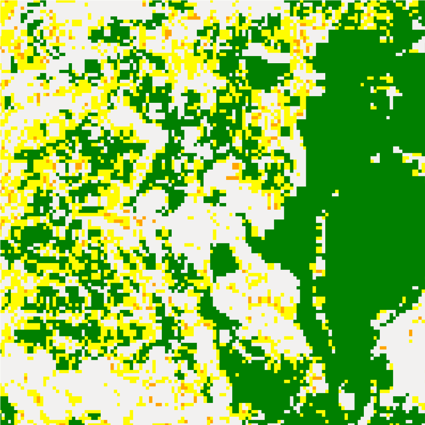
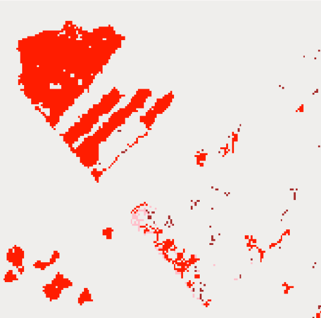
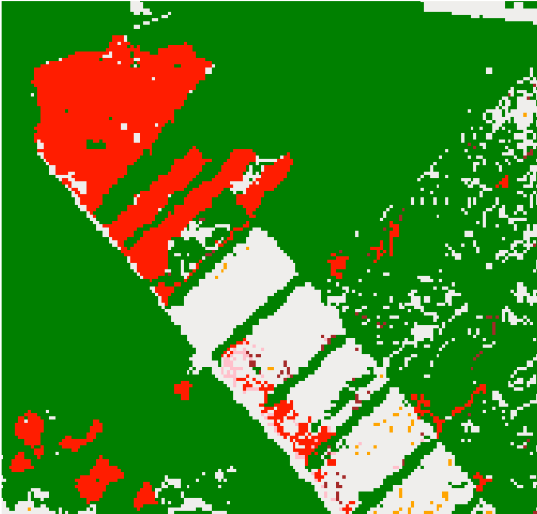

When estimating forest cover, deforestation, or emissions from land-use change at the national level, countries use forest definitions. In this tutorial, you will learn how to extract forest area by applying technical thresholds of canopy cover and minimum area requirements. 

## Context

FAO defines forests as "Land spanning more than 0.5 hectares with trees higher than 5 meters and a canopy cover of more than 10 percent, or trees able to reach these thresholds in situ. It does not include land that is predominantly under agricultural or urban land use" (FRA 2015). 

In various reporting of forest and/or land-use related data, countries may have different forest definitions, including these parameters, forest types or land use categories. 

## Instructions
### Select a country and set parameters

As an example, this tutorial selected Bolivia, with the minimum canopy cover of 10% and minimum forest area of 0.5 ha (the national definition may be different). 
```
var country = 'Bolivia'; // selected country (e.g. Bolivia)
var cc = ee.Number(10); // canopy cover percentage
var pixels = ee.Number(6); // minimum forest area in pixels (approximately 0.5 ha in case of Bolivia)
var lossPixels = ee.Number(6); // minimum mapping area for tree loss (usually same as the minimum forest area)
```

Depending on the location of the country, the number of pixels that make up for 0.5 ha would differ. You can adjust this by calculating the actual minimum areas you were using (see the last step of the next subsection).

### Tree cover

Currently, Google Earth Engine has several tree cover datasets in the catalogue, including the Global Forest Change (GFC) (year 2000) and GLCF: Landsat Tree Cover Continuous Fields (2000, 2005, and 2010). Here, we use the Global Forest Change dataset. 
```
var gfc2018 = ee.Image('UMD/hansen/global_forest_change_2018_v1_6');
```

### 1. Select 'treecover2000' in the Global Forest Change dataset. Use selfMask() to mask value zero 
```
var canopyCover = gfc2018.select(['treecover2000']).selfMask();
```
### 2. Apply the minimum canopy cover percentage (e.g. greater than equal to 10%)
```
var canopyCover10 = canopyCover.gte(cc);
```
### 3. Apply the minimum area requirement using connectedPixelCount (e.g. greater than equal to 0.5 ha)
```
// Use connectedPixelCount() to get contiguous area.
var contArea = canopyCover10.connectedPixelCount();
// Apply the minimum area requirement. 
var minArea = contArea.gte(pixels);
```
### 4. Scale the results in nominal value based on to the dataset's projection
```
var prj = gfc2018.projection();
var scale = prj.nominalScale();
Map.addLayer(minArea.reproject(prj.atScale(scale)), {
    min: 0,
    palette: ['orange', 'green']
}, '>= min canopy cover and area size', false);
```
### 5. Quantify the tree cover area (ha)
```
var forestArea = minArea.multiply(ee.Image.pixelArea()).divide(10000);
var forestSize = forestArea.reduceRegion({
    reducer: ee.Reducer.sum(),
    geometry: selected.geometry(),
    scale: 30,
    maxPixels: 1e13
});
print('Year 2000 tree cover (ha) \nmeeting minimum canopy cover and \nforest area thresholds \n ', forestSize.get('treecover2000'));
```
### 6. Calculate the actual average minimum forest area used
```
var pixelCount = minArea.reduceRegion({
    reducer: ee.Reducer.count(),
    geometry: selected.geometry(),
    scale: 30,
    maxPixels: 1e13
});
var onePixel = forestSize.getNumber('treecover2000').divide(pixelCount.getNumber('treecover2000'));
print('Minimum forest area used (ha)\n ', onePixel.multiply(pixels));
```
The GFC dataset uses 30x30m pixels. Therefore, 6 pixels (>5,000/(30x30)) is used for this exercise. This can be used for countries near the equator. For countries in higher or lower latitudes, you would need to increase the number of pixels. 



- Yellow = all trees
- Orange = canopy cover is greater than or equal to 10%
- Green = canopy cover is greter than equal to 10% & min area is greater than or equal to 0.5 ha

### Tree loss

We use the Global Forest Change dataset (year 2001) to demonstrate how to estimate tree loss based on forest definition.

### 1. Select tree loss pixels that are inside the derived tree cover
```
var treeLoss = gfc2018.select(['lossyear']);
var treeLoss01 = treeLoss.eq(1); // tree loss in year 2001
// Select the tree loss within the derived tree cover (>= canopy cover and area requirements).
var treecoverLoss01 = minArea.and(treeLoss01).rename('loss2001').selfMask();
```
### 2. Apply the minimum mapping unit using connectedPixelCount
```
// Create connectedPixelCount() to get contiguous area.
var contLoss = treecoverLoss01.connectedPixelCount();
// Apply the minimum area requirement. 
var minLoss = contLoss.gte(lossPixels);
```
### 3. Quantify the tree loss area (ha)
```
var lossArea = minLoss.multiply(ee.Image.pixelArea()).divide(10000);
var lossSize = lossArea.reduceRegion({
    reducer: ee.Reducer.sum(),
    geometry: selected.geometry(),
    scale: 30,
    maxPixels: 1e13
});
print('Year 2001 tree loss (ha) \nmeeting minimum canopy cover and \nforest area thresholds \n ', lossSize.get('loss2001'));
```


- Pink = all tree loss
- Brown = tree loss within 'forests' (meeting minimum canopy cover and area requirements)
- Red = tree loss within 'forests' that is greater than or equal to minimum area


Tree loss over tree cover layer

### Subsequent tree cover

We can estimate the tree cover after the loss by subtracting them (you can also add tree gain if you have data).

### 1. Use the derived tree cover and tree loss from the previous steps
### 2. Create a new tree cover by removing the tree loss
```
// Unmask the derived loss.
var minLossUnmask = minLoss.unmask();
// Switch the binary value of the loss (0, 1) to (1, 0).
var notLoss = minLossUnmask.select('loss2001').eq(0); 
// Combine the derived tree cover and not-loss with 'and'. 
var treecoverLoss01 = minArea.and(notLoss);
```
### 3. Apply the minimum area requirement to the above tree cover (minimum canopy cover threshold is already applied by using the derived tree cover). Reproject in nominal scale when displaying on the map. 
```
var contArea01 = treecoverLoss01.selfMask().connectedPixelCount();
var minArea01 = contArea01.gte(pixels);
Map.addLayer(minArea01.reproject(prj.atScale(scale)), {
    palette: ['ffffff', 'lime']
}, '2001 tree cover (gain not considered) (light green)');
```
### 4. Quantify the new tree cover area (ha)
```
var forestArea01 = minArea01.multiply(ee.Image.pixelArea()).divide(10000);
var forestSize01 = forestArea01.reduceRegion({
    reducer: ee.Reducer.sum(),
    geometry: selected.geometry(),
    scale: 30,
    maxPixels: 1e13
});
print('Year 2001 tree cover (ha) \nmeeting minimum canopy cover and \nforest area thresholds \n ', forestSize01.get('treecover2000'));
```

## Land use categories

You can also exclude certain tree areas such as tree plantations or agricultural plantations with tree crops, if you have spatial data for these areas (e.g. masking, assigning values, etc. - not included in this tutorial). 

## References
- GOFC-GOLD 2013 A sourcebook of methods and procedures for monitoring and reporting anthropogenic greenhouse gas emissions and removals associated with deforestation, gains and losses of carbon stocks in forests remaining forests, and forestation p 126 GOFC-GOLD Report (version COP22-1)
- FAO 2018 From reference levels to results reporting: REDD+ under the UNFCCC 2018 update (Food and Agriculture Organization of the United Nations) (http://fao.org/3/CA0176EN/ca0176en.pdf)
- Forest Resources Assessment Programme (FAO) 2015 Global forest resources assessment 2015 (http://fao.org/3/a-i4808e.pdf)
- Nomura, K., Mitchard, E.T., Bowers, S.J. and Patenaude, G., 2019. Missed carbon emissions from forests: comparing countries' estimates submitted to UNFCCC to biophysical estimates. Environmental Research Letters (https://iopscience.iop.org/article/10.1088/1748-9326/aafc6b)
