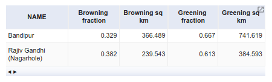

<!--
Copyright 2020 The Google Earth Engine Community Authors

Licensed under the Apache License, Version 2.0 (the "License");
you may not use this file except in compliance with the License.
You may obtain a copy of the License at

    https://www.apache.org/licenses/LICENSE-2.0

Unless required by applicable law or agreed to in writing, software
distributed under the License is distributed on an "AS IS" BASIS,
WITHOUT WARRANTIES OR CONDITIONS OF ANY KIND, either express or implied.
See the License for the specific language governing permissions and
limitations under the License.
-->

## Context

Forests around the world are in crisis. Rapidly expanding global human footprint
and climate change have caused extensive deforestation, and have left remnant
forests fragmented and significantly altered in condition. Yet, these remaining
forests harbour a dazzling array of unique ecosystems and an overwhelming
majority of our planet’s current terrestrial biodiversity, thanks to in-situ
conservation efforts including those by local and indigenous communities.
Valuing these forests and ensuring their continued conservation depends on our
understanding their long term dynamics and responses to dominant anthropogenic
and climatic drivers. This tutorial illustrates the use of Earth Engine to
investigate forest vegetation condition over time.

## Rationale

Remotely sensed indices such as enhanced vegetation index (EVI), normalized
difference vegetation index (NDVI) and normalized difference water index (NDWI)
are widely used to estimate vegetation status from satellite imagery. EVI and
NDVI estimate vegetation chlorophyll content while NDWI estimates vegetation
moisture content. All these indices can be derived from free public imagery of
satellites like Landsat and MODIS, available in the Earth Engine data catalog.
This tutorial uses MODIS EVI data from the
[MOD13Q1.006 dataset](https://developers.google.com/earth-engine/datasets/catalog/MODIS_006_MOD13Q1)
for the period from year 2000 to 2019.

Bandipur and Nagarhole national parks are located in the Mysore-Malenad
landscape of the Western Ghats in southern India, and are home to diverse
habitats ranging from dry deciduous scrub forests to evergreen forests. Forest
vegetation in this region is typically under most stress during the dry summer
months, and hence, tracking annual changes during this period can be useful
from a conservation and management perspective. The vegetation turns most green
and abundant during the rainy monsoon months, but also becomes hard to observe
from optical satellite imagery due to the accompanying heavy cloud cover.

## Approach

### Import images, features

Import the MODIS 250m/pixel 16-day composite vegetation indices dataset. Load
boundaries of Bandipur and Nagarhole national parks from the
[World Database on Protected Areas (WDPA)](https://developers.google.com/earth-engine/datasets/catalog/WCMC_WDPA_current_polygons?hl=en)
dataset. Note that analyses here are performed within these features; modify the
import to suit your study.

```js
// Get MODIS 250m vegetation data.
var mod13 = ee.ImageCollection('MODIS/006/MOD13Q1');

// Get features of the forest national parks.
var nps = ee.FeatureCollection('WCMC/WDPA/202006/polygons')
  .filter(ee.Filter.inList('NAME', ['Bandipur', 'Rajiv Gandhi (Nagarhole)']));
```

### Compute annual summertime composites

Build an image collection with an image for each year from 2000 to 2019. Each of
these images is calculated to be the maximum EVI in the summer months of its
corresponding year. This is our measure of the status of the vegetation for each
year. Also add the year as a band, in preparation for linear trend analysis.

```js
// Filter MODIS images to summer months between Jan and Apr 2000-2019,
// Add observation year as an image property.
var mod13Summer = mod13.filter(ee.Filter.calendarRange(1, 4, 'month'))
  .filter(ee.Filter.calendarRange(2000, 2019, 'year'))
  .map(function(img) {
    return img.set('year', img.date().get('year'));
  });

// Generate lists of images from the year using a join.
var mod13SummerAnnualJoin = ee.Join.saveAll('same_year').apply({
  primary: mod13Summer.distinct('year'),
  secondary: mod13Summer,
  condition: ee.Filter.equals({leftField: 'year', rightField: 'year'})
});

// Calculate annual max EVI composite images from the "same year" join lists.
// Return an image with two bands for use in time series slope calculation;
// year as band 1, max EVI as band 2.
var summerStats = ee.ImageCollection(mod13SummerAnnualJoin.map(function(img) {
  var year = img.get('year');
  var yearCol = ee.ImageCollection.fromImages(img.get('same_year'));
  var max = yearCol.select('EVI').max();
  var yr = ee.Image.constant(ee.Number(year)).toShort();
  return ee.Image.cat(yr, max).rename(['year', 'max']).set('year', year);
}));
```

### Estimate trends and infer vegetation condition

Estimate a linear trend at each pixel by calculating its Sen's slope of maximum
summer EVI with time. Calculate and visualize histograms of the regression slope
values for each national park.

```js
// Calculate time series slope using sensSlope().
var sens = summerStats.reduce(ee.Reducer.sensSlope());

// Define a function to calculate a histogram of slope values to be calculated
// for each park; defining a custom histogram function instead of using
// ui.Chart.image.histogram because it does not allow baseline to be set as 0,
// which is important when evaluating positive and negative slope frequency.
function getHistogram(sensImg, geometry, title) {
  // Calculate histogram as an ee.Array table.
  var hist = sensImg.select('slope').reduceRegion({
    reducer: ee.Reducer.autoHistogram(),
    geometry: geometry,
    scale: 250,
    maxPixels: 1e13,
  });

  // Get the array and extract the bin column and pixel count columns.
  var histArray = ee.Array(hist.get('slope'));
  var binBottom = histArray.slice(1, 0, 1);
  var nPixels = histArray.slice(1, 1, null);

  // Chart the two arrays using the `ui.Chart.array.values` function.
  var histColumnFromArray =
    ui.Chart.array.values({array: nPixels, axis: 0, xLabels: binBottom})
      .setChartType('LineChart')
      .setOptions({
        title: title + ' forest condition trend histogram',
        hAxis: {title: 'Slope'},
        vAxis: {title: 'Pixel count'},
        pointSize: 0,
        lineSize: 2,
        colors: ['1b7837'],
        legend: {position: 'none'}
      });

  return histColumnFromArray;
}

// Get the slope histogram charts and print them to the console per park.
print(getHistogram(
  sens, nps.filter(ee.Filter.eq('NAME', 'Bandipur')), 'Bandipur'));
print(getHistogram(
  sens, nps.filter(ee.Filter.eq('NAME', 'Rajiv Gandhi (Nagarhole)')),
  'Rajiv Gandhi (Nagarhole)'));
```

    |    
:----------------------------------:|:---------------------------------------:

Infer pixel-wise vegetation greening or browning based on the sign of the slope
value. Calculate summary of areas under greening and browning for each national
park.

```js
// Infer pixel-wise vegetation condition based on sign of the slope.
var cond = ee.Image.cat(sens.select('slope').gt(0).rename('greening'),
                        sens.select('slope').lt(0).rename('browning'));

// Calculate area under greening and browning in each national park.
var npsRes = cond.multiply(ee.Image.pixelArea())
                 .reduceRegions(nps, ee.Reducer.sum(), 250);
```

### Visualise results

Tabulate the areas of vegetation greening and browning for each national park.

```js
// Format results of the greening and browning for use in a table; convert sq m
// to sq km and calculate fraction of each; add as feature properties.
npsRes = npsRes.map(function(feature) {
  var browningSqM = feature.getNumber('browning');
  var greeningSqM = feature.getNumber('greening');
  var forestSqM = feature.area();
  return feature.set({
    'Browning sq km': browningSqM.divide(1e6),
    'Browning fraction': browningSqM.divide(forestSqM),
    'Greening sq km': greeningSqM.divide(1e6),
    'Greening fraction': greeningSqM.divide(forestSqM),
  });
});

// Display area summary of vegetation condition as a table "chart".
print(ui.Chart.feature.byFeature(npsRes.select(['NAME', 'Browning sq km',
    'Browning fraction', 'Greening sq km', 'Greening fraction']),
    'NAME')
  .setChartType('Table'));
```



Choose suitable visualization parameters and display the slope values on the map
to denote areas under greening and browning, along with the national park
boundaries.

```js
// Prepare to display vegetation condition to the map; set map display options.
Map.setOptions('SATELLITE');
Map.centerObject(nps, 10);

// Set visualisation parameters for greening and browning areas; display to map.
var visParams = {
  opacity: 1,
  bands: ['slope'],
  min: -55,
  max: 55,
  palette:
    ['8c510a', 'd8b365', 'f6e8c3', 'f5f5f5', 'd9f0d3', '7fbf7b', '1b7837']
};
Map.addLayer(sens.clipToCollection(nps), visParams, 'Sen\'s slope');

// Draw national park boundaries to the map.
var paimg = ee.Image().byte().paint(nps, 0, 2);
Map.addLayer(paimg, {palette: '000000'}, 'National Parks');
```


Chart the median of maximum summer EVIs in each national park over the years.

```js
// Plot trend in EVI data by national park and year.
print(ui.Chart.image
          .seriesByRegion({
            imageCollection: summerStats,
            regions: nps,
            reducer: ee.Reducer.median(),
            band: 'max',
            scale: 250,
            xProperty: 'year',
            seriesProperty: 'NAME'
          })
          .setChartType('ScatterChart')
          .setOptions({
            title: 'Greening/browning trend in forest national parks',
            vAxis: {title: 'Median of max. summer EVI'},
            hAxis: {title: 'Year', format: '####'},
            lineWidth: 2,
            pointSize: 0,
            series: {0: {color: 'ff0000'}, 1: {color: '0000ff'}}
          }));
```


