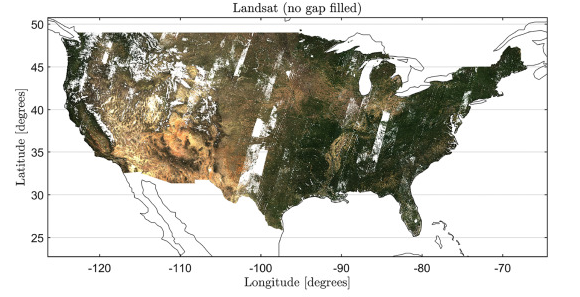
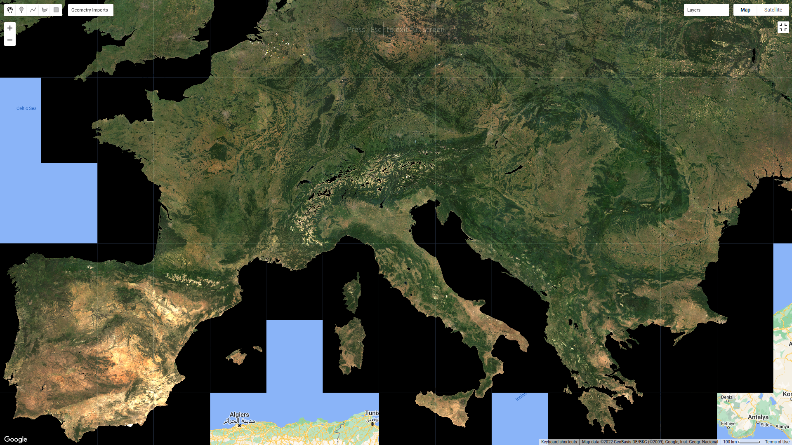
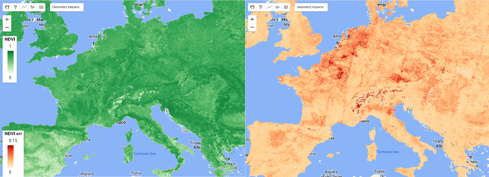
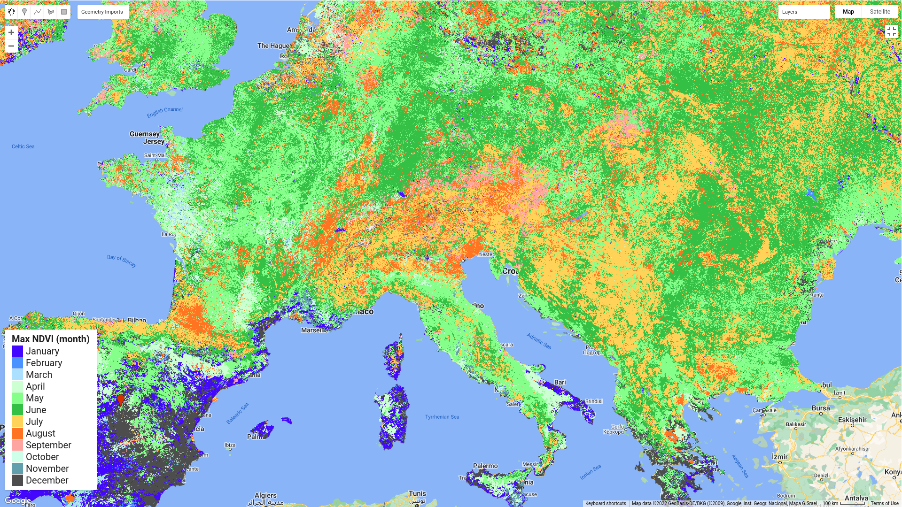
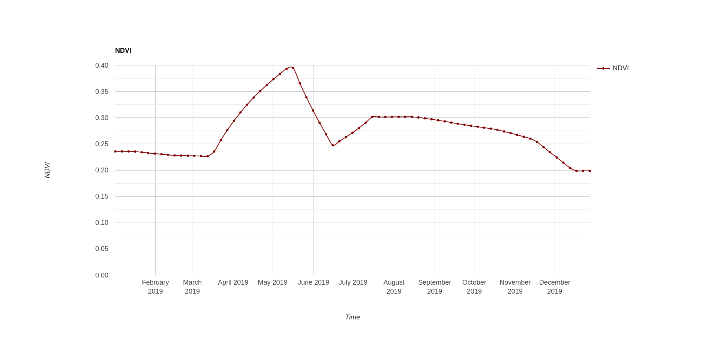
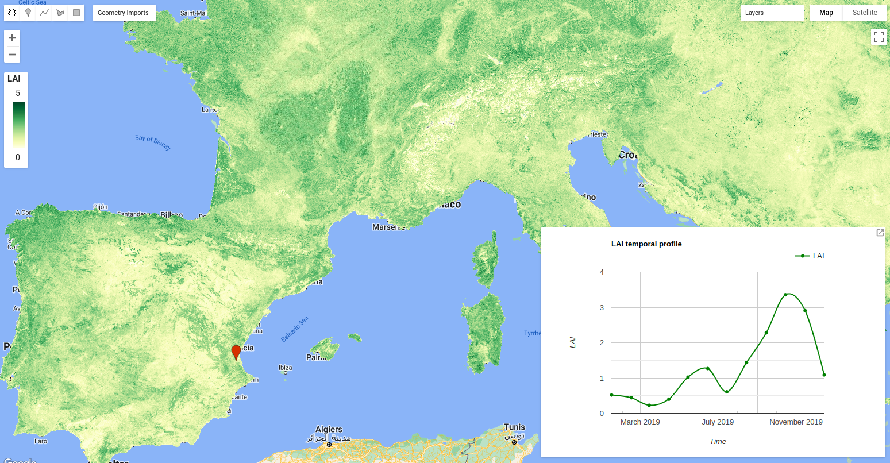

<!--
Copyright 2022 The Google Earth Engine Community Authors

Licensed under the Apache License, Version 2.0 (the "License");
you may not use this file except in compliance with the License.
You may obtain a copy of the License at

    https://www.apache.org/licenses/LICENSE-2.0

Unless required by applicable law or agreed to in writing, software
distributed under the License is distributed on an "AS IS" BASIS,
WITHOUT WARRANTIES OR CONDITIONS OF ANY KIND, either express or implied.
See the License for the specific language governing permissions and
limitations under the License.
-->

## Overview

Although there is an extensive array of optical remote sensing sensors from a
variety of satellites providing long time data records, their data are incapable
of retrieving reliable land surface information when clouds, aerosols, shadows,
and strong angular effects are present in the scenes. The mitigation of noise
and gap filling of satellite data are preliminary and almost mandatory tasks for
any remote sensing application aimed at effectively analyzing the earth's
surface continuously through time.

{: width="512"}<br>
_An example of cloud contaminated Landsat surface reflectance data_

In 2020, to tackle this challenging problem
[Moreno-Martinez et al. (2020)](https://www.sciencedirect.com/science/article/pii/S0034425720302716)
proposed using the Google Earth Engine (GEE) cloud computing platform to
implement the HIghly Scalable Temporal Adaptive Reflectance Fusion Model
(HISTARFM). This method generates reduced noise and gap-free estimates of
Landsat reflectance values at vast scales. Despite the computational power of
GEE and the optimizations of HISTARFM, the computational burden and memory costs
of HISTARFM are too high to carry out any extra computations after the
gap-filling process. Therefore, the data have to be pre-processed in different
study areas. We have generated data for number of world regions already, and in
this tutorial we will show how to use it and provide examples of how you can
improve your research and applications with this enhanced Landsat-based dataset.

### Background

The HISTARFM database is a gap-filled monthly reflectance temporal series at 30m
spatial resolution generated by the fusion of Landsat and Moderate Resolution
Imaging Spectroradiometer (MODIS) temporal series. The fusion algorithm relies
on a bias-aware Bayesian data assimilation scheme implemented in GEE. The
approach uses two linked estimators operating synergistically to filter out
random noise and reduce the bias of Landsat spectral reflectances. The first
estimator is an optimal interpolator that produces Landsat reflectance
estimation values by combining Landsat historical data, pre-computed from the
available Landsat record, and fused MODIS and Landsat reflectances obtained from
overpasses closest to the time of interest. The fusion of reflectances results
from using an efficient pixel-wise linear regression model. The second linked
estimator is a Kalman filter that corrects the bias of the reflectance produced
by the first estimator. For more information about HISTARFM algorithm, see the
[Moreno-Martinez et al. 2020](https://www.sciencedirect.com/science/article/pii/S0034425720302716)
manuscript.

### Versions

HISTARFM has been updated and improved since its publication in 2020. At the
present, there are two versions available:

*   **Version 2** corresponds with the exact algorithm published in the original
    paper in 2020. It relies on the USGS Landsat collection 1 surface
    reflectance data.
*   **Version 5** (the last available version) contains numerous updates and
    enhancements, such as:
    *   The new USGS Landsat collection 2 is used.
    *   A linear interpolation method has been included for the original Landsat
        bands with adaptive uncertainties depending on the interpolation
        temporal distance.
    *   The Aerosol Optical Depth and Atmospheric Opacities data layers are used
        for better cloud masking and to prevent cirrus clouds contamination.

Version 2 datasets will be updated to Version 5 in the future, but it will take
time.

To access the databases, ask any questions and stay updated on the latest
information and upcoming data, please join the following google group:
[histarfm-collection@googlegroups.com](mailto:histarfm-collection@googlegroups.com).

### Study areas

HISTARFM contains two study areas so far, but the dataset is continuously being
expanded in time and spatial coverage.

1.  The CONUS database contains 154 images stored as assets. It corresponds with
    **version 2**, and temporal coverage ranges from 2009 to 2021. Each image in
    the ImageCollection covers the full CONUS, and each has the properties
    'version', 'month', and 'year'. This information is also present in their
    file names. For example, the image called
    Gap_Filled_Landsat_CONUS_month_10_2009_v2 is an October 2009 image for the
    CONUS area. The CONUS database is available in
    [this asset](https://code.earthengine.google.com/?asset=projects/KalmanGFwork/GFLandsat_V1).
2.  The European database is currently being generated with **version 5** of the
    algorithm. It contains 8208 images from 2017 to 2020, and the study area is
    divided into tiles stored in the Google Cloud Platform as Cloud Optimized
    Geotiffs (COG). These COGs are provided as COG-backed Earth Engine assets in
    a publicly readable ImageCollection available
    [here](https://code.earthengine.google.com/?asset=projects/ee-emma/assets/GF_Landsat_Europe_C2).
    In this case, the images have all the properties needed in their generation,
    but the name of the image only includes the month, year, study area, and the
    tile. As an example, the image called GF_2018_10_EUROPA_1 represents the
    image in October 2018 over the first tile in Europe.

## Examples of use of the HISTARFM database

### 1. Importing and visualizing the database

#### a. Import the ImageCollection

In this tutorial, we focus on 2019 in the European continent. Using the code
below, you will load the European HISTARFM database from 2017 to 2020. The
ImageCollection is filtered in the desired year (e.g., 2019) using the ee
function `filter`. After that, a function called `EuropeanMosaic` to map the
image collection is defined to generate a mosaic image of the entire continent
per month. The images in the new image collection will contain the properties:
'system:time_start', 'month', and 'year' from the original images. These
properties will be necessary for the next steps of this tutorial. After that, a
function called `scaleError` is defined to scale and mask the error bands and
set 'DOY,' 'month', and 'year' properties in the images together with the
'system:time_start' of the original images.

```js
// Import HISTARTFM database.
var GF_Landsat =
    ee.ImageCollection('projects/ee-emma/assets/GF_Landsat_Europe_C2');

// Filter per year.
var year = '2019';  // In version 5 the properties are in string format, it
                    // seems to be a limitation of adding properties to COGs In
                    // case of using version 2 data (CONUS), the metadata is in
                    // standard integer format: `var year = 2019;`

GF_Landsat = GF_Landsat.filter(ee.Filter.eq('year', year));

var months = GF_Landsat.aggregate_array('month').distinct().sort();
// Join all images of a month into a single image.
function EuropeanMosaic(num) {
  var ic = GF_Landsat.filter(ee.Filter.eq('month', num));
  var img = ic.mosaic().selfMask();
  return img.copyProperties(ic.first(), ['system:time_start', 'month', 'year']);
}
var GF_Landsat = ee.ImageCollection(months.map(EuropeanMosaic));
// Sort the ImageCollection considering the 'system:time_start' property.
GF_Landsat = GF_Landsat.sort('system:time_start');

// Scaling the data to reflectance units.
function scaleError(img) {
  var y = ee.Number.parse(img.get('year'));
  var m = ee.Number.parse(img.get('month'));
  var d = ee.Date.fromYMD(y, m, 15);
  var doy = d.getRelative('day', 'year').add(1);
  var scaled = img.select(['P.*']).multiply(0.5);
  return img.addBands(scaled, null, true)
      .set({'month': m, 'year': y, 'DOY': doy})
      .copyProperties(img, ['system:time_start']);
}

GF_Landsat = GF_Landsat.map(scaleError);
```

#### b. Visualization of HISTARFM data

Once the HISTARFM dataset is prepared, the RGB gap-filled Landsat reflectance
mosaic filtered to a specific month and its first band error are displayed
considering their visualization parameters.

```js
// Set map options.
Map.setOptions('HYBRID');
Map.setCenter(14.76, 49.28, 4);

// Subset a single month for display (e.g. July, the 7th month).
var julyImg = GF_Landsat.filter(ee.Filter.eq('month', 7));

// Display the RGB gap-filled Landsat reflectance mosaic to the map.
var imageVisParam = {
  'opacity': 1,
  'bands': ['B3_mean_post', 'B2_mean_post', 'B1_mean_post'],
  'min': 0,
  'max': 2500,
  'gamma': 1
};
Map.addLayer(julyImg, imageVisParam, 'example July RGB');

// Display the error gap-filled Landsat reflectance mosaic to the map.
var imageVisParam =
    {'opacity': 1, 'bands': ['P1_postSD'], 'min': 0, 'max': 200, 'gamma': 1};
Map.addLayer(GF_Landsat, imageVisParam, 'example error B1');
```

<br>
_Example of a mosaic of the HISTARFM data over Europe for a given date_

### 2. Calculate the timing and value of the maximum NDVI

The Normalized Difference Vegetation Index (NDVI) is the most widely used among
the vast options of remotely sensed vegetation indices. The annual maximum value
of NDVI is especially relevant in many studies as it represents the best status
the vegetation can achieve in a growing season related to characteristics such
as biomass, health, and photosynthetic capacity. To achieve this goal, the
gap-free observations provided by the HISTARFM to correctly track vegetation
phenology are very beneficial.

#### a. Calculate the NDVI and its error

The NDVI is based on the RED and NIR reflectances difference defined as follows:

$$NDVI = \frac{NIR-RED}{NIR+RED}$$

As HISTARFM provides the reflectance values and reflectance uncertainties, it is
possible to calculate the NDVI error using standard
[error propagation approach](https://en.wikipedia.org/wiki/Propagation_of_uncertainty).
Under the assumption of independence among the input variables, it is possible
to obtain the error using a simplified approach:

$$\epsilon(NDVI) = \frac{2}{(NIR+RED)^2} \cdot \sqrt{NIR^2 \cdot \epsilon(RED)^2 + RED^2 \cdot \epsilon(NIR)^2}$$

Reminder: NIR reflectance is the band called B4_mean_post and
the RED is B3_mean_post in HISTARFM database.

Therefore, a function to calculate the NDVI and its error of the image
collection is defined. The function `ndvicompGF` calculates NDVI and the error
for each image. Additionally, the properties 'system:time_start', 'DOY',
'month', and 'year' are also included in the images from the original ones.

```js
function ndvicompGF(img) {
  var ndvi =
      img.normalizedDifference(['B4_mean_post', 'B3_mean_post']).rename('NDVI');
  var errorNDVI = ee.Image().expression({
    expression: 'errorNDVI = 2 / pow(NIR + RED, 2) * ' +
        'sqrt(pow(NIR, 2) * pow(SD_RED, 2) + pow(RED, 2) * pow(SD_NIR, 2))',
    map: {
      RED: img.select('B3_mean_post'),
      NIR: img.select('B4_mean_post'),
      SD_RED: img.select('P3_postSD'),
      SD_NIR: img.select('P4_postSD')
    }
  });
  return img.addBands([ndvi, errorNDVI]).copyProperties(img, [
    'system:time_start', 'month', 'year', 'DOY'
  ]);
}

// Compute the NDVI and its error.
GF_Landsat = GF_Landsat.map(ndvicompGF);
```

<br>
_An example of the computed NDVI and its corresponding propagated error_

#### b. Extracting growing season maximum NDVI value and timing

A function called `maxMonth` is defined to obtain the maximum NDVI value and the
month when it is reached. Within this function, the GF_Landsat ImageCollection
is mapped to add the month value as a band. Afterward, NDVI and Month bands are
selected from the collection and reduced using a reducer `ee.Reducer.max`.

```js
// Calculate the NDVI maximum value image.
function maxMonth(col) {
  col = col.map(function(img) {
    return img.addBands(
        ee.Image(ee.Number.parse(img.get('month'))).toByte().rename('Month'));
  });
  var theseBands = ['NDVI', 'Month'];
  return col.select(theseBands)
      .reduce(ee.Reducer.max(theseBands.length))
      .rename(theseBands);
}
var maxMonthNdvi = maxMonth(GF_Landsat);
```

#### c. Visualization of maximum NDVI value and the month

Once the variables are calculated, the NDVI maximum is displayed in whitenish
(lower), greenish (medium) and blackish tones (higher values). The month is also
displayed with a specific palette: bluenish tones for autumn and winter periods
and greenish and reddish tones for spring and summer periods.

```js
var imageVisParam = {
  'opacity': 1,
  'bands': ['NDVI'],
  'min': -1,
  'palette': ['ffffff', 'c5ff15', '94c00f', '617e0a', '000000']
};
Map.addLayer(maxMonthNdvi, imageVisParam, 'max NDVI');

var imageVisParam = {
  'opacity': 1,
  'bands': ['Month'],
  'min': 1,
  'max': 12,
  'palette': [
    '4306ff',  // January
    '4992ff',  // February
    'abe0ff',  // March
    'ccffd2',  // April
    '85ff89',  // May
    '34c045',  // Juny
    'ffd358',  // July
    'ff7321',  // August
    'ffa5a1',  // September
    'ceffe8',  // October
    '629fad',  // November
    '4d4d4d'   // December
  ]
};
Map.addLayer(maxMonthNdvi, imageVisParam, 'max month');
```

<br>
_Timing of the maximum value of the NDVI for Europe (2019)_

### 3. Temporal interpolation of the HISTARFM database

#### a. Creating a dummy ImageCollection with the desired temporal resolution

The first step to interpolating the HISTARFM database is the creation of a dummy
(empty) ImageCollection with a regular time step sampling defined by
`tResolution`. The function `RegTimeColl` requires a list of dates (interpreted
as milliseconds since 1970-01-01T00:00:00Z) as input (`timeRange` in our
example). Therefore, `RegTimeColl` creates the desired ImageCollection with the
metadata ready ('DOY', 'system:time_start', and 'month'), which will be used to
store the results of the interpolation.

```js
// Desired interpolation temporal resolution in day units.
var tUnit = 'days';
var tResolution = 5;

// Create a list of DOYs.
var dateini = ee.Date(year + '-01-01');
var dateend = ee.Date(year + '-12-31');
var nSteps = dateend.difference(dateini, tUnit).divide(tResolution).floor();
var steps = ee.List.sequence(0, nSteps);
var timeRange = steps.map(function(i) {
  return dateini.advance(ee.Number(i).multiply(tResolution), tUnit).millis();
});

// Create a dummy collection with regular time space.
function RegTimeColl(date) {
  var DOY = ee.Date(date).getRelative('day', 'year').add(1);
  var m = ee.Number(ee.Date(date).get('month'));
  return ee.Image(DOY).rename('DOY').short().set(
      {'dummy': true, 'system:time_start': date, 'DOY': DOY, 'month': m});
}

var fiveDaysRes = ee.ImageCollection(timeRange.map(RegTimeColl));
```

#### b. HISTARFM linear interpolation

This section comprises two sub-steps: 1) Joining the ImageCollection created in
the previous section called fiveDaysRes with the `GF_Landsat` ImageCollection
from section 2.a, and 2) the interpolation step using the join from step 1.

##### b.1 Joining step

This step joins the `fiveDaysRes` ImageCollection with `GF_Landsat`
ImageCollection. Each image in `fiveDaysRes` includes a property called `LS`
where all the `GF_Landsat` images with a month of difference of `fiveDaysRes`
are stored. The `GF_Landsat` selection is based on the 'system:time_start'
property for both collections.

```js
var join = ee.Join.saveAll('LS', 'system:time_start', true, null, true);
var nDays = 31;
var maxMilliDif = (nDays * 24 * 3600 * 1000);
var filter = ee.Filter.maxDifference(
    maxMilliDif, 'system:time_start', null, 'system:time_start');
var fiveDaysRes =
    ee.ImageCollection(join.apply(fiveDaysRes, GF_Landsat, filter));
```

##### b.2 Defining the interpolation function step

Once the `fiveDaysRes` ImageCollection contains the selected GF_Landsat images
in the 'LS' property, an interpolation function (named `CompositeInterpolate`)
is defined to map the `fiveDaysRes` ImageCollection. The interpolation between
two points is a method to estimate new data between two known points.
Considering $(x_0,y_0)$ and $(x_1,y_1)$ as these two known points, the linear
prediction in an intermediate location is possible using the following equation:

$$ y = y_0 + \frac{y_1-y_0}{x_1-x_0} \cdot (x-x_0),$$

where $y_0$ and $y_1$ are the Gap-filled Landsat reflectances before and after
respectively from `GF_Landsat`, $x_0$ and $x_1$ are their respective acquisition
times (i.e. 'system:time_start'), $x$ is the time step for prediction, and $y$
is the predicted reflectance (of the new point) in the instant $x$.

Note two essential points:

* Landsat images within the 'LS' property are sorted by 'system:time_start'.
  Therefore selecting the last element (i.e., get -1 element of the list) always
  is the after reflectance image, and selecting the previous to the last element
  (i.e., get -2 element of the list) always is the before reflectance image.
* If the number of Landsat images in the 'LS' property is lower than 2
  (extrapolation case), the image is either the first or the last in the
  `fiveDaysRes` ImageCollection. Therefore, the first or last images in
  `fiveDaysRes` are not interpolated. We only consider the values of Gap-filled
  Landsat reflectance contained in the 'LS' property.

```js
// Get DOY of first and last day of the gap-filled reflectance ImageCollection.
var init_doy = ee.Image(GF_Landsat.first()).get('DOY');
var end_doy =
    ee.Image(GF_Landsat.sort('system:time_start', false).first()).get('DOY');

function CompositeInterpolate(img) {
  var list = ee.List(img.get('LS'));
  var LSbefore = ee.Image(
      ee.Algorithms.If(list.length().lt(2), list.get(0), list.get(-2)));
  var LSafter = ee.Image(
      ee.Algorithms.If(list.length().lt(2), list.get(0), list.get(-1)));
  var day = ee.Number(img.get('DOY'));
  var ini = ee.Number(LSbefore.get('DOY'));
  var end = ee.Number(LSafter.get('DOY'));
  var tdiff = end.subtract(ini);
  var slope = LSafter.subtract(LSbefore).divide(tdiff);
  var img_inter = slope.multiply(day.subtract(ini)).add(LSbefore);
  img_inter = img_inter.addBands(img_inter.select('P.*').int16(), null, true);
  img_inter = img_inter.where(
      day.lte(init_doy),
      GF_Landsat.filter(ee.Filter.eq('DOY', ee.Number(init_doy))).first());
  img_inter = img_inter.where(
      day.gte(end_doy),
      GF_Landsat.filter(ee.Filter.eq('DOY', ee.Number(end_doy))).first());
  var time = img.get('system:time_start');
  var month = img.get('month');
  return img_inter.set({
    'day': day,
    'month': month,
    'date_ini': ini,
    'date_end': end,
    'system:time_start': time,
    'year': year
  });
}

GF_Landsat = fiveDaysRes.map(CompositeInterpolate);
```

#### c. Visualization of the interpolated time series

In this case, a NDVI temporal series at one specific point is shown using a
chart. Note that another band (i.e., reflectance or uncertainties) could also be
visualized, only changing the selected band name in the code. We first define
the `ee.Geomatry.Point` where the time series is going to be plotted. After
that, the `ui.Chart.image.series` is used to visualize the NDVI temporarily
upgraded temporal sequence. Finally, the chart is added to the map using the ee
function `Map.add`.

```js
// Define the geometry
var point = ee.Geometry.Point([-3.7010995437603, 40.41436099577093]);

// Define the chart
var chart = ui.Chart.image
                .series({
                  imageCollection: GF_Landsat.select('NDVI'),
                  region: point,
                  scale: 10,
                  reducer: ee.Reducer.first()
                })
                .setOptions({
                  title: ' NDVI',
                  vAxis: {title: 'NDVI'},
                  hAxis: {title: 'Time'},
                  series: {
                    0: {
                      color: '800000',
                      lineWidth: 2,
                      pointSize: 4,
                      curveType: 'function'
                    }
                  }
                });

// Add the chart to the map.
chart.style().set({position: 'top-left', width: '300px', height: '200px'});
Map.add(chart);
```

<br>
_NDVI interpolated time series from monthly to 5 days temporal resolution_

### 4. High resolution biophysical variable retrieval

Estimating biophysical variables is at the core of remote sensing science,
allowing close monitoring of crops and forests. Deriving temporally resolved and
spatially explicit maps of these variables of interest have been the subject of
intense research. This section shows how to generate an animated GIF of one key
biophysical variable, the Leaf Area Index (LAI), using HISTARFM data. The LAI
measures the total area of leaves per unit ground area and is directly related
to the amount of light plants can intercept. To estimate the LAI, we have used
the *BioNet* algorithm from
[Martinez-Ferrer et al. 2022](https://www.sciencedirect.com/science/article/pii/S0034425722003091).
*BioNet* provides new high resolution products of several key variables to
quantify the terrestrial biosphere at 30 m Landsat spatial resolution:

* Leaf Area Index (LAI)
* Fraction of Absorbed Photosynthetically Active Radiation (FAPAR)
* Canopy Water Content (CWC)
* Fractional Vegetation Cover (FVC)

The following section has three subsections: Biophysical parameter retrieval,
map and chart visualization, and GIF generation.

#### a. Biophysical parameter retrieval

We are going to calculate the LAI from `GF_Landsat` obtained in section 3.b.
Other parameters like the fraction of absorbed photosynthetically active
radiation (fAPAR) are also possible to calculate, just changing the variable par
from 'LAI' to 'FAPAR'. <ins>This code requires using the **bioNet** repository
to compute the biophysical parameter, which is available for all GEE
users.</ins> You can add the repository to your Code Editor by clicking
[here](https://code.earthengine.google.com/?accept_repo=users/ispguv/BioNet).

```js
// Include the bioNet repository.
var bioNet = require('users/ispguv/BioNet:Code/bioNet_nested.js').bioNet;

// Apply the created method to compute the LAI parameter.
var par = 'LAI';
var lai = bioNet.bioNetcompute(GF_Landsat, par);
```

If you use *bioNet*, please considering to cite it as follow:

Martínez-Ferrer, L. Moreno-Martínez, Á., Campos-Taberner, M., García-Haro, F.
J., Muñoz-Marí, J., Running, S. W., Kimball J., Clinton, N. & Camps-Valls, G.
(2022). Quantifying uncertainty in high resolution biophysical variable
retrieval with machine learning. Remote Sensing of Environment, 280, 113199.

#### b. Visualization

To visualize the LAI map, the palette and the visualization parameters are
defined for the LAI and its uncertainty. Additionally to the visualization map,
a chart of the LAI temporal series in the geometry defined in section 3.c is
added to the bottom left part in the map.

```js
// Define color palette and value ranges.
var colors = [
  'ffffe5', 'f7fcb9', 'd9f0a3', 'addd8e', '78c679', '41ab5d', '238443',
  '006837', '004529'
];
var vis_vi_dp = {min: 0, max: 5, palette: colors};
var vis_vi_dp_err = {
  min: 0.0,
  max: 1,
  palette: ['fef0d9', 'fdcc8a', 'fc8d59', 'e34a33', 'b30000']
};

// LAI and its uncertanty maps.
Map.addLayer(lai.select(par), vis_vi_dp, par, true);
Map.addLayer(
    lai.select(par.concat('total')), vis_vi_dp_err, par.concat('_err'), true);

// Select a location in a cropland area in Spain.
var point = ee.Geometry.Point([-0.4600542766311655, 39.24615305773666]);

// Plot the temporal profile; create an image time series chart.
var chart = ui.Chart.image
                .series({
                  imageCollection: lai.select(par),
                  region: point,
                  reducer: ee.Reducer.first(),
                  scale: 30
                })
                .setOptions({
                  title: 'LAI temporal profile',
                  vAxis: {title: 'LAI'},
                  hAxis: {title: 'Time'},
                  series: {
                    0: {
                      color: '008000',
                      lineWidth: 2,
                      pointSize: 4,
                      curveType: 'function'
                    }
                  }
                });

// Add the chart to the map.
chart.style().set({position: 'bottom-left', width: '300px', height: '200px'});
Map.add(chart);
```

<br>
_Computed LAI over Europe and temporal profile for a region in Spain_

#### c. Yearly LAI animation (GIF format)

The text added over the GIF is done using the Gennadii Donchyts packages
**text** and **style** from the available
[repository](https://code.earthengine.google.com/?accept_repo=users/gena/packages)
for all GEE users. With this repository, the DOY and the year is added to the
images. They require a position in the image, a scale and size and color of the
text. Additionally, the visualization parameters of the LAI are defined. All
variables are used in the function called `gifImages` to obtain the
ImageCollection to visualize in the GIF. After that, the GIF parameters are
defined to obtain the GIF visualization using the function `ui.Thumbnail`, which
is added in the map.

```js
// Include text and style repositories.
var text = require('users/gena/packages:text');
var style = require('users/gena/packages:style');

// Get text location for the DOY and the year.
var reg = ee.Geometry.Polygon(
    [[
      [-10.787367805584234, 71.26575224248047],
      [-10.787367805584234, 34.76021219655947],
      [41.41966344441577, 34.76021219655947],
      [41.41966344441577, 71.26575224248047]
    ]],
    null, false);
var pt_doy = text.getLocation(reg, 'right', '5%', '96%');
var pt_year = text.getLocation(reg, 'right', '2%', '65%');
var scale = 4500;
var textProperties = {fontSize: 64, textColor: 'ffffff'};
var visParams =
    {'opacity': 1, 'bands': [par], 'min': 0, 'max': 6, 'palette': colors};

// Create RGB visualization images for use as animation frames.
function gifImages(img) {
  var label = text.draw(
      ee.Date(img.get('system:time_start')).get('year'), pt_year, scale,
      textProperties);
  var label2 = text.draw(img.get('day'), pt_doy, scale, textProperties);
  return img.visualize(visParams).blend(label).blend(label2);
}
var LAIvis = lai.select(par).map(gifImages);

// Generate animation.
var gifParams = {
  'region': reg,
  'dimensions': 512,
  'crs': 'EPSG:4326',
  'framesPerSecond': 2,
  'format': 'gif'
};
Map.add(ui.Thumbnail(
    ee.ImageCollection(LAIvis), gifParams, null, {position: 'bottom-right'}));
```

Once the animation appears in the map, you can download the image by
right-clicking on it.

<br>
_Resulting LAI animation from interpolated and gap-free HISTARFM data_

Now you know how to work with HISTARFM database and few tips of what you can do
with it. Hope you like the gap-filled database and you use it in your research
and work. If so, please, cite us as follow:

Moreno-Martínez, Á., Izquierdo-Verdiguier, E., Maneta, M. P., Camps-Valls, G.,
Robinson, N., Muñoz-Marí, J., Sedano, F., Clinton, N. & Running, S. W. (2020).
Multispectral high resolution sensor fusion for smoothing and gap-filling in the
cloud. Remote Sensing of Environment, 247, 111901.

## Acknowledgements

Emma Izquierdo-Verdiguier and Alvaro Moreno-Martinez devised and directed
tutorial development. Jordi Muñoz-Marí assisted in the method implementation.
All authors contributed text, code and analysis examples.

The tutorial authors would like to thank all the bioNet and HISTARFM creators
and Gennadii Donchyts from [Deltares](https://www.deltares.nl/en/) for his
routines, `text`, and `style`, which have been used in this tutorial. Also, we
would like to thank the broad Google Earth Engine community for their help and
comments. Special thanks to Nicolas Clinton from Google Inc. for actively
supporting us during these years.
