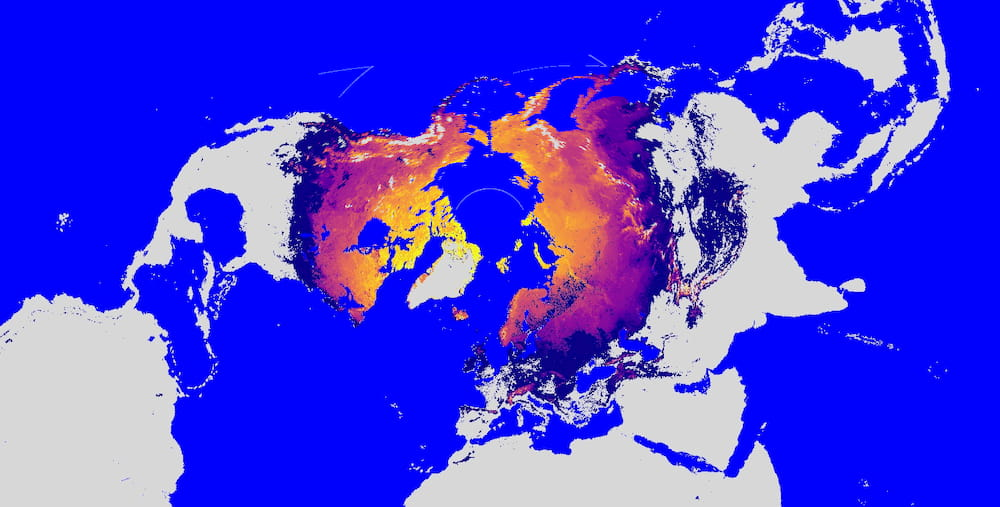
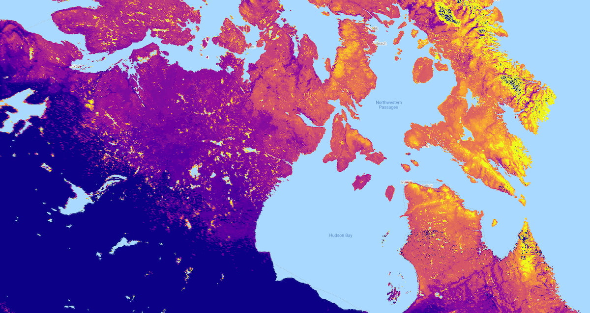
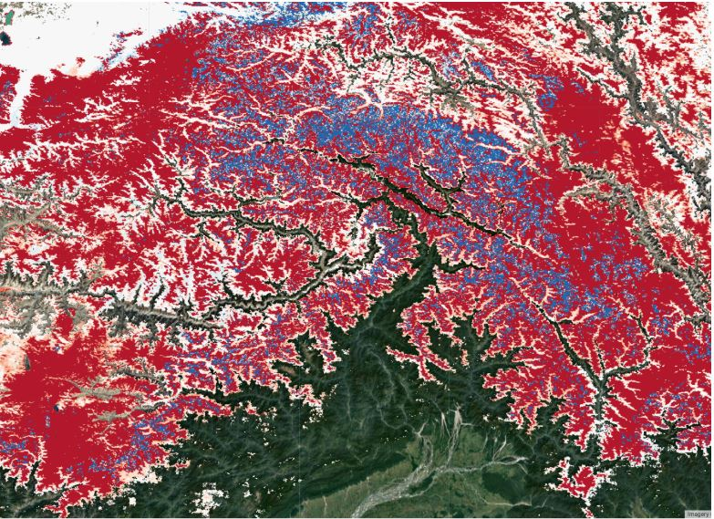
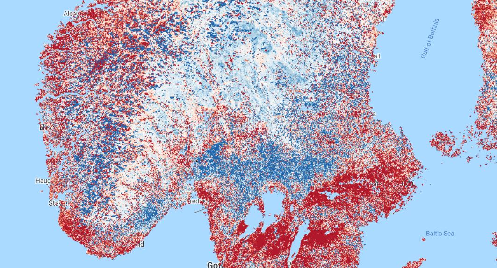
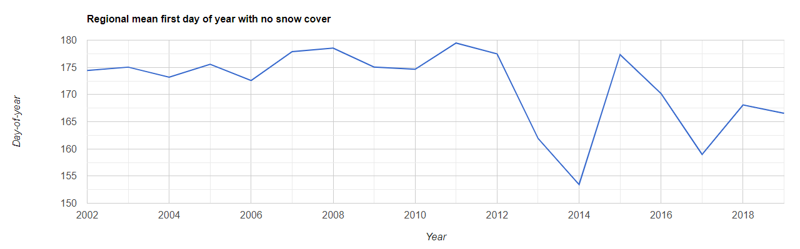

<!--
Copyright 2020 The Google Earth Engine Community Authors

Licensed under the Apache License, Version 2.0 (the "License");
you may not use this file except in compliance with the License.
You may obtain a copy of the License at

    https://www.apache.org/licenses/LICENSE-2.0

Unless required by applicable law or agreed to in writing, software
distributed under the License is distributed on an "AS IS" BASIS,
WITHOUT WARRANTIES OR CONDITIONS OF ANY KIND, either express or implied.
See the License for the specific language governing permissions and
limitations under the License.
-->

This tutorial demonstrates how to produce annual maps depicting the first day
within a year where a given pixel reaches zero percent snow cover and provides
suggestions for summarizing and visualizing the results over time and space.

<br>
_Patterns of snowmelt timing are represented here by the first day in 2018 where
each pixel no longer contained snow, as detected by the MODIS daily snow cover
product. The color grades from purple (earlier) to yellow (later) as the first
day of the year with zero percent snow per pixel increases
(Arctic Polar Stereographic projection)._

## Context

The timing of annual seasonal snowmelt and any potential change in that
timing has broad ecological implications and thus impacts human livelihoods,
particularly in and around high latitude and mountainous systems.

One of the most important phases of the hydrologic cycle within these
regions, the
annual melting of accumulated winter snowfall provides the dominant source of
water for streamflow and groundwater recharge for approximately one sixth of
the global population (Musselman et al., 2017; Barnhart et al., 2016;
Bengtsson, 1976).

The timing of snowmelt in the Arctic and Antarctic influences the length of
the growing season; and consistent snow cover
throughout the winter insulates vegetation from harsh temperatures and wind
(Duchesne et al., 2012; Kudo et al., 1999). In mountainous regions such as
the Himalayas, snowmelt is a major source of freshwater downstream (Barnhart
et al., 2016) and is essential in recharging groundwater.

This seasonal water resource is one of the fastest changing hydrologic
systems under Earth’s
warming climate, and will broadly impact regional economies, ecosystem
function and increase the potential for flood hazards (Musselman et al.,
2017; IPCC, 2007; Beniston, 2012; Allan and Casillo, 2007; Barnett and
Lettenmaier, 2005).

The anticipated warmer temperatures will alter the type
and onset of precipitation; multiple regions, including the Rocky Mountains
of North America have already measured a reduction in snowpack volume and
warmer temperatures have shifted precipitation from snowfall to rain, causing
snowmelt to occur earlier (Barnhart et al., 2016; Clow, 2010; Harpold et al.,
2012).

This tutorial calculates the first day of no snow annually at the pixel
level, providing the user with the ability to track the seasonal and interannual
variability in the timing of snowmelt toward a better understanding of how
the hydrological cycles of higher latitude and mountainous regions are
responding to climate change.

## Identify first day of zero percent snow cover

This section covers building an image collection where each image is a mosaic
of pixels that describe the first day in a given year that zero percent snow
cover is recorded. Snow cover is defined by the [MODIS NDSI Snow Cover
product](https://developers.google.com/earth-engine/datasets/catalog/MODIS_006_MOD10A1).
The general workflow is as follows:

1. Define the date ranges to consider for analysis.
2. Define a function that adds date information as bands to snow cover images.
3. Define an analysis mask.
4. For each year:
    1. Filter the image collection to observations from the given year.
    2. Add date bands to the filtered images.
    3. Identify the first day of the year without any snow per pixel.
    4. Apply an analysis mask to the image mosaic.
    5. Summarize the findings with a series of visualizations.

### 1\. Define date range

Define the day-of-year (DOY) to start the search for the first
day with zero percent snow cover. For applications in the northern
hemisphere, you will likely want to start with January 1st (DOY `1`).
However, if you are studying snowmelt timing in the southern hemisphere (e.g.,
the Andes), where snowmelt can occur on dates either side of the new year,
it is more appropriate to start the year on July 1st (DOY `183`), for
instance. In this calculation, a year is defined as the 365 days beginning
from the provided `startDay`.

```js
var startDoy = 1;
```

Define the year to start and end tracking snow cover fraction. All years in
the range will be included in the analysis.

```js
var startYear = 2000;
var endYear = 2019;
```

### 2\. Define date bands

Define a function to add several date bands to the images; they will be used
in a future step. Each image has a metadata timestamp property, but since we
will be creating annual image mosaics composed of pixels from many different
images, the date needs to be encoded per pixel as a value in an image band so
that it is retained in the final mosaics. The function encodes:

- Calendar DOY (`calDoy`): enumerated DOY from January 1st
- Relative DOY (`relDoy`): enumerated DOY from user-defined `startDoy`
- Milliseconds from Unix epoch (`millis`)
- Year (`year`) - Note that the year is tied to the `startDoy` e.g., if
`startDoy` is set at 183, the analysis will cross the new year, the year
given to all pixels will be the first year, even if a particular image was
collected on January 1 of the subsequent year.

Note that two global variables are initialized (`startDate` and `startYear`)
that will be redefined iteratively in a subsequent step.

```js
var startDate;
var startYear;

function addDateBands(img) {
  // Get image date.
  var date = img.date();
  // Get calendar day-of-year.
  var calDoy = date.getRelative('day', 'year');
  // Get relative day-of-year; enumerate from user-defined startDoy.
  var relDoy = date.difference(startDate, 'day');
  // Get the date as milliseconds from Unix epoch.
  var millis = date.millis();
  // Add all of the above date info as bands to the snow fraction image.
  var dateBands = ee.Image.constant([calDoy, relDoy, millis, startYear])
    .rename(['calDoy', 'relDoy', 'millis', 'year']);
  // Cast bands to correct data type before returning the image.
  return img.addBands(dateBands)
    .cast({'calDoy': 'int', 'relDoy': 'int', 'millis': 'long','year': 'int'})
    .set('millis', millis);
}
```

### 3\. Define an analysis mask

Here is the opportunity to define a mask for your analysis. This mask can be
used to constrain the analysis to certain latitudes
(`ee.Image.pixelLonLat()`), land cover types, geometries, etc. In this case
we will: 1) mask out water so that the analysis is confined to pixels over
landforms only; 2) mask out pixels that have very few days of snow cover; 3)
mask out pixels that are snow covered for a good deal of the year
(e.g., glaciers).

Import the MODIS water/land mask dataset, select the ‘water_mask’ band, and
set all land pixels to value 1:

```js
var waterMask = ee.Image('MODIS/MOD44W/MOD44W_005_2000_02_24')
  .select('water_mask')
  .not();
```

Import the MODIS Snow Cover Daily Global 500m product and select the
'NDSI_Snow_Cover' band.

**Note that this dataset is used in following
sections. If you decide not to do any analysis masking, you must still
include and run this line before the start of the next section**.

```js
var completeCol = ee.ImageCollection('MODIS/006/MOD10A1')
  .select('NDSI_Snow_Cover');
```

Mask pixels based on frequency of snow cover:

```js
// Pixels must have been 10% snow covered for at least 2 weeks in 2018.
var snowCoverEphem = completeCol.filterDate('2018-01-01', '2019-01-01')
  .map(function(img) {
    return img.gte(10);
  })
  .sum()
  .gte(14);

// Pixels must not be 10% snow covered more than 124 days in 2018.
var snowCoverConst = completeCol.filterDate('2018-01-01', '2019-01-01')
  .map(function(img) {
    return img.gte(10);
  })
  .sum()
  .lte(124);
```

Combine the water mask and the snow cover frequency masks:

```js
var analysisMask = waterMask.multiply(snowCoverEphem).multiply(snowCoverConst);
```

### 4\. Identify the first day of the year without snow per pixel, per year

Make a list of the years to process; input variables were defined in step 1:

```js
var years = ee.List.sequence(startYear, endYear);
```

Map the following function over the list of years. For each year, identify
the first day with zero percent snow cover.

1. Define the start and end dates to filter the dataset for the given year.
2. Filter the image collection by the date range.
3. Add the date bands to each image in the filtered collection.
4. Sort the filtered collection by date. (Note: to determine the first day with
snow accumulation in the fall, reverse sort the filtered collection.)
6. Make a mosaic using the `min` reducer to select the pixel with 0 (minimum)
snow cover. Since the collection is sorted by date, the first image with 0
snow cover is selected. This operation is conducted per-pixel to build the
complete image mosaic.
6. Apply the analysis mask to the resulting mosaic.

An `ee.List` of images is returned.

```js
var annualList = years.map(function(year) {
  // Set the global startYear variable as the year being worked on so that
  // it will be accessible to the addDateBands mapped to the collection below.
  startYear = year;
  // Get the first day-of-year for this year as an ee.Date object.
  var firstDoy = ee.Date.fromYMD(year, 1, 1);
  // Advance from the firstDoy to the user-defined startDay; subtract 1 since
  // firstDoy is already 1. Set the result as the global startDate variable so
  // that it is accessible to the addDateBands mapped to the collection below.
  startDate = firstDoy.advance(startDoy-1, 'day');
  // Get endDate for this year by advancing 1 year from startDate.
  // Need to advance an extra day because end date of filterDate() function
  // is exclusive.
  var endDate = startDate.advance(1, 'year').advance(1, 'day');
  // Filter the complete collection by the start and end dates just defined.
  var yearCol = completeCol.filterDate(startDate, endDate);
  // Construct an image where pixels represent the first day within the date
  // range that the lowest snow fraction is observed.
  var noSnowImg = yearCol
    // Add date bands to all images in this particular collection.
    .map(addDateBands)
    // Sort the images by ascending time to identify the first day without
    // snow. Alternatively, you can use .sort('millis', false) to
    // reverse sort (find first day of snow in the fall).
    .sort('millis')
    // Make a mosaic composed of pixels from images that represent the
    // observation with the minimum percent snow cover (defined by the
    // NDSI_Snow_Cover band); include all associated bands for the selected
    // image.
    .reduce(ee.Reducer.min(5))
    // Rename the bands - band names were altered by previous operation.
    .rename(['snowCover', 'calDoy', 'relDoy', 'millis', 'year'])
    // Apply the mask.
    .updateMask(analysisMask)
    // Set the year as a property for filtering by later.
    .set('year', year);

  // Mask by minimum snow fraction - only include pixels that reach 0
  // percent cover. Return the resulting image.
  return noSnowImg.updateMask(noSnowImg.select('snowCover').eq(0));
});
```

Convert the `ee.List` of images to an image collection:

```js
var annualCol = ee.ImageCollection.fromImages(annualList);
```

## Data summary and visualization

The following are a series of examples for how to display and explore the
first DOY with no snow dataset you just generated.

**Note**:

- These examples refer to the calendar date (`calDoy` band) when
displaying and incorporating date information in calculations. If you are
using a date range that begins on any day other than January 1 (DOY = 1) you
may want to replace `calDoy` with `relDoy` in all cases below.

- Results may appear different as you zoom in and out of the map because of
[tile aggregation](https://developers.google.com/earth-engine/scale). It is best
to view map data interactively with a relatively high zoom level. Additionally,
for any analysis where a function provides a scale parameter (e.g., region
reduction, exporting results), it is best to define it with the native
resolution of the dataset (500m).

- MODIS cloud masking can influence results. If there are a number
of sequentially masked image pixel observations (clouds, poor quality), the
actual date of the first observation with zero percent snow cover may be earlier
than identified in the image time series. Regional patterns may be less
influenced by this bias than local results. For local results, please inspect
image masks to understand their influence on the dates near snowmelt timing.

### Single-year map

Filter a single year (2018 in the example below) from the collection and display
the image to the Map to see spatial patterns of snowmelt timing. Setting
the `min` and `max` parameters of the `visArgs` variable to a narrow range
around expected snowmelt timing is important for getting a good color
stretch.

```js
// Define a year to visualize.
var thisYear = 2018;

// Define visualization arguments.
var visArgs = {
  bands: ['calDoy'],
  min: 150,
  max: 200,
  palette: [
    '0D0887', '5B02A3', '9A179B', 'CB4678', 'EB7852', 'FBB32F', 'F0F921']};

// Subset the year of interest.
var firstDayNoSnowYear = annualCol.filter(ee.Filter.eq('year', thisYear)).first();

// Map it.
Map.setCenter(-95.78, 59.451, 5);
Map.addLayer(firstDayNoSnowYear, visArgs, 'First day of no snow, 2018');
```

Running this code produces something similar to Figure 2. Color represents
day-of-year when zero percent snow cover was first experienced (blue is
early, yellow is late).  One can notice a number of interesting patterns.
Frozen lakes have been shown to decrease air temperatures in adjacent pixels,
resulting in delayed snow melt (Rouse et al., 1997; Salomonson and Appel, 2004;
Wang and Derksen, 2007).

Additionally, the protected estuaries of the Northwest Passages have earlier
dates of no snow compared to the landscapes exposed to the currents and winds
of the Northern Atlantic. Latitude, elevation and proximity to ocean currents
are the strongest determinants in this region.

**Note**: pixels representing glaciers that did not get removed by the analysis
mask can produce anomalies in the data. Since glaciers are generally snow
covered, the day-of-year with the least snow cover (according to the MODIS snow
cover product) is presented in the map. In the image below, this is evident in
the abrupt transition from yellow to blue in alpine areas of Baffin island
(blue pixels are glaciers in this case).

<br>
_Figure 2. Thematic map representing the first day-of-year with zero percent
snow cover. Color grades from blue to yellow as day-of-year increases._

###  Year-to-year difference map

Compare year-to-year difference in melt timing by selecting two years of
interest from the collection and subtracting them. Here, we’re calculating the
difference in melt timing between 2015 and 2005.

```js
// Define the years to difference.
var firstYear = 2005;
var secondYear = 2015;

// Calculate difference image.
var firstImg = annualCol.filter(ee.Filter.eq('year', firstYear))
  .first().select('calDoy');
var secondImg = annualCol.filter(ee.Filter.eq('year', secondYear))
  .first().select('calDoy');
var dif = secondImg.subtract(firstImg);

// Define visualization arguments.
var visArgs = {
  min: -15,
  max: 15,
  palette: ['b2182b', 'ef8a62', 'fddbc7', 'f7f7f7', 'd1e5f0', '67a9cf', '2166ac']};

// Map it.
Map.setCenter(-95.78, 59.451, 5);
Map.addLayer(dif, visArgs, '2015-2005 first day no snow dif');
```

Running this code produces something similar to Figure 3. Color represents
the difference between the 2015 and 2005 day-of-year when zero percent snow
cover was first experienced (red is a negative change/an earlier no snow date
in 2015, blue is a positive change/a later no snow date in 2015, white is no
change/negligible change in no snow date in 2015).

<br>
_Figure 3. Year-to-year (2015 - 2005) difference map of the Himalayan
Mountains on the Nepal-China border. Color grades from red to blue, with red
indicating an earlier date of no snow in 2015 and blue indicating a later date
of no snow in 2015. White areas indicate little or no change._

### Trend analysis map

It is also possible to identify trends in the shifting first DOY with no snow
by calculating the slope through a pixel’s time series points. Here, the
slope for each pixel is calculated with year as the x variable and y as first
DOY with no snow.

```js
// Calculate slope image.
var slope = annualCol.sort('year').select(['year', 'calDoy'])
  .reduce(ee.Reducer.linearFit()).select('scale');

// Define visualization arguments.
var visArgs = {
  min: -1,
  max: 1,
  palette: ['b2182b', 'ef8a62', 'fddbc7', 'f7f7f7',
            'd1e5f0', '67a9cf', '2166ac']};

// Map it.
Map.setCenter(-95.78, 59.451, 5);
Map.addLayer(slope, visArgs, '2000-2019 first day no snow slope');
```

The result is a map where red is a negative slope (progressively earlier first
DOY with no snow), white is 0, and blue is positive (progressively later
first DOY with no snow). In southern Norway and Sweden, the trend in
first DOY with no snow between 2002 and 2019 appears to be influenced by
various factors. Coastal areas exhibit progressively earlier first DOY of no
snow than inland areas; however, high variability in slopes can be observed
around fjords and in mountainous regions. This map reveals the complexity of
seasonal snow dynamics in these areas.

**Note** that the goodness of fit is not measured here, nor is significance
considered. Slope may indicate regional trends, but local trends should be
investigated using a time series chart (see the next section). Inter-annual
variability can be influenced by masked pixels, as described above.

<br>
_Figure 4. Map representing the slope of first DOY with no snow cover between
2000 and 2019. The slope represents the overall trend. Color grades from red
to blue as the slope in DOY increases. White indicates areas of little to no
change._

###  Time series chart

To visually understand the temporal patterns of the first date of no snow
through time, we can display our results in a time series chart. In this case,
we’ve defined a 500m radius circle around a point of interest and
calculated the annual mean first DOY with no snow for pixels within the region.

```js
// Define an AOI.
var aoi = ee.Geometry.Point(-94.242, 65.79).buffer(1e4);
Map.addLayer(aoi, null, 'Area of interest');

// Calculate annual mean DOY of AOI.
var annualAoiMean = annualCol.select('calDoy').map(function(img) {
  var summary = img.reduceRegion({
    reducer: ee.Reducer.mean(),
    geometry: aoi,
    scale: 1e3,
    bestEffort: true,
    maxPixels: 1e14,
    tileScale: 4,
  });
  return ee.Feature(null, summary).set('year', img.get('year'));
});

// Print chart to console.
var chart = ui.Chart.feature.byFeature(annualAoiMean, 'year', 'calDoy')
  .setOptions({
    title: 'Regional mean first day of year with no snow cover',
    legend: {position: 'none'},
    hAxis: {
      title: 'Year',
      format: '####'
    },
    vAxis: {title: 'Day-of-year'}});
print(chart);
```

As is evident by the displayed results, the first day of no snow was mostly
stable from 2000 to 2012. Following this, the day has become more erratic.

<br>
_Figure 5. Regional annual mean first DOY with no snow time series._

## Acknowledgements

Amanda Armstrong devised and directed tutorial development. Justin Braaten
assisted in method implementation. Morgan Shelby asked the initial question that
led to the development of the dataset and subsequent tutorial. All contributors
provided text, code and analysis examples.

## References

[Allan, J.D. and Castillo, M.M., 2007. Stream ecology: structure and function of running waters. Springer Science & Business Media.](http://the-eye.debloque.net/public/Books/BioMed/Stream%20Ecology%20-%20Structure%20and%20Function%20of%20Running%20Waters%202nd%20ed%20-%20J.%20Allan%2C%20M.%20Castillo%20%28Springer%2C%202007%29%20WW.pdf)

[Barnhart, T.B., Molotch, N.P., Livneh, B., Harpold, A.A., Knowles, J.F. and Schneider, D., 2016. Snowmelt rate dictates streamflow. Geophysical Research Letters, 43(15), pp.8006-8016.](https://agupubs.onlinelibrary.wiley.com/doi/full/10.1002/2016GL069690)

[Bengtsson, L., 1976. Snowmelt estimated from energy budget studies. Hydrology Research, 7(1), pp.3-18.](https://iwaponline.com/hr/article/7/1/3/1439/Snowmelt-Estimated-from-Energy-Budget-Studies)

[Beniston, M., 2012. Impacts of climatic change on water and associated economic activities in the Swiss Alps. Journal of Hydrology, 412, pp.291-296.](https://www.sciencedirect.com/science/article/pii/S0022169410004993)

[Clow, D.W., 2010. Changes in the timing of snowmelt and streamflow in Colorado: a response to recent warming. Journal of Climate, 23(9), pp.2293-2306.](https://journals.ametsoc.org/doi/full/10.1175/2009JCLI2951.1)

[Duchesne, L., Houle, D. and D’Orangeville, L., 2012. Influence of climate on seasonal patterns of stem increment of balsam fir in a boreal forest of Québec, Canada. Agricultural and forest meteorology, 162, pp.108-114.](https://www.sciencedirect.com/science/article/pii/S0168192312001463)

[Harpold, A.A., Brooks, P.D., Rajogopalan, S., Heidebuchel, I., Jardine, A. and Stielstra, C., 2012. Changes in snowpack volume and snowmelt timing in the Intermountain West. Water Resources Research, 48(11).](https://agupubs.onlinelibrary.wiley.com/doi/full/10.1029/2012wr011949)

[IPCC Climate Change 2007: The Physical Science Basis (eds Solomon, S. et al.)(Cambridge Univ. Press, 2007).](https://books.google.com/books?hl=en&lr=&id=8-m8nXB8GB4C&oi=fnd&pg=PA339&dq=IPCC+Climate+Change+2007:+The+Physical+Science+Basis+(eds+Solomon,+S.+et+al.)+(Cambridge+Univ.+Press,+2007).+&ots=hAmou5qfN2&sig=2Y4Dwz1oBscMPeSVXifi2qUW6cc#v=onepage&q=IPCC%20Climate%20Change%202007%3A%20The%20Physical%20Science%20Basis%20(eds%20Solomon%2C%20S.%20et%20al.)%20(Cambridge%20Univ.%20Press%2C%202007).&f=false)

[Kudo, G., Nordenhäll, U. and Molau, U., 1999. Effects of snowmelt timing on leaf traits, leaf production, and shoot growth of alpine plants: comparisons along a snowmelt gradient in northern Sweden. Ecoscience, 6(3), pp.439-450.](https://www.tandfonline.com/doi/abs/10.1080/11956860.1999.11682543)

[Musselman, K.N., Clark, M.P., Liu, C., Ikeda, K. and Rasmussen, R., 2017. Slower snowmelt in a warmer world. Nature Climate Change, 7(3), pp.214-219.](https://www.nature.com/articles/nclimate3225)

[Rouse, W.R., Douglas, M.S., Hecky, R.E., Hershey, A.E., Kling, G.W., Lesack, L., Marsh, P., McDonald, M., Nicholson, B.J., Roulet, N.T. and Smol, J.P., 1997. Effects of climate change on the freshwaters of arctic and subarctic North America. Hydrological processes, 11(8), pp.873-902.](https://onlinelibrary.wiley.com/doi/abs/10.1002/(SICI)1099-1085(19970630)11:8%3C873::AID-HYP510%3E3.0.CO;2-6)

[Salomonson, V.V. and Appel, I., 2004. Estimating fractional snow cover from MODIS using the normalized difference snow index. Remote sensing of environment, 89(3), pp.351-360.](https://www.sciencedirect.com/science/article/abs/pii/S0034425703002864)

[Wang, L. and Derksen, C., 2007. Detection of Pan-Arctic Terrestrial Snowmelt Onset from QuikSCAT, 2000–2005. In Proceedings of the 64th Eastern Snow Conference (pp. 37-43).](http://citeseerx.ist.psu.edu/viewdoc/download?doi=10.1.1.503.5315&rep=rep1&type=pdf)
