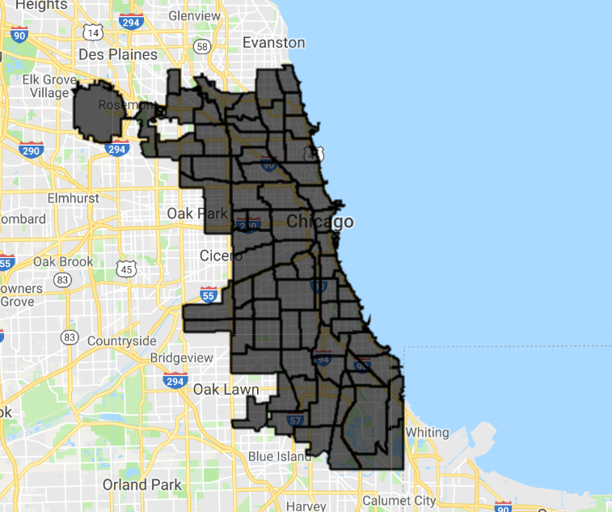

[Geometries - Open In Code Editor](https://code.earthengine.google.com/e9231ac879a0ae1fe80f77aa73573cd0)

[Features - Open In Code Editor](https://code.earthengine.google.com/1cd4cb760f71a56dce1cabcf44feec27)

[Images - Open In Code Editor - Geometries](https://code.earthengine.google.com/b2ddaa87c13ec42b7c122eab8310a611)

We will introduce types of geospatial data, using these data on the Earth Engine platforms, and discuss a host of functionality to visualize and analyze them. This workshop was originally created for a workshop during Yale-NUS Data 2.0 hackathon and then updated for Yale GIS Day 2018. 

## Introduction
Collection, visualization, and analysis of geographical or spatial data.

## Data types

-Vector data represent lat-long coordinates

-Raster data comprises of pixels with associated values

---


- Points


- Lines


- Polygons


- Raster layers/bands


---

## Google Earth Engine platform

[Introductory video](https://www.youtube.com/watch?v=gKGOeTFHnKY&feature=youtu.be, "Video")

[Code Editor](https://code.earthengine.google.com/ "Earth Engine Code Editor")

- Cloud-based platform for planetary scale geospatial analysis
- Uses Google's computational resources to reduce processing time
- Massive archive of remote sensing data 
- 200+ public datasets 
- greater than 4000 new images every day 
- greater than 5 million images 
- greater than 5 petabytes of data

Source: Google Earth Engine User summit

---


---

## Basic Functions

### Declaring variables
```javascript
var varName = Containerforvariabletype(variable name); 
```
A container (in the form ee.variabletype) is used to wrap up a native javascript object type so that Google's server can recognize its structure and perform operations on it

###  Centering map
```javascript
Map.setCenter(long, lat, zoom level);
```
>Zoom level varies from 0 (no zoom) to 20 (highest zoom level)

### Displaying metadata
```javascript
print(varName)
```
You cannot print more than 5000 elements at once

### Adding a layer to the map
```javascript
Map.addLayer(varName);
```

---

## Variable types in Earth Engine

### Strings

```javascript
var str = ee.String("This is a string. Or is it? It is.");
```
### Numbers
```javascript
var num = ee.Number(5);
```

### Arrays
```javascript
var arr = ee.Array([[5, 2, 3],  [-2, 7, 10],  [6, 6, 9]]);
```

### Lists
```javascript
var lis = ee.List([5, "five" , 6, "six"]);
```
### Dictionaries
```javascript
var dict = ee.Dictionary({five: 5 , six: 6});
```

### And the fun stuff
- Geometries
- Features
- Feature Collections
- Images
- Image Collections

---

## Geometries – declaration and types

### Points
```javascript
var poi = ee.Geometry.Point(0, 45);
```
### Multi Points
```javascript
var multi = ee.Geometry.MultiPoint(0, 45, 5,6, 70,-56);
```
### Line String
```javascript
var linestr = ee.Geometry.LineString([[0, 45], [5,6], [70,-56]]);
```
### Multi Line String
```javascript
var mlinestr = ee.Geometry.MultiLineString([[[0, 45], [5,6], [70,-56]], [[0, -45], [-5,-6], [-70,56]]]);
```
### Linear Ring
```javascript
var linrin = ee.Geometry.LinearRing(0, 45, 5,6, 70,-56, 0,45);
```
### Rectangle
```javascript
var rect = ee.Geometry.Rectangle(0, 0, 60,30);
```
### Polygon
```javascript
var poly = ee.Geometry.Polygon([[[0, 0], [6,3], [5, 5], [-30,2], [0,0]]]);
```
### Multi Polygon
```javascript
var multiploy = ee.Geometry.MultiPolygon([ee.Geometry.Polygon([[0, 0], [6, 3], [5, 5], [-30, 2], [0,0]]), ee.Geometry.Polygon([[0, 0], [-6, -3], [-5, -5], [30, -2], [0, 0]])]);
```

---

## Features and Feature Collections

- Features are geometries associated with specific properties
- Feature Collections are groups of features




---

## Functions and mapping

- A set of instructions to perform a specific task
```javascript
function  function_Name(Arguments) {statements};
```
### Call function
```javascript
var result = function_Name(Input);
```

### Map function over Feature or Image Collection
```javascript
var result = Input.map(function_Name);
```
Mapping a function over a collection sends the each element of the collection to a different server to be processes.

---


## Operations on Geometries

[Geometry operations](https://code.earthengine.google.com/2f8ac6fe92f8fa7aff23eedb087c7d12 "EE Geometry operations")

### Find area of geometry
```javascript
var geo_area = var_Geometry.area();
```

All units in Earth Engine are in meters

### Find length of line
```javascript
var lin_len = var_LineString.length();
```
### Find perimeter of geometry
```javascript
var geo_peri = var_Geometry.perimeter();
```

### Reduce number of vertices in geometry
```javascript
var simp_geo = var_Geometry.simplify(100);
```
### Find centroid of geometry
```javascript
var centr = var_Geometry.centroid();
```
### Create buffer around geometry
```javascript
var buff = var_Geometry.buffer(100);
```
### Find bounded rectangle of the Geometry
```javascript
var boun_geo = var_Geometry.bounds();
```
### Find the smallest envelope that can envelop the Geometry
```javascript
var convex_geo = var_Geometry.convexHull();
```
### Find common area between two or more geometries
```javascript
var inter_geo = var_Geometry1.intersection(var_Geometry2);
```
### Find area that includes two or more geometries
```javascript
var un_geo = var_Geometry1.union(var_Geometry2);
```
---
## Operations on Features

[Feature operations](https://code.earthengine.google.com/1cd4cb760f71a56dce1cabcf44feec27 "EE Feature operations")

### Set property name and value of geometry to create a feature
```javascript
var feat = ee.Feature(var_Geometry, {Name: "Feature name", Size: 500};
```
### Create a new feature from existing feature while renaming a property
```javascript
var featnew = var_Feature.select(["Name"], ["Descriptor"]);
```
### Extract values of a property from a Feature
```javascript
var feat_val = var_Feature.get(''Size'');
```
---

## Filters

### Creator a filter for values of a property

```javascript
var B_filter = ee.Filter.eq(Property_name, Value);
```
>or .neq , .gt , .gte , .lt , and .lte

### Create a filter based on maximum difference from a threshold

```javascript
var Diff_filter = ee.Filter.maxDifference(threshold, Property_name, Value);
```

### Create a text filter

```javascript
var Txt_filter = ee.Filter.stringContains( Property_name, StringValue);
```

>or .stringStartsWith, and .stringEndsWith

### Create a range filter

```javascript
var Range_filter = ee.Filter.rangeContains( Property_name, StringValue, MinValue, MaxValue);
```
  
### Create a list filter to check for certain values

```javascript
var List_filter = ee.Filter.listContains(Property_name, Value1, Property_name2, Value2);
```
>.inList to test against list of values

### Create a filter of dates

```javascript
var Date_filter = ee.Filter.calendarRange(StartDate, StopDate);
```

### Create a filter for particular days of the year

```javascript
var Day_filter = ee.Filter.dayOfYear(startDay, StopDay);
```

### Create a filter to subset geospatial data

```javascript
var Bounds_filter= ee.Filter.bounds(GeometryorFeature);
```
### Combining and inversing filters

```javascript
var New_filter=ee.Filter.and(Listoffilters);
var New_filter=ee.Filter.or(Listoffilters);
var inverse_filter = ee.Filter.not(filter);
```
---
## Operations on Images

[Image operations](https://code.earthengine.google.com/b2ddaa87c13ec42b7c122eab8310a611 "EE Image operations")

### Selecting the bands of an image
```javascript
var band = var_Image.select(band name);
```
### Creating masks
```javascript
var mask =var_Image.eq(value);
```
>or .neq or .gt or .gte or .lt or .lte

### Applying masks
```javascript
var masked =var_Image.mask(mask);
```

### Pixelwise calculation
```javascript
var results =var_Image.sum(value);
```
>or .subtract ,    .multiply ,    .divide ,    .max , .min ,  .abs ,  .round ,  .floor ,  .ceil ,  .sqrt ,  .exp,  .log, .log10, .sin ,  .cos ,  .tan ,  .sinh ,  .cosh ,  .tanh ,  .acos, .asin

### Shift pixels of an image
```javascript
newImage = oldImage.leftShift(valueofshift);                   
```
>or .rightShift

### Create a single value from an image by applying a reducer based on regions of interest

```javascript
var outputDictionary = var_Image.reduceRegion(Reducer, var_Geometry, scale);
```

---

# Operations on Image Collections

### Select the first n numbers of images in a collection (based on property)

```javascript
var SelectedImages =var_ImCollection.limit (n, Property_name, Order);
```

### Select images in collection based on particular properties

```javascript
var selected_im = var_ImCollection.filterMetadata (Property_name, Relation , Value);
```
>Relations could be "equals", "less_than", "greater_than", "starts_with", "ends_with", and "contains"

### Select images within date range
```javascript
var selected_im = var_ImCollection.filterDate (StartDate, StopDate);
```

### Select images within Geometry
```javascript
var selected_im = var_ImCollection.filterBounds (var_Geometry);
```

### Perform pixelwise calculations for all images in collection
```javascript
var sum_of_images = var_ImCollection.sum();
```
>or .product, .max, .min, .mean, .mode, .median, and .count 

### Create composite of images in collection with the last image on top

```javascript
var mosaic_of_images = var_ImCollection.mosaic();
```
---
## Importing and exporting data

[Image to table example](https://code.earthengine.google.com/31ca9a8d6ba853db8a74fbdb214626f5 "Image to table example")

[Timelapse example](https://code.earthengine.google.com/b26b01f29aacedad8309d44eda64c950 "Timelapse example")

[Dubai timelapse](https://www.youtube.com/watch?v=6gK4Fd-WSM4&feature=youtu.be "Dubai timelapse")


### Export image, video or table to Google Drive, Asset, or Google Cloud

```javascript
Export.image.toDrive({
  collection: var_Image, description: 'FileName', region: var_Geometry, scale: 1000}
});
```
>or image.toCloudStorage, image.toAsset, table.toDrive, table.toCloudStorage, video.toCloudStorage, and video.toDrive

---

## Example Applications

 What can you do with Google Earth Engine?

### [EE Population Explorer](https://code.earthengine.google.com/f5c100f29958f6fe82ba5d0dcf6421a4 "EE Population Explorer")

### [EE Ocean Time Series Investigator](https://code.earthengine.google.com/901e5a356ef3d260a5ff542598667044 "EE Ocean Time Series Investigator")

### [Global Surface UHI Explorer](https://yceo.users.earthengine.app/view/uhimap "Global Surface UHI Explorer")

### [Stratifi - cloud-based stratification](https://sabrinaszeto.users.earthengine.app/view/stratifi "Stratifi - cloud-based stratification")
---

## Resources


[Geospatial Software Design](https://environment.yale.edu/courses/2018-2019/detail/754/ "Geospatial Software Design")

[Google Earth Engine API documentation](https://developers.google.com/earth-engine/ "Google Earth Engine API documentation")

[Google Earth Engine Developers forum](https://groups.google.com/forum/#!forum/google-earth-engine-developers "Google Earth Engine Developers forum")

[Example scripts from Prof. Dana Tomlin's handouts for his course on Geospatial Software Design](https://github.com/EEYale/example-scripts "Example scripts from Prof. Dana Tomlin's handouts for his course on Geospatial Software Design")
