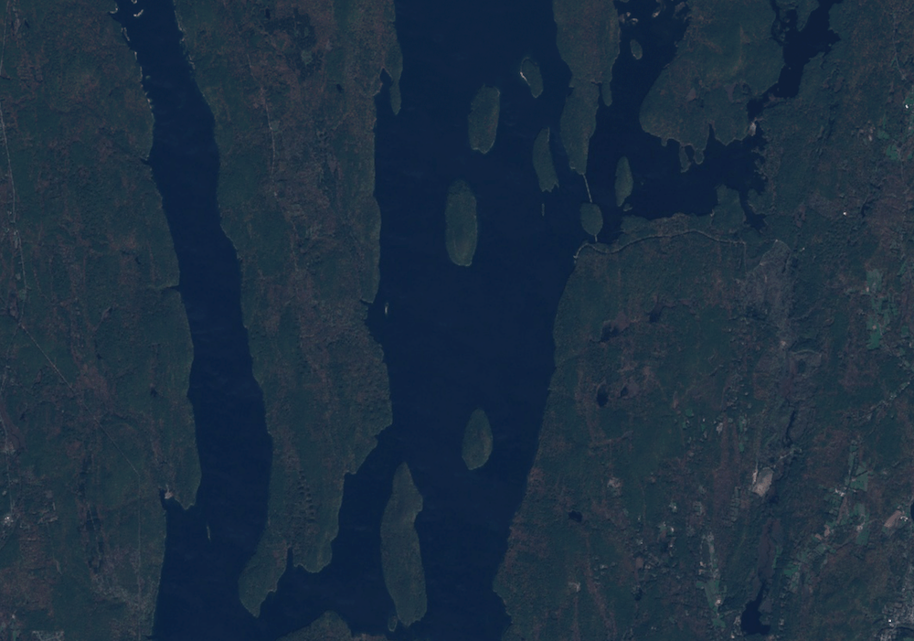
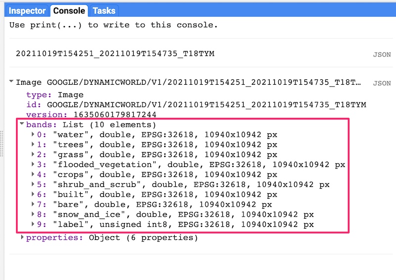
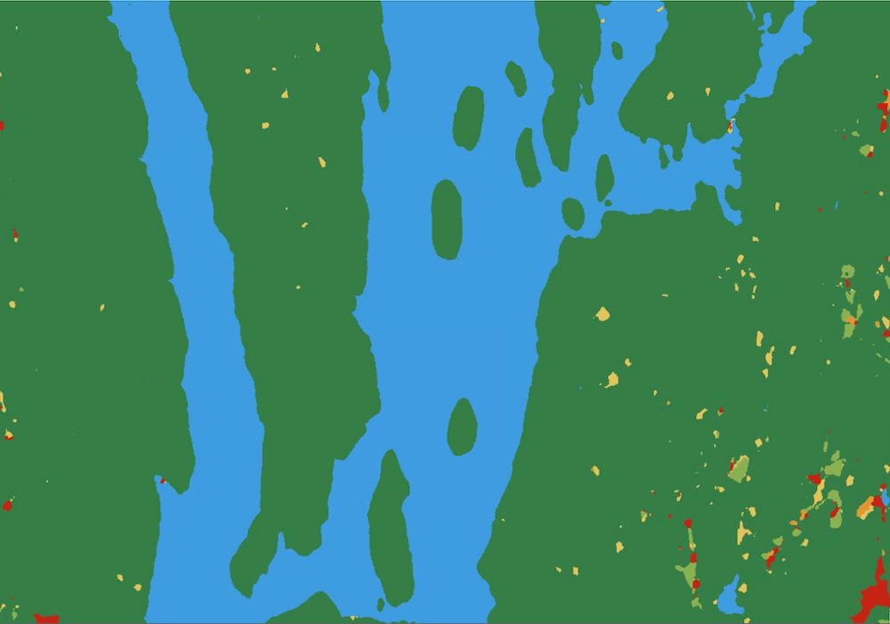
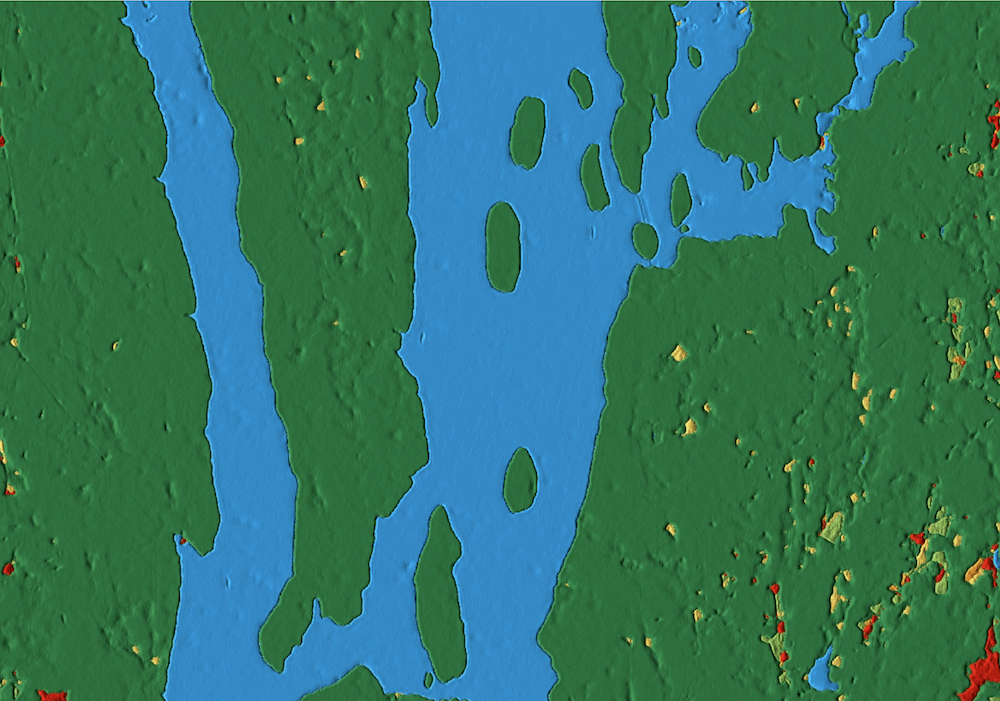
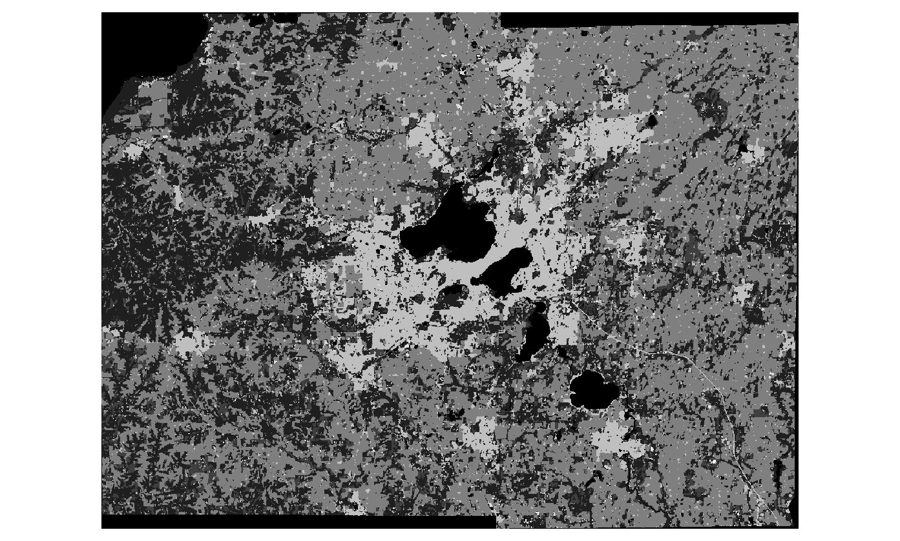
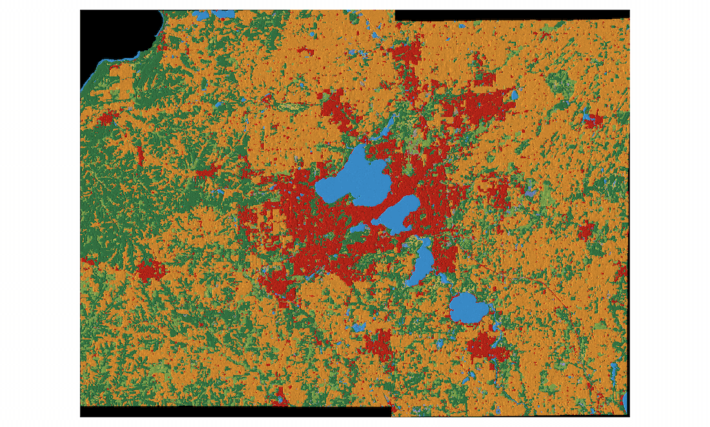

<!--
Copyright 2022 The Google Earth Engine Community Authors

Licensed under the Apache License, Version 2.0 (the "License");
you may not use this file except in compliance with the License.
You may obtain a copy of the License at

    http://www.apache.org/licenses/LICENSE-2.0

Unless required by applicable law or agreed to in writing, software
distributed under the License is distributed on an "AS IS" BASIS,
WITHOUT WARRANTIES OR CONDITIONS OF ANY KIND, either express or implied.
See the License for the specific language governing permissions and
limitations under the License.
-->

_This is part 1 of a 3-part tutorial, see also
[part 2](/earth-engine/tutorials/community/introduction-to-dynamic-world-pt-2) and
[part 3](/earth-engine/tutorials/community/introduction-to-dynamic-world-pt-3)._

Welcome to the Google Earth Engine tutorial for working with the Dynamic World
(DW) dataset. The dataset contains near real-time (NRT) land use land cover
(LULC) predictions created from Sentinel-2 imagery for nine land use land cover
(LULC) classes as described in the table below.

| LULC Type          | Description                                                                |
| ------------------ | -------------------------------------------------------------------------- |
| Water              | Permanent and seasonal water bodies                                        |
| Trees              | Includes primary and secondary forests, as well as large-scale plantations |
| Grass              | Natural grasslands, livestock pastures, and parks                          |
| Flooded vegetation | Mangroves and other inundated ecosystems                                   |
| Crops              | Include row crops and paddy crops                                          |
| Shrub & Scrub      | Sparse to dense open vegetation consisting of shrubs                       |
| Built Area         | Low- and high-density buildings, roads, and urban open space               |
| Bare ground        | Deserts and exposed rock                                                   |
| Snow & Ice         | Permanent and seasonal snow cover                                          |

This tutorial provides examples of how to use Earth
Engine to load and visualize this rich 10m resolution probability-per-pixel
land use land cover dataset. The tutorial also covers techniques to compute
statistics and analyze the probability time-series data for change detection.

The tutorial is divided into three parts:

* Part 1. Visualization and Creating Composites
* Part 2. Calculating Statistics of a Region
* Part 3. Exploring Time Series

Within each part, code will be built up gradually with short code snippets
and explanatory text. At the end of each section, the complete working script
will be presented.

## Prerequisites

The tutorial assumes some familiarity with the Code Editor and Earth Engine API.
Before proceeding, please make sure to:

* [Signup for Earth Engine](https://signup.earthengine.google.com/). Once your application
has been approved, you will receive an email with additional information.
* Get familiar with the [Earth Engine Code Editor](https://code.earthengine.google.com/),
the IDE for writing Earth Engine JavaScript code in a web browser. Learn more
about the Code Editor [here](/earth-engine/guides/playground).
* If you are unfamiliar with JavaScript, check out the
[JavaScript for Earth Engine](/earth-engine/tutorials/tutorial_js_01) tutorial.
* If you are unfamiliar with the Earth Engine API, check out the
[Introduction to the Earth Engine API](/earth-engine/tutorials/tutorial_api_01) tutorial.

Once you're familiar with JavaScript, the Earth Engine API and the Code Editor,
get started on the tutorial!

## Hello [Dynamic] World

The Dynamic World (DW) dataset is a continuously updating Image Collection of
globally consistent, <nobr>10m-resolution</nobr>, near real-time (NRT) land use
land cover (LULC) predictions created from Sentinel-2 imagery. Images in this
dataset include ten bands: nine bands with estimated probabilities for each of
the nine DW LULC classes as well as a class "label" band indicating the class
with the largest estimated probability. These unique properties enable users to
do multi-temporal analysis as well as create custom products suited to their
needs.

### Using the NRT Image Collection

The Dynamic World Near Real-time (NRT) Image Collection includes LULC
predictions for Sentinel-2 L1C acquisitions from 2015-06-23 to the present
where the `CLOUDY_PIXEL_PERCENTAGE` metadata is less than 35%. The Image
Collection is continuously updated in near real-time with predictions generated
for new [Sentinel-2 L1C harmonized](/earth-engine/datasets/catalog/COPERNICUS_S2_HARMONIZED)
images as they become available in Google Earth Engine.

The [Dynamic World NRT collection](/earth-engine/datasets/catalog/GOOGLE_DYNAMICWORLD_V1)
is available at `GOOGLE/DYNAMICWORLD/V1`.
The images in this collection have names that match the individual Sentinel-2
L1C product names from which they were derived.

Let's see how we can find and load the Dynamic World classification for a
specific Sentinel-2 image.

We first define the variables containing the start date, end date, and
coordinates of a location. Here we have defined a point centered at the
Quabbin Reservoir in Massachusetts, US.

```js
var startDate = '2021-10-15';
var endDate = '2021-10-25';
var geometry = ee.Geometry.Point([-72.28525, 42.36103]);
```

### Load a Sentinel-2 Image

We can find a Sentinel-2 image by applying filters on the Sentinel-2 L1C
harmonized collection for the date range and location of interest. Since the
Dynamic World classification is available only for scenes with < 35% cloud
cover, we also apply a metadata filter.

```js
var s2 = ee.ImageCollection('COPERNICUS/S2_HARMONIZED')
             .filterDate(startDate, endDate)
             .filterBounds(geometry)
             .filter(ee.Filter.lt('CLOUDY_PIXEL_PERCENTAGE', 35));
```

The resulting collection in the `s2` variable contains all images matching the
filters. We can call `.first()` to extract a single image (the earliest one
matching our criteria) from the collection. Once we have the image, let's add
it to the map to visualize it. The code also centers the viewport at the
coordinates of the point location.

```js
var s2Image = ee.Image(s2.first());
var s2VisParams = {bands: ['B4', 'B3', 'B2'], min: 0, max: 3000};
Map.addLayer(s2Image, s2VisParams, 'Sentinel-2 Image');
Map.centerObject(geometry, 13);
```


_A Sentinel-2 L1C Image of Quabbin Reservoir, Massachusetts, US_

### Find the Matching Dynamic World Image

To find the matching classified image in the Dynamic World collection, we
need to extract the product id using the `system:index` property.

```js
var imageId = s2Image.get('system:index');
print(imageId);
```

You will see the Sentinel-2 product ID printed in the console. We can use the
same id to load the matching Dynamic World scene. The code snippet below
applies a filter on the Dynamic World collection and extracts the matching
scene.

```js
var dw = ee.ImageCollection('GOOGLE/DYNAMICWORLD/V1')
             .filter(ee.Filter.eq('system:index', imageId));
var dwImage = ee.Image(dw.first());
print(dwImage);
```

The console will show the information about the Dynamic World image.
Expanding the bands section, you will notice that the image contains 10 bands.


_Dynamic World Image Information_

### Visualize the Classified Image

The `label` band of Dynamic World images contains a discrete label for each
pixel assigned based on the class with the highest probability. The nine-class
taxonomy is described in the table below.

| Label | LULC Type          | Color   | Description                                                                |
| ----- | ------------------ | --------| -------------------------------------------------------------------------- |
| 0     | Water              | #419BDF | Permanent and seasonal water bodies                                        |
| 1     | Trees              | #397D49 | Includes primary and secondary forests, as well as large-scale plantations |
| 2     | Grass              | #88B053 | Natural grasslands, livestock pastures, and parks                          |
| 3     | Flooded vegetation | #7A87C6 | Mangroves and other inundated ecosystems                                   |
| 4     | Crops              | #E49635 | Include row crops and paddy crops                                          |
| 5     | Shrub & Scrub      | #DFC35A | Sparse to dense open vegetation consisting of shrubs                       |
| 6     | Built Area         | #C4281B | Low- and high-density buildings, roads, and urban open space               |
| 7     | Bare ground        | #A59B8F | Deserts and exposed rock                                                   |
| 8     | Snow & Ice         | #B39FE1 | Permanent and seasonal snow cover                                          |

Let's visualize the classified image using the label band.

```js
var classification = dwImage.select('label');
var dwVisParams = {
  min: 0,
  max: 8,
  palette: [
    '#419BDF', '#397D49', '#88B053', '#7A87C6', '#E49635', '#DFC35A',
    '#C4281B', '#A59B8F', '#B39FE1'
  ]
};

Map.addLayer(classification, dwVisParams, 'Classified Image');
```


_Visualization of the label classification_

### Create a Probability Hillshade Visualization

The label band of a Dynamic World image contains the class value with the
highest probability among the different LULC classes. Each image also
contains 9 other bands—each containing the pixel-wise probability for the
corresponding LULC class. We can use this information to create a better and
more information-rich visualization.

The technique uses a hillshade computed from a probability image containing
the value of the highest probability at each pixel (Top-1 Probability). This
probability image is then used as a pseudo-elevation image by the
`ee.Terrain.hillshade` algorithm. Higher confidence of a class membership
represents higher *elevation* and lower confidence represents lower *elevation*.
The resulting hillshade rendering contains ridges and valleys showing the
varying class confidence across the landscape—revealing features not normally
visible with discretized visualization.

To compute the hillshade, we first select all the probability bands and
compute the Top-1 probability using the `ee.Reducer.max()` reducer.

```js
var probabilityBands = [
  'water', 'trees', 'grass', 'flooded_vegetation', 'crops', 'shrub_and_scrub',
  'built', 'bare', 'snow_and_ice'
];

var probabilityImage = dwImage.select(probabilityBands);

// Create the image with the highest probability value at each pixel.
var top1Probability = probabilityImage.reduce(ee.Reducer.max());
```

The pixel values in the resulting image range from 0-1. The hillshade
algorithm expects values in meters so we convert these to integer values by
multiplying them by 100. The hillshade algorithm returns an image from 0-255,
so we divide the result by 255 to get an image with pixel values from 0-1.

```js
// Convert the probability values to integers.
var top1Confidence = top1Probability.multiply(100).int();

// Compute the hillshade.
var hillshade = ee.Terrain.hillshade(top1Confidence).divide(255);
```

For the last step, we colorize the hillshade by multiplying the
classification image with the hillshade.

```js
// Colorize the classification image.
var rgbImage = classification.visualize(dwVisParams).divide(255);

// Colorize the hillshade.
var probabilityHillshade = rgbImage.multiply(hillshade);

var hillshadeVisParams = {min: 0, max: 0.8};
Map.addLayer(probabilityHillshade, hillshadeVisParams, 'Probability Hillshade');
```


_Probability Hillshade Visualization_

### Summary

In this section, you learnt how to find the matching LULC classification
image from the Dynamic World NRT collection using a Sentinel-2 L1C image. We
also covered two different techniques for visualizing the LULC classes: a
discrete visualization using the label band and a hillshade visualization
using the Top-1 confidence class. In the next section, we will learn how to
create annual composites for a larger region.

The full script for this section can be accessed from the link below
[https://code.earthengine.google.com/5a2d8406ed41ea177bf8e2bef34cd9e8](https://code.earthengine.google.com/5a2d8406ed41ea177bf8e2bef34cd9e8)

| Sentinel-1C Image  | Class Labels  | Top-1 Confidence Hillshade |
:-------------------:|:-------------:|:--------------------------:|
        |  |               |

_A Sentinel-1C image along with matching Dynamic World products_

## Creating Multi-Temporal Composites

Being a continuous product, Dynamic World allows users to aggregate the NRT
collection over a longer, custom time period. For example, one can create a
monthly, seasonal or annual product from the NRT scenes collected during this
duration. In this section, you will learn how to create an annual land cover
product for a US County and export the results as a GeoTiff.

### Select a Region

For this tutorial, we will use the
[TIGER: US Census Counties 2018](/earth-engine/datasets/catalog/TIGER_2018_Counties)
dataset to extract the boundary for Dane County, Wisconsin.

```js
var counties = ee.FeatureCollection('TIGER/2016/Counties');
var filtered = counties.filter(ee.Filter.eq('NAMELSAD', 'Dane County'));
var geometry = filtered.geometry();
Map.centerObject(geometry, 10);
```

### Filter the Dynamic World NRT Collection

Now we apply a date and bounds filter to select all images in the NRT
collection for the year 2020 over the selected region.

```js
var startDate = '2020-01-01';
var endDate = '2021-01-01';

var dw = ee.ImageCollection('GOOGLE/DYNAMICWORLD/V1')
             .filterDate(startDate, endDate)
             .filterBounds(geometry);
```

### Create a Mode Composite

We can aggregate the estimated distribution of the LULC classes over the time
period by creating a mode composite using the highest probability label for
each NRT image. We can apply the `ee.Reducer.mode()` on the filtered collection
to select the most frequently occurring class label for each pixel during the
year. Once we have the composite image, we use `.clip()` to create an annual
landcover image for the region.

```js
var classification = dw.select('label');
var dwComposite = classification.reduce(ee.Reducer.mode());
```

### Visualize the Annual Composite

As shown in the previous section, you may visualize the LULC image using the
class labels or the Top-1 hillshade. Here we add the result to the map using
the class taxonomy.

```js
var dwVisParams = {
  min: 0,
  max: 8,
  palette: [
    '#419BDF', '#397D49', '#88B053', '#7A87C6', '#E49635', '#DFC35A',
    '#C4281B', '#A59B8F', '#B39FE1'
  ]
};

// Clip the composite and add it to the Map.
Map.addLayer(dwComposite.clip(geometry), dwVisParams, 'Classified Composite');
```


_Annual Composite for Dane County, WI_

### Create a Probability Hillshade Composite

As we saw in the previous section, you can use the pixel-wise probability
information contained in the 9 LULC bands to create a richer visualization by
calculating the Top-1 Probability Hillshade. We can use the same technique on
composites, but with a few adjustments.

The composite is created from a collection of images. Each image is collected
at a different time and has different pixel-wise probabilities. For our
visualization, we can create a mean composite that has the average pixel-wise
probability for each band across images captured at different times.

```js
var probabilityBands = [
  'water', 'trees', 'grass', 'flooded_vegetation', 'crops', 'shrub_and_scrub',
  'built', 'bare', 'snow_and_ice'
];

// Select probability bands.
var probabilityCol = dw.select(probabilityBands);

// Create an image with the average pixel-wise probability
// of each class across the time-period.
var meanProbability = probabilityCol.reduce(ee.Reducer.mean());
```

The `meanProbability` image is a composite image with 9 bands having the
average pixel-wise probability calculated from all the source image bands. In
Earth Engine, a composite of input images will have the
[default projection](/earth-engine/guides/projections#the-default-projection),
which is WGS84 with 1-degree scale. This is not suitable for hillshade
computation. To fix this, we can set another default projection for the
composite image. For visualizing the image in the Code Editor, the
[*EPSG:3857* CRS](https://epsg.io/3857) is a good choice (Code Editor CRS is
EPSG:3857). We also set the scale of the projection to be the same as the source
images (10m).

```js
var projection = ee.Projection('EPSG:3857').atScale(10);
var meanProbability = meanProbability.setDefaultProjection(projection);
```

We can now proceed and create the colorized hillshade visualization as
described in the previous section.

```js
// Create the Top-1 Probability Hillshade.
var top1Probability = meanProbability.reduce(ee.Reducer.max());
var top1Confidence = top1Probability.multiply(100).int();
var hillshade = ee.Terrain.hillshade(top1Confidence).divide(255);
var rgbImage = dwComposite.visualize(dwVisParams).divide(255);
var probabilityHillshade = rgbImage.multiply(hillshade);
```

Finally, clip and add the layer to the Map.

```js
var hillshadeVisParams = {min: 0, max: 0.8};
Map.addLayer(
    probabilityHillshade.clip(geometry), hillshadeVisParams,
    'Probability Hillshade');
```


_Top-1 Probability Hillshade Visualization of the Annual Composite_

### Export the Composite

We can export the resulting composite annual LULC product to download it as a
GeoTIFF. If you want to further analyze this dataset with GIS software, you
can export the raw image with the pixel values representing classes. We use
the `Export.image.toDrive()` function to create a task for exporting the
composite.

Once you run the script, switch to the Tasks tab and click Run. Upon
confirmation, the task will start running and create a GeoTIFF file in your
Google Drive in a few minutes.

```js
Export.image.toDrive({
  image: dwComposite.clip(geometry),
  description: '2020_dw_composite_raw',
  region: geometry,
  scale: 10,
  maxPixels: 1e10
});
```

Alternatively, if you wish to create a map using this composite or use it as
a background map, it is advisable to export the probability hillshade
visualization. The code below creates an export task for the visualized
composite.

```js
// Top-1 Probability Hillshade Composite.
var hillshadeComposite = probabilityHillshade.visualize(hillshadeVisParams);

Export.image.toDrive({
  image: hillshadeComposite.clip(geometry),
  description: '2020_dw_composite_hillshade',
  region: geometry,
  scale: 10,
  maxPixels: 1e10
});
```

Once the Export tasks finish, you can download the GeoTIFF file from your
Google Drive.

| Raw Composite  | Top-1 Probability Hillshade Composite |
:-------------------:|:---------------------------------:|
  |   |

_Exported GeoTIFF Images Loaded in QGIS_

### Summary

You now know how to create temporally aggregated products from the Dynamic
World NRT collection for a region of your choice and visualize them. This
section also showed how you can download a GeoTIFF of the resulting composite
using the `Export` function.

The full script for this section can be accessed from this Code Editor link:
[https://code.earthengine.google.com/35657f5dc56c19e8d957cd729138a327](https://code.earthengine.google.com/35657f5dc56c19e8d957cd729138a327)

In [Part 2](/earth-engine/tutorials/community/introduction-to-dynamic-world-pt-2)
of this tutorial, we will learn how to calculate and summarize
statistics of a region.

---

<div>
  <p><small>
    The data described in this tutorial were produced by Google, in
    partnership with the World Resources Institute and National Geographic
    Society and are provided under a CC-BY-4.0 Attribution license.</small></p>
</div>
