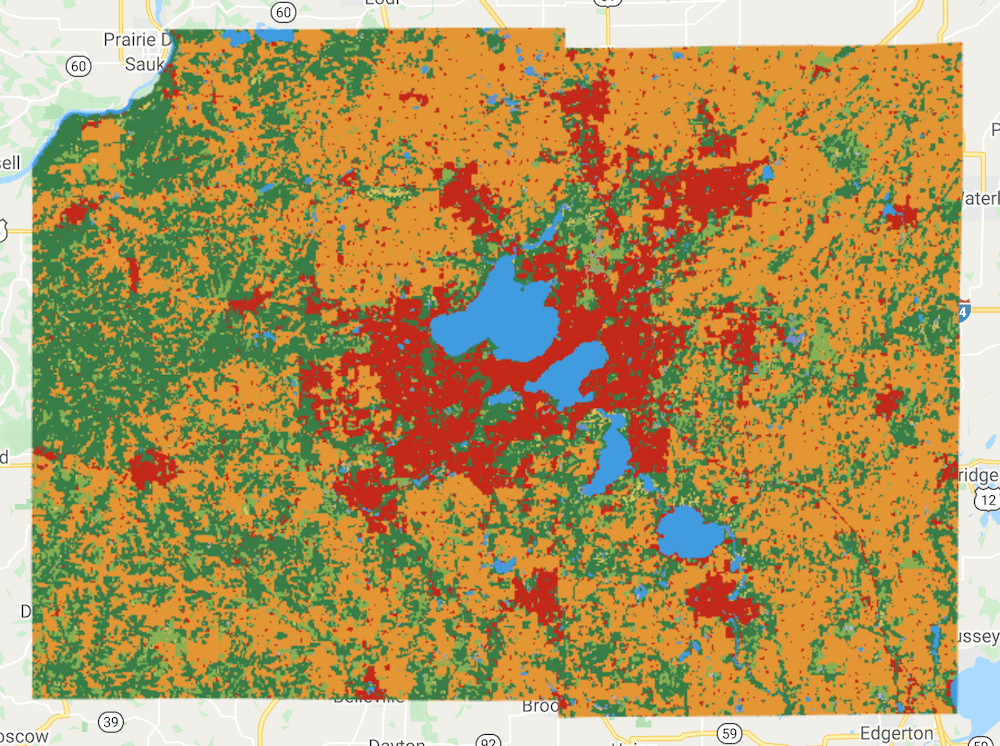
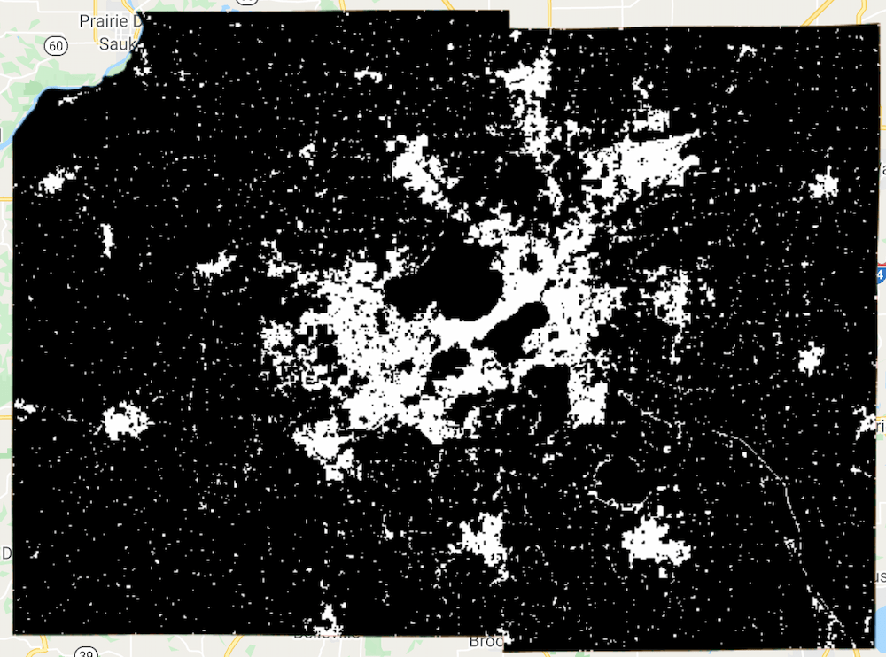

<!--
Copyright 2022 The Google Earth Engine Community Authors

Licensed under the Apache License, Version 2.0 (the "License");
you may not use this file except in compliance with the License.
You may obtain a copy of the License at

    http://www.apache.org/licenses/LICENSE-2.0

Unless required by applicable law or agreed to in writing, software
distributed under the License is distributed on an "AS IS" BASIS,
WITHOUT WARRANTIES OR CONDITIONS OF ANY KIND, either express or implied.
See the License for the specific language governing permissions and
limitations under the License.
-->

_This is part 2 of a 3-part tutorial, see also
[part 1](/earth-engine/tutorials/community/introduction-to-dynamic-world-pt-1) and
[part 3](/earth-engine/tutorials/community/introduction-to-dynamic-world-pt-3)._

A high resolution Land Use Land Cover (LULC) dataset like Dynamic World allows
us to estimate the footprint of human activity on carbon cycles, biodiversity
and other anthropogenic natural processes. Using the Dynamic World taxonomy, we
can calculate and summarize statistics over any region. In this section, we
will learn how to calculate the number of pixels for a single land cover class
in a region as well as the distribution of pixel counts for all classes.

> Note that summary statistics could be used to get class proportions for a
stratified sample, but reference data would need to be collected in order to
correct for biases and perform area estimation.

We continue from
[Part 1](/earth-engine/tutorials/community/introduction-to-dynamic-world-pt-1)
of the Tutorial with the selected region of Dane
County, Wisconsin. In this section, you will learn how to calculate the
fraction of a single land cover class in this county as well as the
pixel counts for all the classes.

## Calculate the Fraction of a Single Class

Let's say we want to estimate what percentage of a region is
built-up area. We start by creating a mode composite for the
given time period.

```js
var counties = ee.FeatureCollection('TIGER/2016/Counties');
var filtered = counties.filter(ee.Filter.eq('NAMELSAD', 'Dane County'));
var geometry = filtered.geometry();
Map.centerObject(geometry, 10);

var startDate = '2020-01-01';
var endDate = '2021-01-01';

var dw = ee.ImageCollection('GOOGLE/DYNAMICWORLD/V1')
             .filterDate(startDate, endDate)
             .filterBounds(geometry);

// Create a mode composite.
var classification = dw.select('label');
var dwComposite = classification.reduce(ee.Reducer.mode());
```

According to the Dynamic World taxonomy, the *Built Area* class is
represented with the pixel value **6**. We can use the boolean operator `.eq()`
to extract all pixels with that value.

```js
// Extract the Built Area class.
var builtArea = dwComposite.eq(6);
```

The resulting `builtArea` image is a binary image—with pixel value 1 where
the condition matched and 0 where it didn't. We can add both the composite
and the built area images to the Map to verify it.

```js
var dwVisParams = {
  min: 0,
  max: 8,
  palette: [
    '#419BDF', '#397D49', '#88B053', '#7A87C6', '#E49635', '#DFC35A',
    '#C4281B', '#A59B8F', '#B39FE1'
  ]
};

// Clip the composite and add it to the Map.
Map.addLayer(dwComposite.clip(geometry), dwVisParams, 'Classified Composite');
Map.addLayer(builtArea.clip(geometry), {}, 'Built Areas');
```

|  Composite  | Built Area Composite       |
:------------:|:--------------------------:|
  |   |

_Dynamic World Composite and Extracted Built Area Image_

Before proceeding further, it is helpful to rename our image bands so it is
easier to keep track of them.

```js
var dwComposite = dwComposite.rename(['classification']);
var builtArea = builtArea.rename(['built_area']);
```

To count pixels within a region, we can use the `reduceRegion()` function with
the `ee.Reducer.count()` reducer. We first count total pixels in the image. Then
we use the `selfMask()` function to mask all 0 values and count the remaining
pixels.

```js
// Count all pixels.
var statsTotal = builtArea.reduceRegion({
    reducer: ee.Reducer.count(),
    geometry: geometry,
    scale: 10,
    maxPixels: 1e10
    });
var totalPixels = statsTotal.get('built_area');

// Mask 0 pixel values and count remaining pixels.
var builtAreaMasked = builtArea.selfMask();

var statsMasked = builtAreaMasked.reduceRegion({
    reducer: ee.Reducer.count(),
    geometry: geometry,
    scale: 10,
    maxPixels: 1e10
    });
var builtAreaPixels = statsMasked.get('built_area');
print(builtAreaPixels);
```

The last step is to calculate the built area fraction by dividing the total
built area pixels by total image pixels. We round off the number to 2 decimal
places using the `format()` function and print the result.

```js
var fraction = (ee.Number(builtAreaPixels).divide(totalPixels))
  .multiply(100);
print('Percentage Built Area', fraction.format('%.2f'));
```

## Summarizing Pixel Counts for All Classes

The method described in the previous section is useful for many applications,
but it can be limiting if you want to summarize the pixel counts for all the
classes. Instead, we can take the `dwComposite` image and use another reducer
called `ee.Reducer.frequencyHistogram()`. This reducer computes the counts for
all unique pixel values in the image. Note that this is a weighted reducer, so
it will count the pixels based on their overlap with the geometry. To match the
results we get from `ee.Reducer.count()`, we can create an unweighted reducer by
calling `unweighted()` on it. Learn more about
[Weighted Reducers](/earth-engine/guides/reducers_reduce_region?#pixels-in-the-region).

```js
var pixelCountStats = dwComposite.reduceRegion({
    reducer: ee.Reducer.frequencyHistogram().unweighted(),
    geometry: geometry,
    scale: 10,
    maxPixels: 1e10
    });

var pixelCounts = ee.Dictionary(pixelCountStats.get('classification'));
print(pixelCounts);
```

The result is a dictionary with pixel values as keys and pixel counts as values.
We can rename the keys in the dictionary with the class names to make the
results more readable.

```js
// Format the results to make it more readable.
var classLabels = ee.List([
    'water', 'trees', 'grass', 'flooded_vegetation', 'crops',
    'shrub_and_scrub', 'built', 'bare', 'snow_and_ice'
    ]);

// Rename keys with class names.
var pixelCountsFormatted = pixelCounts.rename(
  pixelCounts.keys(), classLabels);
print(pixelCountsFormatted);
```

If you are summarizing pixel counts over a large region, you may get a
**Computation Timed Out** error when you print the results. In such cases, you
must export the results instead of printing them in the Console.

The pixel counts are stored in a dictionary. To export it, we have to convert
the dictionary to a Feature Collection. A simple solution is to create a
Feature Collection having a single feature with null geometry and set the
dictionary as its properties. This resulting collection can then be exported
using the `Export.table.toDrive()` function. Run the script and click *Run* to
start the Export. Once the Export task finishes, you will have a file named
`pixel_counts.csv` in your Google Drive with the result of the computation.

```js
// Create a Feature Collection.
var exportFc = ee.FeatureCollection(
  ee.Feature(null, pixelCountsFormatted));

// Export the results as a CSV file.
Export.table.toDrive({
  collection: exportFc,
  description: 'pixel_counts_export',
  folder: 'earthengine',
  fileNamePrefix: 'pixel_counts',
  fileFormat: 'CSV',
});
```

## Summary

You learned different techniques to calculate statistics on the LULC composite
image. We covered the method to extract pixels for a single class and
calculate its fraction. The tutorial also showed how to summarize pixel counts
of all classes in a region and export the results as a CSV file.

The pixel counts obtained through the method described here should be used with
care. For accurate area estimates, it should be further refined by comparing
against reference datasets and applying bias corrections.

The full script for this section can be accessed from this Code Editor link:
[https://code.earthengine.google.com/020bc4a2311777545bcb1d44d6f524be](https://code.earthengine.google.com/020bc4a2311777545bcb1d44d6f524be)

In [Part 3](/earth-engine/tutorials/community/introduction-to-dynamic-world-pt-3)
of this tutorial, we will explore the probability time-series and
use it to detect changes.

---

<div>
  <p><small>
    The data described in this tutorial were produced by Google, in
    partnership with the World Resources Institute and National Geographic
    Society and are provided under a CC-BY-4.0 Attribution license.</small></p>
</div>
