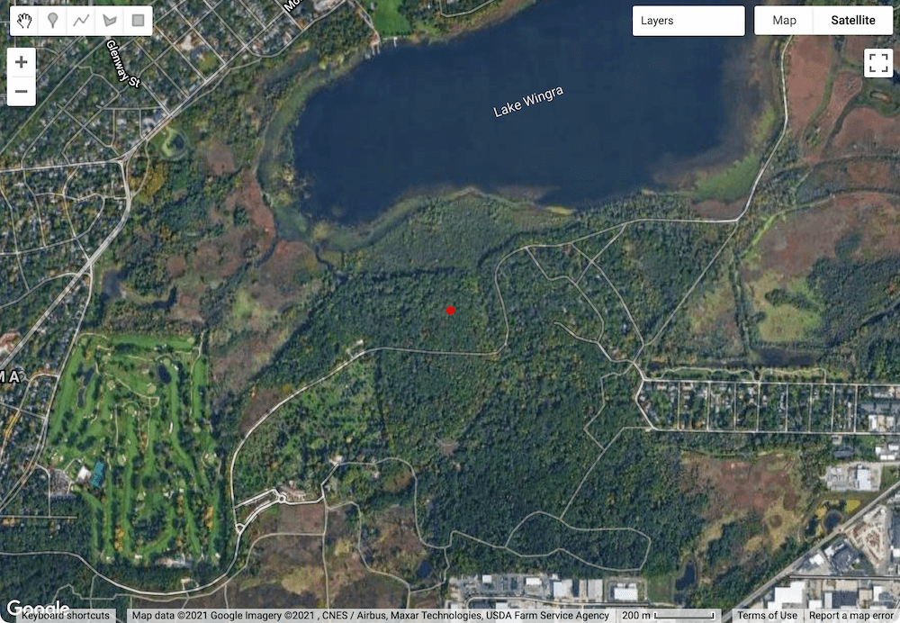
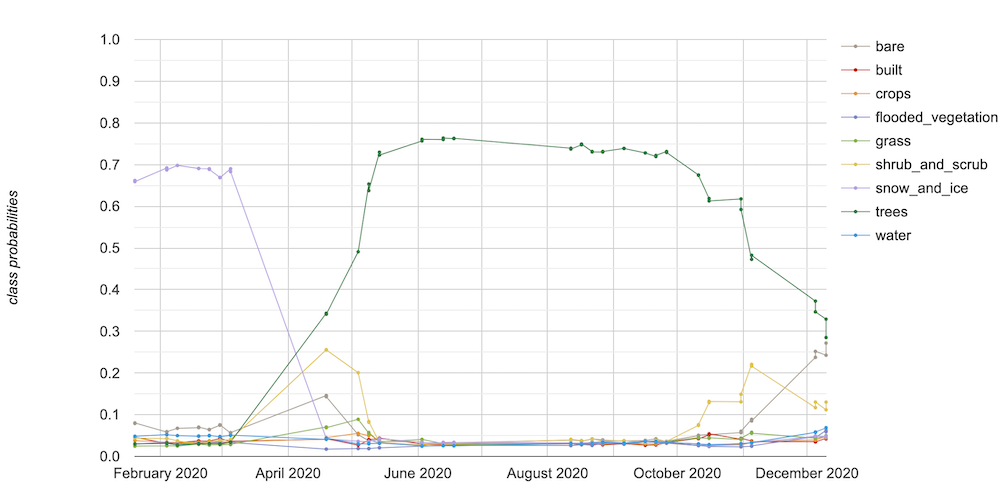
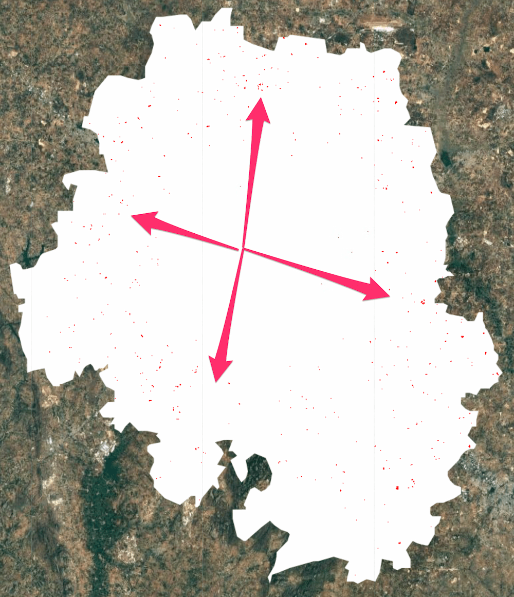
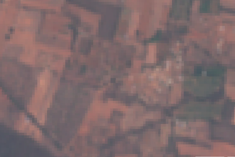
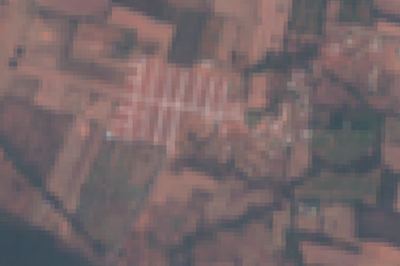
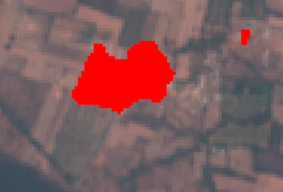

<!--
Copyright 2022 The Google Earth Engine Community Authors

Licensed under the Apache License, Version 2.0 (the "License");
you may not use this file except in compliance with the License.
You may obtain a copy of the License at

    http://www.apache.org/licenses/LICENSE-2.0

Unless required by applicable law or agreed to in writing, software
distributed under the License is distributed on an "AS IS" BASIS,
WITHOUT WARRANTIES OR CONDITIONS OF ANY KIND, either express or implied.
See the License for the specific language governing permissions and
limitations under the License.
-->

_This is part 3 of a 3-part tutorial, see also
[part 1](/earth-engine/tutorials/community/introduction-to-dynamic-world-pt-1) and
[part 2](/earth-engine/tutorials/community/introduction-to-dynamic-world-pt-2)._

A key differentiator of the Dynamic World dataset is the availability of a
regularly updated time-series of land cover predictions. This allows you to
monitor the landscape in near-real time and detect changes in land surface
state. In this section, we will explore how you can work with this rich
time-series data.

Continuing from the
[Part 2](/earth-engine/tutorials/community/introduction-to-dynamic-world-pt-2)
of this tutorial, we will now learn how you can work with this
time-series data.

## Charting Class Probabilities Over Time

Each Dynamic World image has bands with the predicted probabilities for each
class. For any location in the world, we can plot a time series of these
probabilities to understand the temporal patterns.

We start by defining a location with its coordinates. The location in this
example is a point over the University of Wisconsin - Madison Arboretum in
Wisconsin, USA. It is a dense urban forest that undergoes seasonal changes
throughout the year. This is a great location to see how Dynamic World can
help us monitor the changing conditions.

```js
var geometry = ee.Geometry.Point([-89.4235, 43.0469]);
Map.addLayer(geometry, {color: 'red'}, 'Selected Location');
Map.centerObject(geometry, 16);
```


_Google Maps Satellite Image of the Selected Location_

We start by first filtering the Dynamic World collection for the time period
and location of interest. Here we want to chart the changes to this location
over the course of a year. So we apply the filter to select images collected
over this region in the time period of interest. Finally, we select all class
probability bands.

```js
var startDate = '2020-01-01';
var endDate = '2021-01-01';

var dw = ee.ImageCollection('GOOGLE/DYNAMICWORLD/V1')
             .filterDate(startDate, endDate)
             .filterBounds(geometry);

var probabilityBands = [
  'water', 'trees', 'grass', 'flooded_vegetation', 'crops', 'shrub_and_scrub',
  'built', 'bare', 'snow_and_ice'
];

var dwTimeSeries = dw.select(probabilityBands);
```

We are now ready to create a chart showing changes in class probabilities
through the year. Earth Engine provides several charting functions to work
with time-series data. Since we want to plot the time series for a single
location—we can use the `ui.Chart.image.series` function. Once the chart is
created, print it to see it in the console.

```js
var chart = ui.Chart.image.series(
    {imageCollection: dwTimeSeries, region: geometry, scale: 10});
print(chart);
```

The chart is useful but not very informative. We need to make several
adjustments. First, the line colors are assigned at random and do not match
the colors used in the Dynamic World taxonomy. It is also missing the axis
labels. Let's use the `setOptions` function to set some configuration
options. You will find the explanations and a full list of parameters in the
[Google Charts documentation](/chart/interactive/docs/gallery/linechart).

Each band value is plotted as a line in the chart. This is called a series.
We need to set the label, color, and style properties for each of the 9 series
in the chart. We define a helper function to make the code simpler. This
function returns a dictionary for each series based on the label and color
arguments.

```js
var lineStyle = function(label, color) {
  var styleDict =
      {labelInLegend: label, color: color, lineWidth: 2, pointSize: 3};
  return styleDict;
};
```

We now create the chart and call `setOptions` on the time-series chart with
a dictionary of configuration options. Each series is now styled with the
label and color matching the Dynamic World taxonomy.

```js
var chart = ui.Chart.image.series({
  imageCollection: dwTimeSeries,
  region: geometry,
  scale: 10
}).setOptions({
  vAxis: {
    title: 'Class probabilities',
    viewWindow: {min: 0, max: 1}},
  interpolateNulls: true,
  series: {
              0: lineStyle('Bare', '#A59B8F'),
              1: lineStyle('Built', '#C4281B'),
              2: lineStyle('Crops', '#E49635'),
              3: lineStyle('Flooded vegetation', '#7A87C6'),
              4: lineStyle('Grass', '#88B053'),
              5: lineStyle('Shrub and scrub', '#DFC35A'),
              6: lineStyle('Snow and ice', '#B39FE1'),
              7: lineStyle('Trees', '#397D49'),
              8: lineStyle('Water', '#419BDF')}
});
print(chart);
```


_Time Series Chart of Class Probabilities_

The resulting chart is much more informative and interpretable. The chart
immediately reveals the shift from snow in the winter to trees in the spring.
You can also see the model predicting high probabilities for *shrub_and_scrub*
and *bare* classes at the seasonal transition.

### Summary

You learned how to explore the time-series of Dynamic World dataset by plotting
the probability of each class at each time step. You can easily obtain this
chart for any location in the world by simply changing the geometry and the
date range.

The full script for this section can be accessed from this Code Editor link:
[https://code.earthengine.google.com/3bf152cd06507cc984a1748de3f996b3](https://code.earthengine.google.com/3bf152cd06507cc984a1748de3f996b3)

## Change Detection using Probability Bands

As you saw in the previous section, Dynamic World dataset provides a
time-series of per-pixel class probabilities. This allows one to build change
detection models easily without training custom models or collecting training
data. In this example, we will see how to use the probability bands to explore
urban changes over time.

A unique feature of the Dynamic World *Built Area* class is that it incorporates
the built environment as well as adjacent land cover types in the definition.
When a previously non-urban region starts getting urbanized with new roads and
urban structures - the whole region is classified as built. This feature can be
very useful to detect urban sprawl. We will see how the Dynamic World’s
probability based model allows us to explore urban expansion with a few simple
rules.

We start by selecting a region of interest. For this tutorial, we will try to
detect urban expansion around the City of Bengaluru, India. It is a rapidly
growing city that is witnessing unprecedented urbanisation and sprawl in
recent years. We use the
[FAO GAUL: Global Administrative Unit Layers 2015, Second-Level Administrative Units](/earth-engine/datasets/catalog/FAO_GAUL_2015_level2)
dataset and select the boundary of the Bangalore Urban district as the region
of interest.

```js
var admin2 = ee.FeatureCollection('FAO/GAUL_SIMPLIFIED_500m/2015/level2');
var selected = admin2.filter(ee.Filter.eq('ADM2_NAME', 'Bangalore Urban'));
var geometry = selected.geometry();
Map.centerObject(geometry, 12);
```

We want to detect newly urbanized regions from the year 2019 to 2020. We
first create start and end dates for the before and after periods for the
analysis. Using the `ee.Date.fromYMD` function along with `advance`
allows us to make the code easily adaptable to different time ranges without
having to make many changes.

```js
var beforeYear = 2019;
var afterYear = 2020;

var beforeStart = ee.Date.fromYMD(beforeYear, 1, 1);
var beforeEnd = beforeStart.advance(1, 'year');

var afterStart = ee.Date.fromYMD(afterYear, 1, 1);
var afterEnd = afterStart.advance(1, 'year');
```

Now, we select the *built* band that contains the pixel-wise probabilities
indicating the likeliness of it being urban. Since we are considering many
images over the period of the year, we create a mean composite indicating the
average probability across the year.

```js
var dw = ee.ImageCollection('GOOGLE/DYNAMICWORLD/V1')
             .filterBounds(geometry)
             .select('built');

var beforeDw = dw.filterDate(beforeStart, beforeEnd).mean();
var afterDw = dw.filterDate(afterStart, afterEnd).mean();
```

To detect newly urbanized regions, we can apply a simple criteria. Any pixel
in the built class that had an average probability of less than 0.2 before
and greater than 0.5 after would indicate previously non-urban area which is
now urban.

```js
// Select all pixels that are
// < 0.2 'built' probability before
// > 0.5 'built' probability after
var newUrban = beforeDw.lt(0.2).and(afterDw.gt(0.5));

var changeVisParams = {min: 0, max: 1, palette: ['white', 'red']};
Map.addLayer(newUrban.clip(geometry), changeVisParams, 'New Urban');
```


_Red Pixels Indicating Detected Urban Sprawl between 2019 and 2020_

You can see how easy it was to build a custom model for urban sprawl. You can
also build a more complex decision tree using rules involving multiple
probability bands, or apply the same logic across multiple temporal steps.

It is always a good idea to validate our analysis. We can add before and
after composites of Sentinel-2 images to check whether the detected change is
visible in the imagery. Since optical images have clouds and cloud shadows
that are not masked out, it is preferable to use a median composite.

```js
var s2 = ee.ImageCollection('COPERNICUS/S2')
             .filterBounds(geometry)
             .filter(ee.Filter.lt('CLOUDY_PIXEL_PERCENTAGE', 35));

var beforeS2 = s2.filterDate(beforeStart, beforeEnd).median();
var afterS2 = s2.filterDate(afterStart, afterEnd).median();

var s2VisParams = {bands: ['B4', 'B3', 'B2'], min: 0, max: 3000};
Map.addLayer(beforeS2.clip(geometry), s2VisParams, 'Before S2');
Map.addLayer(afterS2.clip(geometry), s2VisParams, 'After S2');
```

For ease of comparison, we can mask the non-change pixels from the binary
`newUrban` image using the `selfMask` function and add it to the map.

```js
Map.addLayer(
    newUrban.selfMask().clip(geometry), changeVisParams, 'New Urban (Masked)');
```

| Before Composite    | After Composite       | Detected New Urban Areas  |
:--------------------:|:---------------------:|:-------------------------:|
|  |        |

_Before and After Sentinel-2 Composites and Detected Change_

### Summary

This section covered techniques to explore the probability time-series to
build a robust change detection model with just a few lines of code. We could
detect newly urbanized regions by comparing the before and after
probabilities of the built class and visualize the results on a map.

The full script for this section can be accessed from this Code Editor link:
[https://code.earthengine.google.com/2dc41ef62608d81ee4cb8d2e72287a1b](https://code.earthengine.google.com/2dc41ef62608d81ee4cb8d2e72287a1b)

---

<div>
  <p><small>
    The data described in this tutorial were produced by Google, in
    partnership with the World Resources Institute and National Geographic
    Society and are provided under a CC-BY-4.0 Attribution license.</small></p>
</div>
