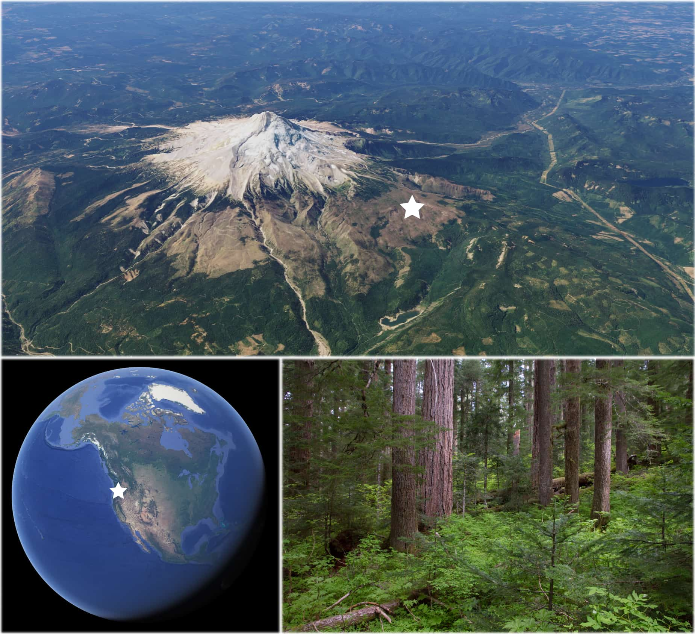

<!--
Copyright 2019 Google LLC

Licensed under the Apache License, Version 2.0 (the "License");
you may not use this file except in compliance with the License.
You may obtain a copy of the License at

    https://www.apache.org/licenses/LICENSE-2.0

Unless required by applicable law or agreed to in writing, software
distributed under the License is distributed on an "AS IS" BASIS,
WITHOUT WARRANTIES OR CONDITIONS OF ANY KIND, either express or implied.
See the License for the specific language governing permissions and
limitations under the License.
-->

[Open In Code Editor](https://code.earthengine.google.com/a780e0817678e2e1e27eec7d84eb2a85)

# Landsat ETM+ to OLI Harmonization

This tutorial concerns harmonizing Landsat ETM+ surface reflectance to Landsat OLI
surface reflectance. It provides:

- A spectral transformation function
- Functions to create analysis-ready data
- A time series visualization example

It is intended to be an end-to-end guide for harmonizing and visualizing a 35+ year
regional time series of Landsat data that can be immediately applied to your own region(s)
of interest.

Note that the characteristics of Landsat ETM+ and Landsat TM data are assumed equal
in this tutorial. As such, with regard to harmonization transformations, reference
to ETM+ is synonymous with TM.

## Table of contents

* [About Landsat](#about-landsat)
* [Why harmonization](#why-harmonization)
* [Instructions](#instructions)
  + [Functions](#functions)
    - [Harmonization](#harmonization)
    - [Cloud and shadow masking](#cloud-and-shadow-masking)
    - [Spectral index calculation](#spectral-index-calculation)
    - [Combine functions](#combine-functions)
  + [Time series example](#time-series-example)
    - [Define an area of interest](#define-an-area-of-interest)
    - [Retrieve Landsat sensor collections](#retrieve-landsat-sensor-collections)
    - [Define an image collection filter](#define-an-image-collection-filter)
    - [Prepare the collections](#prepare-the-collections)
    - [Make a times series chart displaying all observations](#make-a-times-series-chart-displaying-all-observations)
    - [Make a times series chart displaying annual median](#make-a-times-series-chart-displaying-annual-median)
* [Additional information](#additional-information)
  + [Alternative transformation functions](#alternative-transformation-functions)
  + [The Dollar Lake fire](#the-dollar-lake-fire)

## About Landsat

[Landsat](https://landsat.gsfc.nasa.gov/about/) is a satellite imaging program
that has been collecting moderate resolution Earth imagery since 1972.
As the longest space-based Earth observation system, it provides a valuable
temporal record for identifying spatiotemporal trends in landscape change.
Thematic Mapper (TM), Enhanced Thematic Mapper Plus (ETM+), and Operational
Land Imager (OLI) are used in this tutorial. They are closely related and
relatively easy to consolidate into a consistent time series that produce a
continuous record from 1984 to the present, at a cadence of 16 days
per sensor with 30 meter spatial resolution. The seminal Multispectral Scanner
instrument extends the Landsat record back to 1972, but is not used in this tutorial.
Its data are quite different, making integration with later sensors challenging. See
[Savage et al. (2018)](https://www.mdpi.com/1999-4907/9/4/157) and
[Vogeler et al. (2018)](https://www.sciencedirect.com/science/article/abs/pii/S0034425718300579)
for examples of harmonization across all sensors.

## Why harmonization

[Roy et al. (2016)](https://openprairie.sdstate.edu/cgi/viewcontent.cgi?referer=https://scholar.google.com/&httpsredir=1&article=1035&context=gsce_pubs)
demonstrate that there are small, but potentially significant differences between
the spectral characteristics of Landsat ETM+ and OLI, depending on application.
Reasons you might want to harmonize datasets include producing a long time series
that spans Landsat TM, ETM+, and OLI, or you want to produce near-date intra-annual
composites to reduce the effects of missing observations from ETM+ SLC-off gaps
and cloud/shadow masking. Please see the linked manuscript above for more information.

## Instructions

### Functions

The following are a series of functions that are needed to harmonize ETM+ to OLI
and generate analysis-ready data that will be used in the application section of
this tutorial to visualize the spectral-temporal history of a pixel.

#### Harmonization

Harmonization is achieved via linear transformation of ETM+ spectral space to OLI
spectral space according to coefficients presented in
Roy et al. (2016) Table 2 OLS regression. Band-respective coefficients are defined in
the following dictionary with slope (`slopes`) and intercept (`itcps`) image constants.

```js
var coefficients = {
  itcps: ee.Image.constant([0.0003, 0.0088, 0.0061, 0.0412, 0.0254, 0.0172]).multiply(10000),
  slopes: ee.Image.constant([0.8474, 0.8483, 0.9047, 0.8462, 0.8937, 0.9071])
};
```

ETM+ and OLI band names for the same spectral response window are not equal and
need to be standardized. The following function selects only reflectance bands
and the `pixel_qa` band from any given Landsat surface reflectance image and
forces all band names to be consistent with OLI.

```js
function oliBands(img) {
  return ee.Image(ee.Algorithms.If(
    ee.Algorithms.IsEqual(img.get('SATELLITE'), ee.String('LANDSAT_8')),
    img.select(['B2', 'B3', 'B4', 'B5', 'B6', 'B7', 'pixel_qa']),
    img.select(['B1', 'B2', 'B3', 'B4', 'B5', 'B7', 'pixel_qa'], ['B2', 'B3', 'B4', 'B5', 'B6', 'B7', 'pixel_qa'])
  ));
}
```

Finally, define the transformation function, which applies the linear model to ETM+ data,
casts data type as `Int16` for consistency with OLI, and reattaches the `pixel_qa` band for
later use in cloud and shadow masking.

```js
function etm2oli(img) {
  return img.select(['B2', 'B3', 'B4', 'B5', 'B6', 'B7'])
    .multiply(coefficients.slopes)
    .add(coefficients.itcps)
    .round()
    .toShort()
    .addBands(img.select('pixel_qa')
  );
}
```

#### Cloud and shadow masking

Analysis ready data should have clouds and cloud shadows masked out. The following
function uses the CFmask ([Zhu et al., 2015](https://www.sciencedirect.com/science/article/abs/pii/S0034425714005069))
`pixel_qa` band included with each Landsat USGS surface reflectance image to set
pixels identified as cloud and cloud shadow to null.

```js
function fmask(img) {
  var cloudShadowBitMask = 1 << 3;
  var cloudsBitMask = 1 << 5;
  var qa = img.select('pixel_qa');
  var mask = qa.bitwiseAnd(cloudShadowBitMask).eq(0)
    .and(qa.bitwiseAnd(cloudsBitMask).eq(0));
  return img.updateMask(mask);
}
```

#### Spectral index calculation

The forthcoming application example uses the normalized burn ratio (NBR) spectral
index to represent the spectral history of a forested pixel affected by wildfire.
NBR is used because [Cohen et al. (2018)](https://www.fs.fed.us/rm/pubs_journals/2018/rmrs_2018_cohen_w001.pdf)
found that among 13 spectral indices/bands, NBR had the greatest signal to
noise ratio with regard to forest disturbance (signal) throughout the US.
It is calculated by the following function.

```js
function calcNBR(img) {
  return img.normalizedDifference(['B5', 'B7']).rename('NBR');
}
```

In your own application, you may choose to use a different spectral index. Here
is the place to alter or add an additional index.

#### Combine functions

Define a wrapper function that consolidates all above functions for convenience in applying
them to an image collection.

```js
function prepImg(img) {
  var orig = img;
  img = oliBands(img);
  img = fmask(img);
  img = etm2oli(img);
  img = calcNBR(img);
  return ee.Image(img.copyProperties(orig, orig.propertyNames()));
}
```

In your application, you might decide to include or exclude functions. Alter this
function as needed.

### Time series example

The `prepImg` wrapper function above can be mapped over Landsat surface reflectance
collections to create cross-sensor analysis-ready data to visualize
the spectral chronology of a pixel or region of pixels. In this example, you will
create a 35+ year time series and display the spectral history for a single pixel.
This particular pixel relates the recent history of a mature pacific northwest
conifer forest patch (Figure 1) that experienced some perturbation in the 1980's and
90's and a high magnitude burn in 2011.



_Figure 1. Location and site character for example area of interest. Mature pacific
northwest conifer forest on the north slope of Mt Hood, OR, USA. Images courtesy of:
Google Earth, USDA Forest Service, Landsat, and Copernicus._

#### Define an area of interest

The result of this application is a time series of Landsat observations for a pixel.
An `ee.Geometry.Point` object is used to define the pixel's location.

```js
var point = ee.Geometry.Point([-121.70938, 45.43185]);
```

In your application, you might select a different pixel. Do so by replacing the above
longitude and latitude coordinates. Alternatively, you can summarize
the spectral history of a group of pixels using other `ee.Geometry` object definitions,
such as `ee.Geometry.Polygon()` and `ee.Geometry.Rectangle()`.
Please see the [Geometries](https://developers.google.com/earth-engine/geometries)
section of the Developer Guide for more information.

#### Retrieve Landsat sensor collections

Get Landsat USGS surface reflectance collections for
[OLI](https://developers.google.com/earth-engine/datasets/catalog/LANDSAT_LC08_C01_T1_SR),
[ETM+](https://developers.google.com/earth-engine/datasets/catalog/LANDSAT_LE07_C01_T1_SR), and
[TM](https://developers.google.com/earth-engine/datasets/catalog/LANDSAT_LT05_C01_T1_SR).

Visit the links to learn more about each dataset.

```js
var oliCol = ee.ImageCollection('LANDSAT/LC08/C01/T1_SR');
var etmCol= ee.ImageCollection('LANDSAT/LE07/C01/T1_SR');
var tmCol= ee.ImageCollection('LANDSAT/LT05/C01/T1_SR');
```

#### Define an image collection filter

Define a filter that will constrain the image collections by the spatial boundary
of the area of interest, peak photosynthesis season, and quality.

```js
var colFilter = ee.Filter.and(
  ee.Filter.bounds(point),
  ee.Filter.calendarRange(182, 244, 'day_of_year'),
  ee.Filter.lt('CLOUD_COVER', 50),
  ee.Filter.lt('GEOMETRIC_RMSE_MODEL', 10),
  ee.Filter.or(
    ee.Filter.eq('IMAGE_QUALITY', 9),
    ee.Filter.eq('IMAGE_QUALITY_OLI', 9)
  )
);
```

Alter these filtering criteria as you wish. Identify other properties to filter
by under the 'Images Properties' tab of the data description pages linked above.

#### Prepare the collections

Merge the collections, apply the filter, and map the `prepImg` function over all
images. The result of the following snippet is a single `ee.ImageCollection` that
contains images from OLI, ETM+, and TM sensor collections that meet the filter
criteria, and are processed to analysis-ready NBR.

```js
var col = oliCol
  .merge(etmCol)
  .merge(tmCol)
  .filter(colFilter)
  .map(prepImg);
```

#### Make a times series chart displaying all observations

Earth Engine's `ui.Chart.image.series` function can display all of the NBR
observations from the current collection as a time series chart, but it will not
distinguish observations from the various sensors. `ui.Chart.feature.groups`
provides this functionality, but requires rearranging the `ee.ImageCollection`
into an `ee.FeatureCollection`. To make the conversion, each image needs to be
reduced by the area of interest, and the resulting dictionary cast as a `ee.Feature`,
so that the `reduceRegion` function can be mapped over the image collection
and result in a feature collection.

```js
var allObs = col.map(function(img) {
  return ee.Feature(null, img.reduceRegion({
    geometry: point,
    reducer: ee.Reducer.first(),
    scale: 30
  })).copyProperties(img, img.propertyNames());
});
```

The result is an `ee.FeatureCollection` where each feature contains a set of
properties for an image in the filtered image collection. The format of the collection
can now be accepted by the `ui.Chart.feature.groups` function. The function expects
an `ee.FeatureCollection` and the names of feature properties to map to the chart.
Here, the 'system:time_start' copied from the image metadata serves as the x-axis
variable and 'NBR' as the y-axis variable. Note that the NBR property was named by
the `reduceRegion` function above based on the band name in the image being reduced.
If you use a different band (not 'NBR'), change the y-axis property name argument accordingly.
Finally, set the grouping (series) variable to 'SATELLITE' to which distinct colors
are assigned.

```js
var chartAllObs = ui.Chart.feature.groups(
  allObs, 'system:time_start', 'NBR', 'SATELLITE'
)
.setChartType('ScatterChart')
.setSeriesNames(['TM', 'ETM+', 'OLI'])
.setOptions({
  title: 'All Observations',
  colors: ['f8766d', '00ba38', '619cff'],
  hAxis: {title: 'Date'},
  vAxis: {title: 'NBR'},
  pointSize: 6,
  dataOpacity: 0.5
});
print(chartAllObs);
```

A chart similar to Figure 2 will appear in the console after some processing
time. Note several things:

- There are multiple observations per year.
- The time series is composed of three different sensors.
- There are no disernableable sensor-biases.
- Observation frequency varies annually.
- There is some intra-annual variance, which is consistent across years and
relatively tight. Trying this with NDVI (img.normalizedDifference(['B5', 'B4']).rename('NDVI');)
shows much greater intra- and inter-annual response variability.
- NBR remains high for the majority of the time series with some minor perturbations.
- A great, rapid reduction in NBR response results from a forest fire evident in 2012. Note 
however, that the fire ([Dollar Lake](#the-dollar-lake-fire)) occurred in September of 2011.
The error in detection year is due to the annual composite date range being July through
August; changes occuring after this period are not picked until the next available non-null
composite year.
- Vegetation recovery (increasing NBR response) begins two years after the major NBR
loss.


_Figure 2. Spectral response time series chart for a single pixel
with representation from Landsat TM, ETM+, and OLI. TM and ETM+ images
are harmonized to OLI by linear transformation. Images are from July
through August and are filtered for high quality._

#### Make a times series chart displaying annual median

To simplify and remove noise from the time series, intra-annual observation reduction
can be applied. Here, median is used.

The last chart converted the image collection to a feature collection. This section
uses the image collection directy.

The first step is to group images by year. Add a new 'year' property to each image by
mapping over the collection setting 'year' from each image's `ee.Image.Date`.

```js
col = col.map(function(img) {
  return img.set('year', img.date().get('year'));
});
```

The new 'year' property can be used to group images from the same year by a join.
The join between a distinct image year collection and the complete
collection provides same-year lists, from which median reductions can be performed.
Subset the complete collection to a set of distinct year representatives.

```js
var distinctYearCol = col.distinct('year');
```

Define a filter and a join that will identify matching years between the distinct
year collection (`distinctYearCol`) and the complete collection (`col`). Matches
will be saved to a property called 'year_matches'.

```js
var filter = ee.Filter.equals({leftField: 'year', rightField: 'year'});
var join = ee.Join.saveAll('year_matches');
```

Apply the join and convert the resulting FeatureCollection to an ImageCollection.

```js
var joinCol = ee.ImageCollection(join.apply(distinctYearCol, col, filter));

// Apply median reduction among matching year collections.
var medianComp = joinCol.map(function(img) {
  var yearCol = ee.ImageCollection.fromImages(
    img.get('year_matches')
  );
  return yearCol.reduce(ee.Reducer.median())
    .set('system:time_start', img.date().update({month:8, day:1}));
});
```

Finally, create a chart that displays the median NBR values from sets of
inta-annual summer observations.

```js
var chartMedianComp = ui.Chart.image.series({
  imageCollection: medianComp,
  region: point,
  reducer: ee.Reducer.first(),
  scale: 30,
  xProperty: 'system:time_start',
})
.setSeriesNames(['NBR Median'])
.setOptions({
  title: 'Intra-annual Median',
  colors: ['619cff'],
  hAxis: {title: 'Date'},
  vAxis: {title: 'NBR'},
  lineWidth: 6
});
print(chartMedianComp);
```

A chart similar to Figure 3 will appear in the console after some processing
time.


_Figure 3. Median summer spectral response time series chart for a
single pixel with representation from Landsat TM, ETM+, and OLI. TM and ETM+
images are harmonized to OLI by a linear transformation. Images are from
July through August and are filtered for high quality._

## Additional information

### Alternative transformation functions

Roy et al. (2016) Table 2 provides OLS and RMA regression coefficients
to transform ETM+ surface reflectance to OLI surface reflectance and vice
versa. The above tutorial demonstrates only ETM+ to OLI transformation by OLS
regression. Functions for all translation options can be found in the
[Code Editor script](https://code.earthengine.google.com/a780e0817678e2e1e27eec7d84eb2a85)
or the [GitHub source script](script.js).

### The Dollar Lake fire

The fire mentioned in this tutorial is the Dollar Lake fire, which occurred
mid-September, 2011 on the northern slopes of Mt Hood, OR, USA. Visit this
[blog post](https://wyeastblog.org/2016/10/22/dollar-lake-fire-five-years-after/)
and see this [manuscript](http://dearing.biology.utah.edu/Lab/pdf/2015_varner_too_hot_trot.pdf)
for more information about it.
