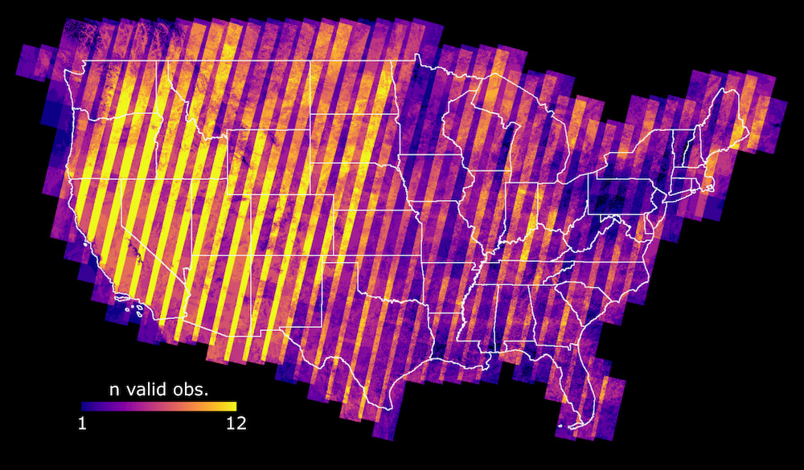
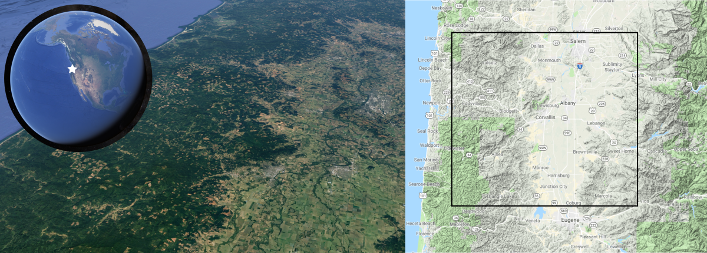
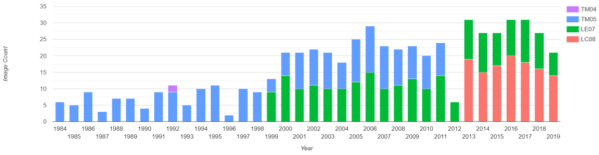
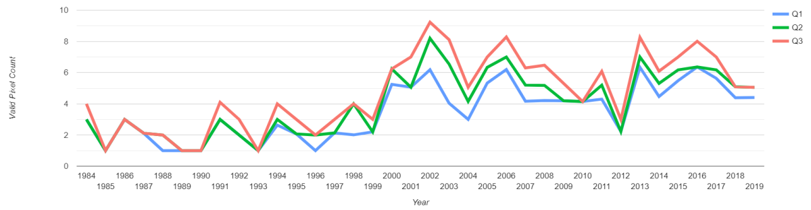
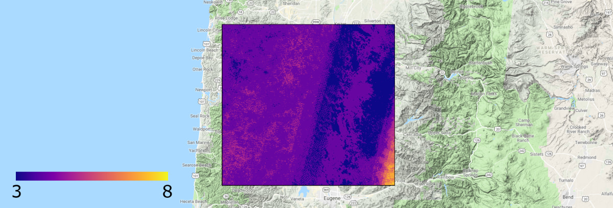
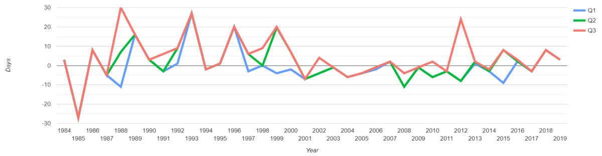
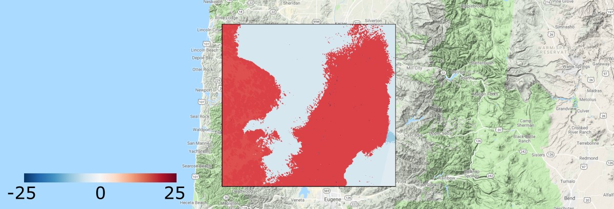
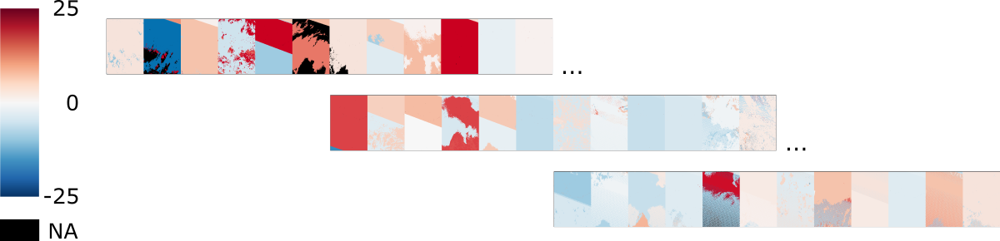
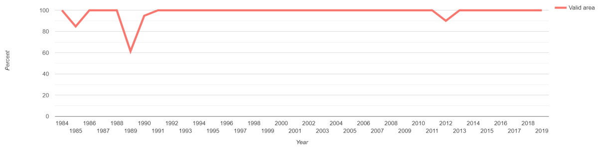

<!--
Copyright 2019 The Google Earth Engine Community Authors

Licensed under the Apache License, Version 2.0 (the "License");
you may not use this file except in compliance with the License.
You may obtain a copy of the License at

    https://www.apache.org/licenses/LICENSE-2.0

Unless required by applicable law or agreed to in writing, software
distributed under the License is distributed on an "AS IS" BASIS,
WITHOUT WARRANTIES OR CONDITIONS OF ANY KIND, either express or implied.
See the License for the specific language governing permissions and
limitations under the License.
-->

This tutorial provides methods for assessing the spatial and temporal
distribution of Landsat images and non-masked (valid) pixels intersecting an
area of interest (AOI).

Collection characteristics described include:

- Number of images per sensor per year
- Number of valid observations per pixel per year
- Difference between image dates and a target day-of-year per year
- Percent of AOI with valid cloud-free coverage per year

This is intended to be an end-to-end guide that can be immediately applied to
your own region(s) of interest to better understand the observation
characteristics of the data you are using.

<br>
_Count of non-cloud/shadow (valid) pixels from Landsat OLI images interesting
CONUS, June through September, 2018._


## Context

Why should you care about observation characteristics?

Variance in observation timing, frequency, and density can bias analysis
and interpretation of a time series.

Imagine you are building an annual time series of Landsat composites for
predicting above-ground biomass. The region of interest has a short peak
leaf-on window and the region is often cloudy. In this scenario, it is
conceivable that temporal variation could be highly dependent on the dates of
cloud-free observations and the number of non-masked (valid) pixels in the
resulting composite. For instance, suppose that of the images available for
2018, the only valid pixels are from the earliest day in the accepted date
window and they make up only 75 percent of the AOI. This 2018 composite is
likely to underestimate biomass since leaves are still developing and a regional
sum reduction exacerbates underestimation. Contrast this with 2017 where the
composite is made up of pixels from the peak of the growing season and the
entire AOI is represented by valid pixels. If you didn't know something about
the underlying data characteristics you might wrongly conclude that there was a
major reduction in total regional biomass from 2017 to 2018.

A thorough understanding of image dates and valid pixel distribution allows
time series interpretations to be qualified and placed in context with
spatiotemporal observation variability.

Note that this tutorial uses Landsat data, but the analysis and considerations
apply to other sensors, particularly those with an infrequent revisit cadence.
Also note that years in this tutorial are defined as calendar years (January 1st
- December 31st) and dates within a year are referenced by sequential
day-of-year (DOY). For study regions in the southern hemisphere, date windows of
interest often cross the new year, which makes using calendar DOY difficult. If
you wish to define a year in such a way that the new year is crossed, you'll
need to adjust the code snippets to account for a start DOY that is not January
1st.

## Instructions

### Define an area of interest

An area of interest is required to filter images by intersection and spatially
bound the analysis of regional valid pixel observation distribution. The
following snippet defines an area centered near Corvallis, OR, USA (Figure 1)
using an `ee.Geometry.Polygon` object and displays it to the map.

```js
var aoi = ee.Geometry.Polygon(
  [[
    [-123.9, 45.0],
    [-123.9, 44.1],
    [-122.6, 44.1],
    [-122.6, 45.0]
  ]], null, false
);

Map.setOptions('TERRAIN');
Map.centerObject(aoi, 9);
Map.addLayer(aoi, {color: 'FFFFFF'}, 'AOI boundary');
```

<br>
_Figure 1. Area of interest; region surrounding Corvallis, OR, USA._

In your own application, the AOI can be defined a number of ways:

- Importing and filtering a table asset
- Using the UI geometry drawing tools
- Specifying an `ee.Geometry` object

Please see the
[Geometries](https://developers.google.com/earth-engine/geometries) section of
the Developer Guide for more information.

### Prepare Landsat image collection

[Landsat](https://landsat.gsfc.nasa.gov/about/) Thematic Mapper (TM),
Enhanced Thematic Mapper Plus (ETM+), and Operational Land Imager (OLI)
surface reflectance imagery are used in this tutorial. These datasets provide a
35+ year record of consistent Earth reflectance valuable for
monitoring landscape change.

#### Retrieve Landsat sensor collections

Get Landsat USGS surface reflectance collections for:
[OLI](https://developers.google.com/earth-engine/datasets/catalog/LANDSAT_LC08_C01_T1_SR),
[ETM+](https://developers.google.com/earth-engine/datasets/catalog/LANDSAT_LE07_C01_T1_SR), and
[TM](https://developers.google.com/earth-engine/datasets/catalog/LANDSAT_LT05_C01_T1_SR).

Note that the TM sensor was carried on both Landsat 4 and 5 satellites.

```js
var LC08col = ee.ImageCollection('LANDSAT/LC08/C01/T1_SR');
var LE07col = ee.ImageCollection('LANDSAT/LE07/C01/T1_SR');
var LT05col = ee.ImageCollection('LANDSAT/LT05/C01/T1_SR');
var LT04col = ee.ImageCollection('LANDSAT/LT04/C01/T1_SR');
```

#### Define an image collection filter

Define a filter that will constrain the image collections by the spatial
boundary of the area of interest, peak photosynthesis season, and quality.

```js
function colFilter(col) {
  return col
    .filter(ee.Filter.bounds(aoi))
    .filter(ee.Filter.calendarRange(182, 244, 'day_of_year'))
    .filter(ee.Filter.lt('CLOUD_COVER', 50))
    .filter(ee.Filter.lt('GEOMETRIC_RMSE_MODEL', 10))
    .filter(ee.Filter.or(
      ee.Filter.eq('IMAGE_QUALITY', 9),
      ee.Filter.eq('IMAGE_QUALITY_OLI', 9)));
}
```

In your own application, you may choose different filtering criteria. See the
"Image Properties" tab of the above sensor links to identify other properties to
filter by or see the
[Column Information](https://developers.google.com/earth-engine/feature_collection_info#column_information)
section of the Developer Guide.

#### Define a function to get cloud mask image

A function is needed to identify image pixels that are cloud/shadow (invalid)
and not (valid). The rest of the analysis will be based on this distinction.
The following snippet defines a function that uses the
CFmask ([Zhu et al., 2015](https://www.sciencedirect.com/science/article/abs/pii/S0034425714005069))
`pixel_qa` band included with each Landsat surface reflectance image to set
pixels identified as cloud and cloud shadow to null ("masked out"). The
resulting masked image is the only thing returned; valid pixels are
coded with the value 1 to indicate non-cloud/shadow condition.

```js
function getCloudMask(img) {
  var cloudShadowBitMask = 1 << 3;
  var cloudsBitMask = 1 << 5;
  var qa = img.select('pixel_qa');
  return qa.bitwiseAnd(cloudShadowBitMask).eq(0)
    .and(qa.bitwiseAnd(cloudsBitMask).eq(0))
    .selfMask()
    .copyProperties(img, img.propertyNames());
}
```

#### Prepare the collections

Merge the Landsat image collections, apply the filter, and map the
`getCloudMask` function over all images. The result of the following snippet is
a single `ee.ImageCollection` that contains images from OLI, ETM+, and TM
sensors that meet the filter criteria, and include a single band where all
cloud/shadow pixels are masked out and all non-cloud/shadow pixels are coded
with a value of 1.

```js
var col = colFilter(LC08col)
  .merge(colFilter(LE07col))
  .merge(colFilter(LT05col))
  .merge(colFilter(LT04col))
  .map(getCloudMask);
```

### Plot annual image count by satellite

This step will create a stacked bar chart that relates the number of Landsat
images per sensor that intersect the AOI per year. The chart provides a rough
sense for image coverage and per-pixel observation frequency per year, given
the filtering criteria applied to the image collection.

The following snippets perform a join to group images by satellite and year. The
result is a list of all the images belonging to each group (year). The size of
each group and the group membership criteria are set as image properties that
are used later in the charting function.

1\. Add several properties related to the sensor and date-of-observation to each
image in the collection by mapping an anonymous function over the combined image
collection. The properties added to each image will be used for grouping sets of
images and for plotting.

```js
col = col.map(function(img) {
  var date = img.date();
  var year = ee.String(date.get('year'));
  var doy = ee.String(date.getRelative('day', 'year'));
  var sat = img.getString('SATELLITE');
  return img.set({year_satellite: year.cat(sat), doy: doy, year: year});
});
```

2\. Subset the collection to a set of distinct representatives for all
combinations of observation year and satellite ("year_satellite" property set
in the previous step). The result will be the primary collection in the
following join operation.

```js
var distinctYrSatCol = col.distinct('year_satellite');
```

3\. Define a filter that identifies images from the complete
collection (`col`) that match the "year_satellite" property from the distinct
year-satellite (`distinctYrSatCol`) collection defined in the previous step.

```js
var yrSatFilter = ee.Filter.equals(
  {leftField: 'year_satellite', rightField: 'year_satellite'});
```

4\. Define and apply a join between the distinct "year_satellite" collection
(`distinctYrSatCol`) and the complete collection (`col`). The resulting
`yrSatJoinCol` variable is a copy of the `distinctYrSatCol` collection with an
added property ("year_sat_matches") that includes the list of all images that
belong to the same "year_satellite" group.

```js
// Define a join.
var yrSatJoin = ee.Join.saveAll('year_sat_matches');

// Apply the join.
var yrSatJoinCol = yrSatJoin.apply(distinctYrSatCol, col, yrSatFilter);
```

5\. Set a property for each distinct "year_satellite" image representative
that relates the number of images per year per satellite. The count is
obtained from the image constituent list (property: "year_sat_matches"
for a given "year_satellite" encountered in mapping over the
`yrSatJoinCol` collection. The result will define bar heights in the following
bar chart.

```js
yrSatJoinCol = yrSatJoinCol.map(function(img) {
  return img.set('img_count', ee.List(img.get('year_sat_matches')).size());
});
```

6\. Make a stacked bar chart with the `ui.Chart.feature.groups()` function.
It is used here because it provides a `group` parameter that will apply a new
color to each distinct element of the assigned property. In this case the
grouping property is defined as "SATELLITE". Discerning satellite is helpful for
assessing which instrument is providing the majority of the data for a given
year.

```js
var chartImgCount = ui.Chart.feature.groups({
  features: yrSatJoinCol,
  xProperty: 'year',
  yProperty: 'img_count',
  seriesProperty: 'SATELLITE'})
  .setSeriesNames({
    LANDSAT_8: 'LC08',
    LANDSAT_7: 'LE07',
    LANDSAT_5: 'TM05',
    LANDSAT_4: 'TM04'})
  .setChartType('ColumnChart')
  .setOptions({
    title: 'Annual image count by satellite',
    colors: ['f8766d', '00ba38', '619cff', 'c77cff'],
    hAxis: {title: 'Year'},
    vAxis: {title: 'Image Count'},
    isStacked: true});
print(chartImgCount);
```

The result should look something like Figure 2. Notice the variance in number
of images per year and also the sensors contributing to the annual image count,
given the collection filtering conditions. The 1980's and 90's have
relatively low annual frequency when Landsat TM was the only operating
sensor. Frequency more than doubles when ETM+ is launched. 2012 experienced a
reduction in images when TM was decommissioned and OLI had not yet launched.
Also note that TM and ETM+ contribution is roughly equal, OLI contributes more
to annual collections than ETM+. Additionally, some years, like 1996 have
unusually low observation frequency. From this chart we can assume that
more information is available from 1999 to the present than prior. So, while a
35+ year time series can be constructed, the first 3rd will likely contain
more noise (shoulder season observations, lower frequency of valid pixels, etc).

<br>
_Figure 2. Annual image count by satellite._

### Plot number of valid observations per pixel

The previous plot described the number of images intersecting the AOI per
year by sensor. Yet, the frequency of pixels in those images that are valid
(unaffected by clouds, cloud shadows, and Landsat ETM+ SLC-off gaps)
is not known. It could be that there are 10 images in a year, but all pixels
are invalid. The following steps create a plot to investigate the frequency
of valid observations per year.

1\. Group images from the same year into lists using a join, similar to the
join operation in the previous section.

```js
// Subset collection to a set of distinct year representatives.
var distinctYrCol = col.distinct('year');

// Define a filter that identifies images from the complete
// collection that match the 'year' from the distinct year collection.
var yrFilter = ee.Filter.equals({leftField: 'year', rightField: 'year'});

// Define a join.
var yrJoin = ee.Join.saveAll('year_matches');

// Apply the join.
var yrJoinCol = yrJoin.apply(distinctYrCol, col, yrFilter);
```

2\. Define a function to add a distinct satellite overflight orbit property to
each image for use in removing duplicate pixels within the same overflight
orbit. Landsat images are arranged in a grid system (WRS-2) described by path
and row, where the path is defined by the satellite orbit and the rows are a
regular division of paths. By design, rows are slightly overlapping. The region
of overlap between adjacent rows for the same overflight orbit represent the
same data, so when counting valid pixels it is important to remove these
duplicated observations.

```js
function setDistinctOrbit(img) {
  var path = ee.String(img.get('WRS_PATH'));
  var ymd = img.date().format('YYYYMMdd');
  var distOrbit = path.cat(ee.String('_').cat(ymd));
  return ee.Image(img.set({'distinct_orbit': distOrbit}));
}
```

3\. Define a function that will mosaic all images within the same
orbit to remove duplicate observations from row overlap. The following function:

1. applies the previously defined `setDistinctOrbit` function to all images to
add an orbit property to each.
2. creates a distinct orbit image collection composed of a single orbit
representative for each orbit in the full collection, to which the full set of
images for the orbit will be joined.
3. performs a join between the distinct orbit image collection and the full
image collection to group images from the same orbit into lists, which are added
as a property of the orbit representatives in the distinct orbit collection.
4. combines all images from the same orbit into a single image using the
`mosaic()` method.

```js
// Define function to mosaic images from the same orbit using a join.
function mosaicOrbit(col) {
  // Set the orbit as a property of each image using the above defined
  // `setDistinctOrbit` function.
  col = col.map(setDistinctOrbit);
  // Define a distinct orbit collection composed of a single representative from
  // each orbit in the full collection.
  var distinctOrbitCol = ee.ImageCollection(col.distinct(['distinct_orbit']));
  // Define a join filter that will group images by orbit.
  var orbitFilter = ee.Filter.equals(
    {leftField: 'distinct_orbit', rightField: 'distinct_orbit'});
  // Define the join.
  var pathJoin = ee.Join.saveAll('same_orbit');
  // Apply the join. Results in a list of same-orbit images being added as a
  // property of each distinct orbit representative in the `distinctOrbitCol`
  // collection. A FeatureCollection is returned, so cast as ImageCollection.
  distinctOrbitCol = ee.ImageCollection(
    pathJoin.apply(distinctOrbitCol, col, orbitFilter));
  // Mosaic all images from the same orbit. Results in an image collection
  // with a single image mosaic for each distinct orbit that was represented in
  // the full collection.
  return distinctOrbitCol.map(function(img) {
    return ee.ImageCollection.fromImages(img.get('same_orbit'))
      .mosaic()
      .set({'distinct_orbit': img.get('distinct_orbit')});
  });
}
```

4\. Make a collection of annual images that are the per-pixel count of all valid
(non-cloud/shadow) pixels for images in the collection defined by AOI, date, and
other filter criteria. Map over the `yrJoinCol` image collection to apply the
`mosaicOrbit` function to the set of images in each year
(creates a collection of orbit mosaics for a given year) and reduce the
resulting orbit mosaics, for a given year, by the per-pixel sum. Recall that the
only values in the images are 1 (valid, non-cloud/shadow), so the sum reduction
of the orbit mosaics, for a given year, represents the number of valid
observations per pixel per year.

```js
// Make an annual collection of valid pixel count.
var nValidObsCol = ee.ImageCollection(yrJoinCol.map(function(img) {
  // Make annual collections from the 'year_matches' join lists stored as
  // properties of the unique year representatives in the `yrJoinCol`
  // collection.
  var yrCol = ee.ImageCollection.fromImages(img.get('year_matches'));
  // Apply the `mosaicOrbit` function defined above to mosaic all images from
  // the same orbit. This removes duplicate observations in image row overlap.
  yrCol = mosaicOrbit(yrCol);
  // Reduce the set of orbit mosaics in the same year by sum. The result is
  // a single image that is the per-pixel count of valid observations for a
  // given year. 
  return yrCol.reduce(ee.Reducer.sum()).rename(['nValid'])
    .copyProperties(img, ['year']);
}));
```

At this point you have a collection of images representing per-pixel count of
valid observations per year. These data can be summarized a variety of ways to
reveal spatiotemporal frequency of valid observations. The following snippet
provides an example of calculating annual regional valid pixel count quartiles
that can be plotted to visualize spatial distribution of valid pixel frequency
over time. 

In this step, a region reduction function is mapped over each valid observation
image in the annual collection to calculate the first, second, and third
quartiles. The result is a `FeatureCollection` that is essentially a table,
where each row represents a year and columns include a year label along with the
first, second, and third quartiles of valid pixel count for the given year.

Note that in this example the scale used to calculate regional percentile
is 120 meters, even though the native resolution is 30 meters. It is set
as such to allow the computation to complete on-the-fly and display in the Code
Editor console. If the area is larger and/or the scale finer, an export task
will be required to complete the job. If that is the case, export the resulting
`FeatureCollection` as an asset, wait for it to complete, and in a separate
script, import the feature collection and plot it. For more information on
exporting tables (`FeatureCollections`) as assets see
[here](https://developers.google.com/earth-engine/exporting#to-asset_1).

```js
// Get regional distribution of per-pixel n valid observations as quartiles.
var nValidObsQuartiles = nValidObsCol.map(function(img) {
 // Cast the dictionary result of the image region reduction as an ee.Feature.
 return ee.Feature(aoi, img.reduceRegion({
   // Use the percentile reducer to calculate the 1st, 2nd, 3rd quartiles.
   reducer: ee.Reducer.percentile([25, 50, 75], ['Q1', 'Q2', 'Q3']),
   geometry: aoi,
   // Note that in this example 120 resolution is used to allow calculation
   // to complete in-session.
   scale: 120,
   crs: 'EPSG:5070',
  }))
  // Add the observation year to the feature as a property.
  .copyProperties(img, ['year']);
});
```

5\. Display annual observation frequency time series plot

Use the `ui.Chart.feature.byFeature()` function to plot a time series of the
first, second, and third quartiles of annual per-pixel valid observation count.

```js
var chartValidObsCount =
    ui.Chart.feature.byFeature({
      features: nValidObsQuartiles.sort('year'),
      xProperty: 'year',
      yProperties: ['nValid_Q1', 'nValid_Q2', 'nValid_Q3']})
      .setSeriesNames({nValid_Q1: 'Q1', nValid_Q2: 'Q2', nValid_Q3: 'Q3'})
      .setOptions({
        title:
          'Distribution of per-pixel intra-annual valid observation count',
        colors: ['619cff', '00ba38', 'f8766d'],
        hAxis: {title: 'Year'},
        vAxis: {title: 'Valid Pixel Count'}
      });
print(chartValidObsCount);
```

The result should look similar to Figure 3. Notice that the median valid pixel
count per year closely resembles the temporal pattern for the number of images
per year in Figure 2. In other words, when there are more sensors, there are
more images, which for this region, translates into more valid pixels per year.
Additionally, the median number valid observations per pixel for the given
collection when Landsat 5 is the only operating sensor is about two, and about
five when multiple sensors are operating. Valid observation count  varies by
pixel but not much, and that variability remains fairly constant
within each of the periods defined by single and multi-sensor imaging.

<br>
_Figure 3. Distribution of per-pixel intra-annual valid observation count._

6\. The previous chart showed the regional distribution of valid pixel count
through time. You can also evaluate the spatial pattern by calculating the
median number of valid observations through time per pixel to get a sense for
where valid pixel count is high or low. To do this, simply reduce
the `nValidObsCol` collection by median and display the result to the Map.

```js
var nValidObsMap = nValidObsCol.reduce(ee.Reducer.median()).toShort().clip(aoi);
var visParams = {
  palette:
    ['0D0887', '5B02A3', '9A179B', 'CB4678', 'EB7852', 'FBB32F', 'F0F921'],
  min: 3,
  max: 8
};
Map.addLayer(nValidObsMap, visParams, 'Median valid observation count');
```
The result should look similar to Figure 4. Note that the color palette grades
from dark blue to yellow and is stretched between median annual valid
observation frequency of 3 and 8. Notice the difference in valid observation
frequency over the region. The southeast
corner has a greater frequency compared to much of the region. The pixels on the
the western slope of the Cascades has particularly low frequency, likely due to
high cloud cover. It is evident that path overlap plays a role in
observation frequency as well; regions where there is path overlap generally
have greater valid observation frequency than those with no path overlap.

<br>
_Figure 4. Distribution of per-pixel intra-annual valid observation count._

### Plot observation day distribution

Assessment of image acquisition day distribution is
important for identifying biases that may influence a pixel's time series. As
noted in the hypothetical example in the [Context](#context) section, it is
quite possible that a year-to-year difference observed in an NDVI time series
is due to difference in observation timing. Imagine an annual NDVI profile that
has distinct low and high plateaus connected by periods of transition. If for a
given year, no imagery is available during the height of NDVI, a less desirable
observation from a transition period may be the only option. In this case, the
difference in NDVI from this year to the next could largely be driven by
observation timing. This situation can result in apparent abrupt change or a
drifting trend in NDVI. The following steps create an image collection with a
day-of-year (DOY) and difference from a target DOY bands. These bands can be
mapped and summarized into table format for chart visualization. Note that the
results of this section will be used in the following section

1\. Define a target DOY. In other words, what day of the year best represents
the season or phenomena you are interested in. This information will be used to
derive the difference from target DOY band.

```js
var doyTarget = ee.Number(213);
```

2\. Add date bands to each image in the collection, including: image acquisition
DOY, difference from target DOY, and difference from target DOY transformed to a
"quality" band. The quality band will be used to make annual
composites with the `qualityMosaic()` collection reducer in the following
step. The quality band is the absolute difference of image acquisition DOY and
target DOY subtracted by a large number to reverse the value order
(i.e., smallest difference is highest quality).

```js
col = col.map(function(img) {
  var doy = ee.Number(img.date().getRelative('day', 'year'));
  var doyDif = doy.subtract(doyTarget);
  var doyDifQlty = ee.Number(1000).subtract(doyDif.abs());
  return img.addBands(ee.Image.constant([doy, doyDif, doyDifQlty])
    .updateMask(img.select(0).mask())
    .int16()
    .rename(['DOY', 'DOY_dif', 'DOY_dif_qlty']));
});
```

3\. Make annual composite images based on nearness to target DOY among all
constituents in a given year. With these composites you can either summarize the
regional annual distribution in a time series chart or reduce the per-pixel
result by a statistic and display it to the Map. The join and composite
operation below is similar to that used in previous steps.

```js
// Apply the join the `yrJoin` that was created earlier between the
// `distinctYrCol` created earlier and the modified `col` image collection.
var yrJoinCol = yrJoin.apply(distinctYrCol, col, yrFilter);

// Make annual collections from the 'year_matches' join lists (yrCol) and
// reduce annual collections by sum - n valid pixels (yrSum).
var doyTargetCol = ee.ImageCollection(yrJoinCol.map(function(img) {
  var yearCol = ee.ImageCollection.fromImages(img.get('year_matches'));
  return yearCol.select(['DOY', 'DOY_dif', 'DOY_dif_qlty'])
    .qualityMosaic('DOY_dif_qlty')
    .copyProperties(img, ['year']);
}));
```

4\. Calculate the regional distribution of difference from target DOY as
quartiles annually. These data will be used to generate a time series chart. Map
a region reduction function over the collection of composites just created. The
result is a feature collection where each feature contains the regional quartile
summaries.

```js
var doyDifQuartiles = doyTargetCol.map(function(img) {
  return ee.Feature(null, img.select('DOY_dif').reduceRegion({
	reducer: ee.Reducer.percentile([25, 50, 75], ['Q1', 'Q2', 'Q3']),
	geometry: aoi,
	scale: 90,
	crs: 'EPSG:5070',
	bestEffort: true,
	tileScale: 4
  }))
  .copyProperties(img, ['year']);
})
// Sort by year so year as x-axis chart label is in ascending order.
.sort('year');
```


5\. Plot the results as a line chart. The data exist as a feature collection, so
you can use the `ui.Chart.feature.byFeature` function and specify the 1st 2nd
and 3rd quartile summaries as y-axis series components, which will distinguish
each by a separate color and legend entry.

```js
var chartDoyDifQuartiles = ui.Chart.feature.byFeature(
  doyDifQuartiles, 'year', ['DOY_dif_Q1', 'DOY_dif_Q2', 'DOY_dif_Q3'])
  .setSeriesNames({DOY_dif_Q1: 'Q1', DOY_dif_Q2: 'Q2', DOY_dif_Q3: 'Q3'})
  .setOptions({
    title: 'Distribution of per-pixel target day-of-year offset minimum',
    colors: ['619cff', '00ba38', 'f8766d'],
    hAxis: {title: 'Year'},
    vAxis: {title: 'Days'}
  });
print(chartDoyDifQuartiles);
```

The result should look similar to Figure 5. Note that the valid pixels from the
1980's and 90's have acquisition dates that are generally further from the
target DOY and are biased toward being later. Contrast that with the 2000's and
10's, where the acquisition dates for valid pixels are closer to the target DOY,
with an exception in 2012, where about a quarter of the data are from images
acquired 25 days later than the target DOY (during the date window specified for
this tutorial, Landsat 7 was the only operational imager). The impact is that
image composites you might generate for the 1980's and 90's may be influenced by
later-than-ideal images, possibly introducing trends in time series driven
simply by acquisition date (this should at least be considered as a possibility).

<br>
_Figure 5. Distribution of per-pixel intra-annual image acquisition offset from
target day-of-year._

### Map observation day distribution

The above chart relates the distribution of valid pixel acquisition date offset
from a target DOY. In this section, the spatial pattern of image acquisition
offset is explored by displaying a given year to the Map. The time series chart
above gives a sense for which years may have less desirable observations,
displaying the results to a map, can reveal regions that are persistently
troublesome for a given year or by an inter-annual statistic (e.g., mean offset
from target DOY among all years). The following example displays a single year.

1\. Filter the  `doyTargetCol` image collection created previously to include
only the image representing 1999 and display the difference from target DOY band
to the map.

```js
var yearImg = doyTargetCol.filter(ee.Filter.eq('year', '1999')).first();
var visParams = {
  bands: ['DOY_dif'],
  palette: ['0571b0', '92c5de', 'f7f7f7', 'f4a582', 'ca0020'],
  min: -25,
  max: 25
};
Map.addLayer(yearImg.clip(aoi), visParams, 'Target DOY offset (1999)');
```

The Map display should look like Figure 6. First, notice that when compositing
all of the images in 1999 (within the selected date window) by minimum
difference to target DOY, a mosaic of pixels from different images results,
i.e., no single image represents the entire area of interest. Second, notice the
range in difference from target DOY: about half of the region is composed of
image pixels that are approximately 15 days later than the target DOY, while the
other half are about about 5 days earlier. This 20-day difference has the
potential to create regional disparities in reflectance (image a wildfire
occurring during the 20 day difference that straddles the spatial boundary of
the two regions - the pixels from the early images would show no fire effects,
while the later image would).

<br>
_Figure 6. Map display of minimum target day-of-year offset for all valid pixels
in a selected date window in 1999. Scale represents days._

2\. Make a filmstrip image of minimum offset from target DOY that includes all
images in the `doyTargetCol` collection. The `getFilmstripThumbURL()` function
returns a PNG image of all images in a collection concatenated north to south.
This output is an easy way to quickly assess regional patterns of minimum offset
from target DOY throughout the time series.

```js
// Make a filmstrip of all difference-from-target-DOY images in the collection.
// Map the visualize function over each image to set RGB properties. Mosaic with
// a black filler image so that masked pixels display as black.
var doyTargetColVis = doyTargetCol.map(function(img) {
  var filler = ee.Image(0).visualize({min: 0, max: 1, forceRgbOutput: true});
  var imgRgb = img.visualize({
    bands: ['DOY_dif'],
    palette: ['0571b0', '92c5de', 'f7f7f7', 'f4a582', 'ca0020'],
    min: -25,
    max: 25,
    forceRgbOutput: true
  });

  return ee.ImageCollection([filler, imgRgb])
    .mosaic()
    .copyProperties(img, ['year']);
})
// Sort by year so images are in ascending order by year.
.sort('year');

// Print the URL to the console - click it to begin processing request for
// the collection filmstrip.
print('Difference from target DOY collection filmstrip:',
  doyTargetColVis.getFilmstripThumbURL({
    dimensions: 512, region: aoi, format: 'png'}));
```

The result should resemble Figure 7 (filmstrip dissected for display purposes).
Note patterns in inter- and intra-annual minimum difference from target DOY
offset and the offset magnitude. It is clear that the first half of the time
series is inconsistent from year-to-year with regard to the minimum valid pixel
offset from target DOY and notice that there is often greater intra-annual
offset difference as well as disparity when compared to the later half of the
time series.

<br>
_Figure 7. Filmstrip image showing the valid pixel minimum offset from target
DOY for all annual composites in a time series collection._

### Valid pixel percent area

Up to this point the concern has been over the per-pixel number and timing of
valid observations for each year in a given area of interest. In this final
section, consideration is given to the percent area covered by valid pixels per
year, for a given time window. Knowing where and how much of an area is
unrepresented can help qualify statistics about year-to-year change in a
classified map time series and provide the opportunity to note years that have
unusually low valid pixel coverage or regions that are persistently low in
coverage.

1\. Calculate the area of the AOI in square meters.

```js
var aoiArea = aoi.area(90, 'EPSG:5070');
```

2\. Calculate the area of valid pixels in the AOI per annual image composite.
Map over the collection - for each image, extract the mask and use it to update
the mask of a pixel area image, so that only the area of valid pixels is
represented. Sum the pixels to calculate the valid pixel area within the AOI.
The result of the sum reduction is a dictionary object. Get the value from the
dictionary and divide it by the total area of the AOI and multiply by 100 to
convert to percent of AOI with valid pixel coverage. Add this value as a
property of the image. The result of this operation is a copy of the input
image collection with a "percent_valid" property added to each image.

```js
var areaCol = doyTargetCol.map(function(img) {
  var mask = img.select(0).mask();
  var areaImg = ee.Image(ee.Image.pixelArea().updateMask(mask)).rename('Area');
  var validArea = areaImg.reduceRegion({
    reducer: ee.Reducer.sum(),
    geometry: aoi,
    scale: 90,
    crs: 'EPSG:5070',
    bestEffort: true,
    tileScale: 4
  });

  var percentValid = validArea.getNumber('Area').divide(aoiArea).multiply(100);
  return img.set('percent_valid', percentValid);
});
```

3\. Make a chart that displays the percent area of AOI with valid pixels as a
time series.

```js
var chartValidArea = ui.Chart.feature.byFeature({
  features: areaCol.sort('year'),
  xProperty: 'year',
  yProperties: ['percent_valid']})
  .setSeriesNames({percent_valid: 'Valid area'})
  .setOptions({
    title: 'Percent of AOI with valid pixel coverage',
    colors: ['f8766d'],
    hAxis: {title: 'Year'},
    vAxis: {
      title: 'Percent',
      viewWindowMode: 'explicit',
      viewWindow: {min: 0, max: 105}
    }
  });
print(chartValidArea);
```
The result will produce a chart similar to Figure 8. Notice that the majority of
the years have 100% valid pixel coverage after compositing all of the valid
pixels from multiple image dates within a season. However, there are four years
with less than 100% coverage, with 1989 being particularly sparse and worth a
special note relaying that 1989 is missing 40% of the AOI.

<br>
_Figure 8. Percent of AOI with valid pixel coverage._

The above chart helps determine what years may be missing a lot of data, but it
does not give a sense for what regions within the AOI are missing observations
for a given year. The following step demonstrates subsetting a single year from
the image collection and displaying the result to the Map.

4\. Display the spatial distribution of valid pixels for a year. For
example, filter the collection to include only 1989.

```js
Map.addLayer(
  areaCol
  .filter(ee.Filter.eq('year', '1989')).first().mask().selfMask().clip(aoi),
  {min: 1, max: 2},
  'Valid pixels (1989)',
  true,
  0.60);
```

The resulting map should look similar to Figure 9. Areas that have valid pixels
in 1989 are partially transparent black, while areas that are missing
observations are completely transparent. As you can see, there are two major
regions of missing observations in 1989. One consequence is that if you are
conducting a year-to-year landscape change analysis and summarizing the area
changed from one year to the next, within these regions of missing observations,
pixels that changed from 1988 to 1989 will not be observed until 1990. This has
the effect of incorrect accounting of change from 1988 to 1989 and 1989 to 1990.

<br>
_Figure 9. Regional distribution of valid (partially transparent black) and
invalid (transparent) observations for the 1989 composite image._

## Summary

Assessing the spatial and temporal patterns of valid pixels is an important step
in a time series analysis project. Understanding and relating this information
can help identify anomalies and qualify results. The above scripts provides an
example of some of the basic metrics you can produce to describe valid
observation distributions. Based on the metrics derived here, some caution
should be used when including dates prior to 2000 in an analysis, particularly
if small change requiring high precision is a matter of interest. The image
composites prior to 2000 are likely to contain more spatial and temporal noise
potentially great enough to obscure minor real changes and/or contribute to
change commission error.

## References

[Zhu, Z., Wang, S., & Woodcock, C. E. (2015). Improvement and expansion of the Fmask algorithm: Cloud, cloud shadow, and snow detection for Landsats 4–7, 8, and Sentinel 2 images. Remote Sensing of Environment, 159, 269-277.](https://www.sciencedirect.com/science/article/abs/pii/S0034425714005069)
