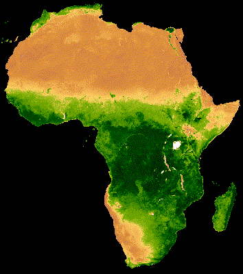

<!--
Copyright 2019 The Google Earth Engine Community Authors

Licensed under the Apache License, Version 2.0 (the "License");
you may not use this file except in compliance with the License.
You may obtain a copy of the License at

    https://www.apache.org/licenses/LICENSE-2.0

Unless required by applicable law or agreed to in writing, software
distributed under the License is distributed on an "AS IS" BASIS,
WITHOUT WARRANTIES OR CONDITIONS OF ANY KIND, either express or implied.
See the License for the specific language governing permissions and
limitations under the License.
-->

[Open In Code Editor](https://code.earthengine.google.com/71b14acfca89099a010adceef8f7f9bb)

Time series animations of Earth observation imagery are captivating and
engaging. In this tutorial, you'll learn how to generate an animated GIF
representing 20-year median NDVI for serial 16-day MODIS composites spanning
January 1st through December 31st. The following image is an example of the
resulting animation.



## Context

[MODIS](https://modis.gsfc.nasa.gov/) is a moderate resolution satellite imaging
system and NDVI is a common reflectance-based vegetation index. The
[Earth Engine Data Catalog](https://developers.google.com/earth-engine/datasets/)
provides NDVI as a precalculated
[dataset](https://developers.google.com/earth-engine/datasets/catalog/MODIS_006_MOD13A2)
for convenience. In the above animation, NDVI is mapped to a color gradient from
tan to dark green representing low to high photosynthetic capacity (low to high
vegetation cover/density/productivity). The tide-like latitudinal shift in
vegetation is associated with the sun’s declination moving between 23.5&deg;
north and 23.5&deg; south, relative to the equator, throughout the year. See
[Nicholson, 2019](https://journals.ametsoc.org/doi/full/10.1175/BAMS-D-16-0287.1)
for more information on this phenomenon. Similar seasonal patterns of vegetation
productivity are found around the world at both small and large scales.

## Instructions

The basic workflow is as follows:

1. Fetch the MODIS vegetation indices dataset and subset the NDVI band
2. Define region of interest and animation frame geometries
3. Group images from the same annual 16-day composite window using a join
4. Reduce the composite groups by median to produce animation frames
5. Define visualization parameters and convert data into RGB visualization
images
6. Generate a URL that will produce a GIF in the browser

### 1. Get MODIS NDVI collection

Retrieve the [MODIS Terra Vegetation Indices 16-Day Global 1km dataset](https://developers.google.com/earth-engine/datasets/catalog/MODIS_006_MOD13A2)
as an `ee.ImageCollection` and select the NDVI band.

```js
var col = ee.ImageCollection('MODIS/006/MOD13A2').select('NDVI');
```

### 2. Define clipping and region boundary geometries

Clipping the data is an optional step that sets pixels outside an area of
interest as null, which is helpful for drawing attention to a particular area
within a region. Here, the [Large Scale International Boundary](https://developers.google.com/earth-engine/datasets/catalog/USDOS_LSIB_SIMPLE_2017)
(LSIB) vector dataset is filtered to include only the collection of geometries
composing Africa, whose union serves as the clipping geometry. When applied, all
pixels outside of Africa will be null. Next, a polygon describing a rectangular
extent of the desired animation is defined. In your own application, you may
define these two geometries any number of ways. Note, however, that very large
regional extents may exceed limitations of the function used to produce the
animated GIF, in which case an error will be printed in the console. Please see
the [Geometry Overview](https://developers.google.com/earth-engine/geometries)
section of the Developers Guide for more information on defining geometries.
Note that you can also
[upload shapefiles](https://developers.google.com/earth-engine/importing#uploading-table-assets)
and import them as `ee.Geometry` objects.

```js
// Define a mask to clip the NDVI data by.
var mask = ee.FeatureCollection('USDOS/LSIB_SIMPLE/2017')
  .filter(ee.Filter.eq('wld_rgn', 'Africa'));

// Define the regional bounds of animation frames.
var region = ee.Geometry.Polygon(
  [[[-18.698368046353494, 38.1446395611524],
    [-18.698368046353494, -36.16300755581617],
    [52.229366328646506, -36.16300755581617],
    [52.229366328646506, 38.1446395611524]]],
  null, false
);
```

### 3. Group images by composite date

The data making up each frame of the animation is the 20-year median NDVI for
the same 16-day composite each year from 2000 to 2019. Generating these median
composites is the crux of this tutorial. The first step is grouping inter-annual
image data representing the same 16-day composite window into lists. To do this,
a calendar date needs to be added to the metadata of each image so there is a
common property to group (join) by. Day-of-year (DOY) is a fine format and can
be derived from the ubiquitous `system:time_start` property using the
`getRelative` method.

```js
col = col.map(function(img) {
  var doy = ee.Date(img.get('system:time_start')).getRelative('day', 'year');
  return img.set('doy', doy);
});
```

A join operation will be implemented that groups images by the 'doy' property
just added. The join operation  expects two collections, in this case: a
distinct DOY collection and the complete collection modified to include the
'doy' property. The complete collection (`col`) exists, the distinct collection
needs to be defined. Do so by filtering the complete collection to a single year
of data e.g. 2013. 

```js
var distinctDOY = col.filterDate('2013-01-01', '2014-01-01');
```

Complete the join by:

1. Creating a filter that will identify matching images between the distinct and
complete collections by the `doy` property
2. Defining a `saveAll` join that will produce a list of all matches per
distinct 'doy' in a property called 'doy_matches'
3. Applying the join

```js
// Define a filter that identifies which images from the complete collection
// match the DOY from the distinct DOY collection.
var filter = ee.Filter.equals({leftField: 'doy', rightField: 'doy'});

// Define a join.
var join = ee.Join.saveAll('doy_matches');

// Apply the join and convert the resulting FeatureCollection to an
// ImageCollection.
var joinCol = ee.ImageCollection(join.apply(distinctDOY, col, filter));
```

The result (`joinCol`) is a copy of the distinct DOY collection with a property
added to each image (`same_doy`) that lists all of the images from the complete
collection (`col`) that have the same DOY for a given distinct DOY image.

### 4. Reduce composite groups

From the list of images having the same DOY, a collection can be created and
then reduced to the median of its constituents. Map this oppertation over each
distinct DOY image in the new `joinCol` collection. The result is a new
collection, with one image per distinct DOY composite that represents its
20-year median NDVI per pixel. It took some work to get to this point, but using
a central tendency statistic based on a population of data produces an annual
time series animation that is free of missing data and outliers
(i.e. the animation is less noisy).

```js
// Apply median reduction among matching DOY collections.
var comp = joinCol.map(function(img) {
  var doyCol = ee.ImageCollection.fromImages(
    img.get('doy_matches')
  );
  return doyCol.reduce(ee.Reducer.median());
});
```

### 5. Make visualization images

Set visualization properties to control the appearance of the data in the
animation frames. The `visualize` method can convert single-band images
(like NDVI) into 3-band RGB pseudo-color images. Define visualization properties
including a color palette and min and max values to stretch the palette between.
Map the `visualize` method over each image using the defined visualization
properties and clip the data to the mask defined in
[Step 2](#2-define-clipping-and-region-boundary-geometries)
to set background pixels to null (black).

```js
// Define RGB visualization parameters.
var visParams = {
  min: 0.0,
  max: 9000.0,
  palette: [
    'FFFFFF', 'CE7E45', 'DF923D', 'F1B555', 'FCD163', '99B718', '74A901',
    '66A000', '529400', '3E8601', '207401', '056201', '004C00', '023B01',
    '012E01', '011D01', '011301'
  ],
};

// Create RGB visualization images for use as animation frames.
var rgbVis = comp.map(function(img) {
  return img.visualize(visParams).clip(mask);
});
```

### 6. Create an animated GIF

The final step is to define arguments for the `getVideoThumbURL` method which
will create an animation from the collection of RGB visualization images
generated in the previous step. Relevant parameters include:

- `region`: set to the region defined in above [Step 2](#2-define-clipping-and-region-boundary-geometries)
- `dimensions`: set to 600 which defines the larger dimension of the resulting GIF as 600px (the smaller dimension
is proportionally scaled)
- `crs`: set to 'EPSG:3857' to match the coordinate reference system of the Code Editor map
- `framesPerSecond`: set to 10 (frames per second)

```js
// Define GIF visualization parameters.
var gifParams = {
  'region': region,
  'dimensions': 600,
  'crs': 'EPSG:3857',
  'framesPerSecond': 10
};

// Print the GIF URL to the console.
print(rgbVis.getVideoThumbURL(gifParams));
```

A URL will be printed to the console after running this block of code. Upon
visiting the URL, Earth Engine servers will complete the work needed to produce
the GIF on-the-fly. Once the task is complete, the animation will appear in the
browser.

Alternatively, you can render the animation directly in the console using the
`ui.Thumbnail` function.

```js
// Render the GIF animation in the console.
print(ui.Thumbnail(rgbVis, gifParams));
```

Once the animation appears, you can download the image by right-clicking on it
to reveal its context menu. Select the appropriate option to download the
file to your computer.
