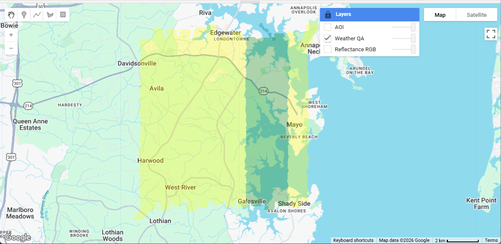
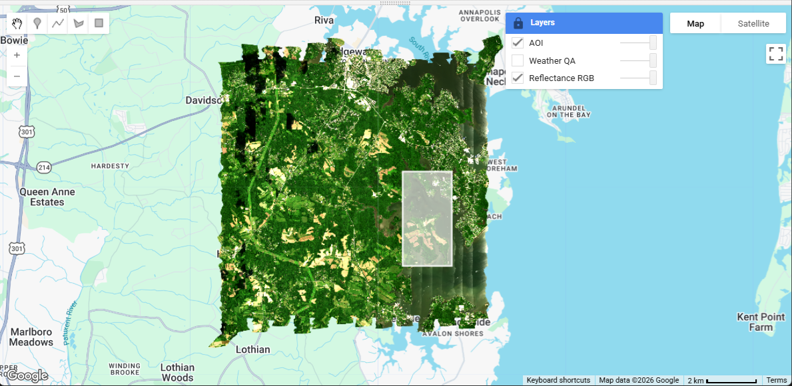
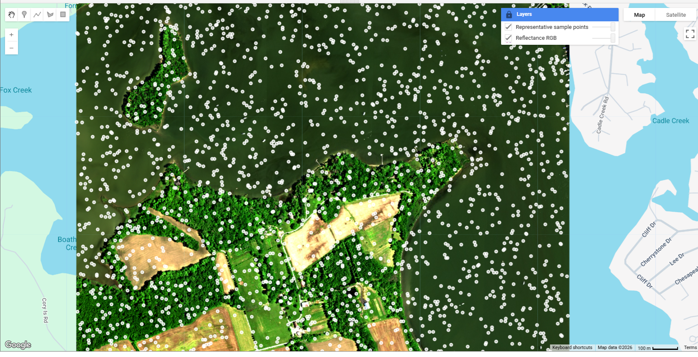
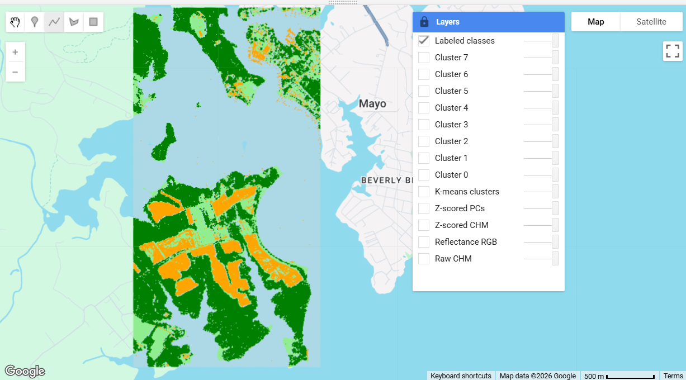
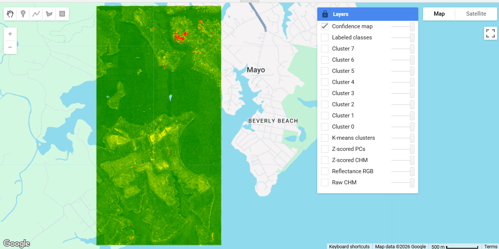
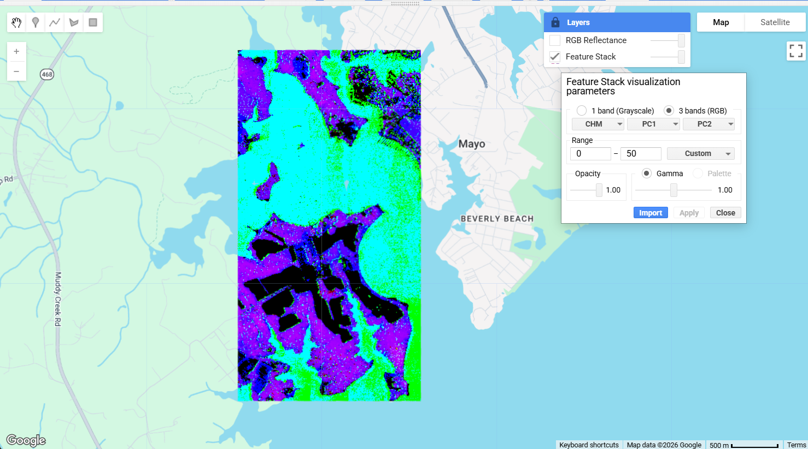
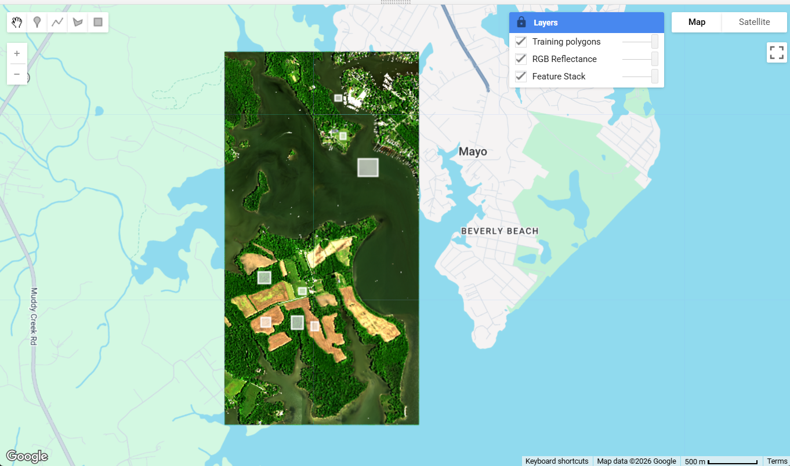
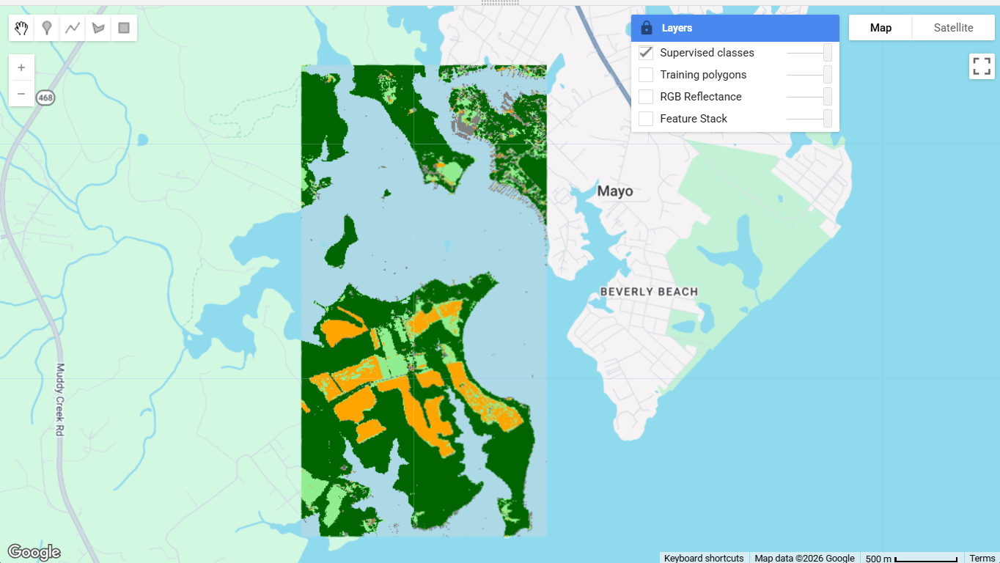

<!--
Copyright 2023 The Google Earth Engine Community Authors

Licensed under the Apache License, Version 2.0 (the "License");
you may not use this file except in compliance with the License.
You may obtain a copy of the License at

    https://www.apache.org/licenses/LICENSE-2.0

Unless required by applicable law or agreed to in writing, software
distributed under the License is distributed on an "AS IS" BASIS,
WITHOUT WARRANTIES OR CONDITIONS OF ANY KIND, either express or implied.
See the License for the specific language governing permissions and
limitations under the License.
-->

[Open In Code Editor](https://code.earthengine.google.com/?accept_repo=users/bhass/gee-community-tutorial)

The principal components transform is a spectral rotation that takes spectrally correlated image data and outputs uncorrelated bands. In this tutorial, you will apply Principal Component Analysis (PCA) to reduce the National Ecological Observatory Network's (NEON's) 426-band airborne reflectance data to a compact set of uncorrelated components. You will then use those components alongside a lidar-derived Canopy Height Model (CHM) to classify land cover with both k-Means unsupervised clustering and a Random Forest supervised classifier, and compare the pros and cons of each approach.

## Context

The National Ecological Observatory Network (NEON), solely funded by the National Science Foundation, provides 1 meter resolution [airborne datasets](https://developers.google.com/earth-engine/datasets/publisher/neon-prod-earthengine), across the United States, including 426 band [hyperspectral data](https://developers.google.com/earth-engine/datasets/catalog/projects_neon-prod-earthengine_assets_HSI_REFL_002) and lidar-derived data, including a [Canopy Height Model](https://developers.google.com/earth-engine/datasets/catalog/projects_neon-prod-earthengine_assets_CHM_001). Click on the links to learn more about [NEON](https://www.neonscience.org/) and NEON's [Airborne Remote Sensing](https://www.neonscience.org/data-collection/airborne-remote-sensing) program, which provide high-resolution open datasets ideal for pairing with satellite data.

## Outline

This tutorial will cover:

1. Reading in the NEON Hyperspectral dataset, assess weather quality and select the AOI
2. Computing Principal Component Analysis on reflectance data using representative sampling
3. Running k-Means unsupervised classification with z-scored feature stack
4. Running a random forest supervised classification with the same feature stack
5. Comparing the classification methods and discussion

## 1. Read in the NEON Hyperspectral Image Collection and select the Area of Interest

[Part 1 - Open In Code Editor](https://code.earthengine.google.com/6ced0612c8b83c07563aeaf838758d5b)

Retrieve the [NEON Surface Bidirectional Reflectance](https://developers.google.com/earth-engine/datasets/catalog/projects_neon-prod-earthengine_assets_HSI_REFL_002) as an `ee.ImageCollection` and select the site and date. This tutorial will focus on the [Smithsonian Environmental Research Center NEON / SERC](https://www.neonscience.org/field-sites/serc) site as an example. NEON airborne data are typically collected at 1000 m Above Ground Level (AGL), and flights are targeted during cloud-free conditions, if possible. Unlike satellite data, the aircraft is collecting below the clouds, which means cloud filtering is not an option. Instead, NEON reflectance data include a Weather Quality Indicator (WQI) band, which indicates percent cloud cover, as recorded by flight operators collecting the data. NEON recommends using < 10% cloud cover data, when possible. In this example, we'll map the cloud cover conditions for the SERC 2022 collection and select an area that was collected in the best weather conditions that encompasses a variety of land cover types. This AOI will be used in the rest of the lesson.

```js
// ------------------------------------------------------------
// Script 1. Load NEON bidirectional reflectance, inspect weather QA,
// and define the area of interest.
// ------------------------------------------------------------

// Display all available images for the NEON bidirectional reflectance image collection
// at the Smithsonian Environmental Research Center (SERC) site
// Find info about all of NEON's sites here: https://www.neonscience.org/field-sites
var reflCol = ee.ImageCollection('projects/neon-prod-earthengine/assets/HSI_REFL/002')
                .filterMetadata('NEON_SITE', 'equals', 'SERC')

// Display available images in the HSI_REFL/002 Image Collection at SERC
print('NEON Bidirectional Reflectance Images at the SERC site:');
print(reflCol.aggregate_array('system:index'));

// Load SERC reflectance data for 2022
var reflImage = reflCol
  .filterDate('2022-01-01', '2022-12-31')
  .filterMetadata('NEON_SITE', 'equals', 'SERC')
  .first();

print('Reflectance image', reflImage);

// Select QA bands and the weather quality layer
var qaBands = reflImage.select('[^B].*');
var weatherQa = reflImage.select('Weather_Quality_Indicator');

print('QA bands', qaBands);
print('Weather QA values: 1 = <10% cloud cover, 2 = 10-50%, 3 = >50%');

// Keep only clear-weather pixels
var clearMask = weatherQa.eq(1);
var clearRefl = reflImage.updateMask(clearMask);

// Display layers
Map.centerObject(reflImage, 12);

// Weather QA map (Green=<10% clouds, Yellow = 10-50% clouds, Red = >50% clouds)
Map.addLayer(
  weatherQa,
  {min: 1, max: 3, palette: ['green', 'yellow', 'red'], opacity: 0.3},
  'Weather QA',
  0 // don't display this layer, by default (can toggle in the layers menu)
);

// Reflectance RGB (<10% cloud cover only)
Map.addLayer(reflImage, {bands: ['B053','B035','B019'], min: 103, max: 1160}, 'Reflectance RGB');

// Define area of interest
// Select area within the <10% cloud cover that encompasses some different land cover types
var aoi = ee.Geometry.Rectangle([-76.5413, 38.8624, -76.5183, 38.8968]);

Map.addLayer(aoi, {color: 'white', opacity: 0.25}, 'AOI');
// Map.addLayer(rgbImage.clip(aoi), {min: 103, max: 1160}, 'AOI RGB');

// display the citation information (included as a property)
var reflProperties = reflImage.toDictionary();

// data citation - see https://www.neonscience.org/data/guidelines-policies/citing
var reflCitation = reflProperties.select(['CITATION']);
print('Data Citation:', reflCitation)
```


Weather Quality Indicator Map of the SERC site, where green represents <10% cloud cover and yellow represents 10-50% cloud cover.


True color image from the reflectance data, showing the Area of Interest (aoi) that will be used throughout the rest of the tutorial.

## 2. Compute Principal Component Analysis on reflectance data using representative sampling

[Part 2 - Open In Code Editor](https://code.earthengine.google.com/36903e32696fc18c4bdb157f3e3c88ae)

With 426 spectral bands, computing PCA statistics across every pixel in the AOI would be memory-intensive in Earth Engine. Instead, this script draws a small representative sample of pixels (5,000 points at 1 m resolution) and uses that sample to estimate the band means and covariance matrix. The `geometry()` of the sampled `FeatureCollection` is a MultiPoint — so when passed to `reduceRegion`, statistics are computed only at those 5,000 pixel locations. The resulting 426 × 426 covariance matrix is estimated from that sample, which keeps memory and compute time manageable.

The `calcImagePca` function carries out four steps:
1. Convert the multi-band image to an array image for matrix algebra.
2. Subtract per-band means (computed over the sample) to center the data.
3. Compute the covariance matrix of the centered array over the sample geometry.
4. Compute eigenvalues and eigenvectors, then project the full image onto the eigenvectors to produce the PC bands.

Note that the statistics (steps 2–3) are estimated from the sample, but the projection (step 4) is applied to every pixel in the clipped AOI image, so the output PCA image covers the full AOI at full 1 m resolution.

```js
// ------------------------------------------------------------
// Compute principal components from NEON hyperspectral
// imagery over the AOI, and display a representative sample of
// pixels used to guide the PCA calculation.
// ------------------------------------------------------------

// Define area of interest
var aoi = ee.Geometry.Rectangle([-76.5413, 38.8624, -76.5183, 38.8968]);

// Analysis settings.
var analysisScale = 1;
var statsScale = 1;
var numberOfSamples = 5000; // sample count should be at least several times larger than band count (426)
var numComponents = 5;

// ------------------------------------------------------------
// Load and prepare hyperspectral imagery
// ------------------------------------------------------------

// Load NEON reflectance for SERC in 2022 and clip to the AOI.
var reflImage = ee.ImageCollection('projects/neon-prod-earthengine/assets/HSI_REFL/002')
  .filterMetadata('NEON_SITE', 'equals', 'SERC')
  .filterDate('2022-01-01', '2022-12-31')
  .first()
  .clip(aoi);

// Create a natural-color RGB composite for visualization.
// B053 ≈ red, B035 ≈ green, B019 ≈ blue.
var reflRgb = reflImage.select(['B053', 'B035', 'B019']);

// Display the AOI and RGB image.
Map.centerObject(aoi, 13);
Map.addLayer(reflRgb, {min: 103, max: 1160}, 'Reflectance RGB');
// Map.addLayer(aoi, {color: 'white'}, 'AOI', false);

// ------------------------------------------------------------
// Draw a representative sample of pixels
// ------------------------------------------------------------

// Sample a subset of pixels across the AOI. These points are used
// as a representative sample of the scene and can be displayed in
// the lesson to show where PCA statistics are being drawn from.
var samplePoints = reflImage.sample({
  region: aoi,
  scale: analysisScale,
  numPixels: numberOfSamples,
  seed: 1,
  geometries: true
});

// Add sample points as a map layer for the lesson figure.
Map.addLayer(
  samplePoints,
  {color: 'white'},
  'Representative sample points',
  false
);

print('Sample points', samplePoints.limit(10));
```



The white points show where spectral statistics will be drawn from. A well-distributed sample like this, spread across forest, open water and man-made surfaces, helps the covariance matrix capture the full range of spectral variability in the scene, which in turn produces more representative eigenvectors. Next we'll define some functions to compute the PCA.

```javascript
// ------------------------------------------------------------
// Helper to generate PC band names: PC1, PC2, PC3, ...
// ------------------------------------------------------------
function getNewBandNames(prefix, num) {
  return ee.List.sequence(1, num).map(function(i) {
    return ee.String(prefix).cat(ee.Number(i).int().format());
  });
}

// ------------------------------------------------------------
// Function to perform Principal Component Analysis
// ------------------------------------------------------------

// This function:
// 1. computes the mean reflectance for each band
// 2. centers the image by subtracting the band means
// 3. computes the covariance matrix
// 4. projects the image into PCA space
function calcImagePca(image, numComponents, samplePoints, scale) {
  var bandNames = image.bandNames();
  var region = samplePoints.geometry();

  // Convert the image into an array for matrix operations.
  var arrayImage = image.toArray();

  // Compute the mean value of each band.
  var meanDict = image.reduceRegion({
    reducer: ee.Reducer.mean(),
    geometry: region,
    scale: scale,
    maxPixels: 1e13,
    bestEffort: true,
    tileScale: 16
  });

  // Convert band means into an image and center the data.
  var meanImage = ee.Image.constant(meanDict.values(bandNames)).rename(bandNames);
  var meanArray = meanImage.toArray().arrayRepeat(0, 1);
  var meanCentered = arrayImage.subtract(meanArray);

  // Compute the covariance matrix from the centered image.
  var covar = meanCentered.reduceRegion({
    reducer: ee.Reducer.centeredCovariance(),
    geometry: region,
    scale: scale,
    maxPixels: 1e13,
    bestEffort: true,
    tileScale: 16
  });

  // Compute eigenvalues and eigenvectors.
  var covarArray = ee.Array(covar.get('array'));
  var eigens = covarArray.eigen();
  var eigenVectors = eigens.slice(1, 1);

  // Project the centered image onto the eigenvectors.
  var principalComponents = ee.Image(eigenVectors)
    .matrixMultiply(meanCentered.toArray(1));

  // Return the first n principal components.
  return principalComponents
    .arrayProject([0])
    .arraySlice(0, 0, numComponents)
    .arrayFlatten([getNewBandNames('PC', numComponents)]);
}

// ------------------------------------------------------------
// Apply PCA
// ------------------------------------------------------------
var pcaImage = calcImagePca(
  reflImage,
  numComponents,
  samplePoints,
  statsScale
);

print('PCA image', pcaImage);

// Print variance explained by each of the top PCs.
// Eigenvalues from the covariance matrix give the variance each PC captures.
var bandNames = reflImage.bandNames();
var meanDict = reflImage.reduceRegion({
  reducer: ee.Reducer.mean(),
  geometry: samplePoints.geometry(),
  scale: statsScale,
  maxPixels: 1e13,
  bestEffort: true,
  tileScale: 16
});
var meanArray = ee.Image.constant(meanDict.values(bandNames))
  .rename(bandNames).toArray().arrayRepeat(0, 1);
var meanCentered = reflImage.toArray().subtract(meanArray);
var covar = meanCentered.reduceRegion({
  reducer: ee.Reducer.centeredCovariance(),
  geometry: samplePoints.geometry(),
  scale: statsScale,
  maxPixels: 1e13,
  bestEffort: true,
  tileScale: 16
});
var eigenValues = ee.Array(covar.get('array')).eigen()
  .slice(1, 0, 1).project([0]);
var totalVariance = eigenValues.reduce(ee.Reducer.sum(), [0]).get([0]);
var pctEach = eigenValues.slice(0, 0, numComponents)
  .divide(totalVariance).multiply(100);
var pctCumulative = eigenValues.slice(0, 0, numComponents)
  .accum(0).divide(totalVariance).multiply(100);

print('Variance explained by top PCs', ee.Dictionary({
  pctEach: pctEach,
  pctCumulative: pctCumulative
}));
```

The variance output lets you confirm how much spectral information the top PCs retain. For this AOI, you should see something close to the following:

```
pctEach:       [87.1, 9.2, 1.5, 0.6, 0.5]
pctCumulative: [87.1, 96.4, 97.9, 98.5, 99.0]
```

PC1 alone captures roughly 87% of the total variance, reflecting the dominant spectral variation across vegetation, soil, and man-made surfaces in the scene. PC2 adds another ~9%, and by PC5, the cumulative variance is already around 99%, which means five principal components preserve nearly all the spectral structure of the original 426 bands. The remaining bands contribute mostly sensor noise and correlated atmospheric effects. This steep drop-off is typical of hyperspectral data, where adjacent bands are highly correlated, and is exactly why PCA is an effective dimensionality-reduction step before classification.

## 3. k-Means Unsupervised Classification

[Part 3 - Open In Code Editor](https://code.earthengine.google.com/75262ac6eaaa141da0e496c493eb18c9)

k-Means is an unsupervised clustering algorithm that groups pixels purely by spectral and structural similarity, with no human-provided class labels. This makes it a useful first-pass classification tool: you can run it immediately after PCA without any training data, and the resulting clusters often correspond to land cover types that can then be interpreted visually.

The workflow here uses a z-scored PCA + CHM feature stack. Z-scoring is important for k-Means because the algorithm measures distance in feature space. Without the z-score, a band with a large numeric range (like raw reflectance values in the thousands) would dominate the clustering and suppress the contribution of narrower-range bands like the CHM. After clustering into 8 groups, each cluster's mean reflectance (from the RGB bands) and mean CHM height are computed to help you assign semantic land cover labels by visually comparing with the RGB reflectance image and CHM layers.

As a quick QA step, the script also generates a per-pixel confidence score to flag pixels that sit near cluster boundaries and may be ambiguously assigned.

### 3a. Create z-scored feature stack and run k-Means

```js
// ------------------------------------------------------------
// Bandwise z-scoring of PC bands + CHM
// ------------------------------------------------------------

// Define area of interest.
var aoi = ee.Geometry.Rectangle([-76.5413, 38.8624, -76.5183, 38.8968]);

// Working scale in meters
var scale = 1;

// ------------------------------------------------------------
// Input data
// ------------------------------------------------------------

// Hyperspectral reflectance image for visual interpretation.
var reflImage = ee.Image(
  'projects/neon-prod-earthengine/assets/HSI_REFL/002/2022_SERC_6'
);

// CHM image from the same airborne campaign.
var chmImage = ee.Image(
  'projects/neon-prod-earthengine/assets/CHM/001/2022_SERC_6'
).rename('CHM');

// Principal components image from hyperspectral data.
var pcImage = ee.Image(
  'projects/neon-sandbox-dataflow-ee/assets/2022_SERC_6_PCA'
);

// Inspect available PC band names if needed.
print('PC image band names', pcImage.bandNames());
print('CHM band names', chmImage.bandNames());

// ------------------------------------------------------------
// Select PC bands to include in the feature stack
// ------------------------------------------------------------

// Update these if your asset uses different band names.
var pcBands = ['PC1', 'PC2', 'PC3', 'PC4', 'PC5'];

// Build the feature stack: PCs + CHM
var featureStack = pcImage.select(pcBands).addBands(chmImage);

print('Feature stack', featureStack);

// ------------------------------------------------------------
// Function for per-band z-scoring
// ------------------------------------------------------------

function zScoreByBand(image, region, scale) {
  var stats = image.reduceRegion({
    reducer: ee.Reducer.mean().combine({
      reducer2: ee.Reducer.stdDev(),
      sharedInputs: true
    }),
    geometry: region,
    scale: scale,
    maxPixels: 1e13,
    bestEffort: true
  });

  var bandNames = image.bandNames();

  var meanImage = ee.Image.constant(
    bandNames.map(function(b) {
      return ee.Number(stats.get(ee.String(b).cat('_mean')));
    })
  ).rename(bandNames);

  var stdDevImage = ee.Image.constant(
    bandNames.map(function(b) {
      return ee.Number(stats.get(ee.String(b).cat('_stdDev')));
    })
  ).rename(bandNames);

  // Prevent divide-by-zero for bands with no variation.
  stdDevImage = stdDevImage.where(stdDevImage.eq(0), 1);

  return image.subtract(meanImage).divide(stdDevImage);
}

// Apply z-scoring bandwise across the stack.
var zStack = zScoreByBand(featureStack, aoi, scale);

// Optional: rename output bands to make the result explicit.
var zBandNames = featureStack.bandNames().map(function(b) {
  return ee.String(b).cat('_z');
});
zStack = zStack.rename(zBandNames);

print('Z-scored feature stack', zStack);

// ------------------------------------------------------------
// Export the z-scored feature stack as an asset so it can be
// loaded directly in subsequent scripts without recomputing.
// Update the assetId to match your own Earth Engine user folder.
// ------------------------------------------------------------
Export.image.toAsset({
  image: zStack,
  description: 'zStack_SERC_2022',
  assetId: 'projects/neon-sandbox-dataflow-ee/assets/zStack_SERC_2022',
  region: aoi,
  scale: 1,
  maxPixels: 1e13
});

// ------------------------------------------------------------
// Quick visualization examples
// ------------------------------------------------------------

// Center map on AOI.
Map.centerObject(aoi, 13);

// Raw CHM
Map.addLayer(
  chmImage.clip(aoi),
  {min: 0, max: 30},
  'Raw CHM'
);

// Reflectance RGB
Map.addLayer(
  reflImage.clip(aoi),
  {bands: ['B053', 'B035', 'B019'], min: 0, max: 1000},
  'Reflectance RGB'
);

// Z-scored CHM
Map.addLayer(
  zStack.select('CHM_z').clip(aoi),
  {min: -2, max: 2},
  'Z-scored CHM'
);

// Example z-scored PCs
Map.addLayer(
  zStack.select(['PC1_z', 'PC2_z', 'PC3_z']).clip(aoi),
  {min: -2, max: 2},
  'Z-scored PCs'
);

// ------------------------------------------------------------
// Optional: sample the z-scored stack for k-means clustering
// ------------------------------------------------------------

var training = zStack.sample({
  region: aoi,
  scale: scale,
  numPixels: 5000,
  geometries: false
});

var num_clusters = 8

var clusterer = ee.Clusterer.wekaKMeans(num_clusters).train(training);

var clustered = zStack.cluster(clusterer);

Map.addLayer(
  clustered.clip(aoi).randomVisualizer(),
  {},
  'K-means clusters'
);

// ------------------------------------------------------------
// Optional helper: add each cluster as a toggleable layer
// ------------------------------------------------------------
function showClusterMask(clusterId) {
  var mask = clustered.eq(clusterId).selfMask();

  Map.addLayer(
    mask.clip(aoi),
    {palette: ['yellow']},
    'Cluster ' + clusterId,
    false
  );
}

// Add one toggleable layer per cluster.
// Update the number if you used a different k in k-means.
for (var i = 0; i < num_clusters; i++) {
  showClusterMask(i);
}

// RGB bands.
var rgbBands = ['B053', 'B035', 'B019'];

// ------------------------------------------------------------
// Compute simple per-cluster summaries
// These can help support visual interpretation.
// ------------------------------------------------------------
var interpretationStack = reflImage
  .select(rgbBands)
  .addBands(chmImage.rename('CHM'))
  .addBands(clustered.rename('cluster'));

var sample = interpretationStack.sample({
  region: aoi,
  scale: scale,
  numPixels: 10000,
  geometries: false,
  seed: 42
});

var clusterIds = ee.List(sample.aggregate_array('cluster')).distinct().sort();
print('Cluster IDs', clusterIds);

var clusterSummaries = ee.FeatureCollection(
  clusterIds.map(function(id) {
    id = ee.Number(id);

    var subset = sample.filter(ee.Filter.eq('cluster', id));

    var stats = ee.Dictionary({
      cluster: id,
      count: subset.size(),
      mean_CHM: subset.aggregate_mean('CHM')
    });

    var bandStats = ee.Dictionary(
      ee.List(rgbBands).iterate(function(b, acc) {
        b = ee.String(b);
        acc = ee.Dictionary(acc);
        return acc.set(
          ee.String('mean_').cat(b),
          subset.aggregate_mean(b)
        );
      }, ee.Dictionary({}))
    );

    return ee.Feature(null, stats.combine(bandStats, true));
  })
);

print('Cluster summaries', clusterSummaries);

// ------------------------------------------------------------
// Manual semantic label assignment
// After reviewing the RGB image, CHM, cluster map, and
// cluster summaries, assign a class to each cluster.
// ------------------------------------------------------------

// Assign a semantic class to each cluster ID, using 4 classes:
// class 1 (shadows / water)
// class 2 (low veg dead / man-made)
// class 3 (low veg, healthy)
// class 4 (tall veg)

// The lists are matched by position:
// cluster 0 -> class 4 (tall veg)
// cluster 1 -> class 2 (low veg dead / man-made)
// cluster 2 -> class 1 (shadows / water)
// cluster 3 -> class 4 (tall veg)
// cluster 4 -> class 1 (shadows / water)
// cluster 5 -> class 3 (low veg, healthy)
// cluster 6 -> class 1 (shadows / water)
// cluster 7 -> class 4 (tall veg)

// make two lists to link the clusters and classes
var fromClusters = [0, 1, 2, 3, 4, 5, 6, 7];
var toClasses    = [4, 2, 1, 4, 1, 3, 1, 4];

var labeledClusters = clustered
  .remap(fromClusters, toClasses)
  .rename('class');

Map.addLayer(
  labeledClusters.clip(aoi),
  {
    min: 1,
    max: 4,
    palette: ['lightblue', 'orange', 'lightgreen', 'green']
  },
  'Labeled classes'
);

```



The clusters in the layer manager (Cluster 0 through Cluster 7) can be compared against the RGB and CHM layers to determine the appropratie class for each. The cluster summary table printed to the console shows the mean RGB reflectance and mean CHM height per cluster, and is a useful tool for deciding which semantic label to assign to each cluster. Clusters with near-zero CHM and low red/green reflectance are typically water or deep shadow. High CHM values reliably identify tall forest canopy. Low CHM with high visible reflectance points to impervious surfaces or exposed soil. The ambiguous cases, such as stressed vegetation, agricultural fields, and paved surfaces, often share similar spectral signatures and may be lumped into the same cluster. This is a known limitation of unsupervised classification without additional information.

Note that k-Means cluster IDs are arbitrary and will change between runs and with different random seeds, so the `remap` values in the labeling step will need to be updated any time `num_clusters` or the sample changes. The cluster summary printout and cluster layers are what guides that mapping each time.

### 3b. Make a confidence map of the clusters

For each pixel, the script computes the Euclidean distance to the centroid of its assigned cluster in z-scored feature space, then inverts and normalises the result so that 1 = closest to the centroid (most confidently assigned) and 0 = farthest away (least confidently assigned). The result is displayed with a red–yellow–green palette from 0.8 to 1.0; values below 0.8 typically fall at class boundaries or on spectrally mixed surfaces.

```js
// ------------------------------------------------------------
// Cluster confidence map: distance from each pixel to its cluster centroid.
// ------------------------------------------------------------

// For each cluster, mask zStack to only that cluster's pixels,
// compute the per-band mean (= centroid), then calculate the
// Euclidean distance from every pixel to that centroid.
// The per-cluster distance images are mosaicked into one image.
var distanceToCentroid = ee.ImageCollection(
  ee.List.sequence(0, num_clusters - 1).map(function(k) {
    k = ee.Number(k);

    // Isolate pixels belonging to cluster k.
    var clusterMask = clustered.eq(k);
    var maskedStack = zStack.updateMask(clusterMask);

    // Compute the centroid: mean of each z-scored band within cluster k.
    var centroid = maskedStack.reduceRegion({
      reducer: ee.Reducer.mean(),
      geometry: aoi,
      scale: scale,
      maxPixels: 1e13,
      bestEffort: true
    });

    // Build a constant image from the centroid values.
    var centroidImage = ee.Image.constant(
      zStack.bandNames().map(function(b) {
        return ee.Number(centroid.get(b));
      })
    ).rename(zStack.bandNames());

    // Euclidean distance to this centroid, masked to cluster k only.
    return zStack.subtract(centroidImage)
      .pow(2)
      .reduce(ee.Reducer.sum())
      .sqrt()
      .updateMask(clusterMask);
  })
).mosaic();

// Normalise by the maximum distance in the AOI so confidence runs
// from 0 (farthest from centroid, least confident) to
// 1 (closest to centroid, most confident).
var maxDist = ee.Number(
  distanceToCentroid.reduceRegion({
    reducer: ee.Reducer.max(),
    geometry: aoi,
    scale: scale,
    maxPixels: 1e13,
    bestEffort: true
  }).get('sum')
);

var confidence = ee.Image(1)
  .subtract(distanceToCentroid.divide(maxDist))
  .rename('confidence');

Map.addLayer(
  confidence.clip(aoi),
  {min: 0.8, max: 1, palette: ['red', 'yellow', 'green']},
  'Confidence map',
  false
);
```



Comparing against the RGB reflectance image, the lowest-confidence areas fall predominantly on the man-made surfaces in the northeast of the AOI, roads, and boats, as well as the agricultural fields (which we labeled as stressed vegetation). This is consistent with what the cluster summaries showed: those two cover types share similar spectral signatures. Both tend to have moderate reflectance and low CHM values, so they were grouped together rather than separated into distinct clusters. 

Two things are worth noting when interpreting this map. First, confidence is relative: it is normalised to the maximum intra-cluster distance observed in the AOI, so a confidence of 0.9 means "close to its centroid relative to the hardest case in the scene," not an absolute probability. Second, low confidence does not mean the labeling is wrong, it means the pixel is spectrally intermediate. Those pixels are the most informative targets for follow-up: adding training polygons in those locations for the supervised classifier in Section 4 is likely to have the greatest impact on accuracy.

The `confidenceThreshold` variable controls how aggressively ambiguous pixels are masked. At 0.8 (the default), most class-boundary artifacts are removed while retaining the majority of the scene. Raising it to 0.9 or higher isolates only the core, most homogeneous areas of each class; lowering it toward 0.5 recovers more pixels but reintroduces the mixed-cover areas.

## 4. Random Forest Supervised Classification

[Part 4 - Open In Code Editor](https://code.earthengine.google.com/5bfe80d1930eecfd76d68f6c87c3980d)

While k-Means discovers structure without any prior knowledge, Random Forest is a supervised classifier that learns from labeled examples you provide. This makes it more precise for distinguishing classes that are spectrally similar but ecologically distinct (such as roads and stressed vegetation) because the training polygons directly show the classifier what each class looks like in feature space.

The feature stack here is the same PCA + CHM combination used for k-Means, but the CHM plays an especially important role in supervised classification: it lets the classifier separate tall-canopy forest from other green surfaces using structure rather than spectral response alone, something that is difficult to achieve with reflectance data exclusively.

### 4a. Build a standardized feature stack using the top principal components + CHM

This script reuses the `zStack` (z-scored PC1–PC5 + CHM) already built in section 3. Z-scoring is not required for Random Forest. Unlike k-Means, RF makes no assumptions about feature scale or distance, but since we already have it, reusing it avoids rebuilding the same feature stack. The classification results will be equivalent to training on the un-scaled `featureStack`; Random Forest's internal decision tree splits are invariant to monotonic rescaling of input features.

```js
// ------------------------------------------------------------
// Supervised classification from hand-labeled training areas.
// Loads the z-scored feature stack exported from section 3.
// Z-scoring is not required for Random Forest but is reused
// here to avoid rebuilding the same stack.
// ------------------------------------------------------------

// Define AOI.
var aoi = ee.Geometry.Rectangle([-76.5413, 38.8624, -76.5183, 38.8968]);

// Load the z-scored feature stack exported at the end of section 3.
// Update the asset path to match wherever you saved it.
var zStack = ee.Image('projects/<your-project>/assets/zStack_SERC_2022');

// Hyperspectral reflectance image for visual interpretation.
var reflImage = ee.Image(
  'projects/neon-prod-earthengine/assets/HSI_REFL/002/2022_SERC_6'
).clip(aoi);

print('Feature stack (z-scored)', zStack);
print('Feature stack band names', zStack.bandNames());

// Visualize CHM and reflectance for reference when drawing polygons.
Map.centerObject(aoi, 14);

Map.addLayer(
  zStack.select('CHM_z').clip(aoi),
  {min: -2, max: 2},
  'Z-scored CHM'
);

Map.addLayer(
  reflImage,
  {bands: ['B053', 'B035', 'B019'], min: 103, max: 1160},
  'RGB Reflectance'
);
```



### 4b. Select polygons representing different land cover types

To train the classifier, you need labeled examples of each land cover type. Here, five classes are defined: water, man-made surfaces, stressed vegetation, low vegetation, and forest. Each class is represented by two small polygons drawn over areas that are clearly identifiable in the RGB reflectance image and the CHM. The polygons are given a numeric `class` property and merged into a single `FeatureCollection` that will be passed to `sampleRegions` in the next step. If you want to experiment with your own training areas, you can draw new polygons directly in the Code Editor's geometry tools and assign them the same `class` values.

```js
// ------------------------------------------------------------
// Define training polygons
// Draw these in the Code Editor or replace the placeholders below.
// Each polygon needs a numeric class property (1-5).
// ------------------------------------------------------------

var water = ee.FeatureCollection([
  ee.Feature(
    ee.Geometry.MultiPolygon(
      [[[[-76.5282, 38.8928],[-76.5282, 38.8923],[-76.5275, 38.8923],[-76.5275, 38.8928]]],
      [[[-76.5255, 38.8869],[-76.5255, 38.8853],[-76.5232, 38.8853],[-76.5232, 38.8869]]]]),
      {class: 1})]);
      
var manMade = ee.FeatureCollection([
  ee.Feature(
    ee.Geometry.MultiPolygon(
      [[[[-76.5258, 38.8922],[-76.5258, 38.8919],[-76.5254, 38.8919],[-76.5254, 38.8922]]],
      [[[-76.5196, 38.8873],[-76.5196, 38.8872],[-76.5195, 38.8872],[-76.5195, 38.8873]]]]),
      {class: 2})]);      

var stressedVeg = ee.FeatureCollection([
  ee.Feature(
    ee.Geometry.MultiPolygon(
      [[[[-76.5370, 38.8723],[-76.5370, 38.8714],[-76.5359, 38.8714],[-76.5359, 38.8723]]],
      [[[-76.5311, 38.8719],[-76.5311, 38.8711],[-76.5302, 38.8711],[-76.5302, 38.8719]]]]),
      {class: 3})]);

var lowVeg = ee.FeatureCollection([
  ee.Feature(
    ee.Geometry.MultiPolygon(
      [[[[-76.5276, 38.8893],[-76.5276, 38.8887],[-76.5269, 38.8887],[-76.5269, 38.8893]]],
      [[[-76.5325, 38.8750],[-76.5325, 38.8744],[-76.5317, 38.8744],[-76.5317, 38.8750]]]]),
      {class: 4})]);

var forest = ee.FeatureCollection([
  ee.Feature(
    ee.Geometry.MultiPolygon(
      [[[[-76.5373, 38.8765],[-76.5373, 38.8754],[-76.5359, 38.8754],[-76.5359, 38.8765]]],
      [[[-76.5334, 38.8724],[-76.5334, 38.8712],[-76.5320, 38.8712],[-76.5320, 38.8724]]]]),
      {class: 5})]);

var trainingPolygons = water
  .merge(manMade)
  .merge(stressedVeg)
  .merge(lowVeg)
  .merge(forest);

Map.addLayer(trainingPolygons, {color: 'white', opacity: 0.25}, 'Training polygons');
```



### 4c. Classification

With training polygons defined, this script samples `zStack` at each polygon location, splits the samples 70/30 into training and validation sets, and trains a Random Forest classifier with 100 trees. Random Forest is a good default choice here because it is robust to the class imbalance typical of land cover datasets — where forest pixels far outnumber man-made pixels — and because its tree-based splits are unaffected by feature scaling, so the z-scored inputs produce identical classification results to the raw PCA + CHM stack.

```js
// ------------------------------------------------------------
// Random Forest Classification using the z-scored feature stack.
// ------------------------------------------------------------

// 1. Sample zStack at training polygon locations.
// sampleRegions copies the class property into each sampled pixel.
var trainingSample = zStack.sampleRegions({
  collection: trainingPolygons,
  properties: ['class'],
  scale: 1,
  geometries: true
});

// ------------------------------------------------------------
// 2. Add a random column for train/validation split
// ------------------------------------------------------------
var sampled = trainingSample.randomColumn('random', 42);

var trainSet = sampled.filter(ee.Filter.lt('random', 0.7));
var testSet  = sampled.filter(ee.Filter.gte('random', 0.7));

// Print total and per-class sample counts to check balance.
print('Total training samples', trainSet.size());
print('Total validation samples', testSet.size());

var classIds = [1, 2, 3, 4, 5];
var classNames = ['water', 'manMade', 'stressedVeg', 'lowVeg', 'forest'];
classIds.forEach(function(c, i) {
  print(
    'Train count — ' + classNames[i],
    trainSet.filter(ee.Filter.eq('class', c)).size()
  );
});

// ------------------------------------------------------------
// 3. Train a Random Forest classifier
// ------------------------------------------------------------
var classifier = ee.Classifier.smileRandomForest({
  numberOfTrees: 100,
  seed: 42
}).train({
  features: trainSet,
  classProperty: 'class',
  inputProperties: zStack.bandNames()
});

// ------------------------------------------------------------
// 4. Classify the full image
// classes are 1. water, 2. man made, 3. stressed veg, 4. low veg, 5. forest
// ------------------------------------------------------------
var classified = zStack.classify(classifier).rename('class');

Map.addLayer(
  classified.clip(aoi),
  {
    min: 1,
    max: 5,
    palette: ['lightblue', 'grey', 'orange', 'lightgreen', 'darkgreen']
  },
  'Supervised classes'
);
```



### 4c. Assess the classification results

The 30% validation set held back during training is used here to evaluate how well the classifier generalizes to new pixels that weren't used in the training. Running those pixels through the trained model and comparing predicted labels against known labels produces a confusion matrix — a table where rows represent true classes and columns represent predicted classes. Diagonal cells are correct predictions; off-diagonal cells are errors.

Three summary metrics are printed:

- **Overall accuracy:** the fraction of all validation pixels that were correctly classified. Straightforward but can be misleading if classes are imbalanced (e.g., if forest covers 80% of the AOI, a classifier that predicts "forest" everywhere would score 80% overall accuracy while being useless for other classes).
- **Producer's accuracy:** for each class, the fraction of true pixels of that class that were correctly identified. Low producer's accuracy for a class means the classifier is frequently missing it (errors of omission). This is the most useful per-class diagnostic for this dataset.
- **Consumer's accuracy (user's accuracy):** for each class, the fraction of pixels predicted as that class that are actually that class. Low consumer's accuracy means the classifier is mislabeling other classes as this one (errors of commission).

```js
// ------------------------------------------------------------
// Evaluate on held-out validation data
// ------------------------------------------------------------
var validated = testSet.classify(classifier);

var confusion = validated.errorMatrix('class', 'classification');
print('Confusion matrix', confusion);
print('Overall accuracy', confusion.accuracy());
print("Producer's accuracy (recall per class)", confusion.producersAccuracy());
print("Consumer's accuracy (precision per class)", confusion.consumersAccuracy());
```

If your accuracy metrics are very high (e.g., overall accuracy > 0.99), this is most likely a consequence of **spatial autocorrelation** rather than a sign the classifier is genuinely that accurate. At 1 m resolution, adjacent pixels within the same small polygon are nearly identical spectrally. A random 70/30 split doesn't account for spatial proximity — neighboring pixels end up on both sides of the split, so the validation set is not truly independent of the training set. The classifier is effectively tested on pixels it has seen spatially close neighbors of, which inflates all accuracy metrics.

A more honest assessment requires spatially independent validation data: either hold out entire polygons for validation (rather than random pixel splits within polygons), or collect separate validation polygons in different locations from the training polygons. With genuinely independent validation, you should expect overall accuracy in the 85–95% range for this scene, with water and forest scoring highest and man-made surfaces and stressed vegetation being the most likely sources of confusion due to spectral overlap in the PC bands.

## 5. Discussion

### Comparing k-Means and Random Forest Classifications

The two classifiers reflect a fundamental trade-off between effort and precision:

| | k-Means | Random Forest |
|---|---|---|
| Labels required | None — fully unsupervised | Yes — training polygons per class |
| Output classes | Arbitrary clusters needing manual interpretation | Named, semantically defined classes |
| Class boundaries | Set by spectral distance in feature space | Set by labeled examples |
| Accuracy assessment | Not directly possible without ground truth | Standard (confusion matrix, accuracy metrics) |
| Best use case | Exploratory analysis, unknown classes | Production mapping, when classes are defined |

For this AOI, k-Means with 8 clusters does a reasonable job separating water, tall forest, and low vegetation, but tends to lump spectrally similar surfaces — stressed crops, bare soil, and paved areas — into the same cluster. Random Forest, given explicit examples of each class, can more reliably distinguish those ambiguous types, particularly when the CHM provides a structural cue that spectral bands alone cannot resolve (e.g., tall-canopy forest vs. tall herbaceous vegetation).

A practical workflow is to run k-Means first as an exploratory step to understand the spectral diversity in the scene, then use it to guide where to place training polygons for the supervised classifier.

### When does running PCA help?

For both classifiers, PCA provides two concrete benefits with NEON hyperspectral data:

**1. Memory and compute efficiency.** Running k-Means or `sampleRegions` directly on 426 raw bands would be very slow and may hit Earth Engine's memory limits. With 5 PCs, the same information is encoded in a fraction of the data volume.

**2. Noise reduction.** Hyperspectral sensors produce bands that capture mostly noise beyond the first few dozen principal components. PCA concentrates signal in the leading components and effectively discards those noise-dominated dimensions. Both classifiers benefit from not having to partition on noisy features.

Additionally, for k-Means, there is another benefit:

**Decorrelation for k-Means.** Adjacent hyperspectral bands are highly correlated — the same information is repeated dozens of times across the spectrum. k-Means treats each band as an independent dimension, so feeding it 426 correlated bands means the clustering is dominated by whichever spectral regions happen to have the most redundant coverage. PCA-transformed bands are by construction uncorrelated, so each PC contributes genuinely new information to the distance calculation.

For Random Forest, the benefit of decorrelation is less critical — the algorithm is designed to select informative features and is relatively robust to redundant inputs — but the compute and memory savings alone justify the PCA step for 426-band data in Earth Engine.

**When you might skip PCA:** if you are working with a small number of bands (e.g., a 10-band multispectral image), PCA is usually not worth the added complexity. It becomes increasingly valuable as band count grows above ~20–30, and can be helpful for full hyperspectral stacks like NEON's.

