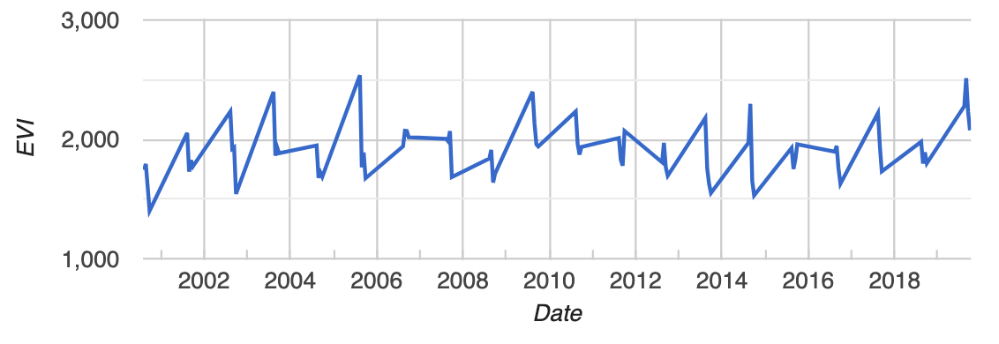
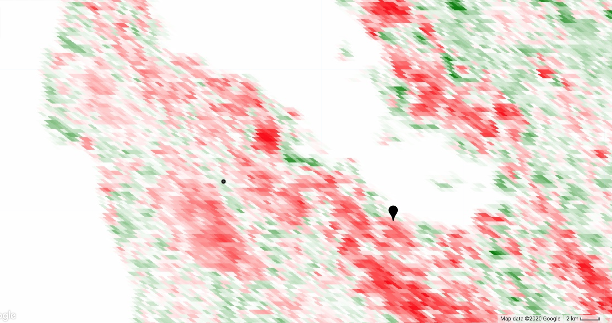
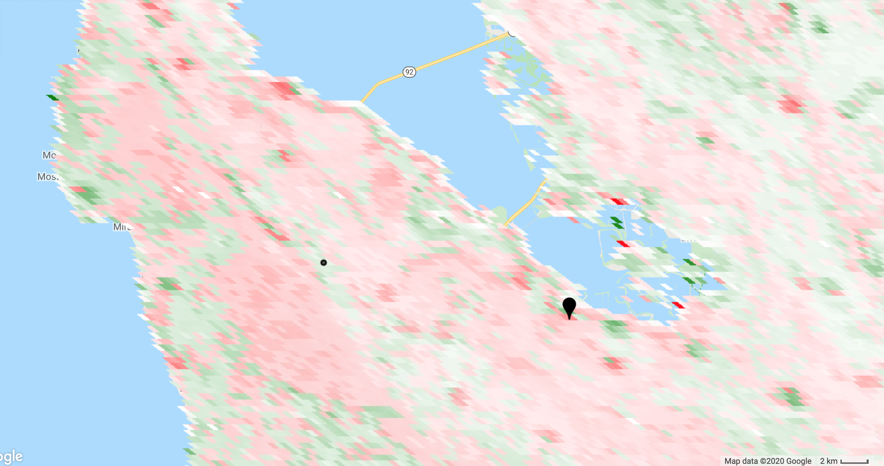
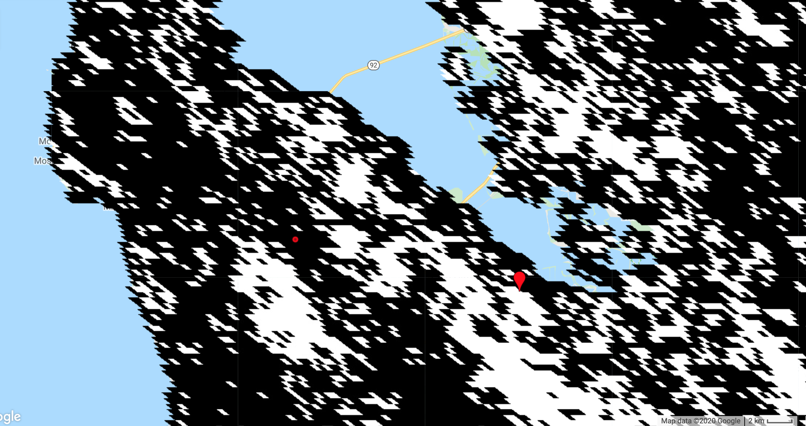

<!--
Copyright 2020 The Google Earth Engine Community Authors

Licensed under the Apache License, Version 2.0 (the "License");
you may not use this file except in compliance with the License.
You may obtain a copy of the License at

    https://www.apache.org/licenses/LICENSE-2.0

Unless required by applicable law or agreed to in writing, software
distributed under the License is distributed on an "AS IS" BASIS,
WITHOUT WARRANTIES OR CONDITIONS OF ANY KIND, either express or implied.
See the License for the specific language governing permissions and
limitations under the License.
-->

Trend analysis is finding places where something of interest is increasing or
decreasing and by how much.  More specifically, this tutorial demonstrates
detecting monotonic trends in imagery using the non-parametric Mann-Kendall
test for the presence of an increasing or decreasing trend and Sen's slope to
quantify the magnitude of the trend (if one exists).  The tutorial also shows
estimating the variance of the Mann-Kendall test statistic, a Z-statistic for
the test of presence of any trend, and a P-value of the statistic (assuming a
normal distribution).  It is important to note that the methods presented here
are suitable for assessing monotonic trends (i.e. data without seasonality)
in discrete data (i.e. not floating point).

## Time series data

We will use a time series of MODIS Enhanced Vegetation Index (EVI) from the
[MOD13A1](https://developers.google.com/earth-engine/datasets/catalog/MODIS_006_MOD13A1)
dataset.  Each pixel of this image collection contains a time series and we
will compute the stats in each pixel.  Assume that filtering the collection to
one season is sufficient to obtain time series with monotonic trends.  To
check the validity of that assumption for your area of interest, add the
collection to the map and using the inspector, click some points and view
the series chart presented in the console.  Adjust the filter as necessary.

```js
var mod13 = ee.ImageCollection('MODIS/006/MOD13A1');
var coll = mod13.select('EVI')
    .filter(ee.Filter.calendarRange(8, 9, 'month'));
Map.addLayer(coll, {}, 'coll');
```

An example EVI time series (one pixel) from this collection is shown below.  Is
there a trend in this pixel?  More importantly, is a there a statistically
significant trend in this pixel?  Read on to find out!



## Join the time series to itself

The non-parametric stats of interest are computed by examining every possible
ordered pair of unique values in the time series.  If there are *n* time points
in the series, we need to examine the *n(n-1)/2* pairs *(i, j)*, *i<j*, where
*i* and *j* are arbitrary time indices.  (Here we use *(i, j)* to signify the
pair of EVI images indexed by *i* and *j*).  To do that, join the collection to
itself with a temporal filter.  The temporal filter will pass all the
chronologically later images.  In the joined collection, each image will
store all the images that come after it in an `after` property.

```js
var afterFilter = ee.Filter.lessThan({
  leftField: 'system:time_start',
  rightField: 'system:time_start'
});

var joined = ee.ImageCollection(ee.Join.saveAll('after').apply({
  primary: coll,
  secondary: coll,
  condition: afterFilter
}));
```

## Mann-Kendall trend test

The Mann-Kendall trend is defined as the sum of the signs of all the pairs.
The `sign` is 1 if EVI at time *j* is more than EVI at time *i*, -1 if the
opposite is true and zero otherwise (if they're equal).  Compute this by
iterating over the collection and computing `sign(i, j)` for each image `i`
in the collection and each image `j` in the `after` images.

```js
var sign = function(i, j) { // i and j are images
  return ee.Image(j).neq(i) // Zero case
      .multiply(ee.Image(j).subtract(i).clamp(-1, 1)).int();
};

var kendall = ee.ImageCollection(joined.map(function(current) {
  var afterCollection = ee.ImageCollection.fromImages(current.get('after'));
  return afterCollection.map(function(image) {
    // The unmask is to prevent accumulation of masked pixels that
    // result from the undefined case of when either current or image
    // is masked.  It won't affect the sum, since it's unmasked to zero.
    return ee.Image(sign(current, image)).unmask(0);
  });
  // Set parallelScale to avoid User memory limit exceeded.
}).flatten()).reduce('sum', 2);

var palette = ['red', 'white', 'green'];
// Stretch this as necessary.
Map.addLayer(kendall, {palette: palette}, 'kendall');
```

Zoom to your area of interest and define a roughly symmetric color stretch
using the map layers styling dialog (i.e. the mean of `min` and `max` should
be approximately zero).  The red pixels are decreasing trend and the green
pixels are increasing trend.  This is illustrated in the following image of
the Mann-Kendall statistic for an area of California, USA.  The map pin is
at the approximate location of the Googleplex.  The dot is the location of
the point from which the time series shown above was extracted.  We'd like
to identify which pixels in this map have significant trend.



You may also be interested in knowing the magnitude of the trend, or the slope
of the trend over time in the present context.  A non-parametric way of
assessing that is with Sen's slope.

## Sen's slope

Sen's slope is computed in a similar way to the Mann-Kendall statistic.
However, instead of adding all the signs of the pairs, the slope is computed
for all the pairs.  Sen's slope is the median slope from all those pairs.  In
the following, slope is computed over days to avoid numerically tiny slopes
(which might result from using epoch time instead).

```js
var slope = function(i, j) { // i and j are images
  return ee.Image(j).subtract(i)
      .divide(ee.Image(j).date().difference(ee.Image(i).date(), 'days'))
      .rename('slope')
      .float();
};

var slopes = ee.ImageCollection(joined.map(function(current) {
  var afterCollection = ee.ImageCollection.fromImages(current.get('after'));
  return afterCollection.map(function(image) {
      return ee.Image(slope(current, image));
  });
}).flatten());

var sensSlope = slopes.reduce(ee.Reducer.median(), 2); // Set parallelScale.
Map.addLayer(sensSlope, {palette: palette}, 'sensSlope');
```

To get Sen's intercept (if you need it), compute all intercepts and take the
median.


```js
var epochDate = ee.Date('1970-01-01');
var sensIntercept = coll.map(function(image) {
  var epochDays = image.date().difference(epochDate, 'days').float();
  return image.subtract(sensSlope.multiply(epochDays)).float();
}).reduce(ee.Reducer.median(), 2);
Map.addLayer(sensIntercept, {}, 'sensIntercept');
```

A map of Sen's slope is shown below.  Note that the pattern is similar to
the Mann-Kendall statistic, but not identical.  Also, there is still the
question of which pixels have significant trend, a question that will
be answered shortly.



The previous examples are only to demonstrate the computation.  If you need
Sen's slope and/or intercept, you can also use the
[Sen's slope reducer](https://developers.google.com/earth-engine/api_docs#ee.reducer.sensslope)
which is likely to be easier (less code) and more efficient, but computes the
intercept as the y-value of the line that passes through the medians.

## Variance of the Mann-Kendall statistic

Computing the variance of the Mann-Kendall statistic is complicated by the
possible presence of ties in the data (i.e. `sign(i, j)` equals zero).
Counting those ties can get a little dicey, requiring an array-based
forward differencing.  Note that you can comment `.subtract(groupFactorSum)`
in the computation of `kendallVariance` if you don't care about ties and
want to disregard that correction.

```js
// Values that are in a group (ties).  Set all else to zero.
var groups = coll.map(function(i) {
  var matches = coll.map(function(j) {
    return i.eq(j); // i and j are images.
  }).sum();
  return i.multiply(matches.gt(1));
});

// Compute tie group sizes in a sequence.  The first group is discarded.
var group = function(array) {
  var length = array.arrayLength(0);
  // Array of indices.  These are 1-indexed.
  var indices = ee.Image([1])
      .arrayRepeat(0, length)
      .arrayAccum(0, ee.Reducer.sum())
      .toArray(1);
  var sorted = array.arraySort();
  var left = sorted.arraySlice(0, 1);
  var right = sorted.arraySlice(0, 0, -1);
  // Indices of the end of runs.
  var mask = left.neq(right)
  // Always keep the last index, the end of the sequence.
      .arrayCat(ee.Image(ee.Array([[1]])), 0);
  var runIndices = indices.arrayMask(mask);
  // Subtract the indices to get run lengths.
  var groupSizes = runIndices.arraySlice(0, 1)
      .subtract(runIndices.arraySlice(0, 0, -1));
  return groupSizes;
};

// See equation 2.6 in Sen (1968).
var factors = function(image) {
  return image.expression('b() * (b() - 1) * (b() * 2 + 5)');
};

var groupSizes = group(groups.toArray());
var groupFactors = factors(groupSizes);
var groupFactorSum = groupFactors.arrayReduce('sum', [0])
      .arrayGet([0, 0]);

var count = joined.count();

var kendallVariance = factors(count)
    .subtract(groupFactorSum)
    .divide(18)
    .float();
Map.addLayer(kendallVariance, {}, 'kendallVariance');
```

## Significance testing

The Mann-Kendall statistic is asymptotically normal for suitably large
samples.  Assume our samples are suitably large and uncorrelated.  Under these
assumptions, the true mean of the Mann-Kendall statistic is zero and the
variance is as computed above.  To compute a standard normal statistic (`z`),
divide the statistic by its standard deviation.  The P-value of the z-statistic
(probability of observing such an extreme value) is *1 - P(|z| < Z)*.  For
a two-sided test of whether any trend exists (positive or negative) at the
95% confidence level, compare the P-value to 0.975.  (Alternatively, compare
the z-statistic to *Z\**, where *Z\** is the inverse distribution function
of 0.975).

The standard normal distribution function can be computed in Earth Engine from
the error function, `erf()`.  Both the distribution function and its inverse
are shown below for reference.  Here we use the distribution function to get
*1 - P(|z| < Z)* and compare it to 0.975.

```js
// Compute Z-statistics.
var zero = kendall.multiply(kendall.eq(0));
var pos = kendall.multiply(kendall.gt(0)).subtract(1);
var neg = kendall.multiply(kendall.lt(0)).add(1);

var z = zero
    .add(pos.divide(kendallVariance.sqrt()))
    .add(neg.divide(kendallVariance.sqrt()));
Map.addLayer(z, {min: -2, max: 2}, 'z');

// https://en.wikipedia.org/wiki/Error_function#Cumulative_distribution_function
function eeCdf(z) {
  return ee.Image(0.5)
      .multiply(ee.Image(1).add(ee.Image(z).divide(ee.Image(2).sqrt()).erf()));
}

function invCdf(p) {
  return ee.Image(2).sqrt()
      .multiply(ee.Image(p).multiply(2).subtract(1).erfInv());
}

// Compute P-values.
var p = ee.Image(1).subtract(eeCdf(z.abs()));
Map.addLayer(p, {min: 0, max: 1}, 'p');

// Pixels that can have the null hypothesis (there is no trend) rejected.
// Specifically, if the true trend is zero, there would be less than 5%
// chance of randomly obtaining the observed result (that there is a trend).
Map.addLayer(p.lte(0.025), {min: 0, max: 1}, 'significant trends');
```

The following shows a map of the "significant" pixels (in white), or the
pixels that pass the `p.lte(0.025)` test.  If our assumptions are correct
and you are satisfied with the computation, you may wish to treat these
pixels differently, by using `p.lte(0.025)` as a mask.  Note that the pixel
with the time series shown above (red in the map below) does NOT have a
significant trend.



Some call this process significance testing.  Pixels that are "significant"
satisfy the condition that `p.lte(0.025)` and are assumed to have a real
trend.  Other pixels are assumed to not have a trend and are removed from
further analysis.  Some consider this process cultish
([Ziliak and McCloskey 2009](https://www.deirdremccloskey.com/docs/jsm.pdf)).
You decide!

## References

- [Thiel. 1950. A rank-invariant method of linear and polynomial regression analysis.](https://link.springer.com/chapter/10.1007/978-94-011-2546-8_20)
- [Sen. 1968. Estimates of the Regression Coefficient Based on Kendall's Tau](https://www.tandfonline.com/doi/abs/10.1080/01621459.1968.10480934)
- [Morell and Fried 2009. On Nonparametric Tests for Trend Detection in Seasonal Time Series](https://link.springer.com/chapter/10.1007/978-3-7908-2121-5_2)
- [Pohlert 2020. Non-Parametric Trend Tests and Change-Point Detection](https://cran.r-project.org/web/packages/trend/vignettes/trend.pdf)
