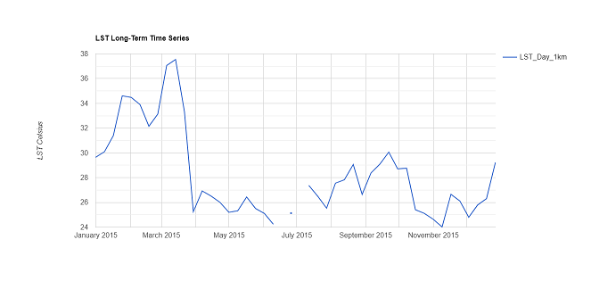
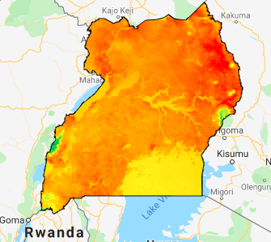

[Open In Code Editor](https://code.earthengine.google.com/1a1f6c705f5ec8e897f319106ef80aef)

Learning objectives:
* Introduce remote sensing data.
* Learn how to obtain and process raster climate data in Google Earth Engine.

Remote sensing (satellite-derived) data are a rich source of information about climate variables, including land cover, vegetation, rainfall, and temperature. Satellite data are available going back to the 1980s in many cases, and so they provide a means for doing historical analyses of changing geographies that can be linked with epidemiologic data for analysis.
In this exercise, we will learn how to acquire remote sensing data from Google Earth Engine. We will learn how to perform time series analysis to study changes in climate variables over our chosen geography and time period. We will also apply some common geospatial procedures (zonal, focal statistics). Finally, we will learn how to export our Earth Engine raster files to Google Drive.

  |   |
:-------------------------:|:-------------------------:|
Time series chart (Land Surface Temperature in Uganda)             |  Heat Map of Land Surface Temperature in Uganda        |


## Writing a simple JavaScript program to extract and process data

We will analyze Land Surface Temperature (LST) data collected using the Moderate Resolution Imaging Spectroradiometer ([MODIS](https://lpdaac.usgs.gov/products/mod11a2v006/)) satellite. This satellite captures images of the Earth’s surface in 1-2 day intervals, with spatial resolution of 1000m. Data are available from March 5, 2000 to present. In addition to temperature, the MODIS satellite captures data on other climate and Earth-based variables (e.g. vegetation indices).
Using the Earth Engine Code Editor, users can manipulate these data over a shorter time period. The tool provides LST long-term and short-term time series for user-defined regions and time periods. This tool will restrict data from March 5, 2000 to present.

### 1. Pull in shape file of Uganda 

In these lines of code, we are creating a new variable called "region". However, now we are pulling in a `FeatureCollection` object, and filtering by ‘Country’ to select ‘Uganda.’ FeatureCollections are groups of features (spatial data and attributes).  `Filter` is the command to extract a specific set of feature data from a feature collection. We then map it.
```javascript
// Import vector file with country boundaries from Earth Engine
var dataset = ee.FeatureCollection('USDOS/LSIB_SIMPLE/2017'); // All countries
var uganda_border = dataset.filter(ee.Filter.eq("country_na","Uganda")); 
// apply filter where "country names" equals "Uganda"
print(uganda_border) 
// print to ensure that new "uganda_border" object just contains polygon for Uganda

// Add region outline to layer - for selected countries
Map.addLayer(uganda_border)
```
### 2. Read in land surface data

Now, we need to read in land surface temperature data. `ImageCollection` objects store collections of images. Using the Earth Engine Data Catalog, we can find different image collections. The `ImageCollection` we are reading in here contains the LST data, but we can read in a different `ImageCollection` for other types of data (e.g. vegetation index, or rain fall, light at night).
Our code applies filters to restrict images for Uganda, within January to December 2015.
```javascript
var modis = ee.ImageCollection('MODIS/MOD11A2'); // read in image collection
var start = ee.Date('2015-01-01'); // set start date
var dateRange = ee.DateRange(start, start.advance(1, 'year'));
// set end date 1 year
var mod11a2 = modis.filterDate(dateRange).filterBounds(uganda_border);
// apply filter on date range, uganda boundary

var modLSTday = mod11a2.select('LST_Day_1km'); // pull just 1km day LST
```
### 3. Create function to convert temperature units

We then need to convert temperature from Kelvin to Celsius. Note that for remote sensing data, sometimes equations required to convert between different units require additional scaling factors, so we should always make sure to check the [documentation](https://icess.eri.ucsb.edu/modis/LstUsrGuide/usrguide_mod11.html#sds) for the specific product we are using when doing conversions.   After referring to the documentation, we learn that in addition to subtracting 273.15, we must multiply the Kelvin value in our MODIS data by a factor of 0.02.

In addition, we will want to keep information about the start and end time for each image in the collection so that we can plot the time series.

We can do both steps at the same time by writing a function to do the conversion, keeping the start and end times using the `copyProperties` function, and then by mapping over the `ImageCollection`. Running this code will generate a new `ImageCollection` called 'modLSTc' (MODIS LST converted) with LST in Celsius, along with the specific time periods we need for the chart.
```javascript
// convert from Kelvin to Celsius and keep start and end times
var modLSTc = modLSTday.map(function(img) {
  return img.multiply(0.02).subtract(273.15).copyProperties(img,['system:time_start','system:time_end']);
}); // this will apply the correction
```
### 4. Describe land surface temperature data using time series

It can be helpful to describe your data using a time series graph. We can plot the mean land surface temperature over the year using the following code. Specifically, we create a new chart called 'TS1' (time series chart 1) using the `ui.Chart.image.series` function. This function takes several arguments. First, we bring in our converted `ImageCollection` (modLSTc). Next, we specify the geographic area by calling our 'ug' feature defining the boundary we are interested in. Next, we apply the `ee.Reducer.mean` function to calculate the mean LST for each image. We specify '1000' as a scale (our LST data have 1km resolution). We then specify the 'system:time_start' as the x-axis for our chart.

Calling the `setOptions` function allows us to specify labels for the title and y-axis of the chart.
```javascript
// Charts Long-term Time Series
var ts1 = ui.Chart.image.series(modLSTc, uganda_border,
 ee.Reducer.mean(), 1000, 'system:time_start').setOptions({
   title: 'LST Long-Term Time Series',
   vAxis: {title: 'LST Celsius'},
 });
 print(ts1);
```

### 5. Visualize processed data on map

The last step allowed us to generate a descriptive time series chart. In addition, we may want to visualize our data on the map. We can take the mean LST in celsius, and clip to Uganda. This code will produce a map of the mean temperatures for us to view in the map window.
```javascript
var clippedLSTc = modLSTc.mean().clip(uganda_border);
// Add clipped image layer to map
Map.addLayer(clippedLSTc, {'min': 0, 'max': 40, 'palette':"blue,limegreen,yellow,darkorange,red"});
```
### 6. Export data for further analysis

Finally, we need to export our raster image file to perform further analysis (e.g. link to participant or clinic data). We can use the export command below to download the processed image data to our Google Drive folder. Concretely, calling `toDrive` will allow the user to save the exported image in their Google Drive folder. You can specify the location when downloading the image from the "Tasks" window in the console. As we have named the "description" 'LST_Celsius_ug', this will be the name of the exported file. You can change the name by changing the 'description'.
```javascript
Export.image.toDrive({
        image: clippedLSTc,
        description: 'LST_Celsius_ug',
        region: uganda_border,
        scale: 1000,
        crs: 'EPSG:4326',
        maxPixels: 1e10,
      });    
```
With that, we have successfully described, processed, and exported land surface temperature data for 2015 in Uganda.
