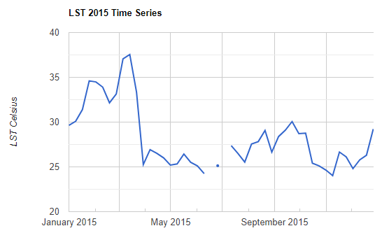
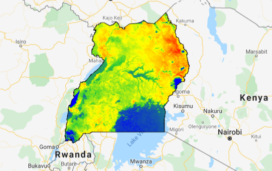

<!--
Copyright 2019 The Google Earth Engine Community Authors

Licensed under the Apache License, Version 2.0 (the "License");
you may not use this file except in compliance with the License.
You may obtain a copy of the License at

    http://www.apache.org/licenses/LICENSE-2.0

Unless required by applicable law or agreed to in writing, software
distributed under the License is distributed on an "AS IS" BASIS,
WITHOUT WARRANTIES OR CONDITIONS OF ANY KIND, either express or implied.
See the License for the specific language governing permissions and
limitations under the License.
-->

[Open In Code Editor](https://code.earthengine.google.com/e702b27b6e794cc496e4e64a7d958435)

Objectives:

* Import land surface temperature (LST) data for one year in Uganda.
* Observe temporal patterns in temperature using a time series chart.
* Calculate mean annual temperature for display and export.

Remote sensing (satellite-derived) data are a rich source of information about
land cover, vegetation, rainfall, temperature, and other climate variables.
Satellite data are available going back to the 1980s in many cases, and so
provide a means for doing historical analyses of changing geographies.

In this exercise, you will learn how to acquire remote sensing data from Google
Earth Engine. You will learn how to perform time series analysis to study
changes in climate variables over a selected geography and time period. You will
also apply some common geospatial procedures (zonal, focal statistics). Finally,
you will learn how to export Earth Engine raster files to Google Drive.

|  |  |
| :---: | :---: |
| Time series of land surface temperature in Uganda | Mean 8-day land surface temperature in Uganda |

## A workflow to explore spatiotemporal temperature patterns

You will analyze land surface temperature (LST) data derived from the
Moderate Resolution Imaging Spectroradiometer
([MODIS](https://lpdaac.usgs.gov/products/mod11a2v006/)) satellites. This
dataset represents an 8-day composite of 1-2 day observation intervals, with
spatial resolution of 1000m. Data are available from March 5, 2000 to present.

In addition to temperature, there are many other MODIS products available in
the [Earth Engine Data Catalog](https://developers.google.com/earth-engine/datasets/catalog/modis).
These datasets can be filtered to your preference of date range and region.
This example will restrict data to all observations in 2015 and focus on
the region of Uganda.

### 1. Define the border of Uganda as a feature

In the following code snippet, you will create a new variable called "region".
Concretely, you are importing a `FeatureCollection` object, and filtering
by "Country" to select "Uganda". FeatureCollections are groups of features
(spatial data and attributes). `Filter` is the method to extract a specific
set of features from a feature collection. You then display it to the map
it using `Map.addLayer()`.

```javascript
// Import country boundaries feature collection.
var dataset = ee.FeatureCollection('USDOS/LSIB_SIMPLE/2017');

// Apply filter where country name equals Uganda.
var ugandaBorder = dataset.filter(ee.Filter.eq('country_na', 'Uganda'));

// Print new "ugandaBorder" object and explorer features and properties.
// There should only be one feature representing Uganda.
print(ugandaBorder);

// Add Uganda outline to the Map as a layer.
Map.centerObject(ugandaBorder, 6);
Map.addLayer(ugandaBorder);
```

### 2. Import land surface temperature data

Next, you need to import land surface temperature data. It is organized as an
`ImageCollection` object, which is a container for a collection of individual
images. The `ImageCollection` you are importing in the following code snippet is
the LST data, but you can use the same method to import an `ImageCollection` for
other types of data (e.g., vegetation index, or rainfall, light at night).
The code below applies a date filter to restrict images to observations within
2015.

```javascript
// Import LST image collection.
var modis = ee.ImageCollection('MODIS/MOD11A2');

// Define a date range of interest; here, a start date is defined and the end
// date is determined by advancing 1 year from the start date.
var start = ee.Date('2015-01-01');
var dateRange = ee.DateRange(start, start.advance(1, 'year'));

// Filter the LST collection to include only images intersecting the desired
// date range.
var mod11a2 = modis.filterDate(dateRange);

// Select only the 1km day LST data band.
var modLSTday = mod11a2.select('LST_Day_1km');
```

### 3. Define a function to convert temperature units

Converting temperature from Kelvin to Celsius will make results easier to
interpret. Note that for remote sensing data, sometimes equations required
to convert between different units have data-specific scaling factors, so
you should always refer to appropriate documentation. In this
case, refer to the MODIS LST User Guide
[documentation](https://icess.eri.ucsb.edu/modis/LstUsrGuide/usrguide_mod11.html#sds).
After referring to the documentation, you will learn that this particular MODIS
data must be multiplied by 0.02 to return the units to Kelvin. Subtract 273.15
to convert Kelvin to Celsius.

In addition, you will need to set the image acquisition time as a property of
the resulting raster. Most image operations generate a new image with only an
index property, so adding additional properties is often a necessary step.
The image acquisition time will serve as the x-axis variable in time series
plotting.

Both steps can be accomplished together by wrapping them in a single
function that performs the conversion, and sets the start times using the
`copyProperties()` image method. Map the function over the `ImageCollection` to
apply it to all images. Running this code will generate a new `ImageCollection`
called "modLSTc" (MODIS LST converted) with LST in Celsius, along with the
specific start time needed for the chart.

```javascript
// Scale to Kelvin and convert to Celsius, set image acquisition time.
var modLSTc = modLSTday.map(function(img) {
  return img
    .multiply(0.02)
    .subtract(273.15)
    .copyProperties(img, ['system:time_start']);
});
```

### 4. Chart land surface temperature as a time series

It can be helpful to describe your data using a time series graph. You can plot
the mean land surface temperature over the year using the following code.
Specifically, you will create a new chart called "TS1" (time series chart 1)
using the `ui.Chart.image.series()` function. This function takes several
arguments. First, you provide your converted `ImageCollection` (modLSTc). Next,
you specify the geographic area by calling your `ugandaBorder` feature defining
the boundary you are interested in. Next, you apply the `ee.Reducer.mean()`
function to calculate the mean LST for each image. Specify 1000 (meters) as the
scale (the LST data have 1km resolution). You should then specify the
`'system:time_start'` as the x-axis for your chart.

Calling the `setOptions` method allows you to specify labels for the title
and y-axis of the chart.

```javascript
// Chart time series of LST for Uganda in 2015.
var ts1 = ui.Chart.image.series({
  imageCollection: modLSTc,
  region: ugandaBorder,
  reducer: ee.Reducer.mean(),
  scale: 1000,
  xProperty: 'system:time_start'})
  .setOptions({
     title: 'LST 2015 Time Series',
     vAxis: {title: 'LST Celsius'}});
print(ts1);
```

### 5. Visualize temperature data on the map

The previous step generated a descriptive time series chart. In
addition, you may want to visualize your data on the map. You can take the mean
LST in Celsius, and clip it to Uganda. The following code produces a map of
mean temperature.

```javascript
// Calculate 8-day mean temperature for Uganda in 2015.
var clippedLSTc = modLSTc.mean().clip(ugandaBorder);

// Add clipped image layer to the map.
Map.addLayer(clippedLSTc, {
  min: 20, max: 40,
  palette: ['blue', 'limegreen', 'yellow', 'darkorange', 'red']},
  'Mean temperature, 2015');
```

### 6. Export data for further analysis

Finally, you can export your raster image file to perform further analysis in a
GIS. You can use the export command below to export the processed image data to
your Google Drive account. Concretely, calling `Export.image.toDrive()` will
allow you to save the exported image in a Google Drive folder. The location
is specified by the `folder` argument. As you have defined the `description` as
"LST_Celsius_ug", this will be the name of the exported file. You can change the
name by changing the `description` argument.

```javascript
// Export the image to your Google Drive account.
Export.image.toDrive({
  image: clippedLSTc,
  description: 'LST_Celsius_ug',
  folder: 'my_folder',
  region: ugandaBorder,
  scale: 1000,
  crs: 'EPSG:4326',
  maxPixels: 1e10});
```

With that, you have successfully described, processed, and exported land surface
temperature data for 2015 in Uganda.

