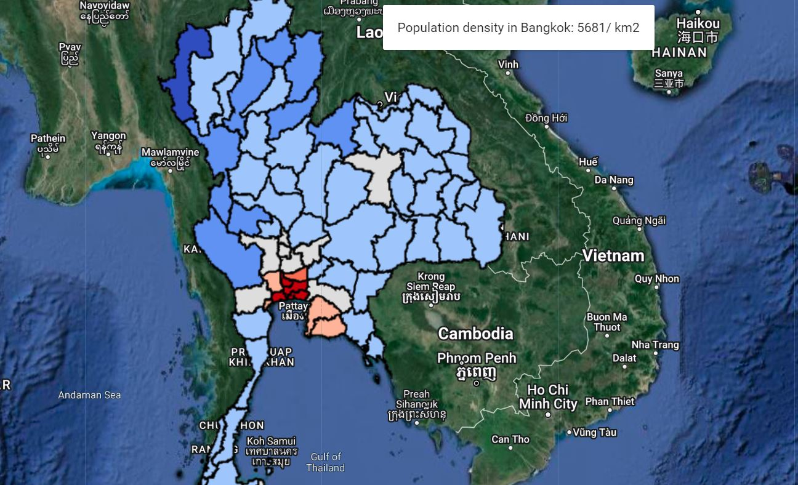

<!--
Copyright 2019 The Google Earth Engine Community Authors

Licensed under the Apache License, Version 2.0 (the "License");
you may not use this file except in compliance with the License.
You may obtain a copy of the License at

    http://www.apache.org/licenses/LICENSE-2.0

Unless required by applicable law or agreed to in writing, software
distributed under the License is distributed on an "AS IS" BASIS,
WITHOUT WARRANTIES OR CONDITIONS OF ANY KIND, either express or implied.
See the License for the specific language governing permissions and
limitations under the License.
-->

## Context

Understanding social demographics is crucial for assessing the interactions between natural processes and human activities, such as in hazard risk assessment. A choropleth map is a statistical thematic map that uses colors corresponding to an aggregate summary of a geographic characteristic. It's a visually effective approach to convey a large amount of information within political administrative units.

This tutorial demonstrates the creation of such maps using the [Gridded Population of the World (GPW)](https://sedac.ciesin.columbia.edu/data/collection/gpw-v4) collection for 2020, which models the distribution of population on a continuous global surface with 30 arc-second (approximately 1km) grid cells. It also showcases the creation of an interactive tool to retrieve values of polygons by clicking on the map, which can be useful in an app application.

The general workflow is as follows:

1. Define the study site (Thailand) for analysis.
2. Compute zonal statistics from population data.
3. Create a choropleth map from zonal statistics.
4. Apply functions to display the choropleth map.
5. Add an interactive inspector widget to retrieve population density from map clicks.

<br>


Conceptual figures sourced from [GISGeography](https://gisgeography.com/wp-content/uploads/2016/08/Featured-Choropleth-Map.png)

<br>

## (1) Defining Study Site

To create a choropleth map, we need polygon layers defining the region boundary. 
In this tutorial, we'll work with administrative level 1 polygons for Thailand from the geoBoundaries Global Database of 
Political Administrative Boundaries (Runfola et al., 2020). Users can adjust the study country by altering the 
country code.

The admin1 FeatureCollection comprises administrative units of various countries, grouped and identified by several properties. 
For instance, consider the example below:

* shapeGroup: THA
* shapeID: THA-ADM1-1590546715-B4
* shapeISO: TH-39
* shapeName: Nong Bua Lam Phu Province
* shapeType: ADM1

To filter only the provinces in Thailand, we need to retrieve all features with a shapeGroup corresponding to "THA". 
You can find the corresponding alpha-3 code for Thailand at [this link](https://www.iban.com/country-codes). Afterward, we'll center the basemap on our study country.

```javascript
// Load administrative boundaries for Thailand
var admin1 = ee.FeatureCollection("projects/sat-io/open-datasets/geoboundaries/HPSCGS-ADM1");
var geometry = admin1.filter(ee.Filter.eq('shapeGroup', 'THA'));

// Center the map on Thailand
Map.centerObject(geometry, 6);

// Set map display with satellite background
Map.setOptions('HYBRID');
```

## (2) Zonal statistics of population density

Zonal statistics summarize the properties of raster datasets within specified zones or regions. 
In this application, we'll compute population density from the GPW data and summarize it for each province.
We'll first create a function for computing zonal statistics to organize the workflow.

```javascript
// Function to compute zonal population density
function zonal_pop_density(geometry) {
    
    // Load GPW dataset: data source for population count
    var dataset = ee.ImageCollection("CIESIN/GPWv411/GPW_Population_Count")
                    .limit(1, 'system:time_start', false) // reverse sort
                    .first(); // data available for several years, the latest image corresponds to 2020
    var pop = dataset.select('population_count').clip(geometry); // get image for Thailand only
    
    // Apply moving window: to sum up population count for each grid of 1 km2,
    // we need to create a kernel covering the grid size
    // Define a kernel to convert count to population per km square
    var kernelSize = ee.Kernel.square({
      radius: 1000, // square length equals 1000 m to cover 1 square kilometer
      units: 'meters',
      normalize: true
    });
    
    // Compute density: Summing up the population counts within the kernel
    var pop_density = pop.reduceNeighborhood({
      reducer: ee.Reducer.sum(),
      kernel: kernelSize
    });
    
    // Zonal statistics: Reduce population density to administrative units and compute mean
    var zonal_stats = pop_density.reduceRegions({
      collection: geometry, // reduce it to the admin 1 boundaries
      reducer:  ee.Reducer.mean().setOutputs(['pop_per_km']) // output named as pop_per_km
    });
    
    // Return outputs
    return zonal_stats;
  }
```

## (3) Creating a choropleth map

After computing zonal statistics, with individual values computed for each polygon,
we'll create a choropleth map, which is essentially a polygon map colored based on its values in the predefined scale. 
To do so, we'll set up the color scale, compute colors to be displayed for each province, then use these colors for the map.

```javascript
// Function to create a choropleth map
function choropleth_map(
  vector, // admin 1 features
  attribute, // 'pop_per_km'
  palette, // color scale
  title // output layer name
  ) {
  
  // Convert palette to a list
  var colors = ee.List(palette);
  // Convert admin 1 polygons to a FeatureCollection
  var zone = ee.FeatureCollection(vector);

  // Compute minimum and maximum attribute values (population density)
  var min_val = ee.Number(vector.aggregate_min(attribute).getInfo());
  var max_val = ee.Number(vector.aggregate_max(attribute).getInfo());
  
  // Get index in logarithmic scale
  // To enhance visuals, we use a logarithmic scale interpolation instead of linear interpolation
  // We'll define a function to perform this task.
  
  // Function to get the index of a value based on a logarithmic scale
  var get_index = function(value) {
      var class_n = palette.length; // number of classes in the choropleth map
  
      // Calculate logarithms of min and max
      var log_min = min_val.log();
      var log_max = max_val.log();
  
      // Calculate logarithmic step
      var log_step = (log_max.subtract(log_min)).divide(class_n);
  
      // Calculate logarithm of the input value
      var log_value = value.log();
  
      // Calculate the index in integers based on the logarithmic scale
      var index = (log_value.subtract(log_min)).divide(log_step).round();
  
      // Clamp the index within the range
      var index_clamp = index.clamp(0, ee.Number(class_n).subtract(1));
  
      return index_clamp;
  };
  
  // Apply the get_index function to each feature in the FeatureCollection
  zone = zone.map(function(f) {
    var value = f.getNumber(attribute); // get polygon value
    var index = get_index(value); // get index to retrieve color
    
    var color = colors.get(index); // retrieve corresponding color for the map
    return f.set('style', {fillColor: color}); // use color to fill the polygons
    });
  
  // Style the FeatureCollection based on the computed colors
  var VisCustom = zone.style({
    styleProperty: 'style'
  });

  // Add the styled FeatureCollection to the map
  Map.addLayer(VisCustom, {}, title);
  
  // Define visualization parameters
  var vis = {
    min: vector.aggregate_min(attribute).getInfo(),
    max: vector.aggregate_max(attribute).getInfo(),
    palette: palette
  };

}
```

## (4) Apply Functions

With functions for both computing zonal statistics and displaying the choropleth map, 
we can apply the functions with our data.

```javascript
// Define parameters

// Coolwarm color map with 7 classes
var palette = ['#3B4CC0', '#6F91F2', '#A9C5FC', '#DDDDDD', '#F6B69B', '#E6745B', '#B40426'];
var title = "Population Density"; // name of the output layer
  
// Compute zonal statistics
var pop_density = zonal_pop_density(geometry);

// Add a choropleth map using computed statistics
var attribute = "pop_per_km";

choropleth_map(
    pop_density, 
    attribute,
    palette,
    title
  );

```

<br>

## (5) Interactive Inspector Widgets

We have our map displayed. Now, let's add an interactive widget that allows users to click on map polygons to display values in a small panel.

```javascript
// Add a panel to the map with an initial message
var inspector = ui.Panel([ui.Label('Click on the district')]);
Map.add(inspector);

// Listen for map clicks
Map.onClick(function(coords) {
  // Show loading label
  inspector.widgets().set(0, ui.Label({
    value: 'Loading...',
    style: {color: 'gray'}
  }));

  // Create a point geometry from the clicked location
  var click_point = ee.Geometry.Point(coords.lon, coords.lat);

  // Extract district names and population densities for the clicked location
  var district = pop_density.reduceColumns(ee.Reducer.toList(), ['shapeName']).get('list');
  var density_feature = pop_density.reduceColumns(ee.Reducer.toList(), ['pop_per_km']).get('list');

  // Convert the full district list to a FeatureCollection
  var district_list = pop_density.toList(pop_density.size());
  
  // Find the index of the clicked district
  var retIdx = district_list.map(function(element) { // check for each polygon if it contains the point
    var idx = district_list.indexOf(element);
    return ee.Algorithms.If(ee.Feature(element).contains(click_point), idx, 0); // get index
  }).removeAll([0]); // remove irrelevant checks

  // Initialize variables
  var name = "";
  var density = "NA";
  
  // Check if a district is found at the clicked location
  if (retIdx.size().getInfo() > 0) {
    // Extract district name and density
    // Get the district name from the 'district' list using 'retIdx'
    name = ee.List(district) // Access the list of districts from geoBoundaries
              .get(retIdx.get(0).getInfo()) // Get name element
              .getInfo(); // JavaScript object

    // Get the population density
    density = ee.List(density_feature) // Access the 'density_feature' list
                  .get(retIdx.get(0).getInfo()) // Get element
                  .getInfo() // JavaScript object
                  .toFixed(0); // Round value to an integer
  }

  // Display district name and population density
  inspector.widgets().set(0, ui.Label({
    value: "Population density in " + name + ": " + density + "/ km2"
  }));
   
});

```



In this tutorial, we successfully create a choropleth map using available population data. 
Users can adjust parameters such as color map, data layers, and study regions to explore different insights from diverse datasets.

<br>

## Acknowledgements

Ka Hei Chow devised this tutorial. 

<br>

## References

Center for International Earth Science Information Network - CIESIN - Columbia University. 2018. 
Gridded Population of the World, Version 4 (GPWv4): Population Count, Revision 11. Palisades, NY: 
NASA Socioeconomic Data and Applications Center (SEDAC). https://doi.org/10.7927/H4JW8BX5. 
Accessed DAY MONTH YEAR.

Runfola D, Anderson A, Baier H, Crittenden M, Dowker E, Fuhrig S, et al. (2020)
geoBoundaries: A global database of political administrative boundaries. PLoS ONE 15(4):
e0231866. https://doi.org/10.1371/journal.pone.0231866
```
