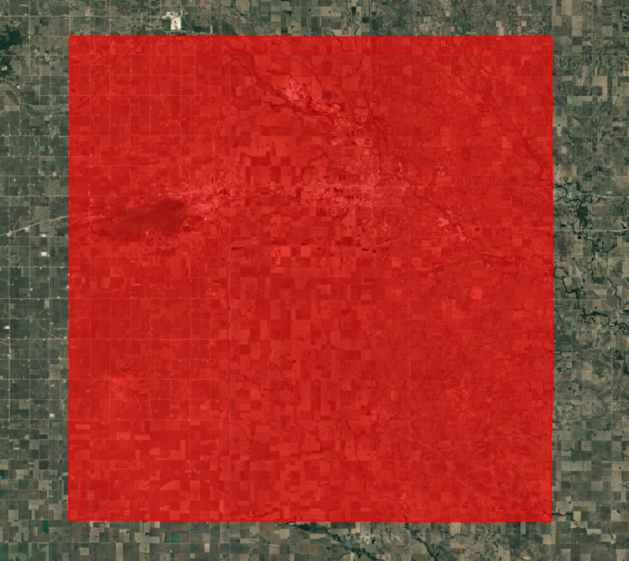
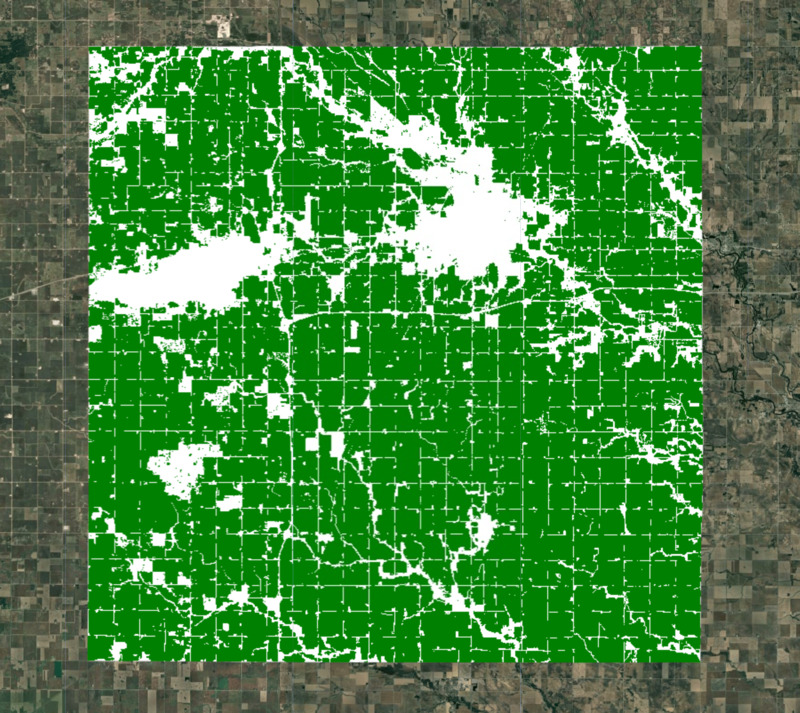
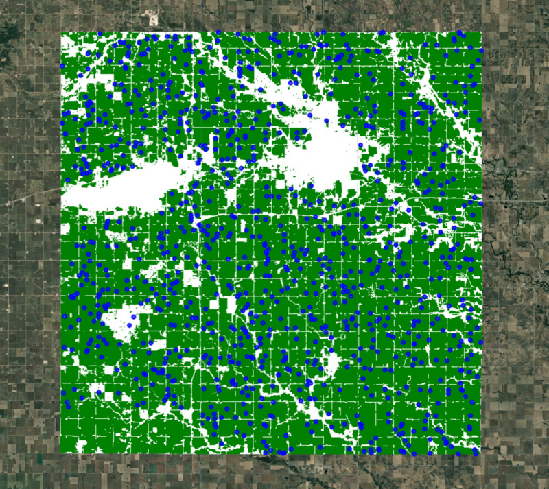
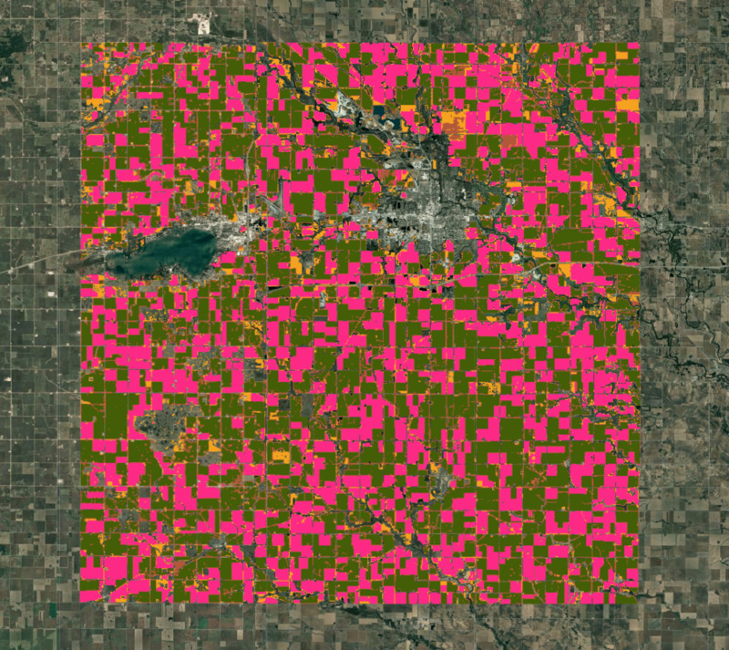
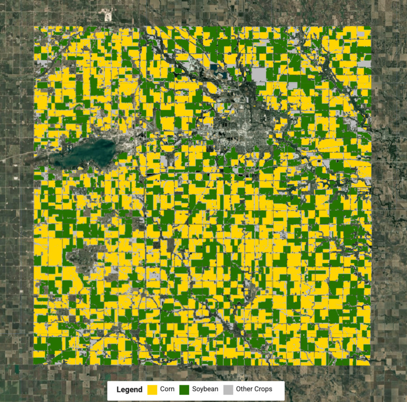
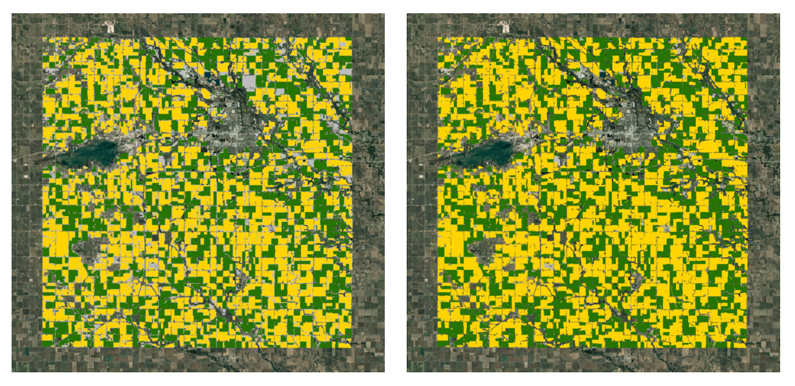

<!--
Copyright 2025 The Google Earth Engine Community Authors

Licensed under the Apache License, Version 2.0 (the "License");
you may not use this file except in compliance with the License.
You may obtain a copy of the License at

    http://www.apache.org/licenses/LICENSE-2.0

Unless required by applicable law or agreed to in writing, software
distributed under the License is distributed on an "AS IS" BASIS,
WITHOUT WARRANTIES OR CONDITIONS OF ANY KIND, either express or implied.
See the License for the specific language governing permissions and
limitations under the License.
-->

_This tutorial is part of a series of tutorials on the Satellite Embedding dataset, see also
[Introduction](/earth-engine/tutorials/community/satellite-embedding-01-introduction),
[Supervised Classification](/earth-engine/tutorials/community/satellite-embedding-03-supervised-classification), [Regression](/earth-engine/tutorials/community/satellite-embedding-04-regression) and [Similarity Search](/earth-engine/tutorials/community/satellite-embedding-05-similarity-search)._

In the [previous tutorial](/earth-engine/tutorials/community/satellite-embedding-01-introduction) (Introduction), we saw how Satellite Embeddings capture annual trajectories of satellite observations and climate variables. This makes the dataset readily usable for mapping crops without the need to model crop phenology. Crop type mapping is a challenging task that typically requires modeling crop phenology and collecting field samples for all crops grown in the region.

In this tutorial, we will take an unsupervised classification approach to crop mapping that enables us to perform this complex task without relying on field labels. This method leverages local knowledge of the region along with aggregate crop statistics, which are readily available for many parts of the world.

## Select a region

For this tutorial, we will create a crop type map for Cerro Gordo County, Iowa. This county is in the corn belt of the United States which has two primary crops: corn and soybean. This local knowledge is important and will help us decide on key parameters for our model.

Let’s start by obtaining the boundary for the chosen county.

```js
// Select the region
// Cerro Gordo County, Iowa
var counties = ee.FeatureCollection('TIGER/2018/Counties');

var selected = counties
  .filter(ee.Filter.eq('GEOID', '19033'));
var geometry = selected.geometry();
Map.centerObject(geometry, 12);
Map.addLayer(geometry, {color: 'red'}, 'Selected Region', false);
```

<br>
_Figure: Selected region_

## Prepare the Satellite Embedding dataset

Next, we load the Satellite Embedding dataset, filter for images for the chosen year and create a mosaic.

```js
var embeddings = ee.ImageCollection('GOOGLE/SATELLITE_EMBEDDING/V1/ANNUAL');

var year = 2022;
var startDate = ee.Date.fromYMD(year, 1, 1);
var endDate = startDate.advance(1, 'year');

var filteredembeddings = embeddings
  .filter(ee.Filter.date(startDate, endDate))
  .filter(ee.Filter.bounds(geometry));

var embeddingsImage = filteredembeddings.mosaic();
```

## Create a cropland mask

For our modeling, we need to exclude non-cropland areas. There are many global and regional datasets that can be used to create a crop mask. [ESA WorldCover](https://developers.google.com/earth-engine/datasets/catalog/ESA_WorldCover_v200) or [GFSAD Global Cropland Extent Product](https://gee-community-catalog.org/projects/gcep30/) are good choices for global cropland datasets. A more recent addition is the [ESA WorldCereal Active Cropland](https://developers.google.com/earth-engine/datasets/catalog/ESA_WorldCereal_2021_MARKERS_v100) product which has seasonal mapping of active croplands. Since our region is in the US, we can use a more accurate regional dataset [USDA NASS Cropland Data Layers](https://developers.google.com/earth-engine/datasets/catalog/USDA_NASS_CDL) (CDL) to obtain a crop mask.

```js
// Use Cropland Data Layers (CDL) to obtain cultivated cropland
var cdl = ee.ImageCollection('USDA/NASS/CDL')
  .filter(ee.Filter.date(startDate, endDate))
  .first();
var cropLandcover = cdl.select('cropland');
var croplandMask = cdl.select('cultivated').eq(2).rename('cropmask');

// Visualize the crop mask
var croplandMaskVis = {min: 0, max: 1, palette: ['white', 'green']};
Map.addLayer(croplandMask.clip(geometry), croplandMaskVis, 'Crop Mask');
```

<br>
_Figure: Selected region with cropland mask_

## Extract training samples

We apply the cropland mask to the embedding mosaic. We are now left with all the pixels representing cultivated cropland in the county.

```js
// Mask all non-cropland pixels
var clusterImage = embeddingsImage.updateMask(croplandMask);
```

We need to take the Satellite Embedding image and obtain random samples to train a clustering model. Since our region of interest contains many masked pixels, a simple random sampling may result in samples with null values. To ensure we can extract the desired number of non-null samples, we use stratified sampling to obtain the desired number of samples in unmasked areas.

```js
// Stratified random sampling
var training = clusterImage.addBands(croplandMask).stratifiedSample({
  numPoints: 1000,
  classBand: 'cropmask',
  region: geometry,
  scale: 10,
  tileScale: 16,
  seed: 100,
  dropNulls: true,
  geometries: true
});
```

## Export sample to an asset (optional)

Tip: This example is designed to work interactively, but may not scale to larger regions and/or numbers of samples. In this case, you can use an export to overcome scaling issues.

Extracting samples is a computationally expensive operation, and it is a [good practice to export](https://developers.google.com/earth-engine/guides/best_practices#use_export) the extracted training samples as Assets and use the exported assets in subsequent steps. This will help overcome *computation timed out* or *user memory exceeded errors* when working with large regions.

Start the export task and wait for it to finish before proceeding further.

```js
// Replace this with your asset folder
// The folder must exist before exporting
var exportFolder = 'projects/spatialthoughts/assets/satellite_embedding/';

var samplesExportFc = 'cluster_training_samples';
var samplesExportFcPath = exportFolder + samplesExportFc;

Export.table.toAsset({
  collection: training,
  description: 'Cluster_Training_Samples',
  assetId: samplesExportFcPath
});
```

Once the export task is completed, we can read the extracted samples back into our code as a feature collection.

```js
// Use the exported asset
var training = ee.FeatureCollection(samplesExportFcPath);
```

## Visualize the samples

Whether you ran your sample interactively or exported to a feature collection, you will now have a training variable with your sample points. Let’s print the first sample to inspect and add our training points to the `Map`.

```js
print('Extracted sample', training.first());
Map.addLayer(training, {color: 'blue'}, 'Extracted Samples', false);
```

<br>
_Figure: Extracted random samples for clustering_

## Perform unsupervised clustering

We can now train a clusterer and group the 64D embedding vectors into a chosen number of distinct clusters. Based on our local knowledge, there are two main types of crops representing the  majority of the area with several other crops covering the remaining fraction. We can perform unsupervised clustering on the Satellite Embedding to obtain clusters of pixels that have similar temporal trajectories and patterns. Pixels with similar spectral and spatial characteristics along with similar phenology will be grouped in the same cluster.

The `ee.Clusterer.wekaCascadeKMeans()` allows us to specify a minimum and maximum number of clusters and find the optimal number of clusters based on the training data. Here our local knowledge comes in handy to decide the minimum and maximum number of clusters. Since we expect a few distinct types of clusters - corn, soybean, and several other crops - we can use 4 as the minimum number of clusters and 5 as the maximum number of clusters. You may have to experiment with these numbers to find out what works best for your region.

```js
// Cluster the Satellite Embedding Image
var minClusters = 4;
var maxClusters = 5;

var clusterer = ee.Clusterer.wekaCascadeKMeans({
  minClusters: minClusters, maxClusters: maxClusters}).train({
  features: training,
  inputProperties: clusterImage.bandNames()
});

var clustered = clusterImage.cluster(clusterer);
Map.addLayer(clustered.randomVisualizer().clip(geometry), {}, 'Clusters');
```

<br>
_Figure: Clusters obtained from unsupervised classification_

## Assign labels to clusters

Upon visual inspection, the clusters obtained in the previous steps match closely with the farm boundaries seen in the high-resolution image. We know from local knowledge that the two largest clusters would be corn and soybean. Let’s compute the areas of each cluster in our image.

```js
// Calculate Cluster Areas
// 1 Acre = 4046.86 Sq. Meters
var areaImage = ee.Image.pixelArea().divide(4046.86).addBands(clustered);

var areas = areaImage.reduceRegion({
      reducer: ee.Reducer.sum().group({
      groupField: 1,
      groupName: 'cluster',
    }),
    geometry: geometry,
    scale: 10,
    maxPixels: 1e10
    });

var clusterAreas = ee.List(areas.get('groups'));

// Process results to extract the areas and create a FeatureCollection

var clusterAreas = clusterAreas.map(function(item) {
  var areaDict = ee.Dictionary(item);
  var clusterNumber = areaDict.getNumber('cluster').format();
  var area = areaDict.getNumber('sum');
  return ee.Feature(null, {cluster: clusterNumber, area: area});
});

var clusterAreaFc = ee.FeatureCollection(clusterAreas);
print('Cluster Areas', clusterAreaFc);
```

We pick the 2 clusters with the highest area.

```js
var selectedFc = clusterAreaFc.sort('area', false).limit(2);
print('Top 2 Clusters by Area', selectedFc);
```

But we still do not know which cluster is what crop. If you had a few field samples of corn or soybeans, you could overlay them on the clusters to figure out their respective labels. In the absence of field samples, we can leverage aggregate crop statistics. In many parts of the world, aggregate crop statistics are collected and published regularly. For the US, the National Agricultural Statistics Service (NASS) has detailed crop statistics for each county and each major crop. For the year 2022, Cerro Gordo County, Iowa had a [Corn Planted Area](https://www.nass.usda.gov/Statistics_by_State/Iowa/Publications/County_Estimates/2023/IA-CtyEst-Corn-02-23.pdf) of 161,500 acres and [Soybean Planted Area](https://www.nass.usda.gov/Statistics_by_State/Iowa/Publications/County_Estimates/2023/IA-CtyEst-Soybeans-02-23.pdf) of 110,500 acres.

Using this information, we now know that among the top 2 clusters, the one with the largest area will more than likely be corn and the other one soybean. Let’s assign these labels and compare the computed areas with the published statistics.

```js
var cornFeature = selectedFc.sort('area', false).first();
var soybeanFeature = selectedFc.sort('area').first();
var cornCluster = cornFeature.get('cluster');
var soybeanCluster = soybeanFeature.get('cluster');

print('Corn Area (Detected)', cornFeature.getNumber('area').round());
print('Corn Area (From Crop Statistics)', 163500);

print('Soybean Area (Detected)', soybeanFeature.getNumber('area').round());
print('Soybean Area (From Crop Statistics)', 110500);
```

## Create a crop map

We now know the labels for each cluster and can extract the pixels for each crop type and merge them to create the final crop map.

```js
// Select the clusters to create the crop map
var corn = clustered.eq(ee.Number.parse(cornCluster));
var soybean = clustered.eq(ee.Number.parse(soybeanCluster));

var merged = corn.add(soybean.multiply(2));
var cropVis = {min: 0, max: 2, palette: ['#bdbdbd', '#ffd400', '#267300']};
Map.addLayer(merged.clip(geometry), cropVis, 'Crop Map (Detected)');
```

To help interpret the results, we can also use UI elements create and add a legend to the map.

```js
// Add a Legend
var legend = ui.Panel({
  layout: ui.Panel.Layout.Flow('horizontal'),
  style: {position: 'bottom-center', padding: '8px 15px'}});

var addItem = function(color, name) {
  var colorBox = ui.Label({
    style: {color: '#ffffff',
      backgroundColor: color,
      padding: '10px',
      margin: '0 4px 4px 0',
    }
  });
  var description = ui.Label({
    value: name,
    style: {
      margin: '0px 10px 0px 2px',
    }
  });
  return ui.Panel({
    widgets: [colorBox, description],
    layout: ui.Panel.Layout.Flow('horizontal')
  });
};

var title = ui.Label({
  value: 'Legend',
  style: {
    fontWeight: 'bold',
    fontSize: '16px',
    margin: '0px 10px 0px 4px'
  }
});

legend.add(title);
legend.add(addItem('#ffd400', 'Corn'));
legend.add(addItem('#267300', 'Soybean'));
legend.add(addItem('#bdbdbd', 'Other Crops'));

Map.add(legend);
```

<br>
_Figure: Detected crop map with corn and soybean crops_

## Validate the results

We were able to obtain a crop type map with the Satellite Embedding dataset without any field labels using just the aggregate statistics and local knowledge of the region. Let’s compare our results with the official crop type map from USDA NASS Cropland Data Layers (CDL).

```js
var cdl = ee.ImageCollection('USDA/NASS/CDL')
  .filter(ee.Filter.date(startDate, endDate))
  .first();
var cropLandcover = cdl.select('cropland');
var cropMap = cropLandcover.updateMask(croplandMask).rename('crops');

// Original data has unique values for each crop ranging from 0 to 254
var cropClasses = ee.List.sequence(0, 254);
// We remap all values as following
// Crop     | Source Value | Target Value
// Corn     | 1            | 1
// Soybean  | 5            | 2
// All other| 0-255        | 0
var targetClasses = ee.List.repeat(0, 255).set(1, 1).set(5, 2);
var cropMapReclass = cropMap.remap(cropClasses, targetClasses).rename('crops');

var cropVis = {min: 0, max: 2, palette: ['#bdbdbd', '#ffd400', '#267300']};
Map.addLayer(cropMapReclass.clip(geometry), cropVis, 'Crop Landcover (CDL)');
```

<br>
_Figure: (left) crop map from satellite embeddings (right) crop map from CDL_

While there are discrepancies between our results and the official map, you will notice that we were able to obtain pretty good results with minimal effort. By applying [post-processing steps](https://courses.spatialthoughts.com/end-to-end-gee-supplement.html#post-processing-classification-results) to the results, we can remove some noise and fill gaps in the output.

[Try the full script for this tutorial in the Earth Engine Code Editor](https://code.earthengine.google.com/d793062fb931035d9eb7a0272550cc96).
