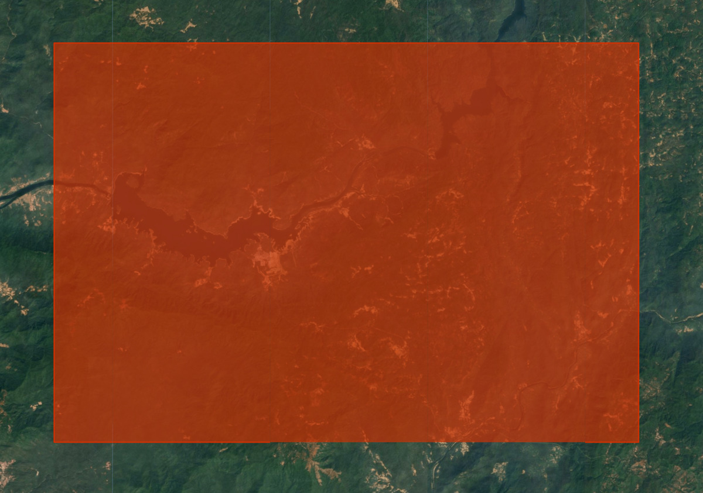
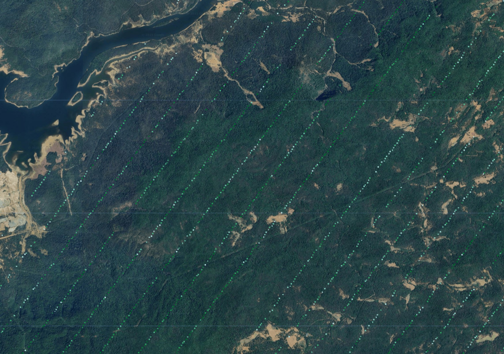
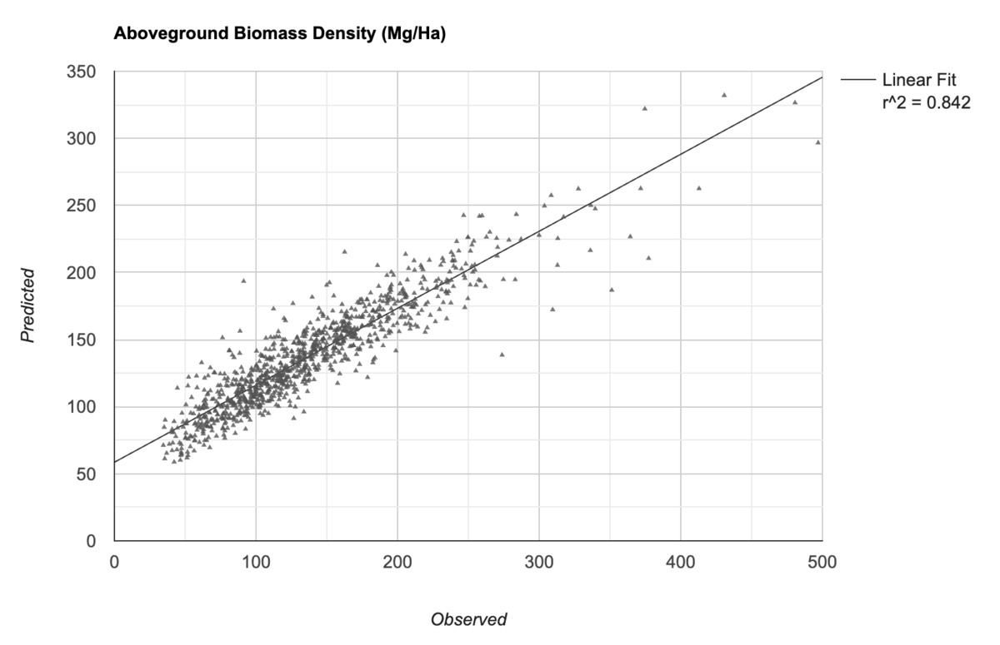
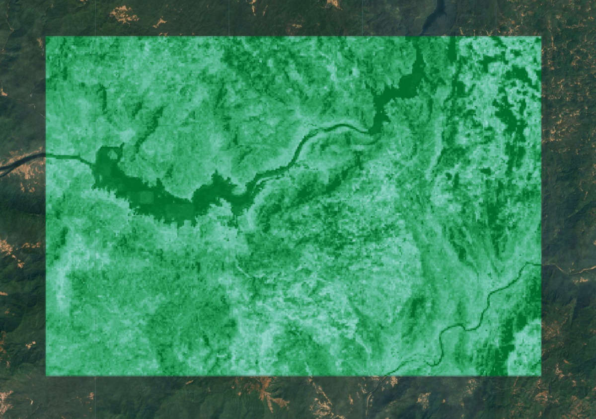
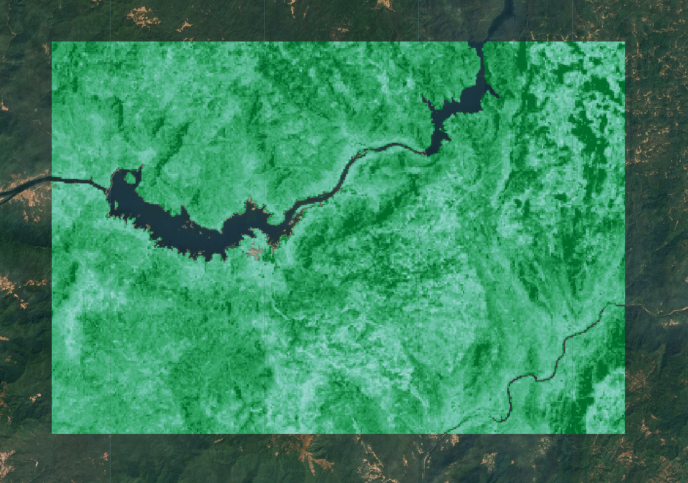

<!--
Copyright 2025 The Google Earth Engine Community Authors

Licensed under the Apache License, Version 2.0 (the "License");
you may not use this file except in compliance with the License.
You may obtain a copy of the License at

    http://www.apache.org/licenses/LICENSE-2.0

Unless required by applicable law or agreed to in writing, software
distributed under the License is distributed on an "AS IS" BASIS,
WITHOUT WARRANTIES OR CONDITIONS OF ANY KIND, either express or implied.
See the License for the specific language governing permissions and
limitations under the License.
-->

_This tutorial is part of a series of tutorials on the Satellite Embedding dataset, see also
[Introduction](/earth-engine/tutorials/community/satellite-embedding-01-introduction),
[Unsupervised Classification](/earth-engine/tutorials/community/satellite-embedding-02-unsupervised-classification), [Supervised Classification](/earth-engine/tutorials/community/satellite-embedding-03-supervised-classification) and [Similarity Search](/earth-engine/tutorials/community/satellite-embedding-05-similarity-search)._

Embedding fields can be used as feature inputs/predictors for regression in the same way they’re used for classification.

In this tutorial, we will learn how to use the 64D embedding field layers as inputs to a multiple regression analysis predicting above-ground biomass (AGB).

NASA’s [Global Ecosystem Dynamics Investigation](https://gedi.umd.edu/) (GEDI) mission collects LIDAR measurements along ground transects at 30 m spatial resolution at 60 m intervals. We will use the [GEDI L4A Raster Aboveground Biomass Density](https://developers.google.com/earth-engine/datasets/catalog/LARSE_GEDI_GEDI04_A_002_MONTHLY) dataset containing point estimates of above ground biomass density (AGBD) that will be used as the predicted variable in the regression model.

## Select a region

Let’s start by defining a region of interest. For this tutorial, we will pick a region in the Western Ghats of India and define a polygon as the geometry variable. Alternatively, you can use the Drawing Tools in the Code Editor to draw a polygon around the region of interest that will be saved as the geometry variable in the Imports. We also use the Satellite basemap, which makes it easy to locate vegetated areas.

```js
var geometry = ee.Geometry.Polygon([[
  [74.322, 14.981],
  [74.322, 14.765],
  [74.648, 14.765],
  [74.648, 14.980]
]]);

// Use the satellite basemap
Map.setOptions('SATELLITE');
```

<br>
_Figure: Selecting the area of interest for above ground biomass prediction_

## Select a time period

Pick a year for which we want to run the regression. Remember that Satellite Embeddings are aggregated at yearly intervals so we define the period for the entire year.

```js
var startDate = ee.Date.fromYMD(2022, 1, 1);
var endDate = startDate.advance(1, 'year');
```

## Prepare the Satellite Embedding dataset

The 64-band Satellite Embedding Images will be used as the predictor for the regression. We load the Satellite Embedding dataset, filter for images for the chosen year and region.

```js
var embeddings = ee.ImageCollection('GOOGLE/SATELLITE_EMBEDDING/V1/ANNUAL');

var embeddingsFiltered = embeddings
  .filter(ee.Filter.date(startDate, endDate))
  .filter(ee.Filter.bounds(geometry));
```

Satellite Embedding images are gridded into tiles and served in the projection for the UTM zones for the tile. As a result, we get multiple Satellite Embedding tiles covering the region of interest. To get a single image, we need to mosaic them. In Earth Engine, a mosaic of input images is assigned the [default projection](https://developers.google.com/earth-engine/guides/projections#the-default-projection), which is WGS84 with a 1-degree scale. As we will be aggregating and reprojecting this mosaic later in the tutorial, it is helpful to retain the original projection. We can extract the projection information from one of the tiles and set it on the mosaic using the `setDefaultProjection()` function.

```js
// Extract the projection of the first band of the first image
var embeddingsProjection = ee.Image(embeddingsFiltered.first()).select(0).projection();

// Set the projection of the mosaic to the extracted projection
var embeddingsImage = embeddingsFiltered.mosaic()
  .setDefaultProjection(embeddingsProjection);
```

## Prepare the GEDI L4A mosaic

As the GEDI biomass estimates will be used to train our regression model, it is critical to filter out invalid or unreliable GEDI data before using it. We apply several masks to remove potentially erroneous measurements.

* Remove all measurements not meeting quality requirement (l4_quality_flag = 0 and degrade_flag > 0)
* Remove all measurements with high relative error ('agbd_se' / 'agbd' > 50%)
* Remove all measurements on slopes > 30% based on the [Copernicus GLO-30 Digital Elevation Mode (DEM)](https://developers.google.com/earth-engine/datasets/catalog/COPERNICUS_DEM_GLO30)

Finally, we select all remaining measurements for the time period and region of interest and create a mosaic.

```js
var gedi = ee.ImageCollection('LARSE/GEDI/GEDI04_A_002_MONTHLY');
// Function to select the highest quality GEDI data
var qualityMask = function(image) {
  return image.updateMask(image.select('l4_quality_flag').eq(1))
      .updateMask(image.select('degrade_flag').eq(0));
};

// Function to mask unreliable GEDI measurements
// with a relative standard error > 50%
// agbd_se / agbd > 0.5
var errorMask = function(image) {
  var relative_se = image.select('agbd_se')
    .divide(image.select('agbd'));
  return image.updateMask(relative_se.lte(0.5));
};

// Function to mask GEDI measurements on slopes > 30%

var slopeMask = function(image) {
  // Use Copernicus GLO-30 DEM for calculating slope
  var glo30 = ee.ImageCollection('COPERNICUS/DEM/GLO30');

  var glo30Filtered = glo30
    .filter(ee.Filter.bounds(geometry))
    .select('DEM');

  // Extract the projection
  var demProj = glo30Filtered.first().select(0).projection();

  // The dataset consists of individual images
  // Create a mosaic and set the projection
  var elevation = glo30Filtered.mosaic().rename('dem')
    .setDefaultProjection(demProj);

  // Compute the slope
  var slope = ee.Terrain.slope(elevation);

  return image.updateMask(slope.lt(30));
};

var gediFiltered = gedi
  .filter(ee.Filter.date(startDate, endDate))
  .filter(ee.Filter.bounds(geometry));

var gediProjection = ee.Image(gediFiltered.first())
  .select('agbd').projection();

var gediProcessed = gediFiltered
  .map(qualityMask)
  .map(errorMask)
  .map(slopeMask);

var gediMosaic = gediProcessed.mosaic()
  .select('agbd').setDefaultProjection(gediProjection);

// Visualize the GEDI Mosaic
var gediVis = {
  min: 0,
  max: 200,
  palette: ['#edf8fb', '#b2e2e2', '#66c2a4', '#2ca25f', '#006d2c'],
  bands: ['agbd']
};

Map.addLayer(gediMosaic, gediVis, 'GEDI L4A (Filtered)', false);
```

<br>
_Figure: Prepared GEDI biomass observations_

## Resample and aggregate inputs

Before sampling pixels to train a regression model, we resample and reproject the inputs to the same pixel grid. GEDI measurements have a horizontal accuracy of +/- 9 m. This is problematic when matching the GEDI AGB values to Satellite Embedding pixels. To overcome this, we resample and aggregate all input images to a larger pixel grid with mean values from the original pixels. This also helps remove noise from the data and helps build a better machine-learning model.

```js
// Choose the grid size and projection
var gridScale = 100;
var gridProjection = ee.Projection('EPSG:3857')
  .atScale(gridScale);

// Create a stacked image with predictor and predicted variables
var stacked = embeddingsImage.addBands(gediMosaic);

//  Set the resampling mode
var stacked = stacked.resample('bilinear');

// Aggregate pixels with 'mean' statistics
var stackedResampled = stacked
  .reduceResolution({
    reducer: ee.Reducer.mean(),
    maxPixels: 1024
  })
  .reproject({
    crs: gridProjection
});

// As larger GEDI pixels contain masked original
// pixels, it has a transparency mask.
// We update the mask to remove the transparency
var stackedResampled = stackedResampled
  .updateMask(stackedResampled.mask().gt(0));
```

Reprojecting and aggregating pixels is an expensive operation, and it is a [good practice to export](https://developers.google.com/earth-engine/guides/best_practices#use_export) the resulting stacked image as an Asset and use the pre-computed image in subsequent steps. This will help overcome *computation timed out* or *user memory exceeded* errors when working with large regions.

```js
// Replace this with your asset folder
// The folder must exist before exporting
var exportFolder = 'projects/spatialthoughts/assets/satellite_embedding/';
var mosaicExportImage = 'gedi_mosaic';
var mosaicExportImagePath = exportFolder + mosaicExportImage;
Export.image.toAsset({
  image: stackedResampled.clip(geometry),
  description: 'GEDI_Mosaic_Export',
  assetId: mosaicExportImagePath,
  region: geometry,
  scale: gridScale,
  maxPixels: 1e10
});
```

Start the export task and wait until it finishes. Once done, we import the Asset and continue building the model.

```js
// Use the exported asset
var stackedResampled = ee.Image(mosaicExportImagePath);
```

## Extract training features

We have our input data ready for extracting training features. We use the Satellite Embedding bands as dependent variables (predictors) and GEDI AGBD values as Independent Variable (predicted) in the regression model. We can extract the coincident values at each pixel and prepare our training dataset. Our GEDI image is mostly masked and contains values at only a small subset of pixels. If we use `sample()` it will return mostly empty values. To overcome this, we create a class band from the GEDI mask and use `stratifiedSample()` to ensure we sample from the non-masked pixels.

```js
var predictors = embeddingsImage.bandNames();
var predicted = gediMosaic.bandNames().get(0);
print('predictors', predictors);
print('predicted', predicted);

var predictorImage = stackedResampled.select(predictors);
var predictedImage = stackedResampled.select([predicted]);

var classMask = predictedImage.mask().toInt().rename('class');

var numSamples = 1000;

// We set classPoints to [0, numSamples]
// This will give us 0 points for class 0 (masked areas)
// and numSample points for class 1 (non-masked areas)
var training = stackedResampled.addBands(classMask)
  .stratifiedSample({
    numPoints: numSamples,
    classBand: 'class',
    region: geometry,
    scale: gridScale,
    classValues: [0, 1],
    classPoints: [0, numSamples],
    dropNulls: true,
    tileScale: 16,
});

print('Number of Features Extracted', training.size());
print('Sample Training Feature', training.first());
```

## Train a regression model

We are now ready to train the model. Many classifiers in Earth Engine can be used for [both classification and regression](https://developers.google.com/earth-engine/guides/classification#classifier-output-modes) tasks. Since we want to predict a numeric value (instead of a class) – we can set the classifier to run in the `REGRESSION` mode and train using the training data. Once the model is trained, we can compare the model’s prediction against input values and compute the root-mean square error (`rmse`) and correlation coefficient `r^2` to check the model’s performance.

```js
// Use the RandomForest classifier and set the
// output mode to REGRESSION
var model = ee.Classifier.smileRandomForest(50)
  .setOutputMode('REGRESSION')
  .train({
    features: training,
    classProperty: predicted,
    inputProperties: predictors
  });

// Get model's predictions for training samples
var predicted = training.classify({
  classifier: model,
  outputName: 'agbd_predicted'
});

// Calculate RMSE
var calculateRmse = function(input) {
    var observed = ee.Array(
      input.aggregate_array('agbd'));
    var predicted = ee.Array(
      input.aggregate_array('agbd_predicted'));
    var rmse = observed.subtract(predicted).pow(2)
      .reduce('mean', [0]).sqrt().get([0]);
    return rmse;
};
var rmse = calculateRmse(predicted);
print('RMSE', rmse);

// Create a plot of observed vs. predicted values
var chart = ui.Chart.feature.byFeature({
  features: predicted.select(['agbd', 'agbd_predicted']),
  xProperty: 'agbd',
  yProperties: ['agbd_predicted'],
}).setChartType('ScatterChart')
  .setOptions({
    title: 'Aboveground Biomass Density (Mg/Ha)',
    dataOpacity: 0.8,
    hAxis: {'title': 'Observed'},
    vAxis: {'title': 'Predicted'},
    legend: {position: 'right'},
    series: {
      0: {
        visibleInLegend: false,
        color: '#525252',
        pointSize: 3,
        pointShape: 'triangle',
      },
    },
    trendlines: {
      0: {
        type: 'linear',
        color: 'black',
        lineWidth: 1,
        pointSize: 0,
        labelInLegend: 'Linear Fit',
        visibleInLegend: true,
        showR2: true
      }
    },
    chartArea: {left: 100, bottom: 100, width: '50%'},

});
print(chart);
```


<br>
_Figure: Observed vs. model’s predicted AGBD values_

## Generate predictions for unknown values

Once we are happy with the model, we can use the trained model to generate predictions at unknown locations from the image containing predictor bands.

```js
// We set the band name of the output image as 'agbd'
var predictedImage = stackedResampled.classify({
  classifier: model,
  outputName: 'agbd'
});
```

The image containing predicted AGBD values at each pixel is now ready for export. We will use this in the next part to visualize the results.

```js
// Replace this with your asset folder
// The folder must exist before exporting
var exportFolder = 'projects/spatialthoughts/assets/satellite_embedding/';
var predictedExportImage = 'predicted_agbd';
var predictedExportImagePath = exportFolder + predictedExportImage;

Export.image.toAsset({
  image: predictedImage.clip(geometry),
  description: 'Predicted_Image_Export',
  assetId: predictedExportImagePath,
  region: geometry,
  scale: gridScale,
  maxPixels: 1e10
});
```

Start the export task and wait until it finishes. Once done, we import the Asset and visualize the results.

```js
var predictedImage = ee.Image(predictedExportImagePath);

// Visualize the image
var gediVis = {
  min: 0,
  max: 200,
  palette: ['#edf8fb', '#b2e2e2', '#66c2a4', '#2ca25f', '#006d2c'],
  bands: ['agbd']
};

Map.addLayer(predictedImage, gediVis, 'Predicted AGBD');
```

<br>
_Figure: Predicted AGBD. Darker greens indicate greater predicted biomass density_

## Estimate total biomass

We now have predicted AGBD values for each pixel of the image and that can be used to estimate the total aboveground biomass (AGB) stock in the region. But we must first remove all pixels belonging to non-vegetated areas. We can use the [ESA WorldCover](https://developers.google.com/earth-engine/datasets/catalog/ESA_WorldCover_v200) landcover dataset and select vegetated pixels.

```js
// GEDI data is processed only for certain landcovers
// from Plant Functional Types (PFT) classification
// https://doi.org/10.1029/2022EA002516

// Here we use ESA WorldCover v200 product to
// select landcovers representing vegetated areas
var worldcover = ee.ImageCollection('ESA/WorldCover/v200').first();

// Aggregate pixels to the same grid as other dataset
// with 'mode' value.
// i.e. The landcover with highest occurrence within the grid
var worldcoverResampled = worldcover
  .reduceResolution({
    reducer: ee.Reducer.mode(),
    maxPixels: 1024
  })
  .reproject({
    crs: gridProjection
});

// Select grids for the following classes
// | Class Name | Value |
// | Forests    | 10    |
// | Shrubland  | 20    |
// | Grassland  | 30    |
// | Cropland   | 40    |
// | Mangroves  | 95    |
var landCoverMask = worldcoverResampled.eq(10)
    .or(worldcoverResampled.eq(20))
    .or(worldcoverResampled.eq(30))
    .or(worldcoverResampled.eq(40))
    .or(worldcoverResampled.eq(95));

var predictedImageMasked = predictedImage
  .updateMask(landCoverMask);
Map.addLayer(predictedImageMasked, gediVis, 'Predicted AGBD (Masked)');
```

<br>
_Figure: Predicted AGBD with masked non-vegetated areas_

The units of GEDI AGBD values are megagrams per hectare (Mg/ha). To get the total AGB, we multiply each pixel by its area in hectares and sum their values.

```js
var pixelAreaHa = ee.Image.pixelArea().divide(10000);
var predictedAgb = predictedImageMasked.multiply(pixelAreaHa);

var stats = predictedAgb.reduceRegion({
  reducer: ee.Reducer.sum(),
  geometry: geometry,
  scale: gridScale,
  maxPixels: 1e10,
  tileScale: 16
});

// Result is a dictionary with key for each band
var totalAgb = stats.getNumber('agbd');

print('Total AGB (Mg)', totalAgb);
```

[Try the full script for this tutorial in the Earth Engine Code Editor](https://code.earthengine.google.com/c0d1fbd7c578077948a5d940c4ea8cf7).
