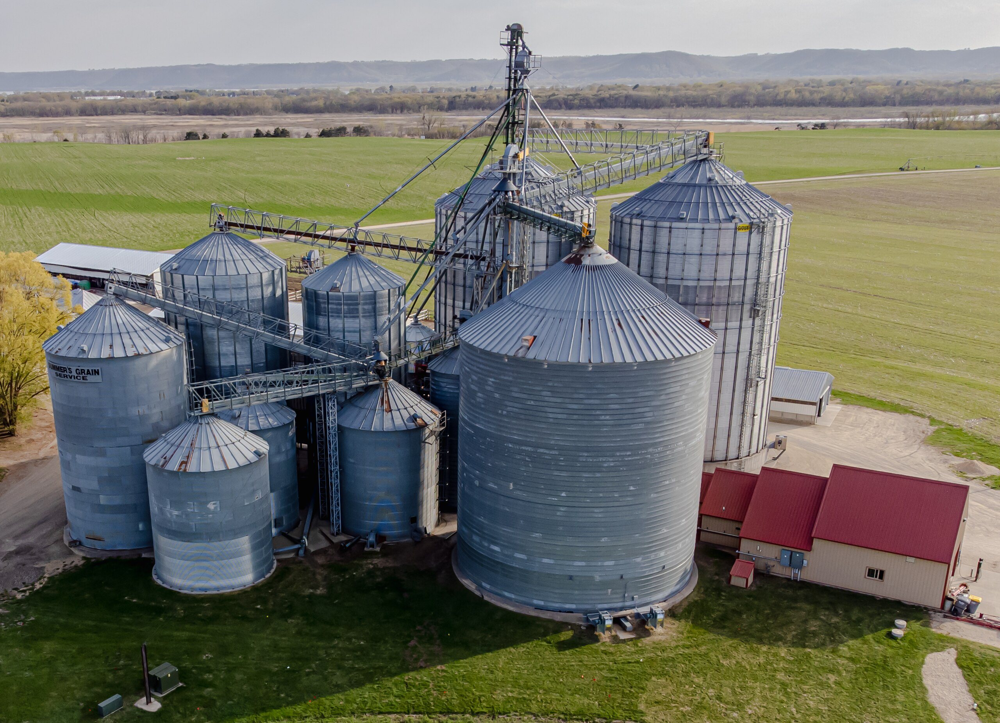
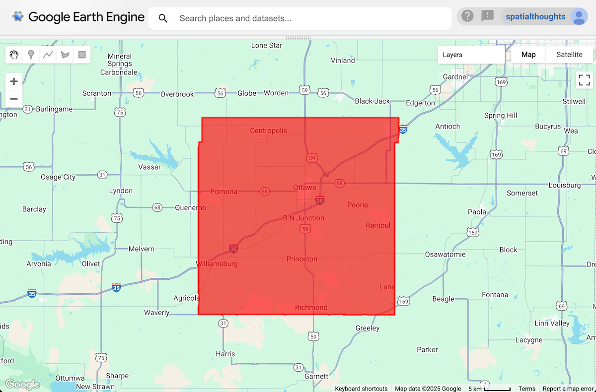
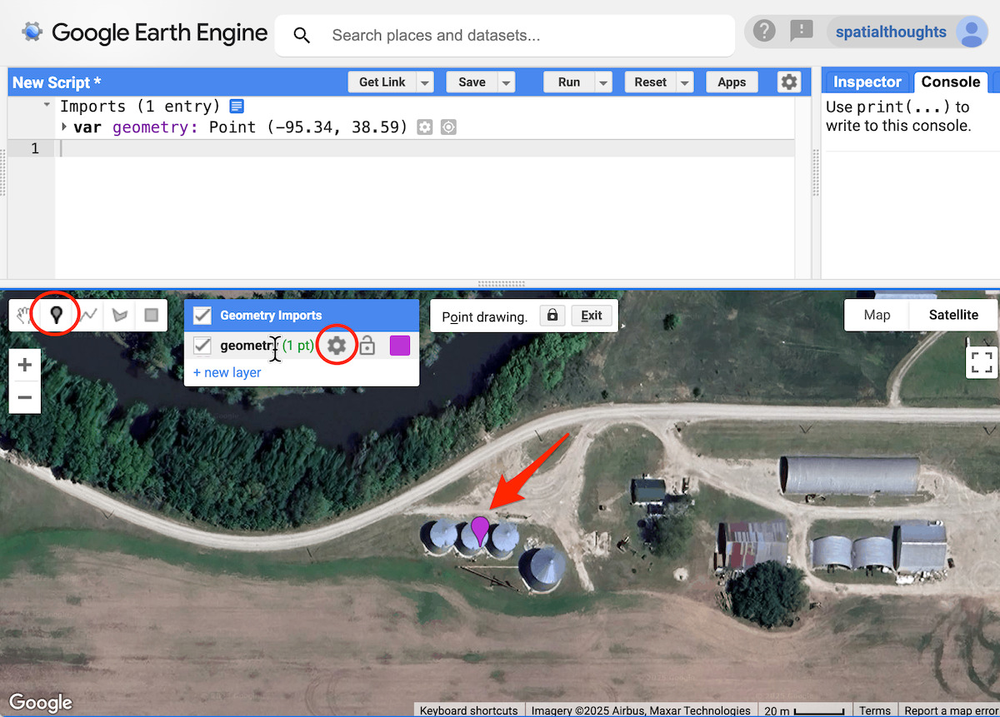
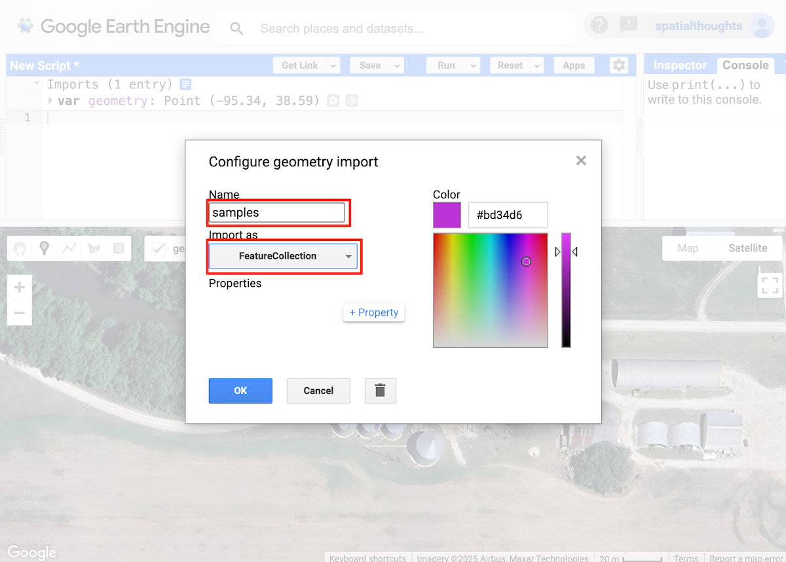
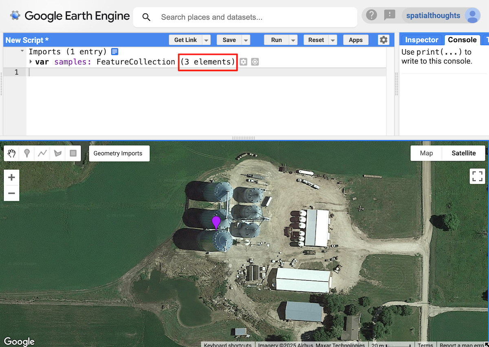
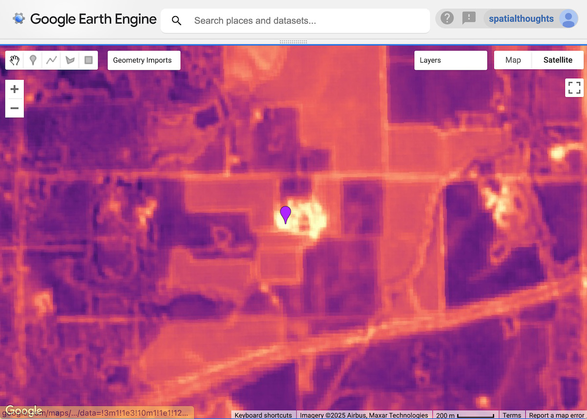
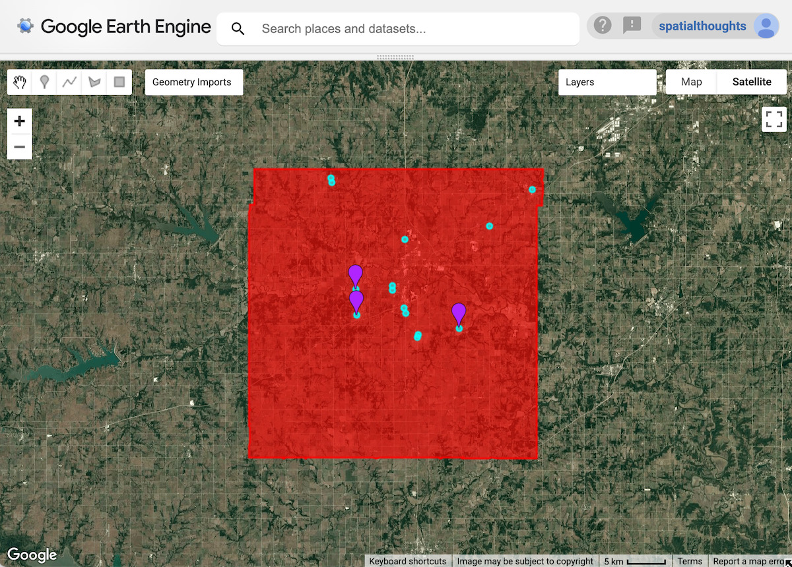
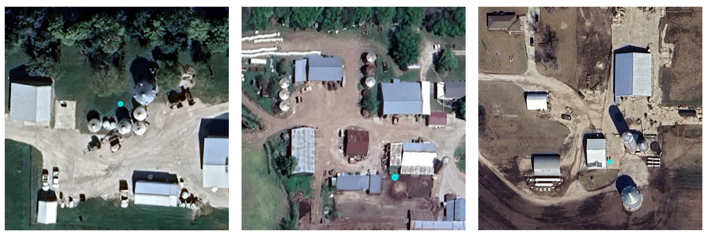
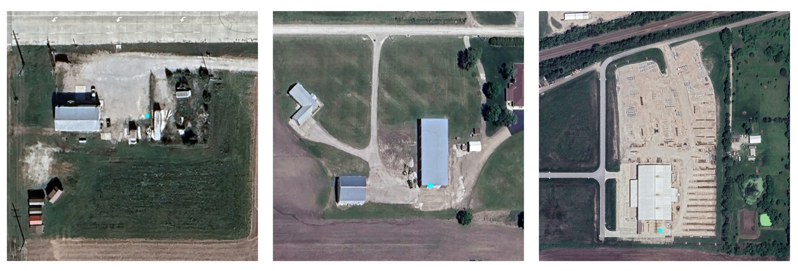

<!--
Copyright 2025 The Google Earth Engine Community Authors

Licensed under the Apache License, Version 2.0 (the "License");
you may not use this file except in compliance with the License.
You may obtain a copy of the License at

    http://www.apache.org/licenses/LICENSE-2.0

Unless required by applicable law or agreed to in writing, software
distributed under the License is distributed on an "AS IS" BASIS,
WITHOUT WARRANTIES OR CONDITIONS OF ANY KIND, either express or implied.
See the License for the specific language governing permissions and
limitations under the License.
-->

_This tutorial is part of a series of tutorials on the Satellite Embedding dataset, see also
[Introduction](/earth-engine/tutorials/community/satellite-embedding-01-introduction),
[Unsupervised Classification](/earth-engine/tutorials/community/satellite-embedding-02-unsupervised-classification), [Supervised Classification](/earth-engine/tutorials/community/satellite-embedding-03-supervised-classification) and [Regression](/earth-engine/tutorials/community/satellite-embedding-04-regression)._

Embeddings present a unique opportunity to find similar locations and features using Earth observation data. By comparing the embedding vector of a reference location with the embedding vectors for all other pixels of an embedding image, we can find locations that exhibit similar properties as the reference location. In practice, this allows us to easily find objects or particular types of sites in our region of interest.

For this tutorial, we will try to find all the grain silos in a region. Grain silos or grain bins are tall structures commonly used for bulk storage of grains. They are found at farms or processing facilities. Mapping these structures would be difficult with traditional remote sensing methods, and would require training a custom object detection model. Since silos have a unique shape, structure, and are typically made of similar materials, they will be represented with unique embedding vectors in the Satellite Embedding images, allowing us to locate them with a simple similarity search.

<br>
_Grain silos (image: Wikipedia)_

## Select the search region

For this tutorial, we will map the grain silos in Franklin County, Kansas. We apply a filter and select the polygon for this county.

```js
var counties = ee.FeatureCollection('TIGER/2018/Counties');

// Select Franklin County, Kansas
var selected = counties
  .filter(ee.Filter.eq('GEOID', '20059'));
var geometry = selected.geometry();

Map.centerObject(geometry);
Map.addLayer(geometry, {color: 'red'}, 'Search Area');
```

<br>
_Figure: Selected region_

## Select reference location(s)

We start by marking the location of one or more grain silos. In the Code Editor, you can use the Satellite basemap, which makes it easy to locate objects.

```js
// Use the satellite basemap
Map.setOptions('SATELLITE');
```

Once you have found the location of the object of interest, use the Add a Marker tool from Drawing Tools to drop a point to mark it as a reference location.

<br>
_Figure: Adding a reference location_

Even a single location is often enough, but having a few more examples helps reduce false positives (in this case, locations identified as grain silos that aren't actually grain silos). We will change the type of geometry to be a FeatureCollection so we can add multiple reference points. Click the *Edit layer properties* button next to the geometry. Change the layer name to `samples` and set the import type as, `FeatureCollection`. Click OK.

<br>
_Figure: Configuring the samples layer_

Back in the main Code Editor window, add points at few more representative locations.

<br>
_Figure: Adding more reference locations_

For this tutorial, we have selected 3 reference locations. These will be used to extract the embedding vectors from Satellite Embedding images.

## Select a time period

Pick a year for which we want to run the search.

```js
var year = 2024;
var startDate = ee.Date.fromYMD(year, 1, 1);
var endDate = startDate.advance(1, 'year');
```

Note: The Satellite Embedding images are derived from public domain earth observation datasets and not from the high-resolution satellite images seen in the basemap. We are using the high-resolution basemap to identify the reference locations. For regions undergoing a lot of change, please verify that the object exists at the location for the chosen year.

## Filter and mosaic the Satellite Embedding dataset

We load the Satellite Embedding dataset, filter for images for the chosen year and create a mosaic.

```js
var embeddings = ee.ImageCollection('GOOGLE/SATELLITE_EMBEDDING/V1/ANNUAL');

var mosaic = embeddings
  .filter(ee.Filter.date(startDate, endDate))
  .mosaic();
```

## Extract the embedding vector from the samples

We sample the mosaic at the reference locations to get the embedding vector associated with these points. We also need to select the scale at which we want to extract and compare the embedding vector. A very practical property of the embeddings in Satellite Embedding is that they have been designed to be linearly composable, which means they can be aggregated or pyramided while retaining distance relationships and interpreted meaning. If we take a spatial average over 2x2 pixels, the result represents the embedding of a larger lower-resolution pixel. The native resolution for Satellite Embedding is 10 m and for identifying small objects like grain silos, this will be a good scale to use. But if you are looking to find objects or sites which are larger, you may use a larger value (i.e., 20 m, 1000 m) to match objects at coarser scales.

```js
// Choose the scale
// You may choose a larger value for larger objects
var scale = 10;

// Extract the embedding vector from the samples
var sampleEmbeddings = mosaic.sampleRegions({
  collection: samples,
  scale: scale
});
```

## Calculate similarity

Calculating the [dot product](https://en.wikipedia.org/wiki/Dot_product) between two embedding vectors allows us to calculate their similarity. The dot product reduces the magnitude of two vectors and the angle between them to a single number – and in our case, embedding vectors are unit-length, the result is just the angle between the vectors.

We can just multiply two 64D, unit-length embedding vectors and sum the products to get the cosine of the angle between the vectors (aka the "dot product"). We compute 1 image per reference location and take the mean of the result to get an image with pixel values of the dot product.

```js
// We compute the dot product between two embedding vectors
var bandNames = mosaic.bandNames();

var sampleDistances = ee.ImageCollection(sampleEmbeddings.map(function(f) {
  var arrayImage = ee.Image(f.toArray(bandNames)).arrayFlatten([bandNames]);
  var dotProduct = arrayImage.multiply(mosaic)
    .reduce('sum')
    .rename('similarity');
  return dotProduct;
}));

// Calculate mean distance from all reference locations
var meanDistance = sampleDistances.mean();
```

Pixels with a dot product close to 1 have relatively similar embedding vectors (angle between them close to 0), while dot products closer to -1 indicate a greater divergence between vectors (orthogonal to opposite direction). We can visualize the results by adding the mean distance image to the map.

```js
var palette = [
  '000004', '2C105C', '711F81', 'B63679',
  'EE605E', 'FDAE78', 'FCFDBF', 'FFFFFF'
];
var similarityVis = {palette: palette, min: 0, max: 1};

Map.addLayer(meanDistance.clip(geometry), similarityVis,
  'Similarity (bright = close)', false);
```

<br>
_Figure: similarity of pixels around a reference point - with brighter areas being more similar_

## Extract location matches

For our next step, we need to define a threshold and extract locations containing our target object. All pixels with grain silos will have embedding vectors very similar to the reference embedding vector and the angle between them will be close to 1. We define a threshold to find all such pixels within the region. Finding the right threshold will depend on the object you are trying to find and the scale. You can experiment with different values and see which one works best for your application.

```js
// Apply a threshold
var threshold = 0.90;
var similarPixels = meanDistance.gt(threshold);
```

The result is a binary image with pixels with similarity values less than the threshold. We now convert the resulting image to polygons.

```js
// Mask 0 values using selfMask()
// to get polygons only for the matched pixels
var polygons = similarPixels.selfMask().reduceToVectors({
  scale: scale,
  eightConnected: false,
  maxPixels: 1e10,
  geometry: geometry
});
```

Each polygon represents a site with a match to the reference locations. We can use the centroid to represent the matched location.

```js
// Extract the centroids of vectorized polygons
var predictedMatches = polygons.map(function(f) {
  return f.centroid({maxError: 1});
});
```

## Export matches to an asset (optional)

Tip: This example is designed to work interactively, but may not scale to larger regions. In this case, you can use an export to overcome scaling issues.

Vectorization is a memory and compute-intensive operation in Earth Engine. To avoid *Computation Timed Out* or *Tile Error* when visualizing the results, it is a [good practice to export](https://developers.google.com/earth-engine/guides/best_practices#use_export) the results as an Asset. Once the asset is exported, it can be imported into the script and visualized. This method also ensures that you can scale the search on large areas without issues.

```js
// Replace this with your asset folder
// The folder must exist before exporting
var exportFolder = 'projects/spatialthoughts/assets/satellite_embedding/';
var matchesExportFc = 'predicted_grain_silo_matches';
var matchesExportFcPath = exportFolder + matchesExportFc;

Export.table.toAsset({
  collection: predictedMatches,
  description: 'Predicted_Matches_Export',
  assetId: matchesExportFcPath
});
```

Start the export tasks and wait for it to finish before proceeding further. Once the export task is finished, we import the matches back into our code.

```js
// Use the exported asset
var predictedMatches = ee.FeatureCollection(matchesExportFcPath);
```

## Visualize the matches

Whether you extracted the matches interactively or exported to a feature collection, you will now have a `predictedMatches` variable with the predicted matches to the reference locations within the search area. Let’s visualize them.

```js
Map.addLayer(predictedMatches, {color: 'cyan'}, 'Predicted Matches');
```

<br>
_Figure: Predicted grain silo locations_

## Validate the results

To evaluate the results, you can zoom in at each predicted match to see if there is a grain silo at that location. You will see that there are many matches that have correctly identified grain silos.

<br>
_Figure: Correctly identified sites with grain silos_

The results also have some false positives. If you observe, the matches have many similar characteristics to our reference location and thus have similar embedding vectors.

<br>
_Figure: False positive matches_

To improve the results, you may adjust the reference locations and the selected threshold.

[Try the full script for this tutorial in the Earth Engine Code Editor](https://code.earthengine.google.com/1fcaf8aea6b6fc4ec821405ec81ec066).
