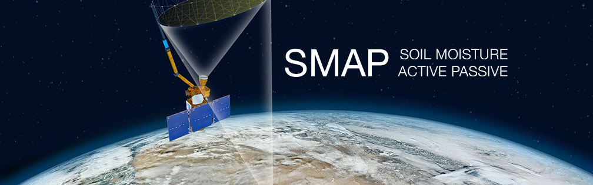
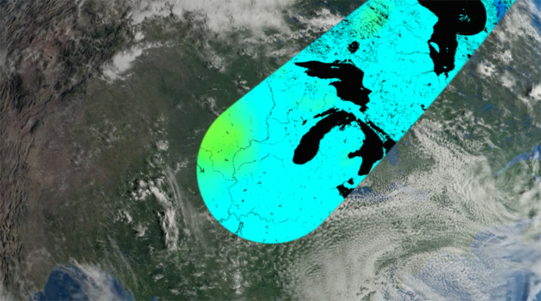

<!--
Copyright 2023 The Google Earth Engine Community Authors
Licensed under the Apache License, Version 2.0 (the "License");
you may not use this file except in compliance with the License.
You may obtain a copy of the License at
    https://www.apache.org/licenses/LICENSE-2.0
Unless required by applicable law or agreed to in writing, software
distributed under the License is distributed on an "AS IS" BASIS,
WITHOUT WARRANTIES OR CONDITIONS OF ANY KIND, either express or implied.
See the License for the specific language governing permissions and
limitations under the License.
-->

{: width="700"}

The thematic focus is learning about the SMAP instrument for water resources
management applications.

The learning objectives of this tutorial:

- Understand how SMAP measures soil moisture from space
- Know which SMAP products are available in GEE catalog and the differences
  between the products
- Know how to import SMAP products into the Code Editor
- Visualize SMAP by adding visualization parameters
- Plot a time series of SMAP soil moisture for a point geometry

After completing this tutorial, you will be able to choose the optimal SMAP
product for your analysis/application, as well as import, visualize, and analyze
a time series of SMAP soil moisture data in Google Earth Engine.

## Soil Moisture Active Passive (SMAP)

### Mission objective

The [SMAP mission](https://smap.jpl.nasa.gov/) is an orbiting observatory that
measures the amount of water in the surface soil everywhere on Earth. Soil
moisture is an important measurement for weather forecasting, drought and flood
predictions, agriculture, and more.

### Instrument description

- SMAP was launched in January, 2015 and started operation in April, 2015 with
  two instruments onboard to measure soil moisture: an active radar and a
  passive radiometer. The radar instrument ceased operation in early 2015 due to
  failure of radar power supply, but collected close to 3 months of science data
  that are available from the [Alaska Satellite Facility](https://asf.alaska.edu/).
  The passive L-band radiometer collects daily data at 6 a.m. (descending) and
  6 p.m. (ascending) local solar time for complete global coverage every 2–3
  days. This permits changes, around the world, to be observed over time scales
  ranging from major storms to repeated measurements of changes over the
  seasons.

- The radiometer specifications are described in the table below.

  | Frequency | Polarization | Resolution                    | Relative accuracy |
  |-----------|--------------|-------------------------------|-------------------|
  | 1.41 Ghz  | H, V         | 36-km original, 9-km enhanced | 1.3 K             |


- SMAP's radiometer collects naturally emitted energy from the surface with a
  20-foot-wide mesh antenna that rotates 14 times per minute – the largest such
  spinning antenna in space.

{: width="700"}

[Watch an animation](https://youtu.be/GAilsFVPmP4) on how SMAP gathers data.

### What does SMAP measure?

- SMAP measures how much water is in the top layer (5 cm) of soil everywhere on
  Earth not covered with water or not frozen. It also distinguishes between
  ground that is frozen or thawed.
- Where the ground is not frozen, SMAP measures the amount of water found
  between the minerals, rocky material, and organic particles found in soil
  everywhere in the world.
- SMAP measures liquid water in the top layer of ground but is not able to
  measure the ice.

### How does SMAP measure soil moisture?

- All types of soil emit microwave radiation, but the amount of water changes
  how much of this energy is emitted.
- The drier the soil, the more microwave energy; the wetter the soil, the less
  energy.
- Radiometers measure this radiation, and scientists use the data to calculate
  water content.
- SMAP measures radiation in the L-band microwave wavelength (30–15 cm & 1–2 Ghz
  frequency). This wavelength of energy penetrates clouds, so SMAP can measure
  soil moisture regardless of cloudy conditions.

{: width="700"}

[Watch a video](https://youtu.be/AuO0pH-1JYg) on how SMAP measures soil moisture.

## SMAP products in GEE

There are three different SMAP products available in the catalog.

1.  [SPL3SMP_E.005 Level 3 product][NASA_SMAP_SPL3SMP_E_005]

    - This Level-3 (L3) soil moisture product provides a daily composite of
      global land surface conditions retrieved by the Soil Moisture Active
      Passive (SMAP) L-Band radiometer.

        | temporal resolution | gridded resolutions | availability             | uses                                                                                                                                                                                                                                                                                                                                                                                                                                                                |
        |---------------------|---------------------|--------------------------|---------------------------------------------------------------------------------------------------------------------------------------------------------------------------------------------------------------------------------------------------------------------------------------------------------------------------------------------------------------------------------------------------------------------------------------------------------------------|
        | Daily               | 9 km                | March 31, 2015 - present | L-band brightness temperature measures from this product can be used to analyze soil moisture, fine fuel moisture content, ocean salinity, and sea ice thickness.<br> The L3 surface soil moisture product is highly accurate, within 4%.<br>The attenuation of soil-emitted radiation by vegetation limits the accuracy of the soil moisture estimates in densely forested areas, therefore masking the data with the retrieval quality flag bands is recommended. |

    - Data outages: June 19-July 23, 2019; September 20-October 6th, 2022

2.  [SPL4SMGP.007 Level 4 product][NASA_SMAP_SPL4SMGP_007]

    - The SMAP Level-4 (L4) Soil Moisture product includes surface soil moisture
      (0-5 cm vertical average), root-zone soil moisture (0-100 cm vertical
      average), and additional research products (not validated), including
      surface meteorological forcing   variables, soil temperature,
      evapotranspiration, and net radiation.

        | temporal resolution | gridded resolutions | availability             | uses                                                                                                          |
        |---------------------|---------------------|--------------------------|---------------------------------------------------------------------------------------------------------------|
        | 3-hourly            | 11 km               | March 31, 2015 - present | Modeled outputs of surface and root zone soil moisture with full global coverage and high temporal frequency. |

    - SMAP L4 provides uninterrupted soil moisture data. During outages of the
      SMAP instrument, SMAP L4 soil moisture is based on land model simulations
      alone, without the concomitant assimilation of SMAP brightness temperature
      observations.  Significant SMAP instrument outages occurred between 19
      June and 23 July 2019 and between 6 August and 20 September 2022.

3.  [NASA-USDA Enhanced SMAP][NASA_USDA_HSL_SMAP10KM_soil_moisture]

    - The NASA-USDA Enhanced SMAP global soil moisture data provides soil
      moisture information across the globe at 10-km spatial resolution. This
      dataset includes surface and subsurface soil moisture (mm), soil moisture
      profile (%), as well as surface and subsurface soil moisture
      anomalies (-).
    - The dataset is generated by integrating satellite-derived Soil Moisture
      Active Passive (SMAP) Level 2 soil moisture observations into the
      modified two-layer Palmer model using a 1-D Ensemble Kalman Filter (EnKF)
      data assimilation approach. Soil moisture anomalies were computed from the
      climatology of the day of interest. The climatology was estimated based on
      the full data record of the SMAP satellite observation and the
      31-day-centered moving-window approach. The assimilation of the SMAP soil
      moisture observations help improve the model-based soil moisture
      predictions particularly over poorly instrumented areas of the world that
      lack good quality precipitation data.
    - This dataset was developed by the Hydrological Science Laboratory at
      NASA's Goddard Space Flight Center in cooperation with USDA Foreign
      Agricultural Services and USDA Hydrology and Remote Sensing Lab.

        | temporal resolution | gridded resolutions | availability                   | uses                                                                                                            |
        |---------------------|---------------------|--------------------------------|-----------------------------------------------------------------------------------------------------------------|
        | Daily               | 10 km               | April 2, 2015 - August 2, 2022 | Modeled surface and root zone soil moisture from the USDA-FAS Palmer model for agricultural drought monitoring. |

    - As of August 2022, the NASA-USDA Enhanced SMAP Global soil moisture
      product has been discontinued.

<br>
The table below describes the surface soil moisture, root-zone soil moisture,
and soil moisture anomaly bands available with each product.

Band description                   | [NASA-USDA Enhanced SMAP][NASA_USDA_HSL_SMAP10KM_soil_moisture] | [SPL4SMGP.007][NASA_SMAP_SPL4SMGP_007] | [SPL3SMP_E.005][NASA_SMAP_SPL3SMP_E_005]               |
|----------------------------------|-----------------------------------------------------------------|----------------------------------------|--------------------------------------------------------|
| Surface soil moisture            | ssm                                                             | sm_surface                             | soil_moisture_am <br> soil_moisture_pm                 |
| Subsurface soil moisture         | susm                                                            | sm_rootzone                            | NA                                                     |
| Soil moisture profile            | smp                                                             | sm_profile                             | sm_profile                                             |
| Surface soil moisture anomaly    | ssma                                                            | sm_surface_anomaly                     | soil_moisture_am_anomaly <br> soil_moisture_pm_anomaly |
| Subsurface soil moisture anomaly | susma                                                           | NA                                     | NA                                                     |

## Visualizing SMAP

In this section, you will learn ways to visualize SMAP in GEE based on your
level of experience with the Code Editor.

### No coding required

Explore the data using the
[SMAP visualization application (beta)](https://krayon.users.earthengine.app/view/soil-moisture-active-passive-smap);
no coding is required.

### New to GEE

```js
// View a single day of SMAP L3 data for both ascending and descending
// overpasses. Change date in line below to see the SMAP L3 image for that day.
var dataset = ee.ImageCollection('NASA/SMAP/SPL3SMP_E/005')
                  .filterDate('2023-04-05');
// Select descending pass of instrument (am).
var soilMoistureSurfaceAM = dataset.select('soil_moisture_am');
// Print collection properties to console for inspection.
print(soilMoistureSurfaceAM);
// Select ascending pass of instrument (pm).
var soilMoistureSurfacePM = dataset.select('soil_moisture_pm');
// Print collection properties to console for inspection.
print(soilMoistureSurfacePM);
// Set visualization parameters.
var soilMoistureVis = {
  min: 0.0,
  max: 0.6,
  palette: ['fC6238', 'FFEC59', '8DD7BF', '00B0BA', '0065A2']
};
// Set map center [lon, lat] and zoom level.
Map.setCenter(-6.746, 46.529, 2);
Map.addLayer(soilMoistureSurfaceAM, soilMoistureVis, 'Soil Moisture AM');
Map.addLayer(soilMoistureSurfacePM, soilMoistureVis, 'Soil Moisture PM');
```

## Analysis and visualization of SMAP L3 product

### Intermediate

```js
// Data: Soil Moisture AM band from L3 SMAP global soil moisture.
// 1) Mask the data with the retrieval quality flag.
// 2) Compute a mean image from multiple images in a series.
// 3) Clip results to country boundary.
// 4) Exports data to GeoTIFF.
// Import country polygons by ISO Alpha-3 code; this example uses Uruguay
// as a region of interest.
var iso_code ='URY';
var country = ee.FeatureCollection('USDOS/LSIB/2013').filter(
    ee.Filter.eq('iso_alpha3', iso_code));
var SMAPL3 = ee.ImageCollection('NASA/SMAP/SPL3SMP_E/005');
// Print collection properties to console for inspection
print(SMAPL3);
// Select 1 month of SMAP images to create mean composite.
// Remember SMAP L3 data are unavailable for the following dates:
// June 19-July 23, 2019 and September 20-October 6th, 2022.
var dataset = SMAPL3.filterDate('2022-07-01', '2022-07-31');
var soilMoisture = dataset.select('soil_moisture_am');
// Set visualization parameters for mean image.
var soilMoistureVis = {
  min: 0.0,
  max: 0.6,
  palette: ['fC6238', 'FFEC59', '8DD7BF', '00B0BA', '0065A2']
};
// Set map center on the country and zoom level 7.
Map.centerObject(country, 7);
// Select AM soil moisture and convert the collection to bands.
var soilmoisture_am = dataset.select('soil_moisture_am').toBands();
// Compute per-pixel mean over the time series.
var SM_MEAN = soilmoisture_am.reduce(ee.Reducer.mean());
// Select QA values.
var soilmoisture_am_qamask = dataset.select('retrieval_qual_flag_am').toBands();
// Invert QA values to create mask.
var QA_mask = soilmoisture_am_qamask.eq(0);
// Add QA mask to soil moisture.
var SM_masked = soilmoisture_am.updateMask(QA_mask);
// Reduce image stack to single image with mean reducer.
var SM_masked_MEAN = SM_masked.reduce(ee.Reducer.mean());
// Visualize Soil Mean Moisture global (cm3/cm3)*1000
// Map.addLayer(SM_masked_MEAN, soilMoistureVis, 'Mean Soil Moisture Masked');
// Map.addLayer(SM_MEAN, soilMoistureVis, 'Mean Soil Moisture');
// Select this option to clip map to Uruguay (cm3/cm3)*1000
Map.addLayer(
    SM_MEAN.clip(country), soilMoistureVis, 'Mean Soil Moisture');
Map.addLayer(
    SM_masked_MEAN.clip(country), soilMoistureVis, 'Mean Soil Moisture Masked');
// Export with maps Mercator projection at 10 km scale.
var exportParams = {scale: 10000, region: country, crs: 'EPSG:3857'};
// Create export task and go to tasks tab to run.
// Set output file names.
Export.image(SM_masked_MEAN, 'SM_MaskedJuly2022MEAN_URY', exportParams);
Export.image(SM_MEAN, 'SM_July2022MEAN_URY', exportParams);
```

## Plotting soil moisture over time with the SMAP L4 product

### Intermediate

Plotting a time series of daily surface and root zone soil moisture.

```js
// Create single-day average of SMAP L4 version 7, 3-hourly soil moisture
// to view. Plot surface soil moisture and root zone soil moisture over
// user-determined time period.
var SMAPL4 = ee.ImageCollection('NASA/SMAP/SPL4SMGP/007');
// Set lon, lat of point of interest.
var point = ee.Geometry.Point([-97.808804, 34.975981]);
// Zoom to point with zoom level 7.
Map.centerObject(point, 7);
// Define visualization parameters.
var soilMoistureVis = {
  min: 0.0,
  max: 0.7,
  palette: ['A67C00', 'FFE625', 'C2E5D3', '90DCD0',
            '2FBDBD', '0C9BBD', '068682'],
};
// User input: set time frame (June-July-August).
var startdate = '2022-06-01';
var enddate = '2022-08-31';
// Load input collection, filter by date, and select surface soil moisture data.
var soilMoisture = SMAPL4.filterDate(startdate, enddate)
                            .select(['sm_surface', 'sm_rootzone']);
// Select soil moisture for last day in time frame.
var soilMoisture1 = soilMoisture.filterDate(enddate)
                                .select(['sm_surface']);
// Create average soil moisture for the last day for visualization.
var soilMoisture_oneday = soilMoisture1.reduce(ee.Reducer.mean());
Map.addLayer(
    soilMoisture.select('sm_surface'), soilMoistureVis, 'Soil Moisture');
Map.addLayer(
    point, {color: 'black'}, 'Geometry [black]: point');
// Define the chart and print it to the console.
var chart =
    ui.Chart.image
        .series({
          imageCollection: soilMoisture,
          region: point,
          reducer: ee.Reducer.mean(),
          scale: 10000,
          xProperty: 'system:time_start'
        })
        .setSeriesNames(['root zone soil moisture', 'surface soil moisture'])
        .setOptions({
          title: 'SMAP L4 version 7, 3-hourly surface and root zone soil '
            + 'moisture (34.975981 N, 97.808804 W)',
          hAxis: {
            title: 'Date',
            titleTextStyle: {italic: false, bold: true}
          },
          vAxis: {
            title: 'Soil Moisture cm3/cm3',
            titleTextStyle: {italic: false, bold: true}
          },
          lineWidth: 5,
          colors: ['4F7942', 'C7EA46'],
          curveType: 'function'
        });
print(chart);
```

## Drought monitoring with SMAP and Global Precipitation Mission (GPM) IMERG

### Advanced

[Click here to access the tutorial](https://developers.google.com/earth-engine/tutorials/community/anomalies-analysis-smo-and-pre)

## Resources

[SMAP website](https://smap.jpl.nasa.gov/)

[NASA ARSET SMAP training](https://appliedsciences.nasa.gov/join-mission/training/english/arset-applications-remote-sensing-soil-moisture-and)

[NASA_SMAP_SPL3SMP_E_005]: https://developers.google.com/earth-engine/datasets/catalog/NASA_SMAP_SPL3SMP_E_005
[NASA_SMAP_SPL4SMGP_007]: https://developers.google.com/earth-engine/datasets/catalog/NASA_SMAP_SPL4SMGP_007
[NASA_USDA_HSL_SMAP10KM_soil_moisture]: https://developers.google.com/earth-engine/datasets/catalog/NASA_USDA_HSL_SMAP10KM_soil_moisture
