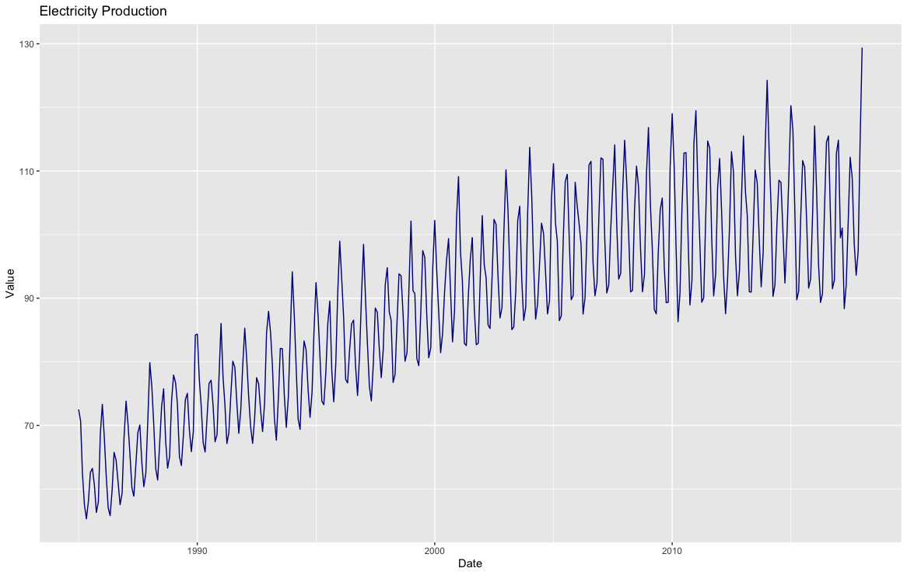
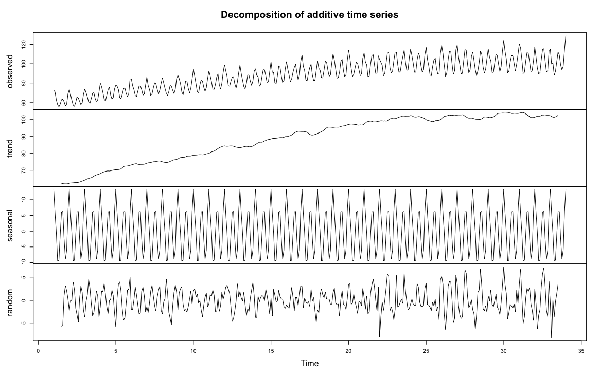
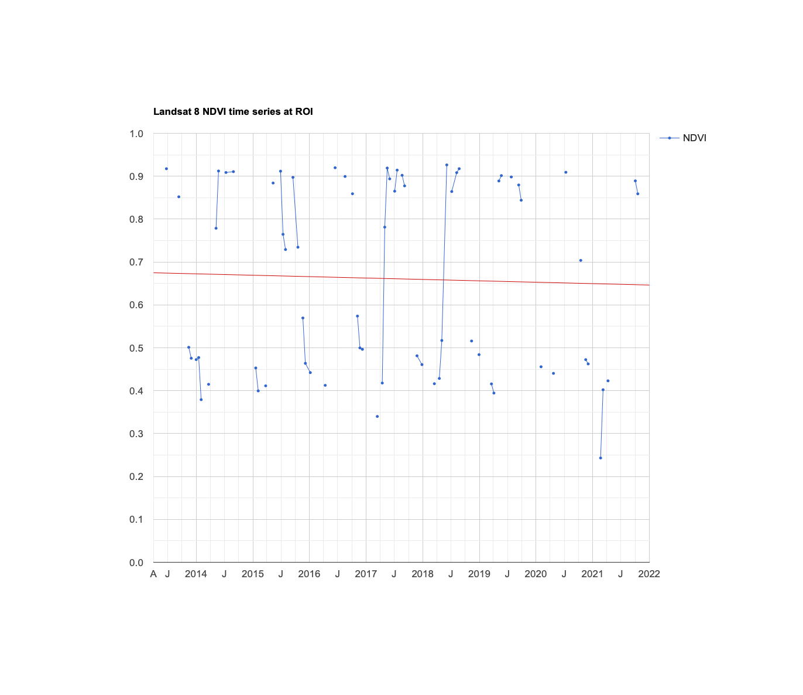
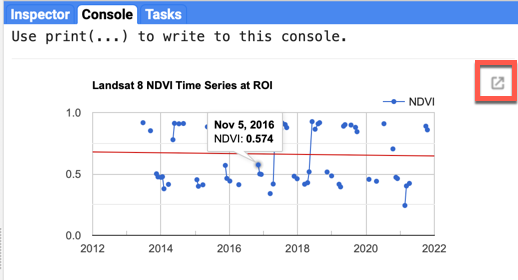

<!--
Copyright 2022 The Google Earth Engine Community Authors

Licensed under the Apache License, Version 2.0 (the "License");
you may not use this file except in compliance with the License.
You may obtain a copy of the License at

    https://www.apache.org/licenses/LICENSE-2.0

Unless required by applicable law or agreed to in writing, software
distributed under the License is distributed on an "AS IS" BASIS,
WITHOUT WARRANTIES OR CONDITIONS OF ANY KIND, either express or implied.
See the License for the specific language governing permissions and
limitations under the License.
-->

## Overview

The purpose of this tutorial is to establish a foundation for time series
analysis on remotely sensed data. You will be introduced to the fundamentals
of time series modeling, including decomposition, autocorrelation and
modeling historical changes. At the completion of this tutorial, you will be
able to build an explanatory model for temporal data which can be used in
many different avenues of research.

This tutorial is a segment of
[remotesensing.dev](https://www.remotesensing.dev/docs/intro), a six-part
series on using Google Earth Engine for research in social science and
economics.

## Background

One of the paradigm-changing features of Earth Engine is the ability to
access decades of imagery without the previous limitation of needing to
download, organize, store and process this information. For instance, within
the Landsat image collection we can access imagery back to 1972, allowing us
to look at an area to visualize and quantify how much it's changed over time.
With Earth Engine, Google maintains the data and offers it's computing power
for processing - users can access tens or hundreds of time-sequenced images
and quantify change across decades.

To explain the concepts of time series modeling, let's begin with a dataset
that illustrates what we are trying to do. The line chart below references
electricity production over thirty years, with one distinct data point per
month. What can we observe?

1. Production tends to increase each year. In this case, it appears to level
out after 2010, but there is a general trend upwards.
2. Within each yearly cycle, we see that there is a sharp peak in June and
July, and a trough in October and December. An annual, 12-month cycle is
specifically referred to as 'seasonality', although there can be other
cyclical time periods (e.g., a housing market in a specific area may see a
recurring pattern in house prices that occurs roughly every 7 years).
3. Finally, the magnitude of the difference between each yearly peak and
trough increases over time as well.



With these observations, we can address each of the components individually
and perhaps build an explanatory model. The time series decomposition below
(generated in R) breaks up the data into separate components.

1. The 'observed' line chart is the data in original form.
2. The next chart is a trendline built using a window function (each data
point is plotted as the average of the previous 12 data points). You can see
the general trend of the data and determine whether a linear fit is
appropriate.
3. The seasonal chart seeks to identify cyclical patterns in the data (in
this case, patterns that repeat every 12 months). It subtracts the trend from
the observed points and averages the data for each time period (month).
4. Finally, the 'random' line chart is the residual amount remaining when you
remove the trend and seasonality from the data.



### Limitations in remote sensing time series

Time series modeling aims to build an explanatory model of the data without
overfitting the problem set—to use as simple a model as possible while
accounting for as much of the data as possible. The previous example was used
to illustrate the concepts of breaking down time series data into component
parts, but remote sensing data has additional limitations that make this more
challenging. Note that in the previous example there was a well-formed
data point for every single month—nothing was missing or obviously
erroneous. It is almost inevitable that you will not get this same level of
precision from remote sensing data.
[Landsat-8](https://developers.google.com/earth-engine/datasets/catalog/LANDSAT_LC08_C02_T1_L2)
has 16-day temporal resolution, but depending on the area,
removing cloudy pixels will remove a significant portion. In a test area in
the Galapagos Islands, over 85% of the data was removed due to cloud masking
or atmospheric conditions. Issues such as the
[Landsat 7 Scan Line Corrector malfunction](https://www.usgs.gov/faqs/what-landsat-7-etm-slc-data)
might prevent a cohesive time series dataset depending on your time period of
research. Also, while the time series example we used involved measured
values on the same scale throughout the time series (e.g., a gigawatt is the
same unit of measurement throughout the entire time series), with remote
sensing we often run into situations where the magnitude of measurement
changes. If we are researching winter crop yield and an image is collected
right after a heavy snowfall, how do we compare this value? Do we keep this
data or remove it? Additionally, atmospheric conditions can skew the visual
results, where the hue of the vegetation changes drastically from image to
image due to atmospheric conditions (fog, ground moisture, cloud cover).

It is important to understand the characteristics of both your data and what
you are trying to measure. Building a time series model to understand
cyclical changes in vegetation can provide useful information in
understanding crop yield, but if you do not account for issues in the data,
you can end up building a time series model with erroneous results. Many time
series modeling tools, such as
[ARIMA modeling](https://otexts.com/fpp2/arima.html), are not directly
applicable in certain settings due to missing data, non-standard collection
periods and varying intensity due to atmospheric conditions. In this tutorial,
we will focus on understanding linear trends and harmonic modeling.

### Multi-temporal data in Earth Engine

Time series data in Earth Engine are represented as a series of images called
'[Image Collections](https://developers.google.com/earth-engine/guides/ic_creating)'.
As a result of the complicating factors in remote sensing discussed earlier,
analyzing time series in Earth Engine is unlike time series modeling in
traditional methods. From a programming sense, we will join data together to
define temporal relationships between collection items and build functions to
reduce this time.

First, some very basic mathematical notation for time series. A time series
is an array of the value being measured, sorted
chronologically: $\textbf{p}{t} = t{0} + t{1}... t{N}$, where each $t$ is
the given value in the series.

### Data preparation and preprocessing

The first step in analysis of time series data is to import data of interest
and plot the data around our region of interest, a deciduous forest near
Blacksburg, VA, USA.

We begin by loading in the Landsat 8 collection and provide a point at the
region of interest. Additionally, we will create a time field.

```js
var landsat8Sr = ee.ImageCollection('LANDSAT/LC08/C02/T1_L2');
var roi = ee.Geometry.Point([-80.498, 37.254]);
```

The function `maskL8sr` is a cloud masking function that uses quality bands
of Landsat 8 to mask out any pixels that are obscured by cloud and cloud
shadow, or are saturated. Note that this function is Landsat 8 specific, using
other platforms will require a different setup.

```js
// Function to cloud mask from the pixel_qa band of Landsat 8 SR data.
var maskL8sr = function(image) {
  // Bit 0 - Fill
  // Bit 1 - Dilated Cloud
  // Bit 2 - Cirrus
  // Bit 3 - Cloud
  // Bit 4 - Cloud Shadow
  var qaMask = image.select('QA_PIXEL').bitwiseAnd(parseInt('11111', 2)).eq(0);
  var saturationMask = image.select('QA_RADSAT').eq(0);

  // Apply the scaling factors to the appropriate bands.
  var opticalBands = image.select('SR_B.').multiply(0.0000275).add(-0.2);
  var thermalBands = image.select('ST_B.*').multiply(0.00341802).add(149.0);

  // Replace the original bands with the scaled ones and apply the masks.
  return image.addBands(opticalBands, null, true)
    .addBands(thermalBands, null, true)
    .updateMask(qaMask)
    .updateMask(saturationMask);
};
```

We'll use the Normalized Difference Vegetation Index (NDVI) as our time series
signal. It is a well-known metric for measuring vegetation productivity—for this
region of interest, we expect there to be strong seasonality, and perhaps a
gradual linear trend over time. In the code block below, we create a function
called `addVariables` that extracts the date of each image, calculates NDVI and
adds it to an array. We can then use `.map()` to apply the two functions we
defined to build a time series model of our data.

```js
// Function to add NDVI, time, and constant variables to Landsat 8 imagery.
var addVariables = function(image) {
  // Compute time in fractional years since the epoch.
  var date = image.date();
  var years = date.difference(ee.Date('1970-01-01'), 'year');
  // Return the image with the added bands.
  return image
  // Add an NDVI band.
  .addBands(image.normalizedDifference(['SR_B5', 'SR_B4']).rename('NDVI'))
  // Add a time band.
  .addBands(ee.Image(years).rename('t')).float()
  // Add a constant band.
  .addBands(ee.Image.constant(1));
};
// Remove clouds, add variables and filter to the area of interest.
var filteredLandsat = landsat8Sr
  .filterBounds(roi)
  .filterDate('2013', '2022')
  .map(maskL8sr)
  .map(addVariables);
```

To visualize the data, we will export a chart at the location of interest. We
will add a linear trend line for reference.

```js
// Plot a time series of NDVI at a single location.
Map.centerObject(roi, 11);
Map.addLayer(filteredLandsat,
  {bands: 'NDVI', min: 0.1, max: 0.9, palette: ['white', 'green']},
  'NDVI Mosaic');
Map.addLayer(roi, {color: 'yellow'}, 'ROI');
var l8Chart = ui.Chart.image.series(filteredLandsat.select('NDVI'), roi)
  .setChartType('ScatterChart')
  .setOptions({
   title: 'Landsat 8 NDVI Time Series at ROI',
   trendlines: {
     0: {color: 'CC0000'}
   },
   lineWidth: 1,
   pointSize: 3,
  });
print(l8Chart);
```

You can click on the 'export' button next to the chart to view an interactive
chart. Scroll over some of the data points and look at the relationships
between the data. A line connecting two dots means that they are sequential
data points (notice that there are relatively few sequential points). We can
also see that there are relatively large jumps in the data, with an upward
climb somewhere between March and late April, and a descent in late August.
Each year is slightly different, but we can surmise that this is due to
seasonal rains in the spring and leaves dying off in the fall. Finally, the
general trend is downward, although the February 2021 datapoint might have
significant leverage on the trend.



### Linear modeling of time

Lots of interesting analyses can be done to time series by harnessing the
`linearRegression()`
[reducer](https://developers.google.com/earth-engine/api_docs#eereducerlinearregression).
To estimate linear trends over time, consider the following linear
model, where $\epsilon_t$ is a random error:

$$
y = \beta_0 + \beta_1X_1 + ... + \beta_nX_n + \epsilon_t \tag{1}
$$

This is the model behind the trendline added to the chart you just created.
We can use this model to detrend our data (explain the upward or downward
movement of the data by subtracting observed values from the fitted model
values). For now, the goal is to discover the values of the beta coefficients.

To fit this trend model to the Landsat-based NDVI series using Ordinary Least
Squares ([OLS](https://setosa.io/ev/ordinary-least-squares-regression/)), use
the `linearRegression()` reducer:

```js
// List of the independent variable names.
var independents = ee.List(['constant', 't']);
// Name of the dependent variable.
var dependent = ee.String('NDVI');
// Compute a linear trend. This will have two bands: 'residuals' and
// a 2x1 band called 'coefficients' (columns are for dependent variables).
var trend = filteredLandsat.select(independents.add(dependent))
  .reduce(ee.Reducer.linearRegression(independents.length(), 1));
Map.addLayer(trend, {}, 'Trend Array Image');
// Flatten the coefficients into a 2-band image.
var coefficients = trend.select('coefficients')
  .arrayProject([0])
  .arrayFlatten([independents]);
```

The image added to the map is a two-band image in which each pixel contains
values for $\beta_0$ and $\beta_1$. Click around the map with the
inspector, and look at some of the values. We can see that most pixels around
our region of interest have a negative trend—although darker values
indicate a shallow negative trend, while bright red pixels indicate a steeper
descent.

Use the model to "detrend" the original NDVI time series. By detrend, we mean
account for the slope of the chart and remove it from the original data.

```js
// Compute a detrended series.
var detrended = filteredLandsat.map(function(image) {
  return image.select(dependent).subtract(
    image.select(independents).multiply(coefficients).reduce('sum'))
    .rename(dependent)
    .copyProperties(image, ['system:time_start']);
});

var detrendedChart = ui.Chart.image.series(detrended, roi, null, 30)
  .setOptions({
    title: 'Detrended Landsat Time Series at ROI',
    lineWidth: 1,
    pointSize: 3,
  });
print(detrendedChart);
```

Compared to our earlier graph, the data looks similar—but now, the slight
downward slope is accounted for with our linear model. Each fitted data point
(data point on the linear model) is subtracted from each of the observed data
points. Additionally, the Y-axis is now centered at 0, and the scale ranges
from 0 to +/- 0.45 This allows us to focus on cyclical patterns in the data
with long-term trends in the data removed.


## Estimate seasonality with a harmonic model

Consider the following linear model, where $e_t$ is random error, $A$ is
amplitude, $\omega$ is frequency, and $\phi$ is phase:

$$
p_t = \beta_0 + \beta_1t + Acos(2\pi\omega t - \phi) + e_t \tag{2}
$$

We can decompose our function into separate cosine and sine elements.

$$
p_t = \beta_0 + \beta_1t + \beta_2cos(2\pi\omega t) + \beta_3sin(2\pi\omega t) + e_t \tag{3}
$$

Note that $\beta_2 = Acos(\phi)$ and $\beta_3 = Asin(\phi)$, implying
$A = (\beta_2^2 + \beta_3^2)^½$ and $\phi = atan(\frac{\beta_3}{\beta_2})$).

In simpler terms, we are breaking up more complex curves into a set of
simplified cosine waves with an additive term. Mark Jakubauskas has an
informative
[paper](https://www.isprs.org/proceedings/xxxiii/congress/part4/384_xxxiii-part4.pdf)
that breaks down the process, and there are many resources that
elaborate more on the math behind harmonic models. Building a harmonic model
is used in remote sensing applications because of its flexibility in
accounting for cyclicality with simple, reproducible shapes. If there is a
seasonal trend in the data, the ordered nature of a cosine curve can likely
approximate it.

To fit this model to the time series, set $\omega$=1 (one cycle per unit
time) and use ordinary least squares regression as the metric of error
reduction.

First, add the harmonic variables (the third and fourth terms of equation 2)
to the image collection.

```js
// Use these independent variables in the harmonic regression.
var harmonicIndependents = ee.List(['constant', 't', 'cos', 'sin']);
// Add harmonic terms as new image bands.
var harmonicLandsat = filteredLandsat.map(function(image) {
  var timeRadians = image.select('t').multiply(2 * Math.PI);
    return image
      .addBands(timeRadians.cos().rename('cos'))
      .addBands(timeRadians.sin().rename('sin'));
  });
```

Fit the model with a linear trend, using the `linearRegression()` reducer:

```js
var harmonicTrend = harmonicLandsat
  .select(harmonicIndependents.add(dependent))
  // The output of this reducer is a 4x1 array image.
  .reduce(ee.Reducer.linearRegression({
   numX: harmonicIndependents.length(),
   numY: 1
  }));
```

Plug the coefficients into equation 2 in order to get a time series of fitted
values:

```js
// Turn the array image into a multi-band image of coefficients.
var harmonicTrendCoefficients = harmonicTrend.select('coefficients')
  .arrayProject([0])
  .arrayFlatten([harmonicIndependents]);
// Compute fitted values.
var fittedHarmonic = harmonicLandsat.map(function(image) {
  return image.addBands(
    image.select(harmonicIndependents)
      .multiply(harmonicTrendCoefficients)
      .reduce('sum')
      .rename('fitted'));
});
// Plot the fitted model and the original data at the ROI.
print(ui.Chart.image.series(fittedHarmonic.select(['fitted', 'NDVI']), roi,
      ee.Reducer.mean(), 30)
  .setSeriesNames(['NDVI', 'fitted'])
  .setOptions({
    title: 'Harmonic Model: Original and Fitted Values',
    lineWidth: 1,
    pointSize: 3
  })
);
```

The harmonic model (red data points) does an adequate job of predicting the
data. There is a datapoint in Feb 2021 that is significantly lower, but this
appears to be an outlier. Additionally, the model misses a significant dip in
July 2015, although this might be due to irregular climate conditions—other
years did not have the same dip.

Although any coefficients can be mapped directly, it is often useful and
interesting to map the phase and amplitude of the estimated harmonic model.
First, compute phase and amplitude from the coefficients, then incorporate
this information into each pixel. Use the inspector to look at the pixels and
note their phase and amplitude.

```js
// Compute phase and amplitude.
var phase = harmonicTrendCoefficients.select('sin')
  .atan2(harmonicTrendCoefficients.select('cos'))
  // Scale to [0, 1] from radians.
  .unitScale(-Math.PI, Math.PI);
var amplitude = harmonicTrendCoefficients.select('sin')
  .hypot(harmonicTrendCoefficients.select('cos'))
  // Add a scale factor for visualization.
  .multiply(5);
// Compute the mean NDVI.
var meanNdvi = filteredLandsat.select('NDVI').mean();
// Use the HSV to RGB transformation to display phase and amplitude.
var rgb = ee.Image.cat([phase, amplitude, meanNdvi]).hsvToRgb();
Map.addLayer(rgb, {}, 'Phase (hue), Amplitude (sat), NDVI (val)');
```

###  Complex time series modeling

A time series can be decomposed as the sum of sinusoids at different
frequencies. The harmonic model presented here can be extended by adding
bands that represent higher frequencies and the corresponding `sin()` band
for a harmonic component to account for two cycles per year.

You can look at this GEE
[example](https://code.earthengine.google.com/f2f03989555d31cad7b532787531f275)
of using multiple sinusoids to build a more complex harmonic model. Note
that each year there is a high peak in June and a secondary peak in January—this
harmonic model consisting of two sinusoids with separate frequencies and
amplitudes is able to account for that. However, the error values in this
model are high and the fit is quite inexact. We can see extreme drops in the
NDVI value that the model misses, and several peaks each year that do not fit.


More complex harmonic models might not be appropriate due to overfitting—in
other words, this model might provide a false sense of comfort in its
explanatory ability. Time series modeling of remote sensing data is more
difficult than many business or scientific contexts due to masked data,
missing data, irregular atmospheric conditions, and natural variability.

### Exporting data

Many of you might be more familiar with building statistical models in other
languages or tools, such as Python, R or JMP. In that case, you might
want to export the data for your own analysis. There are several ways to do
it, but the simplest method is to click the 'expand into new tab' button next
to the chart that contains the data you want to work with (likely the raw
NDVI data). In the new tab, you can click 'Download .csv', which is a data
table that you can use with whichever software you prefer.


